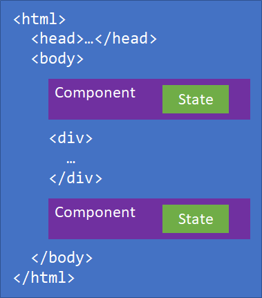
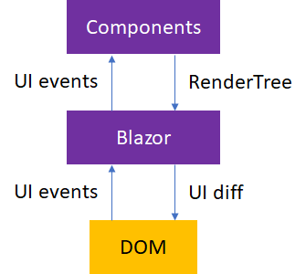

# Architecture comparison of ASP.NET Web Forms and Blazor

While ASP.NET Web Forms and Blazor have many similar concepts, they also have differences in how they work. Here, we'll examine the inner workings and architecture of ASP.NET Web Forms and Blazor to see how they compare.

## ASP.NET Web Forms

ASP.NET Web Forms are built with a page-centric architecture where each request for a location in the application is a separate page that ASP.NET replies with. As pages are requested, the content of the browser are completely replaced with the results of the page requested.

Pages consist of HTML markup, C# or Visual Basic code, a code-behind class that provides logic and event-handling capabilities, and controls. Controls are reusable units of web UI that can be programmatically placed and interacted with on a page. Pages are composed of files that end with *.aspx* containing markup, controls, and some code. The code-behind classes reside in files with the same base name and an *.aspx.cs* or *.aspx.vb* extension depending on the programming language used for the code-behind file. Interestingly, the *.aspx* file contents are interpreted by the web server and re-compiled whenever they change, even while the web server is already running.

Controls can be built with markup and delivered as a `UserControl` with similar structure to the Page with an *.ascx* extension and a code-behind class that resides in an *.ascx.cs* or *.ascx.vb* file. Controls can also be built completely with code, by inheriting from the `WebControl` or `CompositeControl` base classes.

Pages also have an extension event lifecycle. Each page will raise events for the Initialization, Load, PreRender, and Unload events that occur as the ASP.NET runtime executes the code for the page for every visitor's request.  

Controls on a Page typically post-back to the same page that presented the control, and carry along with them a payload from a hidden form field called `ViewState`. The `ViewState` field contains information about the state of the controls at the time they were rendered and presented on the page, allowing the ASP.NET runtime to compare and identify changes in the content submitted to the server.

## Blazor

Blazor is a client-side web UI framework similar in nature to JavaScript front-end frameworks like Angular or React. Blazor handles user interactions and renders UI updates accordingly. Blazor is *not* based on a request-reply model. User interactions are handled as events that aren't in the context of any particular HTTP request.

Blazor apps consist of one or more root components that are rendered on an HTML page.

How the user specifies where components should render and how the components are then wired up for user interactions is [hosting model](hosting-models.md) specific.

Blazor [components](components.md) are .NET classes that represent a reusable piece of UI. Each component maintains its own state and specifies its own rendering logic, which can include rendering other components. Components specify event handlers for specific user interactions to update the component's state.

After a component handles an event, Blazor renders the component and keeps track of what changed in the rendered output. Components don't render directly to the Document Object Model (DOM). They instead render to an in-memory representation of the DOM called a `RenderTree` so that Blazor can track the changes. Blazor compares the newly rendered output with the previous output to calculate a UI diff that it then applies efficiently to the DOM.

Components can also manually indicate that they should be rendered if their state changes outside of a normal UI event. Blazor uses a `SynchronizationContext` to enforce a single logical thread of execution. A component's lifecycle methods and any event callbacks that are raised by Blazor are executed on this `SynchronizationContext`.

>[!div class="step-by-step"]
>[Previous](introduction.md)
>[Next](hosting-models.md)
