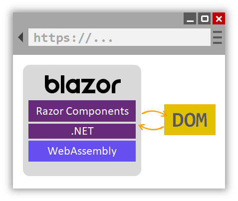
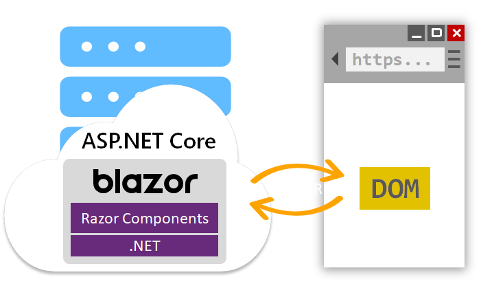

# Blazor app hosting models

Blazor apps can be hosted in IIS just like ASP.NET Web Forms apps. But Blazor apps can be hosted in other ways as well. When considering how to host your Blazor app you have the option of hosting it client-side in the browser on WebAssembly or server-side in an ASP.NET Core app. 

## Blazor WebAssembly apps

Blazor WebAssembly apps execute directly in the browser on a WebAssembly based .NET runtime. Blazor WebAssembly apps function in a very similar way to front-end JavaScript frameworks like Angular or React, but instead of writing JavaScript you write C#. The .NET runtime is download with the app along with the app assembly and any required dependencies. No browser plugins or extensions are required. 

The downloaded assemblies are normal .NET assemblies, like you would use in any other .NET app. The runtime supports .NET Standard, so you can use existing .NET Standard libraries with your Blazor WebAssembly app. However, these assemblies will still execute inside of the browser security sandbox, so some functionality may throw `PlatformNotSupportedExceptions`, like trying to access the filesystem or opening arbitrary network connections. 

When the app loads, the .NET runtime is started and pointed at the app assembly. The app startup logic runs and the root components are rendered. Blazor calculates the UI updates based on the rendered output from the components and updates the DOM accordingly.

Blazor WebAssembly apps run purely client-side and can be deployed as static files to static site hosting solutions like GitHub Pages or Azure Static Website Hosting. .NET is not required on the server at all. To enable deep linking to different parts of the app you typically do need a routing solution on the server to redirect requests to the root of the app. For example, this can be handled using URL rewrite rules in IIS.

To get all of the benefits of Blazor and full-stack .NET web development, you'll want to host your Blazor WebAssembly app with ASP.NET Core. By using .NET on both the client and server, you can easily share code and build your app using one consistent set of languages, frameworks, and tools. Blazor provides convenient templates for setting up a solution that contains both a Blazor WebAssembly app and an ASP.NET Core host project. When the solution is built, the built static files from the Blazor app are hosted by the ASP.NET Core app with fallback routing already setup.

## Blazor Server apps

Remember from the [Blazor architecture](architecture-comparison#Blazor) discussion that Blazor components render their output to an intermediate abstraction called a `RenderTree`. The Blazor framework then handles comparing what was rendered with what was rendered previously and updates the DOM with only what was changed. Because Blazor components are decoupled from how their rendered output gets applied, the components themselves don't have to run in the same process as the process updating the UI. In fact, they don't even have to run on the same machine.

In a Blazor Server apps, the components run on the server instead of client-side in the browser. Any UI events that occur in the browser are sent to the server over a real-time connection. The events get dispatched to the correct component instances, the components render, and then the calculated UI diff is serialized back down to the browser where it is applied to the DOM.

The Blazor Server hosting model may sound familiar if you've used ASP.NET AJAX and the `UpdatePanel` control. The `UpdatePanel` control handles applying partial page updates in response to trigger events on the page. When triggered, the `UpdatePanel` requests a partial update and then applies it without needing to refresh the page. The state of the UI is managed using `ViewState`. Blazor Server apps are slightly different in that the app requires an active connection with the client and all of the UI state is maintained on the server, but otherwise the two models are conceptually very similar.

## How to choose the right Blazor hosting model

As described in the [Blazor hosting model docs](https://docs.microsoft.com/aspnet/core/blazor/hosting-models#server-side), the different Blazor hosting models have different tradeoffs.

The Blazor WebAssembly hosting model has these benefits:

* There's no .NET server-side dependency. The app is fully functioning after downloaded to the client.
* Client resources and capabilities are fully leveraged.
* Work is offloaded from the server to the client.
* An ASP.NET Core web server isn't required to host the app. Serverless deployment scenarios are possible (for example, serving the app from a CDN).

The downsides of the Blazor WebAssembly hosting model are:

* The app is restricted to the capabilities of the browser.
* Capable client hardware and software (for example, WebAssembly support) is required.
* Download size is larger, and apps take longer to load.
* .NET runtime and tooling support is less mature. For example, limitations exist in [.NET Standard](/dotnet/standard/net-standard) support and debugging.

Conversely. the Blazor Server hosting model offers these benefits:

* Download size is significantly smaller than a client-side app, and the app loads much faster.
* The app takes full advantage of server capabilities, including use of any .NET Core compatible APIs.
* .NET Core on the server is used to run the app, so existing .NET tooling, such as debugging, works as expected.
* Thin clients are supported. For example, server-side apps work with browsers that don't support WebAssembly and on resource-constrained devices.
* The app's .NET/C# code base, including the app's component code, isn't served to clients.

The downsides to the Blazor Server hosting model are:

* Higher UI latency. Every user interaction involves a network hop.
* There's no offline support. If the client connection fails, the app stops working.
* Scalability is challenging for apps with many users. The server must manage multiple client connections and handle client state.
* An ASP.NET Core server is required to serve the app. Serverless deployment scenarios aren't possible (for example, serving the app from a CDN).

While these tradeoffs may seem daunting, the good news is that you can always change your mind later. Regardless of which Blazor hosting model you choose the component model is *the same*. This means that the same components can in principle be used with either hosting model. Your app code can stay the same. While it is possible to author components that can only run on the server or in the browser, it's generally good practice to put appropiate abstractions in place so that your components stay hosting model agnostic. That way, you can easily switch your app to use a different hosting model if needed.

## Deploy your app

ASP.NET Web Forms apps are typically hosted on IIS on a Windows Server machine or cluster. Blazor apps can also be hosted on IIS, either as static files or as an ASP.NET Core app. Blazor apps can also leverage the flexibility of ASP.NET Core to be hosted on a variety of different platforms and server infrastructures. For example, you can host a Blazor App using [Nginx](https://docs.microsoft.com/aspnet/core/host-and-deploy/linux-nginx) or [Apache](https://docs.microsoft.com/aspnet/core/host-and-deploy/linux-apache) on Linux. For detailed documentation on how to publish and deploy Blazor apps see the Blazor [Hosting and deployment](https://docs.microsoft.com/aspnet/core/host-and-deploy/blazor/) docs.

In the next section we'll look at how the projects for Blazor WebAssembly and Blazor Server apps are set up.

>[!div class="step-by-step"]
>[Previous](architecture-comparison.md)
>[Next](project-structure.md)
