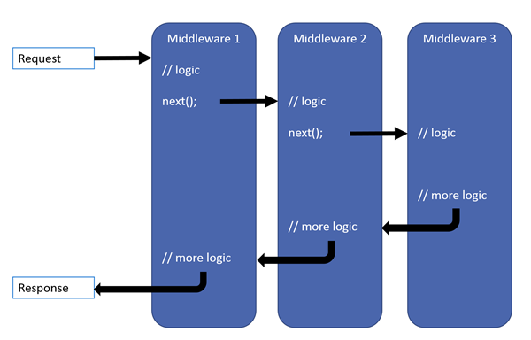

# Modules, handlers, and middleware

[!INCLUDE [book-preview](../../../includes/book-preview.md)]

An ASP.NET Core app is built upon a series of *middleware*. Middleware is handlers that are arranged into a pipeline to handle requests and responses. In a Web Forms app, HTTP handlers and modules solve similar problems. In ASP.NET Core, modules, handlers, *Global.asax.cs*, and the app life cycle are replaced with middleware. In this chapter, you'll learn what middleware in the context of a Blazor app.

## Overview

The ASP.NET Core request pipeline consists of a sequence of request delegates, called one after the other. The following diagram demonstrates the concept. The thread of execution follows the black arrows.



The preceding diagram lacks a concept of lifecycle events. This concept is foundational to how ASP.NET Web Forms requests are handled. This system makes it easier to reason about what process is occurring and allows middleware to be inserted at any point. Middleware executes in the order in which it's added to the request pipeline. They're also added in code instead of configuration files, usually in *Startup.cs*.

## Katana

Readers familiar with Katana will feel comfortable in ASP.NET Core. In fact, Katana is a framework from which ASP.NET Core derives. It introduced similar middleware and pipeline patterns for ASP.NET 4.x. Middleware designed for Katana can be adapted to work with the ASP.NET Core pipeline.

## Common middleware

ASP.NET 4.x includes many modules. In a similar fashion, ASP.NET Core has many middleware components available as well. IIS modules may be used in some cases with ASP.NET Core. In other cases, native ASP.NET Core middleware may be available.

The following table lists replacement middleware and components in ASP.NET Core.

|Module                 |ASP.NET 4.x module           |ASP.NET Core option|
|-----------------------|-----------------------------|-------------------|
|HTTP errors            |`CustomErrorModule`          |[Status Code Pages Middleware](/aspnet/core/fundamentals/error-handling#usestatuscodepages)|
|Default document       |`DefaultDocumentModule`      |[Default Files Middleware](/aspnet/core/fundamentals/static-files#serve-a-default-document)|
|Directory browsing     |`DirectoryListingModule`     |[Directory Browsing Middleware](/aspnet/core/fundamentals/static-files#enable-directory-browsing)|
|Dynamic compression    |`DynamicCompressionModule`   |[Response Compression Middleware](/aspnet/core/performance/response-compression)|
|Failed requests tracing|`FailedRequestsTracingModule`|[ASP.NET Core Logging](/aspnet/core/fundamentals/logging/index#tracesource-provider)|
|File caching           |`FileCacheModule`            |[Response Caching Middleware](/aspnet/core/performance/caching/middleware)|
|HTTP caching           |`HttpCacheModule`            |[Response Caching Middleware](/aspnet/core/performance/caching/middleware)|
|HTTP logging           |`HttpLoggingModule`          |[ASP.NET Core Logging](/aspnet/core/fundamentals/logging/index)|
|HTTP redirection       |`HttpRedirectionModule`      |[URL Rewriting Middleware](/aspnet/core/fundamentals/url-rewriting)|
|ISAPI filters          |`IsapiFilterModule`          |[Middleware](/aspnet/core/fundamentals/middleware/index)|
|ISAPI                  |`IsapiModule`                |[Middleware](/aspnet/core/fundamentals/middleware/index)|
|Request filtering      |`RequestFilteringModule`     |[URL Rewriting Middleware IRule](/aspnet/core/fundamentals/url-rewriting#irule-based-rule)|
|URL rewriting&#8224;   |`RewriteModule`              |[URL Rewriting Middleware](/aspnet/core/fundamentals/url-rewriting)|
|Static compression     |`StaticCompressionModule`    |[Response Compression Middleware](/aspnet/core/performance/response-compression)|
|Static content         |`StaticFileModule`           |[Static File Middleware](/aspnet/core/fundamentals/static-files)|
|URL authorization      |`UrlAuthorizationModule`     |[ASP.NET Core Identity](/aspnet/core/security/authentication/identity)|

This list isn't exhaustive but should give an idea of what mapping exists between the two frameworks. For a more detailed list, see [IIS modules with ASP.NET Core](/aspnet/core/host-and-deploy/iis/modules).

## Custom middleware

Built-in middleware may not handle all scenarios needed for an app. In such cases, it makes sense to create your own middleware. There are multiple ways of defining middleware, with the simplest being a simple delegate. Consider the following middleware, which accepts a culture request from a query string:

```csharp
public class Startup
{
    public void Configure(IApplicationBuilder app)
    {
        app.Use(async (context, next) =>
        {
            var cultureQuery = context.Request.Query["culture"];

            if (!string.IsNullOrWhiteSpace(cultureQuery))
            {
                var culture = new CultureInfo(cultureQuery);

                CultureInfo.CurrentCulture = culture;
                CultureInfo.CurrentUICulture = culture;
            }

            // Call the next delegate/middleware in the pipeline
            await next();
        });

        app.Run(async (context) =>
            await context.Response.WriteAsync(
                $"Hello {CultureInfo.CurrentCulture.DisplayName}"));
    }
}
```

Middleware can also be defined as class, either by implementing the `IMiddleware` interface or by following middleware convention. For more information, see [Write custom ASP.NET Core middleware](/aspnet/core/fundamentals/middleware/write).

>[!div class="step-by-step"]
>[Previous](data.md)
>[Next](config.md)
