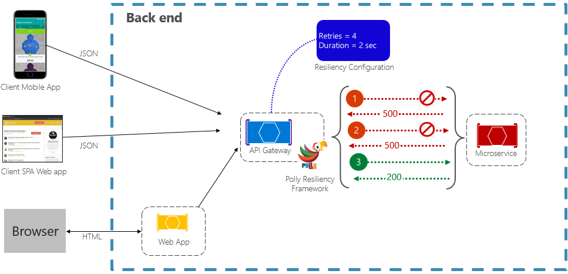
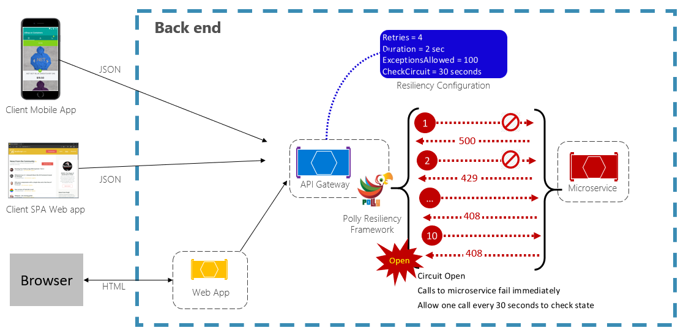

# Application Resiliency Patterns

The first line of defense is software-enabled application resiliency. 

While you could invest time writing your own resiliency framework, such frameworks already exist. For example, Polly is a comprehensive .NET resilience and transient-fault-handling library that allows developers to express
resiliency policies in a fluent and thread-safe manner. Polly targets applications build with both the .NET Framework and .NET Core. Figure 6-2 shows the resiliency policies (that is, functionality) exposed by the Polly Library. These policies can be applied individually or combined together.

**Figure 6-2**. Polly Resiliency Framework Features

Note how in the previous figure the various resiliency policies apply to operation requests, whether coming from an external client or another backend service. The goal is to correctly compensate the request for a that might be intermittently unavailable for a short time duration (in seconds). These interruptions typically manifest themselves with specific HTTP status codes as shown in Figure
6-3.

**Figure 6-3**. HTTP Status Code to Retry

Question: Would you retry an HTTP Status Code of 403 - Forbidden? No. In that case, the system is functioning properly and telling you aren't authorized to perform the operation that you're requesting. Care must be taken in selecting appropriate operations to retry.

As recommended in Chapter 1, Microsoft developers targeting cloud native applications should be building on the .NET Core framework. At the time of this writing, version 2.2 is the current release. Version 2.1 introduced the `HTTPClientFactory` library as a way for sending HTTP requests and receiving HTTP responses from a resource that is identified as a URL. Superseding the original <xref:System.Net.Http.HttpClient> class, the factory class supports many enhanced features, one of which is tight integration with the Polly resiliency framework. It enables you to easily define resiliency policies in the application Startup class to handle partial failures and connectivity issues. Figure X below shows a code block that configures resiliency for a given service.

   Show code block: Polly configuration in startup.cs

Next, let's expand on retry and circuit breaker patterns.

### Retry Pattern

In a distributed cloud native environment, calls to services and cloud resources can fail because of transient (short-lived) failures, which typically correct themselves after a short period of time. Implementing a retry strategy helps a cloud native system handle these scenarios.

The [Retry Pattern](https://docs.microsoft.com/azure/architecture/patterns/retry) enables a service to retry a failed request operation a (configurable) number of times with an exponentially increasing wait time. Figure 6-4 shows a retry in action:

**Figure 6-4**. Retry Pattern in Action

In the previous figure, a retry pattern has been implemented for specific request operation. It's configured to allow up to four retries before failing with a starting backoff interval of two seconds, which  exponentially doubles for each subsequent attempt.

- The first invocation fails and returns an HTTP status code of 500. The application waits for 2 seconds and reties the call.
- The second invocation also fails and returns an HTTP status code of 500. The application now doubles the wait time to four seconds and retries the call.
- Finally, the third call succeeds.
- In this scenario, the retry operation would have attempted up to four retries while doubling the  backoff duration before formally failing the call.

It's important to increase the backoff period before retrying the next call to allow the service time to self-correct. It's a best practice to implement an exponentially increasing backoff (doubling the period on each retry) to allow for adequate correction time.

## Circuit Breaker Pattern

While the retry pattern can help salvage a request caught up in a partial
failure, there are situations where faults can be caused by unanticipated events that will require longer periods of time to resolve. These faults can range in severity from a partial loss of connectivity to the complete failure of a service. In these situations, it's pointless for an application to continually retry an operation that is unlikely to succeed.

To make things worse, executing continual retry operations on a non-responsive service can move you into a self-imposed denial of service scenario where you flood your service with continual calls exhausting resources such as memory, threads and database connections, causing failure in unrelated parts of the system that use the same resources.

In these situations, it would be preferable for the operation to fail immediately, and only attempt to invoke the service if it's likely to succeed.

The [Circuit Breaker pattern](https://docs.microsoft.com/azure/architecture/patterns/circuit-breaker)
can prevent an application from repeatedly trying to execute an operation that's likely to fail. It also monitors the application with periodic trial call to determine whether the fault has resolved. Figure 6-5 shows the Circuit Breaker pattern in action:

Figure 6-5. Circuit Breaker Pattern in Action

In the previous figure, a circuit breaker pattern has been added to the original retry pattern. Note how after 10 failed requests, the circuit breakers opens and no longer allows calls to the service. The CheckCircuit value, set at 30 seconds, specifies how often the framework allows one request to proceed to the service. If that call succeeds, the circuit closes and the service is once again available to traffic.

Keep in mind that the intent of the Circuit Breaker pattern is *different* than the Retry pattern. The Retry pattern enables an application to retry an operation in the expectation that it will succeed. The Circuit Breaker pattern prevents an application from doing an operation that is likely to fail. An application can *combine* these two patterns by using the Retry pattern to invoke an operation through a circuit breaker. However, the retry logic should be sensitive to any exceptions returned by the circuit breaker and abandon retry attempts if the circuit breaker indicates that a fault isn't transient.

Application resiliency is a must for handling problematic requested operations. But, it's only half of the story. Next, we cover resiliency features available in the Azure cloud.

>[!div class="step-by-step"]
>[Previous](resiliency.md)
>[Next](infrastructure-resiliency-azure.md)
