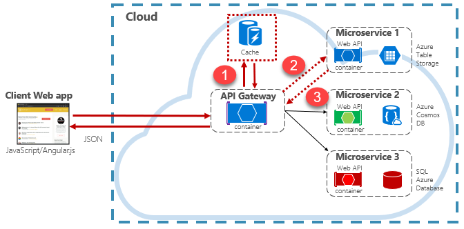

# Caching in a cloud-native app

The benefits of caching are well understood. The technique works by temporarily copying frequently accessed data from a backend data store to *fast storage* that's located closer to the application. Caching is often implemented where...

- Data remains relatively static.
- Data access is slow, especially compared to the speed of the cache.
- Data is subject to high levels of contention.

## Why?

As discussed in the [Microsoft caching guidance](https://docs.microsoft.com/azure/architecture/best-practices/caching?toc=%2Fazure%2Fredis-cache%2Ftoc.json), caching can increase performance, scalability, and availability for individual microservices and the system as a whole. It reduces the latency and contention of handling large volumes of concurrent requests to a data store. As data volume and the number of users increase, the greater the benefits of caching become.

Caching is most effective when a client repeatedly reads data that is immutable or that changes infrequently. Examples include reference information such as product and pricing information, or shared static resources that are costly to construct.

While microservices should be stateless, a distributed cache can support concurrent access to session state data when absolutely required.

Also consider caching to avoid repetitive computations. If an operation transforms data or performs a complicated calculation, cache the result for subsequent requests.

## Caching architecture

Cloud native applications typically implement a distributed caching architecture. The cache is hosted as a [cloud-based backing service](./definition.md#backing-services), separate from the microservices. Figure 5- shows the architecture.

**Figure 5-**: Caching in a cloud native app

In the figure above, note how the cache is independent of and shared by the microservices. In this scenario, the cache is invoked by the [API Gateway](./front-end-communication.md#Front-end-client-communication). As discussed in chapter 4, the gateway serves as a front end for all incoming requests. The distributed cache increases system responsiveness by returning cached data whenever possible. Additionally, separating the cache from the services allows the cache to scale up or out independently to meet increased traffic demands.

The figure presents a common caching pattern known as the [cache-aside pattern](https://docs.microsoft.com/azure/architecture/patterns/cache-aside). For an incoming request, you first query the cache (step #1) for a response. If found, the data is returned immediately. If the data doesn't exist in the cache (known as a [cache miss](https://www.techopedia.com/definition/6308/cache-miss)), it's retrieved from a local database in a downstream service (step #2). It's then written to the cache for future requests (step #3), and returned to the caller. Care must be taken to periodically evict cached data so that the system remains timely and consistent.

As a shared cache grows, it might prove beneficial to partition its data across multiple nodes. Doing so can help minimize contention and improve scalability. Many Caching services support the ability to dynamically add and remove nodes and rebalance data across partitions. This approach typically involves clustering. Clustering exposes a collection of federated nodes as a seamless, single cache. Internally, however, the data is dispersed across the nodes following a predefined distribution strategy that balances the load evenly.

## Azure Cache for Redis

[Azure Cache for Redis](https://azure.microsoft.com/services/cache/) is a secure data caching and messaging broker service, fully managed by Microsoft. Consumed as a [Platform as a Service (PaaS)](https://azure.microsoft.com/overview/what-is-paas/) offering, it provides high throughput and low-latency access to data. The service is accessible to any application within or outside of Azure.

The Azure Cache for Redis service manages access to open-source Redis servers hosted across Azure data centers. The service acts as a facade providing management, access control, and security. The service natively supports a rich set of data structures, including [strings](http://redis.io/topics/data-types#strings), [hashes](http://redis.io/topics/data-types#hashes), [lists](http://redis.io/topics/data-types#sets), and [sets](http://redis.io/topics/data-types#sets). If your application already uses Redis, it will work as-is with Azure Cache for Redis.

Azure Cache for Redis is [more than a simple cache server](https://docs.microsoft.com/azure/azure-cache-for-redis/cache-overview). It can support a number of scenarios to enhance a microservices architecture:

- An in-memory data store
- A distributed non-relational database
- A message broker
- A configuration or discovery server
  
For advanced scenarios, a copy of the cached data can be [persisted to disk](https://docs.microsoft.com/azure/azure-cache-for-redis/cache-how-to-premium-persistence). If a catastrophic event were to disable both the primary and replica caches, the cache is reconstructed from the most recent snapshot.

Azure Redis Cache is available across a number of predefined configurations and pricing tiers.  The [Premium tier](https://docs.microsoft.com/azure/azure-cache-for-redis/cache-premium-tier-intro) features many enterprise-level features such as clustering, data persistence, geo-replication, and virtual-network isolation.

## Summary

This chapter presented a detailed look at data in cloud-native systems. We started by contrasting data storage in monolithic applications with that in cloud-native systems. We looked at data patterns implemented in cloud-native systems, including cross-service queries, distributed transactions, and patterns to deal with high-volume systems. We contrasted SQL with NoSQL data stores. We looked at data storage options available in Azure that include both Microsoft-centric and open-source options. Finally, we discussed caching in a cloud-native application.

### References

- [Command and Query Responsibility Segregation (CQRS) pattern](https://docs.microsoft.com/azure/architecture/patterns/cqrs)

- [Event Sourcing pattern](https://docs.microsoft.com/azure/architecture/patterns/event-sourcing)

- [RDBMSs vs. NoSQL Databases: Overview](https://maxivak.com/rdbms-vs-nosql-databases/)

- [Why isn't RDBMS Partition Tolerant in CAP Theorem and why is it Available?](https://stackoverflow.com/questions/36404765/why-isnt-rdbms-partition-tolerant-in-cap-theorem-and-why-is-it-available)

- [Materialized View](https://docs.microsoft.com/azure/architecture/patterns/materialized-view)

- [All you really need to know about open source databases](https://www.ibm.com/blogs/systems/all-you-really-need-to-know-about-open-source-databases/)

- [Compensating Transaction pattern](https://docs.microsoft.com/azure/architecture/patterns/compensating-transaction)

- [Saga Pattern](https://microservices.io/patterns/data/saga.html)

- [Saga Patterns | How to implement business transactions using microservices](https://blog.couchbase.com/saga-pattern-implement-business-transactions-using-microservices-part/)

- [Compensating Transaction pattern](https://docs.microsoft.com/azure/architecture/patterns/compensating-transaction)

- [Getting Behind the 9-Ball: Cosmos DB Consistency Levels Explained](https://blog.jeremylikness.com/blog/2018-03-23_getting-behind-the-9ball-cosmosdb-consistency-levels/)

- [Exploring the different types of NoSQL Databases Part II](https://www.3pillarglobal.com/insights/exploring-the-different-types-of-nosql-databases)
  
- [Microservice - Data Considerations](https://docs.microsoft.com/azure/architecture/microservices/design/data-considerations)

>[!div class="step-by-step"]
>[Previous](azure-data-storage.md)
>[Next](resiliency.md) <!-- Next Chapter -->
