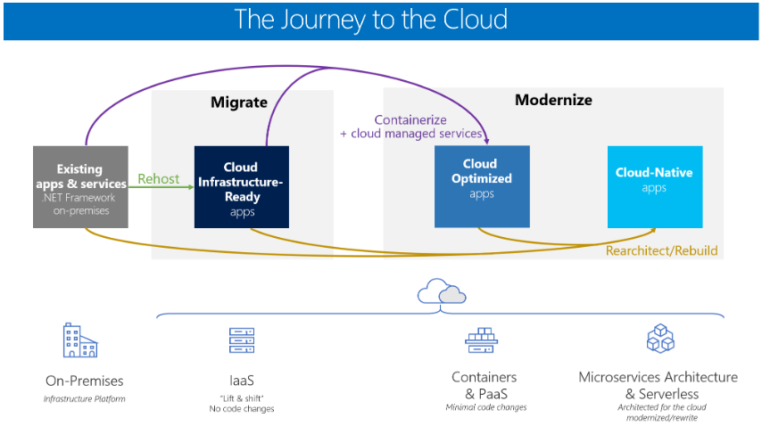

# Candidate Apps for Cloud Native

Take a close look at the apps in your portfolio. How many of them justify a cloud-native architecture? All of them? Perhaps some?

Applying a cost/benefit trade-off, many wouldn't warrant the hefty price tag required to be cloud native. A cloud native-based approach would greatly exceed the business value of the application - like driving a large 18-wheeler semi-truck to the local 7-11 store to buy milk - when your simple Honda sedan would work just fine.

What types of applications might be candidates for a cloud-native approach?

- Large, strategic enterprise systems that need to align to business capabilities/features

- Systems that require a high release velocity - frequent releases with high confidence

- The ability to immediately release features without redeploying the entire system

- Applications developed by heterogenous teams with expertise in different technology stacks

- Applications with components that must scale independently

While we'd all like to maximize our developer excitement level building brand new (known as green field) systems, often we're charged with modernizing legacy (known as brownfield) workloads that are critical to the business. While not "born in the cloud," a legacy brownfield application could be decomposed into microservices, containerized, and eventually "replatformed" into a cloud native architecture.  	

The free Microsoft e-book [Modernize existing .NET applications with Azure cloud and Windows Containers](https://dotnet.microsoft.com/download/thank-you/modernizing-existing-net-apps-ebook) provides a wealth of guidance for migrating on-premises workloads into cloud. Figure 1-11 shows that there isn't a single, one-size-fits-all strategy for migrating legacy applications to the cloud.

**Figure 1-11**. Strategies for migrating legacy workloads

Non-critical monolithic apps might benefit from a quick lift-and-shift ([Cloud Infrastructure-Ready](https://docs.microsoft.com/dotnet/standard/modernize-with-azure-and-containers/lift-and-shift-existing-apps-azure-iaas)) effort where an on-premises workload is re-hosted in the cloud, as-is, typically to a cloud-based VM, leveraging the IaaS (Infrastructure as a Service) model. Azure includes several tools such as ([Azure Migrate](https://aka.ms/azuremigrate), [Azure Site Recovery](https://azure.microsoft.com/services/site-recovery/), and [Azure Database Migration Service](https://azure.microsoft.com/campaigns/database-migration/)) to make such a move easier.

Business critical systems may warrant an enhanced lift-and-shift (*Cloud Optimized*) that include deployment optimizations to leverage key cloud services - without changing the core architecture of the application. You might [containerize](https://docs.microsoft.com/virtualization/windowscontainers/about/) the application to capture the code, runtime, and dependencies - without changing code - to increase deployment agility and embrace many cloud-based features.

Finally, strategic enterprise-critical applications might best benefit from a *Cloud-Native* approach, the subject of this book. This approach provides for increased long-term agility and more efficient application maintenance, but comes at a cost of re-platforming, re-architecting, and rewriting code.

If you and your team believe that a cloud-native approach might be justified, it behooves you to rationalize the decision with the business needs of your organization. What exactly is the business problem that a cloud- native approach will solve? How would it align with business needs?

- Rapid releases of features with increased confidence?

- Fine-grained scalability - more efficient usage of resources?

- Improve system resiliency?

- Improve system performance?

- Provide more visibility into operations?

- Blend platforms and data stores to arrive at the best tool for the job?

- Future-proofing application investment?

The right strategy for you depends on your organization's needs and priorities, and the system that you're targeting. In many cases, you may find it more cost effective to create a simpler monolithic application, or add coarse-grained services to an N-Tier app. In these cases, you can still make full use of cloud PaaS capabilities like the ones offered by Azure App Service.

>[!div class="step-by-step"]
>[Previous](definition.md)
>[Next](azure-development-stack.md)
