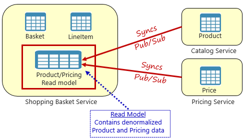
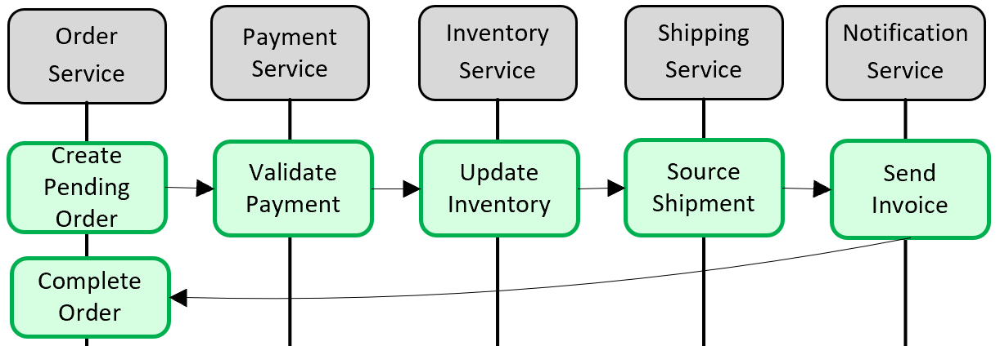
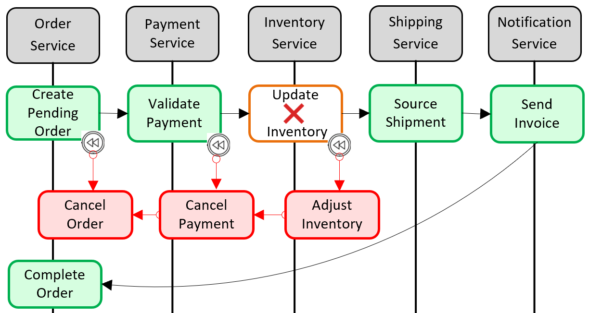

# Cloud native data patterns

While decentralized data can lead to improved performance, scalability and cost savings, it also presents many challenges. For example, querying for data across multiple services becomes tricky and complex. Then, there is no support for a distributed transaction. A transaction that spans several microservices must be managed by your code, including a mechanism to roll back changes in the event of a partial transactional failure. Then, a transaction across multiple services will result in [eventual consistency](https://en.wikipedia.org/wiki/Eventual_consistency) which is discussed later in this chapter.

Let's examine these challenges.

## Cross-Service Queries

To start, how does an application query data that is distributed across multiple, independent microservices?

This scenario is shwon in Figure 5-4.

![Cross service query] (./media/cross-service-query.png)

**Figure 5-4**. Cross-service query

In the prevous figure, we see a shopping basket microservice that adds an item to a user's shopping basket. While the data store of the shopping basket service contains a basket and lineItem table, it does not contain product or pricing information. Instead, that data is found in the product and price microservices, respectfully. But, to add an item, the shopping basket microservice needs product data and pricing data. So how does it obtain product and pricing data?

The shopping basket microservice could make a direct HTTP call to both the product catalog and pricinp microservices shown in Figure 5-5.

**Figure 5-5**. Direct HTTP communication

But, as we discussed in chapter 4, direct HTTP calls made across multiple backend microservices couple the system together and are not considered a good practice.

We could implement an *aggregator microservice* as shown in Figure 5-6.

**Figure 5-6.** Aggregator microservice

While this approach isolates the workflow to an a dedicated microservice, it adds complexity and still results in direct HTTP calls.

Instead, a common approach for executing cross-microservice queries system is the [Materialized view pattern](https://docs.microsoft.com/azure/architecture/patterns/materialized-view), as show in Figure 5-7 below.

**Figure5-7**. Materialized view pattern

Start here

The pattern here is simple. In the data store for the Shopping Basket microservice, you include a local table, called a *read model*, that contains a denormalized copy of the data that is needed from Product and Pricing microservices. Directly placing the data inside the Shopping Basket microservice eliminates the need for making expensive cross-service calls and provides *locality* of data improving response time and reliability while removing coupling and reducing architectural complexity.

The catch is that we now have duplicate data in our system. The good news is duplicate data is not considered an anti-pattern in distributed systems. However, one and only one system can be the owner of any dataset, and you will need to set up a publish/subscribe mechanism that will enable the system of record to update all of the read models when a change to the underlying data occurs.

## Transactional Support

While cross-service queries can be complex, implementing cross-service transactions is even more tricky. The inherent challenge of maintaining consistency across data sources that reside in different services cannot be understated. Figure 5-8, shown below, depicts the problem.

**Figure 5-8**. Implementing a Transaction Across Microservices

In the above figure, we have five independent microservices that all participate in a Create Order transaction. In this scenario, all 5 services must succeed, or all must abort and roll-back the operation. While built-in transactional support is available inside each of the services, there is no support for a distributed transaction across all five services.

However, transactional support is essential for this operation as without it, we have no way of keeping data consistent. So, we are put into a situation where we have to build transactional support.

A widely-accepted pattern for programmatically adding transactional support is the [Saga pattern](https://blog.couchbase.com/saga-pattern-implement-business-transactions-using-  microservices-part/). It is implemented by building a message-driven sequence of local transactions in which each service is sequentially updated. If any local transaction fails, the Saga aborts the operation and invokes [compensating transactions](https://docs.microsoft.com/azure/architecture/patterns/compensating-transaction) that undo the changes made by the preceding local transactions. Figure 5-9, show below, depicts a failed Saga.

**Figure 5-9**. Rolling Back an Operation

In the figure above, the GenerateContent operation has failed in the Music microservice. Note how the Saga invokes compensating transactions (in red) to remove content, cancel payment and cancel the order.

Saga patterns are typically choreographed as a series of related events or orchestrated as a set of related commands.

## CQRS Pattern

CQRS, or [Command and Query Responsibility Segregation](https://docs.microsoft.com/azure/architecture/patterns/cqrs), is an architectural pattern that separate operations that read data from those that write data. This pattern can help maximize performance, scalability and security.

In normal data access scenarios, you implement a single set of entity and repository objects that perform *both* read and write data operations.

However, a more advanced data access scenario might warrant separate models (i.e. data entity classes) and even separate tables for reads and writes. To improve performance, the read operation, known as a *query*, might go against a highly denormalized representation of the data to avoid expensive repetitive table joins. Whereas the *write* operation, known as a *command*, goes against a fully normalized representation of the data. You would then need to implement a mechanism that kept both representations in sync. Typically, whenever the write table is modified, it raises an event that replicates that data modification to the read table.

Figure 5-10, shown below, depicts a CQRS pattern.

**Figure 5-10**. CQRS Implementation

Note in the figure above how separate command and query models are implemented. Moreover, each data write operation is saved to the write store and then propagated to the read store. Pay close attention to how the propagation process experiences the principle of eventual consistency, whereas the read model eventually synchronizes with the write model, but there may be some lag in the process.

By implementing separation, you have the ability to scale reads and writes separately. As well, you might impose tighter security on write operations than those concerning reads.

Typically, CQRS patterns are applied to limited sections of your system based upon specific needs.

## Relational vs NoSQL

The impact of [NoSQL](https://www.geeksforgeeks.org/introduction-to-nosql/) technologies cannot be overstated, especially for distributed cloud native systems. The proliferation of new data technologies in this space has disrupted solutions that were once exclusively solved with relational databases.

On the one side, relational databases have been a prevalent technology for decades. They are mature, proven and widely implemented. Competing database products, expertise and tooling abounds. Relational databases provide a store of related data tables. These tables have a fixed schema, use SQL (Structured Query Language) to manage data and have [ACID](https://www.geeksforgeeks.org/acid-properties-in-dbms/) (Atomicity, Consistency, Isolation and Durability) guarantees.

No-SQL databases, on the other side, refer to high-performance, non-relational data stores. They excel in their ease-of-use, scalability, resilience and availability characteristics. Instead of joing tables of normalized data, NoSQL stores self-describing (schemaless) data and is typically stored in JSON documents. They do not offer [ACID](https://www.geeksforgeeks.org/acid-properties-in-dbms/) guarantees.

A way to understand the differences between these types of databases can be found in the [CAP theorem](https://towardsdatascience.com/cap-theorem-and-distributed-database-management-systems-5c2be977950e), a set of principles that can be applied to distributed systems that store state. Figure 5-11 below depicts the three properties of the CAP theorem.

**Figure 5-11**. The CAP Theorem

The theorem states that any distributed data system will offer a trade-off between consistency, availability and partition tolerance and that any database can only guarantee two of the three properties:

-   *Consistency* Every node in the cluster will respond with the most recent data, even if it requires blocking a request until all replicas are correctly updated

-   *Availability* Every node will return a response in a reasonable amount of time, even if that response is not the most recent data

-   *Partition Tolerance* Guarantees that the system will operate if a node fails or loses connectivity with another

Relational databases exhibit consistency and availability, but not so much partition tolerance. Partitioning for a relational database, such as sharding, is difficult and can impact performance.

On the other hand, NoSQL databases typically exhibit partition tolerance (horizontal scalability) and high availability. As the CAP theorem specifies, you can only have two of the three principles, and you therefore lose the consistency property.

NoSQL databases are often distributed and commonly scaled out across commodity servers. Doing so can provide great availability, both within and across geographical regions at a reduced cost. Data can be partitioned and replicated across these machines, or nodes, providing redundancy and fault tolerance. The downside is consistency. A change to data on one NoSQL node can take some time to propagate to other nodes. Typically, a NoSQL database node will provide an immediate response to a query, even if the data that it is presenting is stale and has not been updated yet.

This is called [eventual consistency](https://en.wikipedia.org/wiki/Eventual_consistency), a characteristic of distributed data systems where ACID transactions are not supported. It is a (brief) delay between the update of a data item and time that it takes to propagate that update to each of the replica nodes. So, if you update a product item in a NoSQL database in the United States, but at same time query another that data item from a replica node in Europe, you might retrieve the earlier product information that is, until the European node has updated. Again, the trade-off here is that by giving up [strong consistency](https://en.wikipedia.org/wiki/Strong_consistency), (i.e., waiting for all nodes to update before returning a query result), you are able to support enormous scale and traffic volume, but with the possibility of presenting older data.

NoSQL databases can be categorized by one of the following four models: 

-   *Document Store* (mongodb, couchdb, couchbase) - Data (and corresponding metadata) is stored non-relationally in denormalized JSON-based documents inside the database

-   *Key/Value Store* (redis, riak, memcached) Data is stored in simple key-value pairs with system operations performed against a unique access key that is mapped to a value of user data

-   *Wide-Column Store* (hbase, Cassandra) Related data is stored in a columnar format as a set of nested-key/value pairs within a single column with data typically retrieved as a single unit without having to join multiple tables together

-   *Graph stores* (neo4j, titan) Data is stored as a graphical representation within a node along with edges that specify the relationship between the nodes

NoSQL databases can be optimized to deal with large scale data needs, especially when the data is relatively simple. Consider a NoSQL database when: 

-   Your workload requires large-scale and high-concurrency

-   You have large numbers of users

-   Your data can be expressed simply without relationships

-   You need to geographically distribute your data

-   You don't need ACID guarantees

-   Will be deployed to commodity hardware

Then, consider a SQL database when:

-   Your workloads require medium to large-scale

-   Concurrency isn't a major concern

-   ACID guarantees are needed

-   Data is best expressed relationally

-   Will be deployed to large, high-end hardware

Next, we visit data storage in the Azure cloud.

>[!div class="step-by-step"]
>[Previous](distributed-data.md)
<[Next](azure-data-storage.md)
