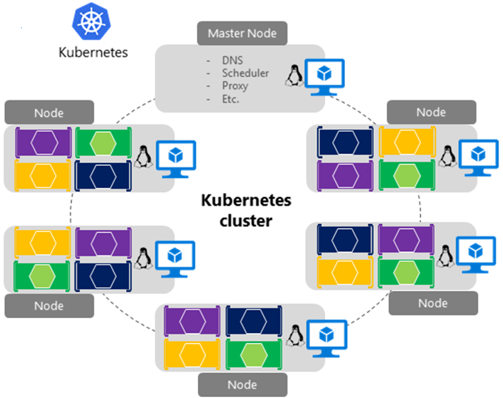

# Cloud-native communication patterns

When constructing a cloud native system, communication becomes a significant design decision. How does a front-end client application communicate with a backend microservice? How do backend microservices communicate with each other? What are the principles, patterns, and best practices to consider when implementing communication in cloud-native applications?

## Communication considerations

In a monolithic application, communication is straightforward. The code modules execute together in the same executable space (process) on a server. This approach can have performance advantages as everything runs together in shared memory, but results in tightly coupled code that becomes difficult to maintain, evolve, and scale.

Cloud-native systems implement a microservice-based architecture with many small, independent microservices. Each microservice executes in a separate process and typically runs inside a container that is deployed to a *cluster*. 

A cluster groups a pool of virtual machines together to form a highly available environment. They're managed with an orchestration tool, which is responsible for deploying and managing the containerized microservices. Figure 4-1 shows a [Kubernetes](https://kubernetes.io) cluster deployed into the Azure cloud with the fully managed [Azure Kubernetes Services](https://docs.microsoft.com/azure/aks/intro-kubernetes).

**Figure 4-1**. A Kubernetes cluster in Azure

Across the cluster, microservices communicate with each other through APIs and messaging technologies.

While they provide many benefits, microservices are no free lunch. Local in-process method calls between components are now replaced with network calls. Each microservice must communicate over a network protocol, which adds complexity to your system:

- Network congestion, latency, and transient faults are a constant concern.

- Resiliency (that is, retrying failed requests) is essential.

- Some calls must be [idempotent](https://www.restapitutorial.com/lessons/idempotency.html) as to keep consistent state.

- Each microservice must authenticate and authorize calls.

- Each message must be serialized and then deserialized - which can be expensive.

- Message encryption/decryption becomes important.

The book [.NET Microservices: Architecture for Containerized .NET Applications](https://docs.microsoft.com/dotnet/standard/microservices-architecture/), available for free from Microsoft, provides an in-depth coverage of communication patterns for microservice applications. In this chapter, we provide a high-level overview of these patterns along with implementation options available in the Azure cloud.

In this chapter, we'll first address communication between front-end applications and back-end microservices. We'll then look at back-end microservices communicate with each other. We'll explore the up and gRPC communication technology. Finally, we'll look new innovative communication patterns using service mesh technology. We'll also see how the Azure cloud provides different kinds of *backing services* to support cloud-native communication.  

>[!div class="step-by-step"]
>[Previous](other-deployment-options.md)
>[Next](front-end-communication.md)
