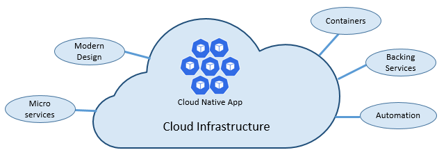
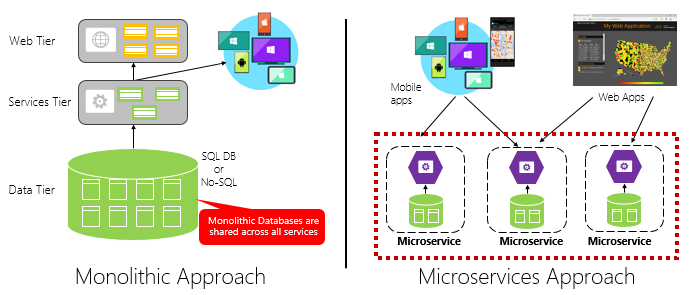
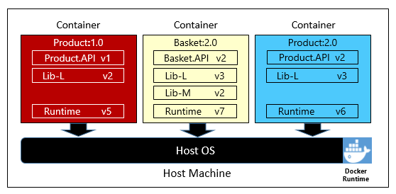
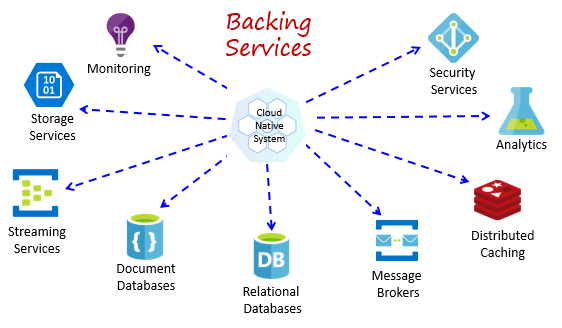
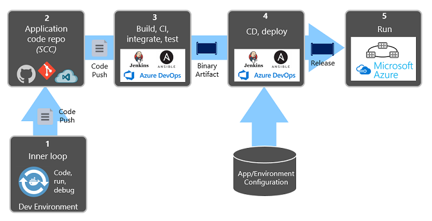

# Defining cloud native

[!INCLUDE [book-preview](../../../includes/book-preview.md)]

Stop what you’re doing and text 10 of your colleagues. Ask them to define the term “Cloud Native.” Good chance you’ll get eight different answers. Interestingly, six months from now, as cloud-native technologies and practices evolve, so will their definition.

Cloud native is all about changing the way we think about constructing critical business systems.

Cloud-native systems are designed to embrace rapid change, large scale, and resilience. 

The Cloud Native Computing Foundation provides an [official definition](https://github.com/cncf/foundation/blob/master/charter.md):

> *Cloud-native technologies empower organizations to build and run scalable applications in modern, dynamic environments such as public, private, and hybrid clouds. Containers, service meshes, microservices, immutable infrastructure, and declarative APIs exemplify this approach.*

> *These techniques enable loosely coupled systems that are resilient, manageable, and observable. Combined with robust automation, they allow engineers to make high-impact changes frequently and predictably with minimal toil.*

Applications have become increasingly complex with users demanding more and more. Users expect rapid responsiveness, innovative features, and zero downtime. Performance problems, recurring errors, and the inability to move fast are no longer acceptable. They'll easily move to your competitor.

Cloud native is much about *speed* and *agility*. Business systems are evolving from enabling business capabilities to weapons of strategic transformation, accelerating business velocity and growth. It’s imperative to get ideas to market immediately. 

Here are some companies who have implemented these techniques. Think about the speed, agility, and scalability they've achieved.

| Company | Experience | 
| :-------- | :-------- |
| [Netflix](https://www.infoq.com/news/2013/06/netflix/) | Has 600+ services in production. Deploys a hundred times per day. |
| [Uber](https://eng.uber.com/micro-deploy/) | Has 1,000+ services stored in production. Deploys several thousand builds each week. | 
| [WeChat](https://www.cs.columbia.edu/~ruigu/papers/socc18-final100.pdf) | Has 300+ services in production. Makes almost 1,000 changes per day. |

As you can see, Netflix, Uber, and WeChat expose systems that consist of hundreds of independent microservices. This architectural style enables them to rapidly respond to market conditions. They can instantaneously update small areas of a live, complex application, and individually scale those areas as needed.

The speed and agility of cloud native come about from a number of factors. Foremost is cloud infrastructure. Five additional foundational pillars shown in Figure 1-3 also provide the bedrock for cloud-native systems.

**Figure 1-3**. Cloud-native foundational pillars

Let’s take some time to better understand the significance of each pillar.

## The cloud…

Cloud-native systems take full advantage of the cloud service model.

Designed to thrive in a dynamic, virtualized cloud environment, these systems make extensive use of [Platform as a Service (PaaS)](https://azure.microsoft.com/overview/what-is-paas/) compute infrastructure and managed services. They treat the underlying infrastructure as *disposable* - provisioned in minutes and resized, scaled, moved, or destroyed on demand – via automation.

Consider the widely accepted DevOps concept of [Pets vs. Cattle](https://medium.com/@Joachim8675309/devops-concepts-pets-vs-cattle-2380b5aab313). In a traditional data center, servers are treated as *Pets*: a physical machine, given a meaningful name, and cared for. You scale by adding more resources to the same machine (scaling up). If the server becomes sick, you nurse it back to health. Should the server become unavailable, everyone notices.

The *Cattle* service model is different. You provision each instance as a virtual machine or container. They're identical and assigned a system identifier such as Service-01, Service-02, and so on. You scale by creating more of them (scaling out). When one becomes unavailable, nobody notices.

The cattle model embraces *immutable infrastructure*. Servers aren't repaired or modified. If one fails or requires updating, it's destroyed and a new one is provisioned – all done via automation.

Cloud-native systems embrace the Cattle service model. They continue to run as the infrastructure scales in or out with no regard to the machines upon which they're running.

The Azure cloud platform supports this type of highly elastic infrastructure with automatic scaling, self-healing, and monitoring capabilities.

## Modern design

How would you design a cloud-native app? What would your architecture look like? To what principles, patterns, and best practices would you adhere? What infrastructure and operational concerns would be important?

### The Twelve-Factor Application

A widely accepted methodology for constructing cloud-based applications is the [Twelve-Factor Application](https://12factor.net/). It describes a set of principles and practices that developers follow to construct applications optimized for modern cloud environments. Special attention is given to portability across environments and declarative automation.

While applicable to any web-based application, many practitioners consider it as a solid foundation for building cloud-native apps. Systems built upon these principles can deploy and scale rapidly and add features to react quickly to market changes.

The following table highlights the Twelve-Factor methodology:

|    |  Factor | Explanation  |
| :-------- | :-------- | :-------- |
| 1 | Code Base | A single code base for each microservice, stored in its own repository. Tracked with version control, it can deploy to multiple environments (QA, Staging, Production). |
| 2 | Dependencies | Each microservice isolates and packages its own dependencies, embracing changes without impacting the entire system. |
| 3 | Configurations  | Configuration information is moved out of the microservice and externalized through a configuration management tool outside of the code. The same deployment can propagate across environments with the correct configuration applied.  |
| 4 | Backing Services | Ancillary resources (data stores, caches, message brokers) should be exposed via an addressable URL. Doing so decouples the resource from the application, enabling it to be interchangeable.  |
| 5 | Build, Release, Run | Each release must enforce a strict separation across the build, release, and run stages. Each should be tagged with a unique ID and support the ability to roll back. Modern CI/CD systems help fulfill this principle. |
| 6 | Processes | Each microservice should execute in its own process,  isolated from other running services. Externalize required state to a backing service such as a distributed cache or data store. |
| 7 | Port Binding | Each microservice should be self-contained with its interfaces and functionality exposed on its own port. Doing so provides isolation from other microservices. |
| 8 | Concurrency | Services scale out across a large number of small identical processes (copies) as opposed to scaling-up a single large instance on the most powerful machine available. |
| 9 | Disposability | Service instances should be disposable, favoring fast startups to increase scalability opportunities and graceful shutdowns to leave the system in a correct state. Docker containers along with an orchestrator inherently satisfy this requirement. |
| 10 | Dev/Prod Parity | Keep environments across the application lifecycle as similar as possible, avoiding costly shortcuts. Here, the adoption of containers can greatly contribute by promoting the same execution environment. |
| 11 | Logging | Treat logs generated by microservices as event streams. Process them with an event aggregator and propagate the data to data-mining/log management tools like Azure Monitor or Splunk and eventually long-term archival. |
| 12 | Admin Processes | Run administrative/management tasks as one-off processes. Tasks can include data cleanup and pulling analytics for a report. Tools executing these tasks should be  invoked from the production environment, but separately from the application. |

In the book, [Beyond the Twelve-Factor App](https://content.pivotal.io/blog/beyond-the-twelve-factor-app), author Kevin Hoffman details each of the original 12 factors (written in 2011). Additionally, the book provides three additional factors that reflect today's modern cloud application design.

|    |  New Factor | Explanation  |
| :-------- | :-------- | :-------- |
| 13 | API First | Make everything a service. Assume your code will be consumed by a front-end client. gateway or another service. |
| 14 | Telemetry | On a workstation, you have deep visibility into your application and its behavior. In the cloud, you don't. Make sure your design includes the collection of monitoring, domain-specific, and health/system data. |
| 15 | Authentication/ Authorization  | Implement identity from the start. Consider [RBAC (role-based access control)](https://docs.microsoft.com/azure/role-based-access-control/overview) features available in public clouds.  |

We'll refer to many of the 12+ factors in this chapter and throughout the book.

### Critical Design Considerations

Beyond the guidance provided from the twelve-factor methodology, there are several critical design decisions you must make when constructing distributed systems.

*Communication*

How will front-end client applications communicate with backed-end core services? Will you allow direct communication? Or, might you abstract the back-end services with a gateway façade that provides  flexibility, control, and security?

How will back-end core services communicate with each other? Will you allow direct HTTP calls that lead to coupling and impact performance and agility? Or might you consider decoupled messaging with queue and topic technologies?

Communication is covered in detail Chapter 4, *Cloud-Native Communication Patterns*.

*Resiliency*

A microservices architecture moves your system from in-process to network communication. In a distributed environment, what will you do when Service B isn't responding to a call from Service A? What happens when Service C becomes up temporarily unavailable and other services calling it stack and degrade system performance?

Resiliency is covered in detail Chapter 6, *Cloud-Native Resiliency*.

*Distributed Data*

By design, each microservice encapsulates its own data, exposing operations via its public interface. If so, how do you query data or implement a transaction across multiple services?

Distributed data is covered in detail Chapter 5, *Cloud-Native Data Patterns*.

*Identity*

How will your service identify who is accessing it and what permissions they have?

Identity is covered in detail Chapter 8, *Identity*.

## Microservices
Cloud-native systems embrace microservices, a popular architectural style for constructing modern applications.

Built as a distributed set of small, independent services that interact through a shared fabric, microservices share the following characteristics:

- Each implements a specific business capability within a larger domain context.

- Each is developed autonomously and can be deployed independently.

- Each is self-contained encapsulating its own data storage technology (SQL, NoSQL) and programming platform.

- Each runs in its own process and communicates with others using standard communication protocols such as HTTP/HTTPS, WebSockets, or [AMQP](https://en.wikipedia.org/wiki/Advanced_Message_Queuing_Protocol).

- They compose together to form an application.

Figure 1-4 contrasts a monolithic application approach with a microservices approach. Note how the monolith is composed of a layered architecture, which executes in a single process. It typically consumes a relational database. The microservice approach, however, segregates functionality into independent services that include logic and data. Each microservice hosts its own datastore.

**Figure 1-4.** Monolithic deployment versus microservices

Note how microservices promote the "One Codebase, One Application" principle from the [Twelve-Factor Application](https://12factor.net/), discussed earlier in the chapter.

> *Factor \#1  specifies "A single code base for each microservice, stored in its own repository. Tracked with version control, it can deploy to multiple environments "*

### Why microservices?

Microservices provide agility.

Earlier in the chapter, we compared an eCommerce application built as a monolith to that with microservices. In the example, we saw some clear benefits: 

- Each microservice has an autonomous lifecycle and can evolve independently and deploy frequently. You don’t have to wait for a quarterly release to deploy a new features or update. You can update a small area of a complex application with less risk of disrupting the entire system.

- Each microservice can scale independently. Instead of scaling the entire application as a single unit, you scale out only those services that require more processing power or network bandwidth. This  fine-grained approach to scaling provides for greater control of your system and helps to reduce overall costs as you scale portions of your system, not everything.

An excellent reference guide for understanding microservices is [.NET Microservices: Architecture for Containerized .NET Applications](https://docs.microsoft.com/dotnet/standard/microservices-architecture/). The book deep dives into microservices design and architecture. It's a companion for a [full-stack microservice reference architecture](https://github.com/dotnet-architecture/eShopOnContainers) available as a free download from Microsoft.

### Developing microservices

Microservices can be created with any modern development platform.

The Microsoft .NET Core platform is an excellent choice. Free and open source, it has many built-in features to simplify microservice development. .NET Core is cross-platform. Applications can be built and run on Windows, macOS, and most flavors of Linux.

.NET Core is highly performant and has scored well in comparison to Node.js and other completing platforms. Interestingly, [TechEmpower](https://www.techempower.com/) conducted an extensive set of [performance benchmarks](https://www.techempower.com/benchmarks/#section=data-r17&hw=ph&test=plaintext) across many web application platforms and frameworks. .NET Core scored in the top 10 - well above Node.js and other competing platforms. 

.NET Core is maintained by Microsoft and the .NET community on GitHub. 

## Containers

Nowadays, it natural to hear the term *container* mentioned in any conversation concerning *cloud native*. In the book, [Cloud Native Patterns](https://www.manning.com/books/cloud-native-patterns), Author Cornelia Davis observes that, "Containers are a great enabler of cloud-native software." The Cloud Native Computing Foundation places microservice containerization as the first step in their [Cloud-Native Trail Map](https://raw.githubusercontent.com/cncf/trailmap/master/CNCF_TrailMap_latest.png) - guidance for enterprises beginning their cloud-native journey.

Containerizing a microservice is simple and straightforward. The code, its dependencies, and runtime are packaged into a binary called a [container image](https://docs.docker.com/glossary/?term=image). Images are stored in a [container registry](https://caylent.com/container-registries/), which acts as a repository or library for images. A registry can be located on your development computer, in your data center, or in a public cloud. Docker itself maintains a public registry via [Docker Hub](https://hub.docker.com/). The Azure cloud features a [container registry](https://azure.microsoft.com/services/container-registry/) to store container images close to the cloud applications that will run them.

When needed, you transform the image into a running container instance. The instance runs on any computer that has a [container runtime](https://kubernetes.io/docs/setup/production-environment/container-runtimes/) engine installed. You can have as many instances of the containerized service as needed.

Figure 1-5 shows three different microservices, each in its own container, running on a single host.

  

**Figure 1-5**. Multiple containers running on a container host

Note how each container maintains its own set of dependencies and runtime, which can be different. Here, we see different versions of the Product microservice running on the same host. Each container shares a slice of the underlying host operating system, memory, and processor, but is isolated from one another. 

Note how well the container model embraces the "Dependencies" principle from the [Twelve-Factor Application](https://12factor.net/).

> *Factor \#2  specifies that "Each microservice isolates and packages its own dependencies, embracing changes without impacting the entire system."*

Containers support both Linux and Windows workloads. The Azure cloud openly embraces both. Interestingly, it's Linux, not Windows Server, that has become the most popular operating system in Azure.

While several container vendors exist, Docker has captured the lion's share of the market. The company has been driving the software container movement. It has become the de facto standard for packaging, deploying, and running cloud-native applications.

### Why containers?

Containers provide portability and guarantee consistency across environments. By encapsulating everything into a single package, you *isolate* the microservice and its dependencies from the underlying infrastructure. 

You can deploy that same container in any environment that has the Docker runtime engine. Containerized workloads also eliminate the expense of pre-configuring each environment with frameworks, software libraries, and runtime engines.

By sharing the underlying operating system and host resources, containers have a much smaller footprint than a full virtual machine. The smaller size increases the *density*, or number of microservices, that a given host can run at one time.

### Container orchestration

While tools such as Docker create images and run containers, you also need tools to manage them. Container management is done with a special software program called a container orchestrator. When operating at scale, container orchestration is essential. 

Figure 1-6 shows management tasks that container orchestrators provide.

**Figure 1-6**. What container orchestrators do

The following table describes common orchestration tasks.

|  Tasks | Explanation  |
| :-------- | :-------- |
| Scheduling | Automatically provision container instances.|
| Affinity/anti-affinity | Provision containers nearby or far apart from each other, helping  availability and performance. |
| Health monitoring | Automatically detect and correct failures.|
| Failover | Automatically reprovision failed instance to healthy machines.|
| Scaling | Automatically add or remove container instance to meet demand.|
| Networking | Manage a networking overlay for container communication.|
| Service Discovery | Enable containers to locate each other.|
| Rolling Upgrades | Coordinate incremental upgrades with zero downtime deployment. Automatically roll back problematic changes.|

Note how orchestrators embrace the disposability and concurrency principles from the [Twelve-Factor Application](https://12factor.net/), discussed earlier in the chapter.

> *Factor \#9  specifies that "Service instances should be disposable, favoring fast startups to increase scalability opportunities and graceful shutdowns to leave the system in a correct state. Docker containers along with an orchestrator inherently satisfy this requirement."*

> *Factor \#8  specifies that "Services scale out across a large number of small identical processes (copies) as opposed to scaling-up a single large instance on the most powerful machine available."*

While several container orchestrators exist, [Kubernetes](https://kubernetes.io/docs/concepts/overview/what-is-kubernetes/) has become the de facto standard for the cloud-native world. It's a portable, extensible, open-source platform for managing containerized workloads. 

You could host your own instance of Kubernetes, but then you'd be responsible for provisioning and managing its resources - which can be complex. The Azure cloud features Kubernetes as a managed service, [Azure Kubernetes Service (AKS)](https://azure.microsoft.com/services/kubernetes-service/). A managed service allows you to fully leverage its features, without having to install and maintain it.

Azure Kubernetes Services is covered in detail Chapter 2, *Scaling Cloud-Native Applications*.

## Backing services

Cloud-native systems depend upon many different ancillary resources, such as data stores, message brokers, monitoring, and identity services. These services are known as [backing services](https://12factor.net/backing-services).

 Figure 1-7 shows many common backing services that cloud-native systems consume.

**Figure 1-7**. Common backing services

Backing services promote the "Statelessness" principle from the [Twelve-Factor Application](https://12factor.net/), discussed earlier in the chapter.

>*Factor \#6* specifies that, "Each microservice should execute in its own process, isolated from other running services. Externalize required state to a backing service such as a distributed cache or data store."

You could host your own backing services, but then you'd be responsible for licensing, provisioning, and managing those resources.

Cloud providers offer a rich assortment of *managed backing services.* Instead of owning the service, you simply consume it. The provider operates the resource at scale and bears the responsibility for performance, security, and maintenance. Monitoring, redundancy, and availability are built into the service. Providers fully support their managed services - open a ticket and they fix your issue.

Cloud-native systems favor managed backing services from cloud vendors. The savings in time and labor are great. The operational risk of hosting your own and experiencing trouble can get expensive fast.

A best practice is to treat a backing service as an *attached resource*, dynamically bound to a microservice with information (a URL and credentials) stored in an external configuration. This guidance is spelled out in the [Twelve-Factor Application](https://12factor.net/), discussed earlier in the chapter.

>*Factor \#4* specifies that backing services "should be exposed via an addressable URL. Doing so decouples the resource from the application, enabling it to be interchangeable."

>*Factor \#3* specifies that "Configuration information is moved out of the microservice and externalized through a configuration management tool outside of the code."

With this pattern, a backing service can be attached and detached without code changes. You might promote a microservice from QA to a staging environment. You update the microservice configuration to point to the backing services in staging and inject the settings into your container through an environment variable.

Cloud vendors provide APIs for you to communicate with their proprietary backing services. These libraries encapsulate the plumbing and complexity. Communicating directly with these APIs will tightly couple your code to the backing service. It's a better practice to insulate the implementation details of the vendor API. Introduce an intermediation layer, or intermediate API, exposing generic operations to your service code. This loose coupling enables you to swap out one backing service for another or move your code to a different public cloud without having to make changes to the mainline service code.

Backing services are discussed in detail Chapter 5, *Cloud-Native Data Patterns*, and Chapter 4, *Cloud-Native Communication Patterns*.

## Automation

As you've seen, cloud-native systems embrace microservices, containers, and modern system design to achieve speed and agility. But, that's only part of the story. How do you provision the cloud environments upon which these systems run? How do you rapidly deploy app features and updates? How do you round out the full picture?

Enter the widely accepted practice of [Infrastructure as Code](https://docs.microsoft.com/azure/devops/learn/what-is-infrastructure-as-code), or IaC.

With IaC, you automate platform provisioning and application deployment. You essentially apply software engineering practices such as testing and versioning to your DevOps practices. Your infrastructure and deployments are automated, consistent, and repeatable.

### Automating infrastructure

Tools like [Azure Resource Manager](https://azure.microsoft.com/documentation/articles/resource-group-overview/), [Terraform, and the [Azure CLI](https://docs.microsoft.com/cli/azure/?view=azure-cli-latest), enable you to declaratively script the cloud infrastructure you require. Resource names, locations, capacities, and secrets are parameterized and dynamic. The script is versioned and checked into source control as an artifact of your project. You invoke the script to provision a consistent and repeatable infrastructure across system environments, such as QA, staging, and production. 

Under the hood, IaC is idempotent, meaning that you can run the same script over and over without side effects. If the team needs to make a change, they edit and rerun the script. Only the updated resources are affected.

In the article, [What is Infrastructure as Code](https://docs.microsoft.com/azure/devops/learn/what-is-infrastructure-as-code), Author Sam Guckenheimer describes how, "Teams who implement IaC can deliver stable environments rapidly and at scale. Teams avoid manual configuration of environments and enforce consistency by representing the desired state of their environments via code. Infrastructure deployments with IaC are repeatable and prevent runtime issues caused by configuration drift or missing dependencies. DevOps teams can work together with a unified set of practices and tools to deliver applications and their supporting infrastructure rapidly, reliably, and at scale."

### Automating deployments

The [Twelve-Factor Application](https://12factor.net/), discussed earlier, calls for separate steps when transforming completed code into a running application.

> *Factor \#5* specifies that "Each release must enforce a strict separation across the build, release and run stages. Each should be tagged with a unique ID and support the ability to roll back."

Modern CI/CD systems help fulfill this principle. They provide separate deployment steps and help ensure consistent and quality code that's readily available to users. 

Figure 1.8 shows the separation across the deployment process.

**Figure 1-8**. Deployment steps in a CI/CD Pipeline

In the previous figure, pay special attention to separation of tasks. 

The developer constructs a feature in their development environment, iterating through what is called the "inner loop" of code, run, and debug. When complete, that code is *pushed* into a code repository, such as GitHub, Azure DevOps, or BitBucket. 

The push triggers a build stage that transforms the code into a binary artifact. The work is implemented with a [Continuous Integration (CI)](https://martinfowler.com/articles/continuousIntegration.html) pipeline. It automatically builds, tests, and packages the application. 

The release stage picks up the binary artifact, applies external application and environment configuration information, and produces an immutable release. The release is deployed to a specified environment. The work is implemented with a [Continuous Delivery(CD)](https://martinfowler.com/bliki/ContinuousDelivery.html) pipeline. Each release should be identifiable. You can say, "This deployment is running Release 2.1.1 of the application."

Finally, the released feature is run in the target execution environment. Releases are immutable meaning that any change must create a new release. 

Applying these practices, organizations have radically evolved how they ship software. Many have moved from quarterly releases to on-demand updates. The goal is to catch problems early in the development cycle when they're less expensive to fix. The longer the duration between integrations, the more expensive problems become to resolve.  With consistency in the integration process, teams can commit code changes more frequently, leading to better collaboration and software quality.  

### Azure Pipelines

The Azure cloud includes a new CI/CD service entitled [Azure Pipelines](https://azure.microsoft.com/services/devops/pipelines/), which is part of the [Azure DevOps](https://azure.microsoft.com/services/devops/) offering shown in Figure 1-9.

**Figure 1-9**. Azure DevOps offerings

Azure Pipelines is a cloud service that combines continuous integration (CI) and continuous delivery (CD). You can automatically test, build, and ship your code to any target.

You define your pipeline in code in a YAML file alongside the rest of the code for your app.

- The pipeline is versioned with your code and follows the same branching structure.
- You get validation of your changes through code reviews in pull requests and branch build policies.
- Every branch you use can customize the build policy by modifying the azure-pipelines.yml file.
- The pipeline file is checked into version control and can be investigated if there's a problem.

The Azure Pipelines service supports most Git providers and can generate deployment pipelines for applications written on the Linux, macOS, or Windows platforms. It includes support for Java, .NET, JavaScript, Python, PHP, Go, XCode, and C++.

>[!div class="step-by-step"]
>[Previous](introduction.md)
>[Next](candidate-apps.md)
