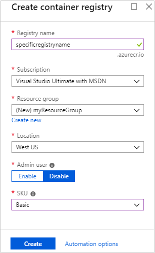
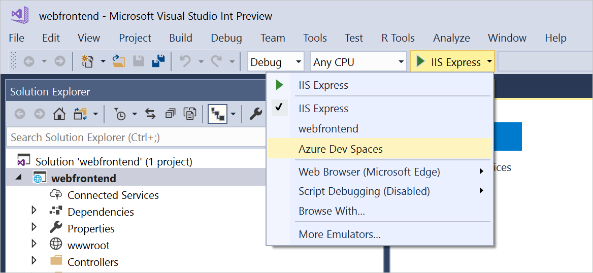

# Deploying containers in Azure

[!INCLUDE [book-preview](../../../includes/book-preview.md)]

We've discussed containers in this chapter and in chapter 1. We've seen that containers provide many benefits to cloud-native applications, including portability. In the Azure cloud, you can deploy the same containerized services across staging and production environments. Azure provides several options for hosting these containerized workloads:

- Azure Kubernetes Services (AKS)
- Azure Container Instance (ACI)
- Azure Web Apps for Containers

## Azure Container Registry

When containerizing a microservice, you first a build container "image." The image is a binary representation of the service code, dependencies, and runtime. While you can manually create an image using the `Docker Build` command from the Docker API, a better approach is to create it as part of an automated build process.

Once created, container images are stored in container registries. They enable you to build, store, and manage container images. There are many registries available, both public and private. Azure Container Registry (ACR) is a fully managed container registry service in the Azure cloud. It persists your images inside the Azure network, reducing the time to deploy them to Azure container hosts. You can also secure them using the same security and identity procedures that you use for other Azure resources.

You create an Azure Container Registry using the [Azure portal](https://docs.microsoft.com/azure/container-registry/container-registry-get-started-portal), [Azure CLI](https://docs.microsoft.com/azure/container-registry/container-registry-get-started-azure-cli), or [PowerShell tools](https://docs.microsoft.com/azure/container-registry/container-registry-get-started-powershell). Creating a registry in Azure is simple. It requires an Azure subscription, resource group, and a unique name. Figure 3-11 shows the basic options for creating a registry, which will be hosted at `registryname.azurecr.io`.



**Figure 3-11**. Create container registry

Once you've created the registry, you'll need to authenticate with it before you can use it. Typically, you'll log into the registry using the Azure CLI command:

```azurecli
az acr login --name *registryname*
```

Once authenticated, you can use docker commands to push container images to it. Before you can do so, however, you must tag your image with the fully qualified name (URL) of your ACR login server. It will have the format *registryname*.azurecr.io.

```console
docker tag mycontainer myregistry.azurecr.io/mycontainer:v1
```

After you've tagged the image, you use the `docker push` command to push the image to your ACR instance.

```console
docker push myregistry.azurecr.io/mycontainer:v1
```

After you push an image to the registry, it's a good idea to remove the image from your local Docker environment, using this command:

```console
docker rmi myregistry.azurecr.io/mycontainer:v1
```

As a best practice, developers shouldn't manually push images to a container registry. Instead, a build pipeline defined in a tool like GitHub or Azure DevOps should be responsible for this process. Learn more in the [Cloud-Native DevOps chapter](devops.md).

## ACR Tasks

[ACR Tasks](https://docs.microsoft.com/azure/container-registry/container-registry-tasks-overview) is a set of features available from the Azure Container Registry. It extends your [inner-loop development cycle](https://docs.microsoft.com/dotnet/architecture/containerized-lifecycle/design-develop-containerized-apps/docker-apps-inner-loop-workflow) by building and managing container images in the Azure cloud. Instead of invoking a `docker build` and `docker push` locally on your development machine, they're automatically handled by ACR Tasks in the cloud.

The following AZ CLI command both builds a container image and pushes it to ACR:

```azurecli
# create a container registry
az acr create --resource-group myResourceGroup --name myContainerRegistry008 --sku Basic

# build container image in ACR and push it into your container regsitry
az acr build --image sample/hello-world:v1  --registry myContainerRegistry008 --file Dockerfile .
```

As you can see from the previous command block, there's no need to install Docker Desktop on your development machine. Additionally, you can configure ACR Task triggers to rebuild containers images on both source code and base image updates.

## Azure Kubernetes Service

We discussed Azure Kubernetes Service (AKS) at length in this chapter. We've seen that it's the de facto container orchestrator managing containerized cloud-native applications.

Once you deploy an image to a registry, such as ACR, you can configure AKS to automatically pull and deploy it. With a CI/CD pipeline in place, you might configure a  [canary release](https://martinfowler.com/bliki/CanaryRelease.html) strategy to minimize the risk involved when rapidly deploying updates. The new version of the app is initially configured in production with no traffic routed to it. Then, the system will route a small percentage of users to the newly deployed version. As the team gains confidence in the new version, it can roll out more instances and retire the old. AKS easily supports this style of deployment.

As with most resources in Azure, you can create an Azure Kubernetes Service cluster using the portal, command-line, or automation tools like Helm or Terraform. To get started with a new cluster, you need to provide the following information:

- Azure subscription
- Resource group
- Kubernetes cluster name
- Region
- Kubernetes version
- DNS name prefix
- Node size
- Node count

This information is sufficient to get started. As part of the creation process in the Azure portal, you can also configure options for the following features of your cluster:

- Scale
- Authentication
- Networking
- Monitoring
- Tags

This [quickstart walks through deploying an AKS cluster using the Azure portal](https://docs.microsoft.com/azure/aks/kubernetes-walkthrough-portal).

## Azure Dev Spaces

Cloud-native applications can quickly grow large and complex, requiring significant compute resources to run. In these scenarios, the entire application can't be hosted on a development machine (especially a laptop). Azure Dev Spaces is designed to address this problem using AKS. It enables developers to work with a local version of their services while hosting the rest of the application in an AKS development cluster.

Developers share a running (development) instance in an AKS cluster that contains the entire containerized application. But they use personal spaces set up on their machine to locally develop their services. When ready, they test from end-to-end in the AKS cluster - without replicating dependencies. Azure Dev Spaces merges code from the local machine with services in AKS. Developers can rapidly iterate and debug code directly in Kubernetes using Visual Studio or Visual Studio Code.

To understand the value of Azure Dev Spaces, let me share this quotation from Gabe Monroy, PM Lead of Containers at Microsoft Azure:

> Imagine you're a new employee trying to fix a bug in a complex microservices application consisting of dozens of components, each with their own configuration and backing services. To get started, you must configure your local development environment so that it can mimic production including setting up your IDE, building tool chain, containerized service dependencies, a local Kubernetes environment, mocks for backing services, and more. With all the time involved setting up your development environment, fixing that first bug could take days.

> Or you could use Dev Spaces and AKS.

The process for working with Azure Dev Spaces involves the following steps:

1. Create the dev space.
2. Configure the root dev space.
3. Configure a child dev space (for your own version of the system).
4. Connect to the dev space.

All of these steps can be performed using the Azure CLI and new  `azds` command-line tools. For example, to create a new Azure Dev Space for a given Kubernetes cluster, you would use a command like this one:

```azurecli
az aks use-dev-spaces -g my-aks-resource-group -n MyAKSCluster
```

Next, you can use the `azds prep` command to generate the necessary Docker and Helm chart assets for running the application. Then you run your code in AKS using `azds up`. The first time you run this command, the Helm chart will be installed. The containers will be built and deployed according to your instructions. This task may take a few minutes the first time it's run. However, after you make changes, you can connect to your own child dev space using `azds space select` and then deploy and debug your updates in your isolated child dev space. Once you have your dev space up and running, you can send updates to it by reissuing the `azds up` command or you can use built-in tooling in Visual Studio or Visual Studio Code. With VS Code, you use the command palette to connect to your dev space. Figure 3-12 shows how to launch your web application using Azure Dev Spaces in Visual Studio.


**Figure 3-12**. Connect to Azure Dev Spaces in Visual Studio

>[!div class="step-by-step"]
>[Previous](combine-containers-serverless-approaches.md)
>[Next](scale-containers-serverless.md)
