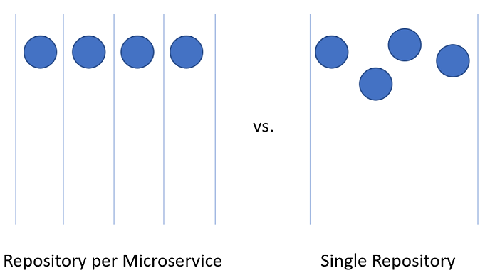
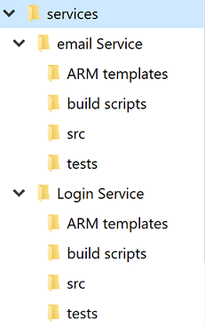
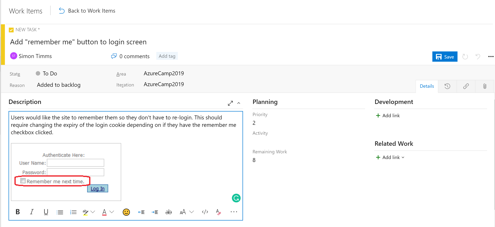
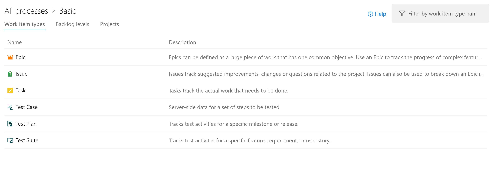

# Cloud Native DevOps

The favorite mantra of software consultants is to answer "It depends" to any question posed. It isn't because software consultants are fond of not taking a position. It's because there's no one true answer to any questions in software. There's no absolute right and wrong, but rather a balance between opposites.

Take, for instance, the two major schools of developing web applications: Single Page Applications (SPAs) vs. server-side applications. On the one hand, the user experience tends to be better with SPAs and the amount of traffic to the web server can be minimized making it possible to host them on something as simple as static hosting. On the other hand, SPAs tend to be slower to develop and more difficult to test. Which one is the right choice? Well, it depends on your situation.

Cloud-native applications aren't immune to that same dichotomy. They have clear advantages in terms of speed of development, stability, and scalability, but managing them can be quite a bit more difficult.

Years ago, it wasn't uncommon for the process of moving an application from development to production to take a month, or even more. Companies released software on a 6-month or even every year cadence. One needs to look no further than Microsoft Windows to get an idea for the cadence of releases that were acceptable before the ever-green days of Windows 10. Five years passed between Windows XP and Vista, a further 3 between Vista and Windows 7.

It's now fairly well established that being able to release software rapidly gives fast-moving companies a huge market advantage over their more sloth-like competitors. It's for that reason that major updates to Windows 10 are now approximately every six months.

The patterns and practices that enable faster, more reliable releases to deliver value to the business are collectively known as DevOps. They consist of a wide range of ideas spanning the entire software development life cycle from specifying an application all the way up to delivering and operating that application.

DevOps emerged before microservices and it's likely that the movement towards smaller, more fit to purpose services wouldn't have been possible without DevOps to make releasing and operating not just one but many applications in production easier. 


Through good DevOps practices, it's possible to realize the advantages of cloud-native applications without suffocating under a mountain of work actually operating the applications.

There's no golden hammer when it comes to DevOps. Nobody can sell a complete and all-encompassing solution for releasing and operating high-quality applications. This is because each application is wildly different from all others. However, there are tools that can make DevOps a far less daunting proposition. One of these tools is known as Azure DevOps.

## Azure DevOps

Azure DevOps has a long pedigree. It can trace its roots back to when Team Foundation Server first moved online and through the various name changes: Visual Studio Online and Visual Studio Team Services. Through the years, however, it has become far more than its predecessors.

Azure DevOps is divided into five major components:


**Azure Boards** - Provides an issue and work item tracking tool that strives to allow users to pick the workflows that work best for them. It comes with a number of pre-configured templates including ones to support SCRUM and Kanban styles of development. 

**Azure Repos** - Source code management that supports the venerable Team Foundation Version Control (TFVC) and the industry favorite git. Pull requests provide a way to enable social coding by fostering discussion of changes as they're made.

**Azure Pipelines** - A build and release management system that supports tight integration with Azure. Builds can be run on a variety of platforms from Windows to Linux to MacOS. Build agents may be provisioned in the cloud or on premise.

**Azure Test Plans** - No QA person will be left behind with the test management and exploratory testing support offered by the Test Plans feature.

**Azure Artifacts** - An artifact feed that allows companies to create their own, internal, versions of NuGet, npm, and others. It serves a double purpose of acting as a cache of upstream packages if there is a failure of a centralized repository.

The top-level organizational unit in Azure DevOps is known as a Project. Within each project the various components, such as Azure Artifacts, can be turned on and off. If users want to manage their source code in GitHub but still take advantage of Azure Pipelines, then that's perfectly possible. In fact, many open-source projects leverage the [free builds](https://azure.microsoft.com/blog/announcing-azure-pipelines-with-unlimited-ci-cd-minutes-for-open-source/) offered by Azure DevOps while keeping their source code on GitHub. Some significant open-source projects such as [Visual Studio Code](https://code.visualstudio.com/), [yarn](https://yarnpkg.com/en/), [gulp](https://gulpjs.com/), and [NumPy](https://www.numpy.org/) have made the transition.

Each of these components provides some advantages for cloud-native applications, but the three most useful are the source control, boards and pipelines.  

## Source control

Organizing the code for a cloud-native application can be challenging. Instead of a single giant application, the cloud-native applications tend to be made up of a web of smaller applications that talk with one another. As with all things in computing, the best arrangement of code remains an open question. There are examples of successful applications using different kinds of layouts, but two variants seem to have the most popularity.

Before getting down into the actual source control itself, it's probably worth deciding on how many projects are appropriate. Within a single project, there's support for multiple repositories, and build pipelines. Boards are a little more complicated but there too the tasks can easily be assigned to multiple teams within a single project. It's certainly possible to support hundreds, even thousands of developers, out of a single Azure DevOps project. Doing so is likely the best approach as it provides a single place for all developer to work out of and reduces the confusion of finding that one application when developers are unsure in which project in which it resides.

Splitting up code for microservices within the Azure DevOps project can be slightly more challenging.



### Repository per microservice

At first glance, this seems like the most logical approach to splitting up the source code for microservices. Each repository can contain the code needed to build the one microservice. The advantages to this approach are readily visible:

1. Instructions for building and maintaining the application can be added to a README file at the root of each repository. When flipping through the repositories, it's easy to find these instructions, reducing spin-up time for developers.
2. Every service is located in a logical place, easily found by knowing the name of the service.
3. Builds can easily be set up such that they're only triggered when a change is made to the owning repository.
4. The number of changes coming into a repository is limited to the small number of developers working on the project.
5. Security is easy to set up by restricting the repositories to which developers have read and write permissions.
6. Repository level settings can be changed by the owning team with a minimum of discussion with others.

One of the key ideas behind microservices is that services should be siloed and separated from each other. When using Domain Driven Design to decide on the boundaries for services the services act as transactional boundaries. Database updates shouldn't span multiple services. This collection of related data is referred to as a bounded context.  This idea is reflected by the isolation of microservice data to a database separate and autonomous from the rest of the services. It makes a great deal of sense to carry this idea all the way through to the source code.

However, this approach isn't without its issues. One of the more gnarly development problems of our time is managing dependencies. Consider the number of files that make up the average `node_modules` directory. A fresh install of something like `create-react-app` is likely to bring with it thousands of packages. The question of how to manage these dependencies is a difficult one. 

If a dependency is updated, then downstream packages must also update this dependency. Unfortunately, that takes development work so, invariably, the `node_modules` directory ends up with multiple versions of a single package, each one a dependency of some other package that is versioned at a slightly different cadence. When deploying an application, which version of a dependency should be used? The version that is currently in production? The version that is currently in Beta but is likely to be in production by the time the consumer makes it to production? Difficult problems that aren't resolved by simply using microservices.

There are libraries that are depended upon by a wide variety of projects. By dividing the microservices up with one in each repository the internal dependencies can best be resolved by using the internal repository, Azure Artifacts. Builds for libraries will push their latest versions into Azure Artifacts for internal consumption. The downstream project must still be manually updated to take a dependency on the newly updated packages.

Another disadvantage presents itself when moving code between services. Although it would be nice to believe that the first division of an application into microservices is 100% correct, the reality is that rarely we're so prescient as to make no service division mistakes. Thus, functionality and the code that drives it will need to move from service to service: repository to repository. When leaping from one repository to another the code loses its history. There are many cases, especially in the event of an audit, where having full history on a piece of code is invaluable.

The final and perhaps most important disadvantage is coordinating changes. In a true microservices application, there should be no deployment dependencies between services. It should be possible to deploy services A, B, and C in any order as they have loose coupling. In reality, however, there are times when it's desirable to make a change that crosses multiple repositories at the same time. Some examples include updating a library to close a security hole or changing a communication protocol used by all services.

To perform a cross-repository change requires a commit to each repository be made in succession. Each change in each repository will need to be pull-requested and reviewed separately. This can be difficult to coordinate and generally annoying to perform.

An alternative to using many repositories is to put all the source code together in a giant, all knowing, single repository.

### Single repository

In this approach, sometimes referred to as a [monorepository](http://danluu.com/monorepo/), all the source code for every service is put into the same repository. At first, this seems like a terrible idea likely to make dealing with source code unwieldy. There are, however, some marked advantages to working this way.

The first advantage is that it's easier to manage dependencies between projects. Instead of relying on some external artifact feed, projects can directly import one another. This means that updates are instant, and conflicting versions are likely to be found at compile time on the developer's workstation. In effect shifting some of the integration testing left.

When moving code between projects, it's now easier to preserve the history as the files will be detected as having been moved rather than being rewritten.

Another advantage is that wide ranging changes that cross service boundaries can be made in a single commit. This reduces the overhead of having potentially dozens of changes to review individually.

There are many tools that can perform static analysis of code to detect insecure programming practices or problematic use of APIs. In a multi-repository world, each repository will need to be iterated over to find the problems in them. The single repository allows running the analysis all in one place.

There are also many disadvantages to the single repository approach. One of the most worrying ones is that having a single repository raises security concerns. If the contents of a repository are leaked in a repository per service model, the amount of code lost is minimal. With a single repository, everything the company owns could be lost. There have been many examples in the past of this happening and derailing entire game development efforts. Having multiple repositories exposes less surface area, which is a very desirable trait in most security practices.

The size of the single repository is likely to become unmanageable rapidly. This presents some interesting performance implications. It may become necessary to use specialized tools such as [Virtual File System for Git](https://vfsforgit.org/), which was originally designed to improve the experience for developers on the Windows team.

Frequently the argument for using a single repository boils down to an argument that Facebook or Google use this method for source code arrangement. If the approach is good enough for these companies, then, surely, it's the correct approach for all companies. The truth of the matter is that very few companies operate on anything like the scale of Facebook or Google. The problems that occur at those scales are different from those most developers will face. What is good for the goose may not be good for the gander.

In the end, either solution can be used to host the source code for microservices. However, in most cases, the management and engineering overhead of operating in a single repository isn't worth the meager advantages. Splitting code up over multiple repositories encourages better separation of concerns and encourages autonomy among development teams.  

### Standard directory structure

Regardless of the single vs. multiple repositories debate each service will have its own directory. One of the best optimizations to allow developers to cross between projects quickly is to maintain a standard directory structure.



Whenever a new project is created, a template that puts in place the correct structure should be used. This template can also include such useful items as a skeleton README file and an `azure-pipelines.yml`. In any microservice architecture, a high degree of variance between projects makes bulk operations against the services more difficult.

There are many tools that can provide templating for an entire directory, containing several source code directories. [Yeoman](https://yeoman.io/) is popular in the JavaScript world and GitHub have recently released [Repository Templates](https://github.blog/2019-06-06-generate-new-repositories-with-repository-templates/), which provide much of the same functionality.

## Task management

Managing tasks in any project can be difficult. Up front there are countless questions to be answered about the sort of workflows to set up to ensure optimal developer productivity.

Cloud-native applications tend to be smaller than traditional software products or at least they're divided into smaller services. Tracking of issues or tasks related to these services remains as important as with any other software project. Nobody wants to lose track of some work item or explain to a customer that their issue wasn't properly logged. Boards are configured at the project level but within each project, areas can be defined. These allow breaking down issues across several components. The advantage to keeping all the work for the entire application in one place is that it's easy to move work items from one team to another as they're understood better.

Azure DevOps comes with a number of popular templates pre-configured. In the most basic configuration, all that is needed to know is what's in the backlog, what people are working on, and what's done. It's important to have this visibility into the process of building software, so that work can be prioritized and completed tasks reported to the customer. Of course, very few software projects stick to a process as simple as `to do`, `doing`, and `done`. It doesn't take long for people to start adding steps like `QA` or `Detailed Specification` to the process.

One of the more important parts of Agile methodologies is self-introspection at regular intervals. These reviews are meant to provide insight into what problems the team is facing and how they can be improved. Frequently, this means changing the flow of issues and features through the development process. So, it's perfectly healthy to expand the layouts of the boards with additional stages.

The stages in the boards aren't the only organizational tool. Depending on the configuration of the board, there's a hierarchy of work items. The most granular item that can appear on a board is a task. Out of the box a task contains fields for a title, description, a priority, an estimate of the amount of work remaining and the ability to link to other work items or development items (branches, commits, pull requests, builds, and so forth). Work items can be classified into different areas of the application and different iterations (sprints) to make finding them easier.



The description field supports the normal styles you'd expect (bold, italic underscore and strike through) and the ability to insert images. This makes it a very powerful tool for use when specifying work or bugs.

Tasks can be rolled up into features, which define a larger unit of work. Features, in turn, can be [rolled up into epics](https://docs.microsoft.com/azure/devops/boards/backlogs/define-features-epics?view=azure-devops). Classifying tasks in this hierarchy makes it much easier to understand how close a large feature is to rolling out.



There are different kinds of views into the issues in Azure Boards. Items that aren't yet scheduled appear in the backlog. From there, they can be assigned to a sprint. A sprint is a time box during which it's expected some quantity of work will be completed. This work can include tasks but also the resolution of tickets. Once there, the entire sprint can be managed from the Sprint board section. This view shows how work is progressing and includes a burn down chart to give an ever-updating estimate of if the sprint will be successful.


By now, it should be apparent that there's a great deal of power in the Boards in Azure DevOps. For developers, there are easy views of what is being worked on. For project managers views into upcoming work as well as an overview of existing work. For managers, there are plenty of reports about resourcing and capacity. Unfortunately, there's nothing magical about cloud-native applications that eliminate the need to track work. But if you must track work, there are a few places where the experience is better than in Azure DevOps.

## CI/CD pipelines

Almost no change in the software development life cycle has been so revolutionary as the advent of continuous integration (CI) and continuous delivery (CD). Building and running automated tests against the source code of a project as soon as a change is checked in catches mistakes early. Prior to the advent of continuous integration builds, it wouldn't be uncommon to pull code from the repository and find that it didn't pass tests or couldn't even be built. This resulted in a lot of tracking down the source of the breakage.

Traditionally shipping software to the production environment required extensive documentation and a list of steps. Each one of these steps needed to be manually completed in a very error prone process.


The sister of continuous integration is continuous delivery in which the freshly built packages are deployed to an environment. The manual process can't scale to match the speed of development so automation becomes more important. Checklists are replaced by scripts that can execute the same tasks faster and more accurately than any human.

The environment to which continuous delivery delivers might be a test environment or, as is being done by many major technology companies, it could be the production environment. The latter requires an investment in high-quality tests that can give confidence that a change isn't going to break production for users. In the same way that continuous integration caught issues in the code early continuous delivery catches issues in the deployment process early.

The importance of automating the build and delivery process is accentuated by cloud-native applications. Deployments happen more frequently and to more environments so manually deploying borders on impossible.

### Azure Builds

Azure DevOps provides a set of tools to make continuous integration and deployment easier than ever. These tools are located under Azure Pipelines. The first of them is Azure Builds, which is a tool for running YAML-based build definitions at scale. Users can either bring their own build machines (great for if the build requires a meticulously set up environment) or use a machine from a constantly refreshed pool of Azure hosted virtual machines. These hosted build agents come pre-installed with a wide range of development tools for not just .NET development but for everything from Java to Python to iPhone development.

DevOps includes a wide range of out of the box build definitions that can be customized for any build. The build definitions are defined in a file called `azure-pipelines.yml` and checked into the repository so they can be versioned along with the source code. This makes it much easier to make changes to the build pipeline in a branch as the changes can be checked into just that branch. An example `azure-pipelines.yml` for building an ASP.NET web application on full framework is show in Figure 11-8.

```yml
name: $(rev:r)

variables:
  version: 9.2.0.$(Build.BuildNumber)
  solution: Portals.sln
  artifactName: drop
  buildPlatform: any cpu
  buildConfiguration: release
  
pool:
  name: Hosted VS2017
  demands:
  - msbuild
  - visualstudio
  - vstest

steps:
- task: NuGetToolInstaller@0
  displayName: 'Use NuGet 4.4.1'
  inputs:
    versionSpec: 4.4.1

- task: NuGetCommand@2
  displayName: 'NuGet restore'
  inputs:
    restoreSolution: '$(solution)'
    
- task: VSBuild@1
  displayName: 'Build solution'
  inputs:
    solution: '$(solution)'
    msbuildArgs: '/p:DeployOnBuild=true /p:WebPublishMethod=Package /p:PackageAsSingleFile=true /p:SkipInvalidConfigurations=true /p:PackageLocation="$(build.artifactstagingdirectory)\\"'
    platform: '$(buildPlatform)'
    configuration: '$(buildConfiguration)'

- task: VSTest@2
  displayName: 'Test Assemblies'
  inputs:
    testAssemblyVer2: |
     **\$(buildConfiguration)\**\*test*.dll
     !**\obj\**
     !**\*testadapter.dll
    platform: '$(buildPlatform)'
    configuration: '$(buildConfiguration)'

- task: CopyFiles@2
  displayName: 'Copy UI Test Files to: $(build.artifactstagingdirectory)'
  inputs:
    SourceFolder: UITests
    TargetFolder: '$(build.artifactstagingdirectory)/uitests'

- task: PublishBuildArtifacts@1
  displayName: 'Publish Artifact'
  inputs:
    PathtoPublish: '$(build.artifactstagingdirectory)'
    ArtifactName: '$(artifactName)'
  condition: succeededOrFailed()
```

**Figure 11-8** - A sample azure-pipelines.yml

This build definition uses a number of built-in tasks that make creating builds as simple as building a Lego set (simpler than the giant Millennium Falcon). For instance, the NuGet task restores NuGet packages, while the VSBuild task calls the Visual Studio build tools to perform the actual compilation. There are hundreds of different tasks available in Azure DevOps, with thousands more that are maintained by the community. It's likely that no matter what build tasks you're looking to run, somebody has built one already.

Builds can be triggered manually, by a check-in, on a schedule, or by the completion of another build. In most cases, building on every check-in is desirable. Builds can be filtered so that different builds run against different parts of the repository or against different branches. This allows for scenarios like running fast builds with reduced testing on pull requests and running a full regression suite against the trunk on a nightly basis.

The end result of a build is a collection of files known as build artifacts. These artifacts can be passed along to the next step in the build process or added to an Azure Artifact feed, so they can be consumed by other builds.

### Azure DevOps releases

Builds take care of compiling the software into a shippable package, but the artifacts still need to be pushed out to a testing environment to complete continuous delivery. For this, Azure DevOps uses a separate tool called Releases. Releases make use of the same tasks' library that were available to the Build but introduce a concept of "stages". A stage is an isolated environment into which the package is installed. For instance, a product might make use of a development, a QA, and a production environment. Code is continuously delivered into the development environment where automated tests can be run against it. Once those tests pass the release moves onto the QA environment for manual testing. Finally, the code is pushed to production where it's visible to everybody.


Each stage in the build can be automatically triggered by the completion of the previous phase. In many cases, however, this isn't desirable. Moving code into production might require approval from somebody. Releases supports this by allowing approvers at each step of the release pipeline. Rules can be set up such that a specific person or group of people must sign off on a release before it makes into production. These gates allow for manual quality checks and also for compliance with any regulatory requirements related to control what goes into production.

### Everybody gets a build pipeline

There's no cost to configuring many build pipelines, so it's advantageous to have at least one build pipeline per microservice. Ideally, microservices are independently deployable to any environment so having each one able to be released via its own pipeline without releasing a mass of unrelated code is perfect. Each pipeline can have its own set of approvals allowing for variations in build process for each service.

### Versioning releases

One drawback to using the Releases functionality is that it can't be defined in a checked-in `azure-pipelines.yml` file. There are many reasons you might want to do that from having per-branch release definitions to including a release skeleton in your project template. Fortunately, work is ongoing to shift some of the stages support into the Build component. This will be known as multi-stage build and the [first version is available now](https://devblogs.microsoft.com/devops/whats-new-with-azure-pipelines/)!

>[!div class="step-by-step"]
>[Previous](azure-security-for-cloud-native.md)
>[Next](infrastructure-as-code.md)
