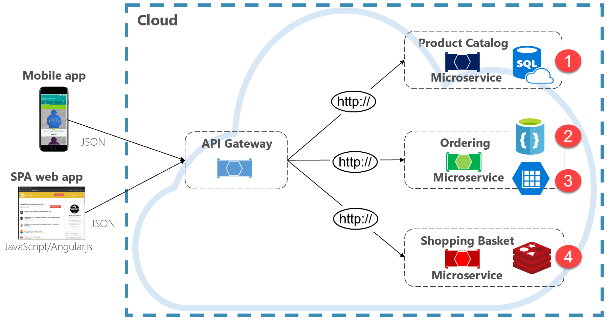

# Distributed data for cloud native apps

When constructing a cloud native system that consists of many independent, decoupled microservices, the way you think about data storage changes.

Traditional monolthic applicaitons favor a centralized data store, typically  shown in Figure 5-1. 

**Figure 5-1**. Single monolithic database

In the above figure, all of the application components consume a single relational database.

There are many benefits to this approach. It's straightforward to query data spread across  multiple tables, and it's straightforward to implement [ACID transactions](https://docs.microsoft.com/windows/desktop/cossdk/acid-properties) that ensure data consistency. You always end up with *immediate consistency*: Either all your data updates or none of it updates.

Cloud native systems favor a data architecture where each microservice owns and encapsulates its own data as shown in Figure 5-2.

**Figure 5-2**. Multiple databases across microservices

In the figure above, note how each data store is encapsulated within the [bounded context](https://martinfowler.com/bliki/BoundedContext.html) of its encompassing microservice exposing external access only via the microservice's public API.
 
Such data encapsulation buys a great deal of flexibility. Data for each service is decoupled enabling services to deploy frequently and evolve independently without having to coordinate schema changes across other services. Each service is free to implement the data store that best matches its needs, as shown below in Figure 5-3 and can independently scale to fit its specific needs.

**Figure 5-3**. Polyglot data persistence

In the figure above, note above how the ProductCatalog and Inventory microservices each bind to a full relational database, while the Ordering microservices leverages a NoSql document data store and the ShoppingCart microservice, a simple externalized key-value store. While relational databases remain relevant for more complex microservices, NoSQL databases have gained considerable popularity, providing adaptability, fast lookup and high availability. Their schemaless nature move you away from an architecture of typed data classes and ORMs that make change expensive and time-consuming.

>[!div class="step-by-step"]
>[Previous](cross-service-communication.md)
>[Next](data-patterns.md)
