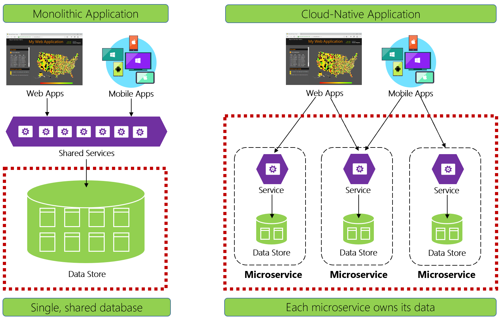

# Cloud-native data

[!INCLUDE [book-preview](../../../includes/book-preview.md)]

While cloud native transforms the way you design systems, it also changes the way you manage and store data.

Figure 5-1 contrasts the differences.

**Figure 5-1**. Data management in cloud-native applications

Experienced developers will recognize the architecture on the left-side of figure 5-1. In a monolithic application, business service components collocate together in a shared services tier, sharing data from a single relational database.

In many ways, this approach keeps data management simple. Querying data across multiple tables is straightforward. Data changes update together or they all rollback. [ACID transactions](https://docs.microsoft.com/windows/desktop/cossdk/acid-properties) guarantee immediate consistency.

Designing for cloud-native, we take a different approach. On the right-side of Figure 5-1, note how business functionality segregates into small, independent microservices. Each microservice...

- Encapsulates specific business capabilities
- Evolves independently
- Deploys frequently
- Scales separately
- Isolates failure

The design also segregates the data for each microservice. The monolithic database decomposes into a *distributed data model* with many smaller databases, each aligning with a microservice.

This distributed data model provides many benefits. Each microservice...

- Owns its own domain data
- Evolves its data schema without affecting other services
- Scales its data independently of others
- Isolates itself from database failures in other services

This data independence also enables each microservice to implement the data store that is best optimized for its workload, storage needs, and read/write patterns. Choices include relational, document, key-value, and even graph-based data stores.

Figure 5-3 presents the principle of polyglot persistence in a cloud-native system.

**Figure 5-3**. Polyglot data persistence

Note in the above figure how each microservice supports a different type of data store.

- The product catalog microservice consumes a relational database to accommodate the rich relational structure of its underlying data.
- The shopping cart microservice consumes a distributed cache that supports its simple, key-value data store.
- The ordering microservice consumes both a NoSql document database for write operations along with a highly denormalized key/value store to accommodate high-volumes of read operations.
  
While relational databases remain relevant for microservices with complex data, NoSQL databases have gained considerable popularity. They provide massive scale and high availability. Their schemaless nature allows developers to move away from an architecture of typed data classes and ORMs that make change expensive and time-consuming.

We'll explore these different types of data stores and some common cloud-native data patterns in this chapter.

>[!div class="step-by-step"]
>[Previous](service-mesh-communication-infrastructure.md)
>[Next](data-patterns.md)
