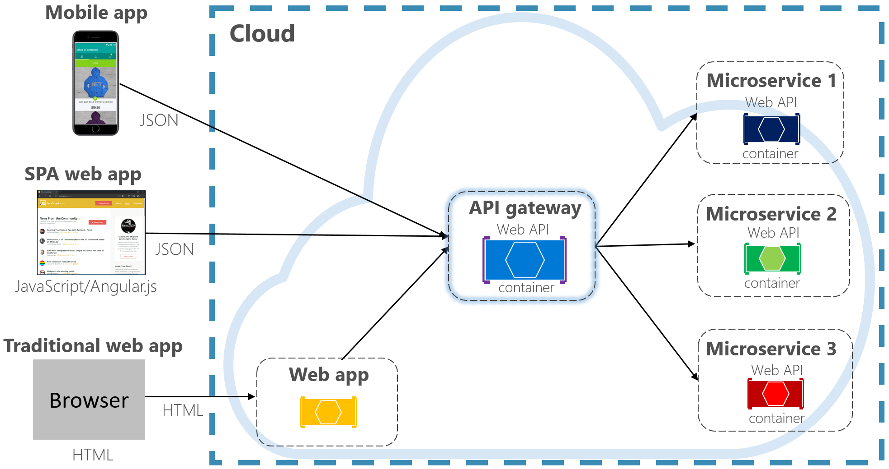
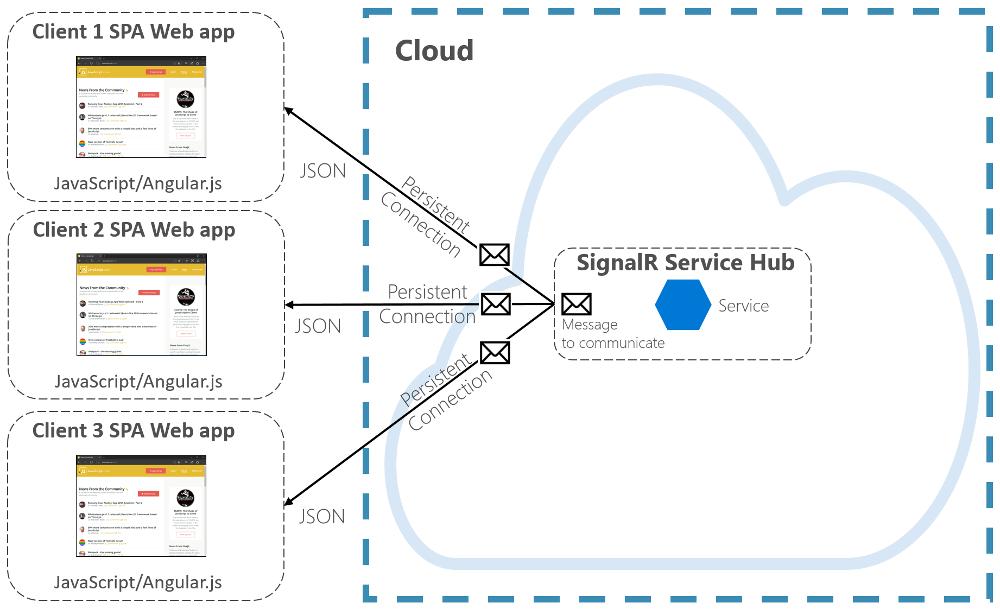

# Front-end client communication

Front-end client applications (mobile, web, and desktop applications) require a communication channel to interact  with back-end microservices that are part of a cloud-native system.  

To keep things simple, a front-end client could *directly communicate* with the back-end microservices, shown in Figure 4-2.

**Figure 4-2**. Direct client to service communication

With this approach, each microservice has a public endpoint and is accessible by the front-end client. In a production environment, you'd go a step further and place a load balancer in front of your microservices, routing traffic proportionately.

While simple to implement, direct client communication would be acceptable only for simple microservice applications. This pattern tightly couples the front-end client to the core back-end services, opening the door for a number of potential problems, including:

- Client susceptibility to back-end service refactoring.

- A wider attack surface as core back-end services are directly exposed.

- Duplication of cross-cutting concerns across each microservice.

- Overly complex client code.

Instead, a widely accepted cloud design pattern is to implement an [API Gateway Service](https://docs.microsoft.com/dotnet/standard/microservices-architecture/architect-microservice-container-applications/direct-client-to-microservice-communication-versus-the-api-gateway-pattern) between the front-end applications and backend services. The pattern is shown in Figure 4-3.

**Figure 4-3.** API gateway pattern

In the previous figure, note how the API Gateway service abstracts the backend core microservices. Implemented as a simple .NET Core API application (in this case), it acts as a *reverse proxy*, routing incoming routing traffic to the internal microservices. 

The gateway insulates the client from internal service partitioning and refactoring. If you make a change to a back-end service, you can accommodate for it in the gateway without breaking the client. It also acts as your first line of defense for implementing cross-cutting concerns, such as identity, caching, resiliency, metering, and throttling. Many of these cross-cutting concerns can be off-loaded from the back-end core services to the gateway, centralizing these concerns and simplifying the back-end services.

Care must be taken to keep the API Gateway simple and fast. Typically, business logic is kept out of the gateway. A complex gateway risks becoming a bottleneck and eventually a monolith itself. Larger systems often expose multiple API Gateways segmented by client type (mobile, web, desktop) or back-end functionality. The [Backend for Frontends](https://docs.microsoft.com/azure/architecture/patterns/backends-for-frontends) pattern provides direction for implementing multiple gateways. The pattern is shown in Figure 4-4.

**Figure 4-4.** Backend for frontend pattern

Note in the previous figure how incoming traffic is sent to a specific API gateway - based upon client type: web, mobile, or desktop app. This approach makes sense as the capabilities of each device differ significantly across form factor, performance, and display limitations. Typically mobile applications expose less functionality than a browser or desktop applications. Each gateway can be optimized to match the capabilities and functionality of the corresponding device.

To start, you could build your own API Gateway service. A quick search of GitHub will provide many examples. However, there are several frameworks and commercial gateway products available.

## Ocelot Gateway

For simple .NET cloud-native applications, you might consider the [Ocelot Gateway](https://github.com/ThreeMammals/Ocelot). Ocelot is an Open Source API Gateway created for microservice systems architecture that requires unified points of entry. It's lightweight, fast, scalable. 

Like any API Gateway, its primary functionality is to forward incoming HTTP requests to downstream services. Additionally, it supports a wide variety of capabilities that are configurable in a .NET Core middleware pipeline. Its feature set is presented in following table.

|Ocelot Features  | |
| :-------- | :-------- |
| Routing | Authentication |
| Request Aggregation | Authorization |
| Service Discovery (with Consul and Eureka) | Throttling |
| Lad Balancing | Logging, Tracing |
| Caching | Headers/Query String Transformation |
| Correlation Pass-Through | Custom Middleware |
| Quality of Service | Retry Policies |

Each Ocelot gateway specifies the upstream and downstream addresses and configurable features in a JSON configuration file. The client sends an HTTP request to the Ocelot gateway. Once received, Ocelot passes the HttpRequest object through its pipeline manipulating it into the state specified by its configuration. At the end of pipeline, Ocelot creates a new HTTPResponseObject and passes it to the downstream service. For the response, Ocelot reverses the pipeline, sending the response back to client.

Ocelot is available as a NuGet package. It targets the NET Standard 2.0, making it compatible with both .NET Core 2.0+ and .NET Framework 4.6.1+ runtimes. Ocelot integrates with anything that speaks HTTP and runs on the platforms which .NET Core supports: Linux, macOS, and Windows. Ocelot is extensible and supports many modern platforms, including Docker containers, Azure Kubernetes Services, or other public clouds.  Ocelot integrates with open-source packages like Consul, GraphQL, and Netflix’s Eureka. 

Consider Ocelot for simple cloud-native applications that don’t require the rich feature-set of a commercial API gateway.

## Azure API Management

For moderate to large-scale cloud-native systems, you may consider [Azure API Management](https://azure.microsoft.com/services/api-management/). It's a cloud-based service that not only solves your API Gateway needs, but provides a rich developer and administrative experience. API Management is shown in Figure 4-5. 

**Figure 4-5**. Azure API Management

To start, API Management exposes a gateway server that allows controlled access to back-end services based upon configurable rules and policies. Your microservices are completely abstracted from front-end clients. API keys and JWT tokens determine who can do what. All traffic is logged for analytical purposes. 

For developers, API Management offers a developer portal that provides access to services, documentation, and sample code for invoking them. Developers can use Swagger/Open API to inspect service endpoints and analyze their usage. the service works across the major development platforms: .NET, Java, Golang, and more. 

The publisher portal exposes a management dashboard where administrators expose APIs and manage their behavior. Service access can be granted, service health monitored, and service telemetry gathered. Administrators apply *policies* to each endpoint to affect behavior. [Policies](https://docs.microsoft.com/azure/api-management/api-management-howto-policies) are pre-built statements that execute sequentially for service each call.  Policies are configured for an inbound call, outbound call, or invoked upon an error. Policies can be applied at different service scopes as to enable deterministic ordering when combining policies. The product ships with a large number of prebuilt [policies](https://docs.microsoft.com/azure/api-management/api-management-policies). 

Here are examples of how policies can affect the behavior of your cloud-native services:  

- Restrict service access.

- Enforce authentication.
  
- Throttle calls from a single source, if necessary.

- Enable caching.

- Block calls from specific IP addresses.

- Control the flow of the service.

- Convert requests from SOAP to REST or between different data formats, such as from XML to JSON.

Azure API Management can expose back-end services that are hosted anywhere – in the cloud or your data center. For legacy services that you may expose in your cloud-native systems, it supports both REST and SOAP APIs. Even other Azure services can be exposed through API Management. You could place a managed API on top of an Azure backing service like [Azure Service Bus](https://azure.microsoft.com/services/service-bus/) or [Azure Logic Apps](https://azure.microsoft.com/services/logic-apps/).

Azure API Management is available across [four different pricing tiers](https://azure.microsoft.com/pricing/details/api-management/):

- Developer

- Basic

- Standard

- Premium

The Developer tier is meant for non-production workloads and evaluation. The other tiers offer progressively more power, features, and higher service level agreements (SLAs). The Premium tier provides Azure Virtual Network and multi-region support. All tiers have a fixed price per hour. 

Recently, Microsoft announced a [API Management serverless tier](https://azure.microsoft.com/blog/announcing-azure-api-management-for-serverless-architectures/) for Azure API Management. Referred to as the *consumption pricing tier*, the service is a variant of API Management designed around the serverless computing model. Unlike the “pre-allocated” pricing tiers previously shown, the consumption tier provides  instant provisioning and pay-per-Action pricing.

It enables API Gateway features for the following use cases:

- Microservices implemented using serverless technologies such as [Azure Functions](https://docs.microsoft.com/azure/azure-functions/functions-overview) and [Azure Logic Apps](https://azure.microsoft.com/services/logic-apps/).
- Azure backing service resources such as Service Bus queues and topics, Azure storage, and others.
- Microservices where traffic has occasional large spikes but remains low the majority of the time. 

The consumption tier uses the same underlying service API Management components, but employs an entirely different architecture based on dynamically allocated resources. It aligns perfectly with the serverless computing model:

- No infrastructure to manage.

- No idle capacity.

- High-availability.

- Automatic scaling.

- Pricing based on actual usage. 
  
The new pricing tier is a great choice for cloud-native systems that expose serverless resources as APIs. 

> At the time of writing, the comsumption pricing tier is in preview in the Azure cloud.

## SignalR Services

Another option for front-end communication with cloud-native applications is that of push and real-time communication. Many applications, such as stock-tickers, dashboards, and job progress updates, require two-way communication across HTTP-based applications. These systems often come with high-frequency data flows and many concurrent connections between the client and server. Manually implementing real-time connectivity in your cloud-native systems would require complex infrastructure to ensure reliable messaging to connected clients. 

[Azure SignalR Service](https://azure.microsoft.com/services/signalr-service/) is a fully managed Azure service that enables you to build real-time experiences into your cloud-native applications. Technical implementation details like capacity provisioning, scaling, and persistent connections are abstracted away, freeing you to focus on application features, not infrastructure plumbing. 

Once enabled, a cloud-based HTTP service can push content updates directly to connected clients, including browser, mobile and desktop applications. As a result, clients are updated without the need to poll the server. Azure SignalR abstracts the transport technologies that create real-time connectivity, including WebSockets, Server-Side Events, and Long Polling. Developers focus on sending messages to all or specific subsets of connected clients.

Figure 4-6 shows a set of HTTP Clients connecting to a Cloud-native application with Azure SignalR enabled.

**Figure 4-6**. Azure SignalR

Azure SignalR Service can be integrated with other Azure services opening up many possibilities for your cloud-native applications.

>[!div class="step-by-step"]
>[Previous](communication-patterns.md)
>[Next](cross-service-communication.md)
