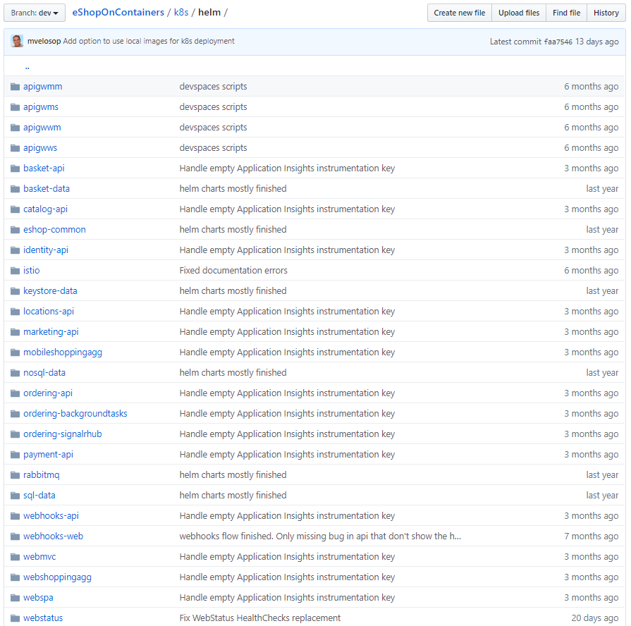

# Deploying eShopOnContainers to Azure

The logic supporting the eShopOnContainers application can be supported by Azure using a variety of services. The recommended approach is to leverage Kubernetes using Azure Kubernetes Service (AKS). This can be combined with Helm deployment to ensure easily repeated infrastructure configuration. Optionally, developers can leverage Azure Dev Spaces for Kubernetes as part of their development process. Another option is to host the functionality of the app using Azure Serverless features like Azure Functions and Azure Logic Apps.

## Azure Kubernetes Service

If you'd like to host the eShopOnContainers application in your own AKS cluster, the first step is to create your cluster. You can do this using the Azure portal, which will walk you through the required steps, or you can use the Azure CLI, taking care to ensure you enable Role-Based Access Control (RBAC) and application routing when you do so. The eShopOnContainers' documentation describes the steps involved in creating your own AKS cluster. Once the cluster is created, you must enable access to the Kubernetes dashboard, at which point you should be able to browse to the Kubernetes dashboard to manage the cluster.

Once the cluster has been created and configured, you can deploy the application to it using Helm and Tiller.

## Deploying to Azure Kubernetes Service using Helm

Basic deployments to AKS may use custom CLI scripts or simple deployment files, but more complex applications should use a dependency management tool like Helm. Helm is maintained by the Cloud-native Computing Foundation and helps you define, install, and upgrade Kubernetes applications. Helm is composed of a command-line client, helm, which uses helm charts, and an in-cluster component, Tiller. Helm Charts use standard YAML-formatted files to describe a related set of Kubernetes resources and are typically versioned alongside the application they describe. Helm Charts range from simple to complex depending on the requirements of the installation they describe.

You'll find the eShopOnContainers helm charts in the /k8s/helm folder. Figure 3-X shows how the different components of the application are organized into a folder structure used by helm to define and managed deployments.

**Figure 3-X**. The eShopOnContainers helm folder.

Each individual component is installed using a `helm install` command. These commands are easily scripted, and eShopOnContainers provides a "deploy all" script that loops through the different components and installs them using their respective helm charts. The result is a repeatable process, versioned with the application in source control, that anyone on the team can deploy to an AKS cluster with a one-line script command. Especially when combined with Azure Dev Spaces, this makes it easy for developers to diagnose and test their individual changes to their microservice-based cloud-native apps.

## DevSpaces for Kubernetes

Azure Dev Spaces helps individual developers host their own unique version of AKS clusters in Azure during development. This minimize local machine requirements and allows team members to quickly see how their changes will behave in a real AKS environment. Azure Dev Spaces offers a CLI for developers to use to manage their dev spaces and to deploy to a specific child dev space as needed. Each child dev space is referenced using a unique URL subdomain, allowing side-by-side deployments of modified clusters so that individual developers can avoid conflicting with each other's work in progress.

## Azure Functions and Logic Apps (Serverless)

The eShopOnContainers sample includes support for tracking online marketing campaigns. An Azure Function is used to pull marketing campaign details for a given campaign ID. Rather than creating a complete ASP.NET Core application for this purpose, a single Azure Function endpoint is simpler and sufficient. Azure Functions have a much simpler build and deployment model than full ASP.NET Core applications, especially when configured to run in Kubernetes. Deploying the function is scripted using Azure Resource Manager (ARM) templates and the Azure CLI. This campaign details microservice is not customer-facing and doesn't have the same requirements as the online store, making it a good candidate for Azure Functions. The function requires some configuration to work properly, such as database connection string data and image base URI settings. You configure Azure Functions in the Azure Portal.

## References

- [eShopOnContainers: Create Kubernetes cluster in AKS](https://github.com/dotnet-architecture/eShopOnContainers/wiki/Deploy-to-Azure-Kubernetes-Service-(AKS)#create-kubernetes-cluster-in-aks)
- [eShopOnContainers: Azure Dev Spaces](https://github.com/dotnet-architecture/eShopOnContainers/wiki/Azure-Dev-Spaces)
- [Azure Dev Spaces](https://docs.microsoft.com/azure/dev-spaces/about)

>[!div class="step-by-step"]
>[Previous](map-eshoponcontainers-azure-services.md)
>[Next](centralized-configuration.md)
