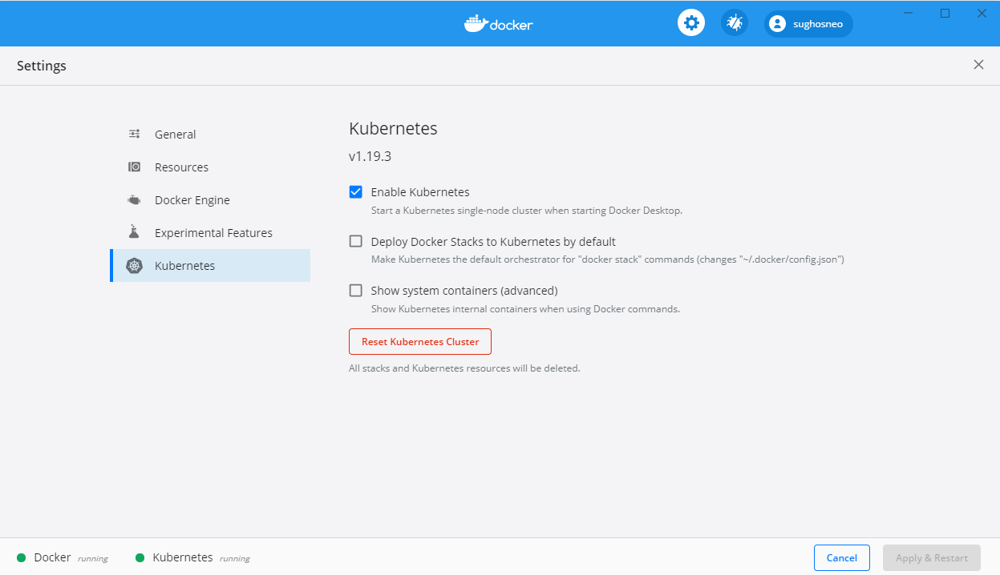
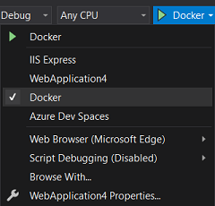
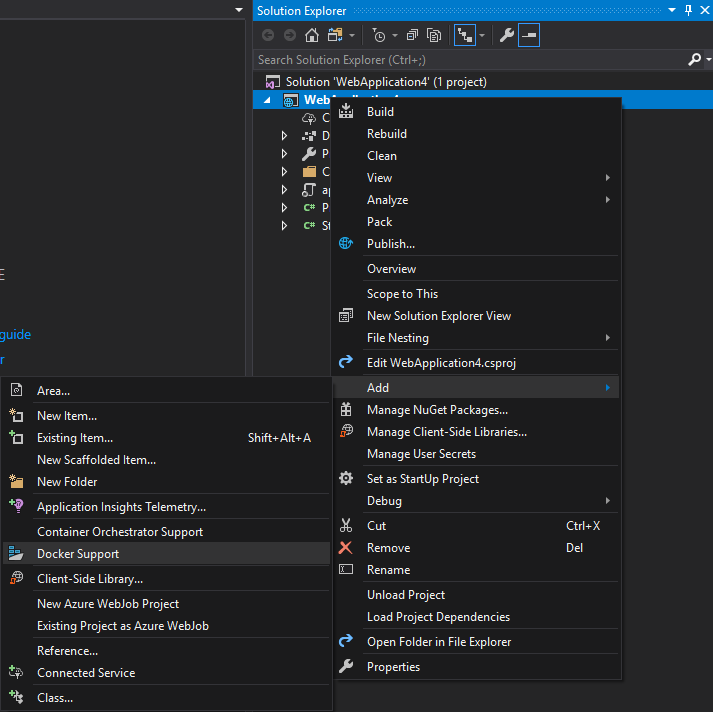

# Leveraging containers and orchestrators

[!INCLUDE [book-preview](../../../includes/book-preview.md)]

Containers and orchestrators are designed to solve problems common to monolithic deployment approaches.

## Challenges with monolithic deployments

Traditionally, most applications have been deployed as a single unit. Such applications are referred to as a monolith. This general approach of deploying applications as single units even if they're composed of multiple modules or assemblies is known as monolithic architecture, as shown in Figure 3-1.


**Figure 3-1**. Monolithic architecture.

Although they have the benefit of simplicity, monolithic architectures face a number of challenges:

### Deployments

Deploying to monolithic applications typically requires restarting the entire application, even if only one small module is being replaced. Depending on the number of machines hosting the application, this can result in downtime during deployments.

### Hosting

Monolithic applications are hosted entirely on a single machine instance. This may require higher-capability hardware than any module in a distributed application would need. Also, if any part of the app becomes a bottleneck, the entire application must be deployed to additional machine nodes in order to scale out.

### Environment

Monolithic applications are typically deployed into an existing hosting environment (operating system, installed frameworks, etc.). This environment may not match the environment in which the application was developed or tested. Inconsistencies in the application's environment are a common source of problems for monolithic deployments.

### Coupling

Monolithic applications are likely to have a great deal of coupling between different parts of the application, and between the application and its environment. This can make it difficult to factor out a particular service or concern later, in order to increase its scalability or swap in an alternative implementation. This coupling also leads to much larger potential impacts for changes to the system, requiring extensive testing in larger applications.

### Technology choice

Monolithic applications are built and deployed as a unit. This offers simplicity and uniformity but can be a barrier to innovation. Although a new feature or module in the system might be better-suited to a more modern platform or framework, it's likely to be built using the application's current approach for the sake of consistency as well as ease of development and deployment.

## What are the benefits of containers and orchestrators?

Docker is the most popular container management and imaging platform and allows you to quickly work with containers on Linux and Windows. Containers provide separate but reproducible application environments that run the same way on any system. This makes them perfect for developing and hosting applications and app components in cloud-native applications. Containers are isolated from one another, so two containers on the same host hardware can have different versions of software and even operating system installed, without the dependencies causing conflicts.

What's more, containers are defined by simple files that can be checked into source control. Unlike full servers, even virtual machines, which frequently require manual work to apply updates or install additional services, container infrastructure can easily be version-controlled. Thus, apps built to run in containers can be developed, tested, and deployed using automated tools as part of a build pipeline.

Containers are immutable. Once you have the definition of a container, you can recreate that container and it will run exactly the same way. This immutability lends itself to component-based design. If some parts of an application don't change as often as others, why redeploy the entire app when you can just deploy the parts that change most frequently? Different features and cross-cutting concerns of an app can be broken up into separate units. Figure 3-2 shows how a monolithic app can take advantage of containers and microservices by delegating certain features or functionality. The remaining functionality in the app itself has also been containerized.


**Figure 3-2**. Breaking up a monolithic app to use microservices in the back end.

Cloud-native apps built using separate containers benefit from the ability to deploy as much or as little of an application as needed. Individual services can be hosted on nodes with resources appropriate to each service. The environment each service runs in is immutable, can be shared between dev, test, and production, and can easily be versioned. Coupling between different areas of the application occurs explicitly as calls or messages between services, not compile-time dependencies within the monolith. And any given part of the overall app can choose the technology that makes the most sense for that feature or capability without requiring changes to the rest of the app.

## What are the scaling benefits?

Services built on containers can leverage scaling benefits provided by orchestration tools like Kubernetes. By design containers only know about themselves. Once you start to have multiple containers that need to work together, it can be worthwhile to organize them at a higher level. Organizing large numbers of containers and their shared dependencies, such as network configuration, is where orchestration tools come in to save the day! Kubernetes is a container orchestration platform designed to automate deployment, scaling, and management of containerized applications. It creates an abstraction layer on top of groups of containers and organizes them into *pods*. Pods run on worker machines referred to as *nodes*. The whole organized group is referred to as a *cluster*. Figure 3-3 shows the different components of a Kubernetes cluster.


**Figure 3-3**. Kubernetes cluster components.

Kubernetes has built-in support for scaling clusters to meet demand. Combined with containerized micro-services, this provides cloud-native applications with the ability to quickly and efficiently respond to spikes in demand with additional resources when and where they're needed.

### Declarative versus imperative

Kubernetes supports both declarative and imperative object configuration. The imperative approach involves running various commands that tell Kubernetes what to do each step of the way. *Run* this image. *Delete* this pod. *Expose* this port. With the declarative approach, you use a configuration file that describes *what you want* instead of *what to do* and Kubernetes figures out what to do to achieve the desired end state. If you've already configured your cluster using imperative commands, you can export a declarative manifest by using `kubectl get svc SERVICENAME -o yaml > service.yaml`. This will produce a manifest file like this one:

```yaml
apiVersion: v1
kind: Service
metadata:
  creationTimestamp: "2019-09-13T13:58:47Z"
  labels:
    component: apiserver
    provider: kubernetes
  name: kubernetes
  namespace: default
  resourceVersion: "153"
  selfLink: /api/v1/namespaces/default/services/kubernetes
  uid: 9b1fac62-d62e-11e9-8968-00155d38010d
spec:
  clusterIP: 10.96.0.1
  ports:
  - name: https
    port: 443
    protocol: TCP
    targetPort: 6443
  sessionAffinity: None
  type: ClusterIP
status:
  loadBalancer: {}
```

When using declarative configuration, you can preview the changes that will be made before committing them by using `kubectl diff -f FOLDERNAME` against the folder where your configuration files are located. Once you're sure you want to apply the changes, run `kubectl apply -f FOLDERNAME`. Add `-R` to recursively process a folder hierarchy.

In addition to services, you can use declarative configuration for other Kubernetes features, such as *deployments*. Declarative deployments are used by deployment controllers to update cluster resources. Deployments are used to roll out new changes, scale up to support more load, or roll back to a previous revision. If a cluster is unstable, declarative deployments provide a mechanism for automatically bringing the cluster back to a desired state.

Using declarative configuration allows infrastructure to be represented as code that can be checked in and versioned alongside the application code. This provides improved change control and better support for continuous deployment using a build and deploy pipeline tied to source control changes.

## What scenarios are ideal for containers and orchestrators?

The following scenarios are ideal for using containers and orchestrators.

### Applications requiring high uptime and scalability

Individual applications that have high uptime and scalability requirements are ideal candidates for cloud-native architectures using microservices, containers, and orchestrators. These applications can be developed in containers using versioned environments, can be extensively tested before going to production, and can be deployed to production with zero downtime. The use of Kubernetes clusters ensures such apps can also scale on demand and recover automatically from node failures.

### Large numbers of applications

Organizations that deploy and must subsequently maintain large numbers of applications benefit from containers and orchestrators. The up front effort of setting up containerized environments and Kubernetes clusters is primarily a fixed cost. Deploying, maintaining, and updating individual applications has a cost that varies with the number of applications that must be maintained. Beyond a certain fairly small number of applications, the complexity of maintaining custom applications manually exceeds the cost of implementing a solution using containers and orchestrators.

## When should you avoid using containers and orchestrators?

If you're unwilling or unable to build your application following Twelve-Factor App principles, you'll probably be better off avoiding containers and orchestrators. In these cases, it may be best to move forward with a VM-based hosting platform, or possibly some hybrid system in which you can spin off certain pieces of functionality into separate containers or even serverless functions.

## Development resources

This section shows a short list of development resources that may help you get started using containers and orchestrators for your next application. If you're looking for guidance on how to design your cloud-native microservices architecture app, read this book's companion, [.NET Microservices: Architecture for Containerized .NET Applications](https://aka.ms/microservicesebook).

### Local Kubernetes Development

Kubernetes deployments provide great value in production environments, but you can also run them locally. Although much of the time it's good to be able to work on individual apps or microservices independently, sometimes it's good to be able to run the whole system locally just as it will run when deployed to production. There are several ways to achieve this, two of which are Minikube and Docker Desktop. Visual Studio also provides tooling for Docker development.

### Minikube

What is Minikube? The Minikube project says "Minikube implements a local Kubernetes cluster on macOS, Linux, and Windows." Its primary goals are "to be the best tool for local Kubernetes application development and to support all Kubernetes features that fit." Installing Minikube is separate from Docker, but Minikube supports different hypervisors than Docker Desktop supports. The following Kubernetes features are currently supported by Minikube:

- DNS
- NodePorts
- ConfigMaps and secrets
- Dashboards
- Container runtimes: Docker, rkt, CRI-O, and containerd
- Enabling Container Network Interface (CNI)
- Ingress

After installing Minikube, you can quickly start using it by running the `minikube start` command, which downloads an image and start the local Kubernetes cluster. Once the cluster is started, you interact with it using the standard Kubernetes `kubectl` commands.

### Docker Desktop

You can also work with Kubernetes directly from Docker Desktop on Windows. This is your only option if you're using Windows Containers, and is a great choice for non-Windows containers as well. The standard Docker Desktop configuration app is used to configure Kubernetes running from Docker Desktop.



**Figure 3-4**. Configuring Kubernetes in Docker Desktop.

Docker Desktop is already the most popular tool for configuring and running containerized apps locally. When you work with Docker Desktop, you can develop locally against the exact same set of Docker container images that you'll deploy to production. Docker Desktop is designed to "build, test, and ship" containerized apps locally. Once the images have been shipped to an image registry like Azure Container Registry or Docker Hub, then services like Azure Kubernetes Service (AKS) manage the application in production.

### Visual Studio Docker Tooling

Visual Studio supports Docker development for web applications. When you create a new ASP.NET Core application, you're given the option to configure it with Docker support as part of the project creation process, as shown in Figure 3-5.


**Figure 3-5**. Visual Studio Enable Docker Support

When this option is selected, the project is created with a `Dockerfile` in its root, which can be used to build and host the app in a Docker container. An example Dockerfile is shown in Figure 3-6.

```docker
FROM mcr.microsoft.com/dotnet/core/aspnet:3.0-stretch-slim AS base
WORKDIR /app
EXPOSE 80
EXPOSE 443

FROM mcr.microsoft.com/dotnet/core/sdk:3.0-stretch AS build
WORKDIR /src
COPY ["WebApplication3/WebApplication3.csproj", "WebApplication3/"]
RUN dotnet restore "WebApplication3/WebApplication3.csproj"
COPY . .
WORKDIR "/src/WebApplication3"
RUN dotnet build "WebApplication3.csproj" -c Release -o /app

FROM build AS publish
RUN dotnet publish "WebApplication3.csproj" -c Release -o /app

FROM base AS final
WORKDIR /app
COPY --from=publish /app .
ENTRYPOINT ["dotnet", "WebApplication3.dll"]
```

**Figure 3-6**. Visual Studio generated Dockerfile

The default behavior when the app runs is configured to use Docker as well. Figure 3-7 shows the different run options available from a new ASP.NET Core project created with Docker support added.



**Figure 3-7**. Visual Studio Docker Run Options

In addition to local development, [Azure Dev Spaces](https://docs.microsoft.com/azure/dev-spaces/) provides a convenient way for multiple developers to work with their own Kubernetes configurations within Azure. As you can see in Figure 3-7, you can also run the application in Azure Dev Spaces.

If you don't add Docker support to your ASP.NET Core application when you create it, you can always add it later. From the Visual Studio Solution Explorer, right click on the project and select **Add** > **Docker Support**, as shown in Figure 3-8.



**Figure 3-8**. Visual Studio Add Docker Support

In addition to Docker support, you can also add Container Orchestration Support, also shown in Figure 3-8. By default, the orchestrator uses Kubernetes and Helm. Once you've chosen the orchestrator, a `azds.yaml` file is added to the project root and a `charts` folder is added containing the Helm charts used to configure and deploy the application to Kubernetes. Figure 3-9 shows the resulting files in a new project.


**Figure 3-9**. Visual Studio Add Orchestrator Support

## References

- [What is Kubernetes?](https://blog.newrelic.com/engineering/what-is-kubernetes/)
- [Installing Kubernetes with Minikube](https://kubernetes.io/docs/setup/learning-environment/minikube/)
- [MiniKube vs Docker Desktop](https://medium.com/containers-101/local-kubernetes-for-windows-minikube-vs-docker-desktop-25a1c6d3b766)
- [Visual Studio Tools for Docker](https://docs.microsoft.com/dotnet/standard/containerized-lifecycle-architecture/design-develop-containerized-apps/visual-studio-tools-for-docker)

>[!div class="step-by-step"]
>[Previous](scale-applications.md)
>[Next](leverage-serverless-functions.md)
