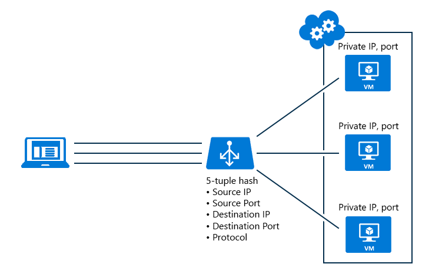

# Load Balancing

Load balancing refers to distributing incoming network requests across a group of resources, ideally avoiding overloading any single resource. A load balancer acts as a "traffic cop" responsible for directing traffic to resources that can quickly and efficiently respond to it. In addition to keeping resources from becoming overloaded, the load balancer can also route traffic away from a resource that has failed, and can automatically begin routing traffic to a new resource that has been added to the group.

Load balancers typically operate at one of two levels: Layer 4 and Layer 7. These layers refer to the [OSI model for communications](https://en.wikipedia.org/wiki/OSI_model), in which Layer 4 refers to the Transport Layer and Layer 7 refers to the Application Layer.

Layer 4 load balancers operate at the network transport level and their algorithms take into account network-level information like IP addresses, ports, and server response times. They do not have insight into higher-level application or cloud service information such as HTTP cookies, application health checks, or message queue counts. 

Layer 7 load balancers have application awareness and can incorporate application and platform information into their algorithms. This allows them to associate client sessions with specific servers using cookies and to optimize load between resources using application-level metrics.

## When to use Azure Load Balancer

Azure Load Balancer (ALB) is a TCP/UDP load balancer that forwards packets to ports. It's a Layer 4 load balancer with no insight into HTTP or application information. If you simply need a public load balancer that can accept incoming requests and route them to one of several virtual machines (VMs) in a virtual network, ALB is a good solution. Figure 3-19 shows how ALB sites between public client requests and a private pool of VMs.

**Figure 3-19**. Azure Load Balancer

If you require more than basic distribution of traffic to a single pool of resources, you should consider another solution like Azure Application Gateway.

## When to use Azure Application Gateway

Azure Application Gateway (AAG) is a Level 7 load balancer that provides a superset of Azure Load Balancer capabilities. You can use AAG to route traffic based on HTTP variables like path, headers, or cookies. For example, if you have some backend resources optimized for dealing with video content, you can route requests for resources under `/video` to these resources. If you have other services optimized to work with images, you could route URLs containing `/images` to the services. AAG also includes a Web Application Firewall (WAF), which can protect your application from common attacks like SQL injection and cross-site scripting.

Figure 3-20 shows how the Azure Application Gateway sits between client requests and back end resources.

**Figure 3-20**. Azure Application Gateway

If you have multiple web sites, AAG can support routing traffic to the appropriate pool of resources associated with each site or subdomain. If you have a multi-tenant application, AAG can be used to provide different resource pools for different tenants, routing based on path, domain, or other HTTP variable.

Another scenario where AAG makes sense is if you require session affinity between clients and backend resources, also referred to as sticky sessions. For example, if your application's servers using local in-memory session storage, clients will see different responses based on which backend server handles their request. To solve this, you would typically use a shared state provider like a Redis cache. However, if this option is not preferred, configuring AAG to use session affinity will also address the issue.

### Kubernetes Ingress Controller

Azure Kubernetes Service(AKS) can use an ingress controller to act as a reverse proxy and provide traffic routing and TLS termination. Using an ingress controller, a Kubernetes cluster can expose a single IP address while routing traffic to multiple services hosted within the cluster. Azure Application Gateway provides all of these features and makes an ideal ingress controller for AKS.

[Learn more about how to configure AAG as an ingress controller for AKS](https://docs.microsoft.com/azure/terraform/terraform-create-k8s-cluster-with-aks-applicationgateway-ingress).

You're learn more about [implementing application gateways for cloud native applications in chapter 6](implement-api-gateways-with-ocelot.md).

## Other options

If you need to route traffic between Azure resources and on-premises resources, [Azure Traffic Manager](https://docs.microsoft.com/azure/traffic-manager/traffic-manager-overview) lets you control traffic between different data centers. Unlike load balancing options, Traffic Manager is DNS-based and can be used to distribute traffic globally between different regions, supporting high availability and reduced network latency.

## References

- [What is Azure Load Balancer](https://docs.microsoft.com/azure/load-balancer/load-balancer-overview)
- [What is Azure Application Gateway](https://docs.microsoft.com/azure/application-gateway/overview)
- [Creates a Kubernetes cluster with Application Gateway ingress controller using AKS](https://docs.microsoft.com/azure/terraform/terraform-create-k8s-cluster-with-aks-applicationgateway-ingress)

>[!div class="step-by-step"]
>[Previous](other-deployment-options.md)
>[Next](communication-patterns.md) <!-- Next Chapter -->
