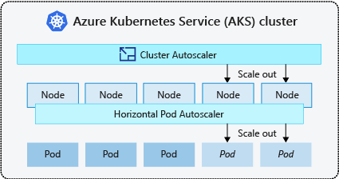

# Scaling containers and serverless applications

There are two typical ways to scale an application: scaling up and scaling out. The former refers to adding capabilities to one host, while the latter refers to adding to the total number of hosts. A common analogy to use to think about this is how to get yourself and some friends across town. If it's just one friend, you could hop into your two-seat race car. But if it's three or four, you might need to take one of your SUVs or a minivan, scaling up to increase capacity. When your total number jumps up to a dozen or more, though, you probably need to take multiple vehicles (unless someone drives a bus), which demonstrates the concept of scaling out by adding more instances (in this case, more vehicles). Let's see how this applies to our applications.

## The simple solution: scaling up

The process of upgrading existing servers to give them more resources (CPU, memory, disk I/O speed, network I/O speed) is known as *scaling up*. In cloud-native applications, scaling up doesn't typically refer to purchasing and installing actual hardware on physical machines so much as choosing a more capable plan from a list of options available. Cloud-native apps typically scale up by modifying the virtual machine (VM) size used to host the individual nodes in their Kubernetes node pool. Kubernetes concepts like nodes, clusters, and pods are described further in [the next section](leverage-containers-orchestrators.md). Azure supports a wide variety of VM sizes running both [Windows](https://docs.microsoft.com/azure/virtual-machines/windows/sizes?toc=%2fazure%2fvirtual-machines%2fwindows%2ftoc.json) and [Linux](https://docs.microsoft.com/azure/virtual-machines/linux/sizes). To vertically scale your application, create a new node pool with a larger node VM size and then migrate workloads to the new pool. This requires [multiple node pools for your AKS cluster](https://docs.microsoft.com/azure/aks/use-multiple-node-pools), a feature that is currently in preview. Serverless apps scale up by choosing a [premium plan](https://docs.microsoft.com/azure/azure-functions/functions-scale) and premium instance sizes or by choosing a different dedicated app service plan.

## Scaling out cloud-native apps

Cloud-native apps support scaling out by adding additional nodes or pods to service requests. This can be accomplished manually by adjusting configuration settings for the app (for example, [scaling a node pool](https://docs.microsoft.com/azure/aks/use-multiple-node-pools#scale-a-node-pool-manually)), or through *autoscaling*. Autoscaling adjusts the resources used by an app in order to respond to demand, similar to how a thermostat responds to temperature by calling for additional heating or cooling. When using autoscaling, manual scaling is disabled.

AKS clusters can scale in one of two ways:

- The [cluster autoscaler](https://docs.microsoft.com/azure/aks/cluster-autoscaler) watches for pods that can't be scheduled on nodes because of resource constraints. It adds additional nodes as required.
- The **horizontal pod autoscaler** uses the Metrics Server in a Kubernetes cluster to monitor the resource demands of pods. If a service needs more resources, the autoscaler increases the number of pods.

Figure 3-13 shows the relationship between these two scaling services.

**Figure 3-13**. Scaling out an App Service plan.

These services can also reduce the number of pods or nodes as needed. These two services can work together and are often deployed together in a cluster. When combined, the horizontal pod autoscaler is focused on running the number of pods required to meet application demand. The cluster autoscaler is focused on running the number of nodes required to support the scheduled pods.

### Scaling Azure Functions

Azure Functions automatically supports scaling out. The default consumption plan adds (and removes) resources dynamically based on the number of triggering events coming in. You're only charged for compute resources being used when your functions are running based on the number of executions, execution time, and memory used. Using the premium plan, you get these same features but you can also control the instance sizes that are used, have instances already warmed up (to avoid cold start delays), and configure dedicated VMs on which to run your functions. While the default configuration should provide an economical and scalable solution for most apps, the premium option allows developers flexibility for custom Azure Functions requirements.

## References

- [AKS Multiple Node Pools](https://docs.microsoft.com/azure/aks/use-multiple-node-pools)
- [AKS Cluster Autoscaler](https://docs.microsoft.com/azure/aks/cluster-autoscaler)
- [Tutorial: Scale applications in AKS](https://docs.microsoft.com/azure/aks/tutorial-kubernetes-scale)
- [Azure Functions scale and hosting](https://docs.microsoft.com/azure/azure-functions/functions-scale)

>[!div class="step-by-step"]
>[Previous](deploy-containers-azure.md)
>[Next](other-deployment-options.md)
