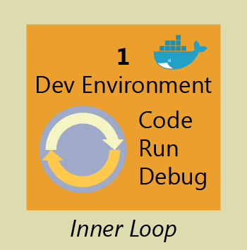
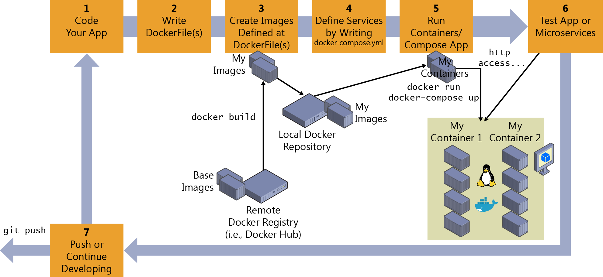
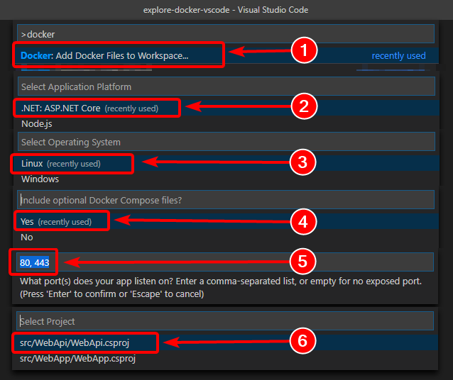
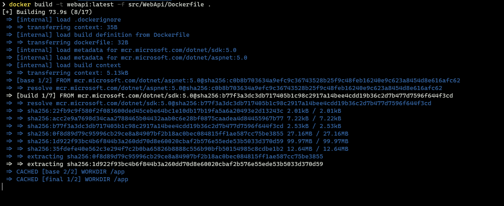
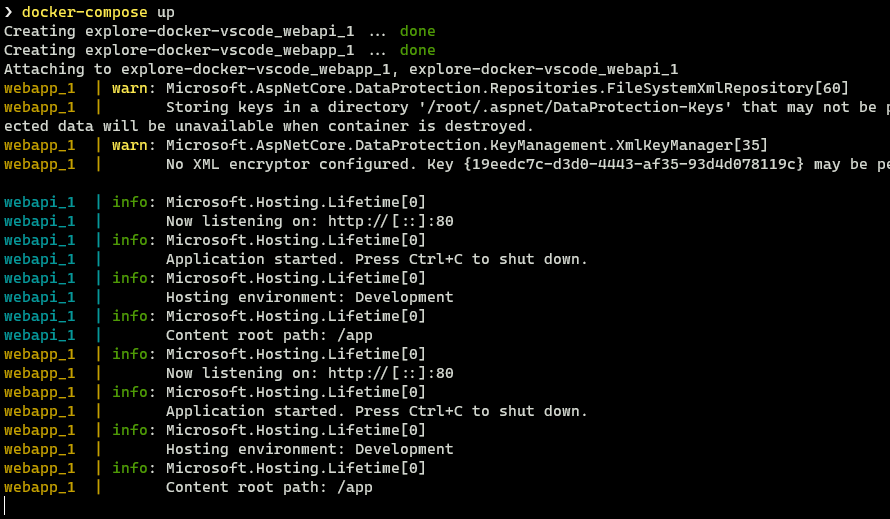
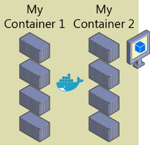
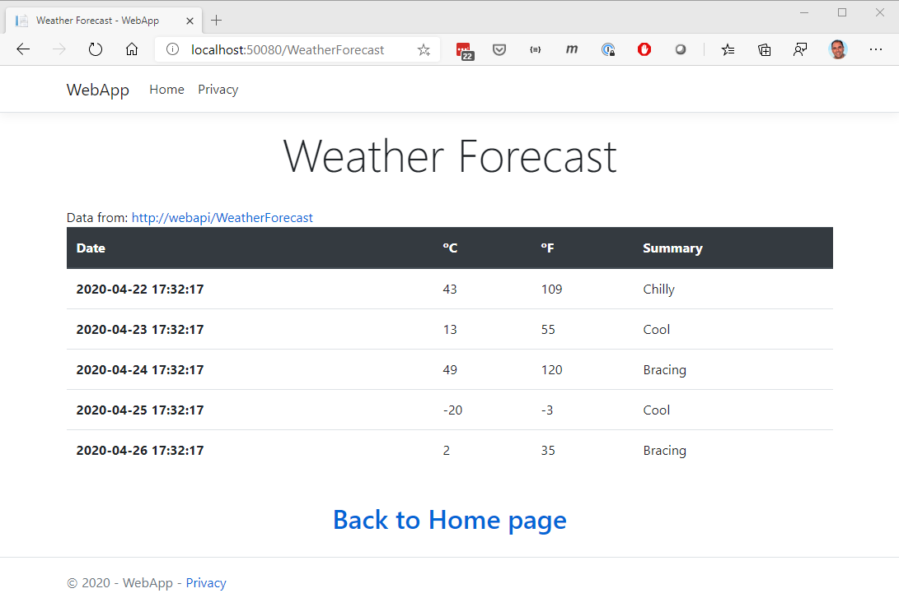

# Inner-loop development workflow for Docker apps

Before triggering the outer-loop workflow spanning the entire DevOps cycle, it all begins on each developer's machine, coding the app itself, using their preferred languages or platforms, and testing it locally (Figure 4-21). But in every case, you'll have an important point in common, no matter what language, framework, or platforms you choose. In this specific workflow, you're always developing and testing Docker containers, but locally.



**Figure 4-21**. Inner-loop development context

The container or instance of a Docker image will contain these components:

- An operating system selection (for example, a Linux distribution or Windows)

- Files added by the developer (for example, app binaries)

- Configuration (for example, environment settings and dependencies)

- Instructions for what processes to run by Docker

You can set up the inner-loop development workflow that utilizes Docker as the process (described in the next section). Consider that the initial steps to set up the environment are not included, because you only need to do it once.

## Building a single app within a Docker container using Visual Studio Code and Docker CLI

Apps are made up from your own services plus additional libraries (dependencies).

Figure 4-22 shows the basic steps that you usually need to carry out when building a Docker app, followed by detailed descriptions of each step.



**Figure 4-22**. High-level workflow for the life cycle for Docker containerized applications using Docker CLI

### Step 1: Start coding in Visual Studio Code and create your initial app/service baseline

The way you develop your application is similar to the way you do it without Docker. The difference is that while developing, you're deploying and testing your application or services running within Docker containers placed in your local environment (like a Linux VM or Windows).

**Setting up your local environment**

With the latest versions of Docker Desktop for Mac and Windows, it's easier than ever to develop Docker applications, and the setup is straightforward.

> [!TIP]
> For instructions on setting up Docker Desktop for Windows, go to <https://docs.docker.com/docker-for-windows/>.
>
> For instructions on setting up Docker Desktop for Mac, go to <https://docs.docker.com/docker-for-mac/>.

In addition, you'll need a code editor so that you can actually develop your application while using Docker CLI.

Microsoft provides Visual Studio Code, which is a lightweight code editor that's supported on Windows, Linux, and macOS, and provides IntelliSense with [support for many languages](https://code.visualstudio.com/docs/languages/overview) (JavaScript, .NET, Go, Java, Ruby, Python, and most modern languages), [debugging](https://code.visualstudio.com/Docs/editor/debugging), [integration with Git](https://code.visualstudio.com/Docs/editor/versioncontrol) and [extensions support](https://code.visualstudio.com/docs/extensions/overview). This editor is a great fit for macOS and Linux developers. In Windows, you also can use Visual Studio.

> [!TIP]
> For instructions on installing Visual Studio Code for Windows, Linux, or macOS, go to <https://code.visualstudio.com/docs/setup/setup-overview/>.
>
> For instructions on setting up Docker for Mac, go to <https://docs.docker.com/docker-for-mac/>.

You can work with Docker CLI and write your code using any code editor, but using Visual Studio Code with the Docker extension makes it easy to author `Dockerfile` and `docker-compose.yml` files in your workspace. You can also run tasks and scripts from the Visual Studio Code IDE to execute Docker commands using the Docker CLI underneath.

The Docker extension for VS Code provides the following features:

- Automatic `Dockerfile` and `docker-compose.yml` file generation

- Syntax highlighting and hover tips for `docker-compose.yml` and `Dockerfile` files

- IntelliSense (completions) for `Dockerfile` and `docker-compose.yml` files

- Linting (errors and warnings) for `Dockerfile` files

- Command Palette (F1) integration for the most common Docker commands

- Explorer integration for managing Images and Containers

- Deploy images from DockerHub and Azure Container Registries to Azure App Service

To install the Docker extension, press Ctrl+Shift+P, type `ext install`, and then run the Install Extension command to bring up the Marketplace extension list. Next, type **docker** to filter the results, and then select the Docker Support extension, as depicted in Figure 4-23.


**Figure 4-23**. Installing the Docker Extension in Visual Studio Code

### Step 2: Create a DockerFile related to an existing image (plain OS or dev environments like .NET Core, Node.js, and Ruby)

You'll need a `DockerFile` per custom image to be built and per container to be deployed. If your app is made up of a single custom service, you'll need a single `DockerFile`. But if your app is composed of multiple services (as in a microservices architecture), you'll need one `Dockerfile` per service.

The `DockerFile` is commonly placed in the root folder of your app or service and contains the required commands so that Docker knows how to set up and run that app or service. You can create your `DockerFile` and add it to your project along with your code (node.js, .NET Core, etc.), or, if you're new to the environment, take a look at the following Tip.

> [!TIP]
> You can use the Docker extension to guide you when using the `Dockerfile` and `docker-compose.yml` files related to your Docker containers. Eventually, you'll probably write these kinds of files without this tool, but using the Docker extension is a good starting point that will accelerate your learning curve.

In Figure 4-24, you can see the steps to add the docker files to a project by using the Docker Extension for VS Code:

1. Open the command palette, type "**docker**" and select "**Add Docker Files to Workspace**".
2. Select Application Platform (ASP.NET Core)
3. Select Operating System (Linux)
4. Include optional Docker Compose files
5. Enter ports to publish (80, 443)
6. Select the project



**Figure 4-24**. Docker files added using the **Add Docker files to Workspace** command

When you add a DockerFile, you specify what base Docker image you'll be using (like using `FROM mcr.microsoft.com/dotnet/core/aspnet`). You'll usually build your custom image on top of a base image that you get from any official repository at the [Docker Hub registry](https://hub.docker.com/) (like an [image for .NET Core](https://hub.docker.com/_/microsoft-dotnet-core/) or the one [for Node.js](https://hub.docker.com/_/node/)).

> [!TIP]
> You'll have to repeat this procedure for every project in your application. However, the extension will ask to overwrite the generated docker-compose file after the first time. You should reply to not overwrite it, so the extension creates separate docker-compose files, that you can then merge by hand, prior to running docker-compose.

**_Use an existing official Docker image_**

Using an official repository of a language stack with a version number ensures that the same language features are available on all machines (including development, testing, and production).

The following is a sample DockerFile for a .NET Core container:

```Dockerfile
FROM mcr.microsoft.com/dotnet/core/aspnet:3.1 AS base
WORKDIR /app
EXPOSE 80
EXPOSE 443

FROM mcr.microsoft.com/dotnet/core/sdk:3.1 AS build
WORKDIR /src
COPY ["src/WebApi/WebApi.csproj", "src/WebApi/"]
RUN dotnet restore "src/WebApi/WebApi.csproj"
COPY . .
WORKDIR "/src/src/WebApi"
RUN dotnet build "WebApi.csproj" -c Release -o /app/build

FROM build AS publish
RUN dotnet publish "WebApi.csproj" -c Release -o /app/publish

FROM base AS final
WORKDIR /app
COPY --from=publish /app/publish .
ENTRYPOINT ["dotnet", "WebApi.dll"]
```

In this case, the image is based on version 3.1 of the official ASP.NET Core Docker image (multi-arch for Linux and Windows), as per the line `FROM mcr.microsoft.com/dotnet/core/aspnet:3.1`. (For more information about this topic, see the [ASP.NET Core Docker Image](https://hub.docker.com/_/microsoft-dotnet-core-aspnet/) page and the [.NET Core Docker Image](https://hub.docker.com/_/microsoft-dotnet-core/) page).

In the DockerFile, you can also instruct Docker to listen to the TCP port that you'll use at runtime (such as port 80 or 443).

You can specify additional configuration settings in the Dockerfile, depending on the language and framework you're using. For instance, the `ENTRYPOINT` line with `["dotnet", "WebMvcApplication.dll"]` tells Docker to run a .NET Core application. If you're using the SDK and the .NET Core CLI (`dotnet CLI`) to build and run the .NET application, this setting would be different. The key point here is that the ENTRYPOINT line and other settings depend on the language and platform you choose for your application.

> [!TIP]
> For more information about building Docker images for .NET Core applications, go to <https://docs.microsoft.com/dotnet/core/docker/building-net-docker-images>.
>
> To learn more about building your own images, go to <https://docs.docker.com/engine/tutorials/dockerimages/>.

**Use multi-arch image repositories**

A single image name in a repo can contain platform variants, such as a Linux image and a Windows image. This feature allows vendors like Microsoft (base image creators) to create a single repo to cover multiple platforms (that is, Linux and Windows). For example, the [dotnet/core/aspnet](https://hub.docker.com/_/microsoft-dotnet-core-aspnet/) repository available in the Docker Hub registry provides support for Linux and Windows Nano Server by using the same image name.

Pulling the [dotnet/core/aspnet](https://hub.docker.com/_/microsoft-dotnet-core-aspnet/) image from a Windows host pulls the Windows variant, whereas pulling the same image name from a Linux host pulls the Linux variant.

**_Create your base image from scratch_**

You can create your own Docker base image from scratch as explained in this [article](https://docs.docker.com/engine/userguide/eng-image/baseimages/) from Docker. This scenario is probably not the best for you if you're just starting with Docker, but if you want to set the specific bits of your own base image, you can do it.

### Step 3: Create your custom Docker images embedding your service in it

For each custom service that comprises your app, you'll need to create a related image. If your app is made up of a single service or web app, you'll need just a single image.

> [!NOTE]
> When taking into account the "outer-loop DevOps workflow", the images will be created by an automated build process whenever you push your source code to a Git repository (Continuous Integration), so the images will be created in that global environment from your source code.
>
> But before you consider going to that outer-loop route, you need to ensure that the Docker application is actually working properly so that they don't push code that might not work properly to the source control system (Git, etc.).
>
> Therefore, each developer first needs to do the entire inner-loop process to test locally and continue developing until they want to push a complete feature or change to the source control system.

To create an image in your local environment and using the DockerFile, you can use the docker build command, as shown in Figure 4-25, because it already tags the image for you and builds the images for all services in the application with a simple command.



**Figure 4-25**. Running docker build

Optionally, instead of directly running `docker build` from the project folder, you first can generate a deployable folder with the .NET libraries needed by using the run `dotnet publish` command, and then run `docker build`.

This example creates a Docker image with the name `explore-docker-vscode/webapi:latest` (`:latest` is a tag, like a specific version). You can take this step for each custom image you need to create for your composed Docker application with several containers. However, we'll see in the next section that it's easier to do this using `docker-compose`.

You can find the existing images in your local repository (your development machine) by using the `docker images` command, as illustrated in Figure 4-26.


**Figure 4-26**. Viewing existing images using docker images

### Step 4: Define your services in docker-compose.yml when building a composed Docker app with multiple services

With the `docker-compose.yml` file, you can define a set of related services to be deployed as a composed application with the deployment commands explained in the next step section.

Create that file in your main or root solution folder; it should have content similar to that shown in this `docker-compose.yml` file:

```yml
version: "3.4"

services:
  webapi:
    image: webapi
    build:
      context: .
      dockerfile: src/WebApi/Dockerfile
    ports:
      - 51080:80
    depends_on:
      - redis
    environment:
      - ASPNETCORE_ENVIRONMENT=Development
      - ASPNETCORE_URLS=http://+:80

  webapp:
    image: webapp
    build:
      context: .
      dockerfile: src/WebApp/Dockerfile
    ports:
      - 50080:80
    environment:
      - ASPNETCORE_ENVIRONMENT=Development
      - ASPNETCORE_URLS=http://+:80
      - WebApiBaseAddress=http://webapi

  redis:
    image: redis
```

In this particular case, this file defines three services: the web API service (your custom service), a web application, and the redis service (a popular cache service). Each service will be deployed as a container, so you need to use a concrete Docker image for each. For this particular application:

- The web API service is built from the DockerFile in the `src/WebApi/Dockerfile` directory.

- The host port 51080 is forwarded to the exposed port 80 on the `webapi` container.

- The web API service depends on the redis service

- The web application accesses the web API service using the internal address: `http://webapi`.

- The redis service uses the [latest public redis image](https://hub.docker.com/_/redis/) pulled from the Docker Hub registry. [redis](https://redis.io/) is a popular cache system for server-side applications.

### Step 5: Build and run your Docker app

If your app has only a single container, you just need to run it by deploying it to your Docker Host (VM or physical server). However, if your app is made up of multiple services, you need to _compose it_, too. Let's see the different options.

**_Option A: Run a single container or service_**

You can run the Docker image by using the docker run command, as shown here:

```console
docker run -t -d -p 50080:80 explore-docker-vscode/webapp:latest
```

For this particular deployment, we'll be redirecting requests sent to port 50080 on the host to the internal port 80.

**_Option B: Compose and run a multiple-container application_**

In most enterprise scenarios, a Docker application will be composed of multiple services. For these cases, you can run the `docker-compose up` command (Figure 4-27), which will use the docker-compose.yml file that you created previously. Running this command builds all custom images and deploys the composed application with all of its related containers.



**Figure 4-27**. Results of running the "docker-compose up" command

After you run `docker-compose up`, you deploy your application and its related container(s) into your Docker Host, as illustrated in Figure 4-28, in the VM representation.



**Figure 4-28**. VM with Docker containers deployed

### Step 6: Test your Docker application (locally, in your local CD VM)

This step will vary depending on what your app is doing.

In a simple .NET Core Web API "Hello World" deployed as a single container or service, you'd just need to access the service by providing the TCP port specified in the DockerFile.

On the Docker host, open a browser and navigate to that site; you should see your app/service running, as demonstrated in Figure 4-29.



**Figure 4-29**. Testing your Docker application locally by using the browser

Note that it's using port 50080, but internally it's being redirected to port 80, because that's how it was deployed with `docker compose`, as explained earlier.

You can test this by using the browser using CURL from the terminal, as depicted in Figure 4-30.


**Figure 4-30**. Testing a Docker application locally by using CURL

**Debugging a container running on Docker**

Visual Studio Code supports debugging Docker if you're using Node.js and other platforms like .NET Core containers.

You also can debug .NET Core or .NET Framework containers in Docker when using Visual Studio for Windows or Mac, as described in the next section.

> [!TIP]
> To learn more about debugging Node.js Docker containers, see <https://blog.docker.com/2016/07/live-debugging-docker/> and <https://docs.microsoft.com/archive/blogs/user_ed/visual-studio-code-new-features-13-big-debugging-updates-rich-object-hover-conditional-breakpoints-node-js-mono-more>.

> [!div class="step-by-step"]
> [Previous](docker-apps-development-environment.md)
> [Next](visual-studio-tools-for-docker.md)
