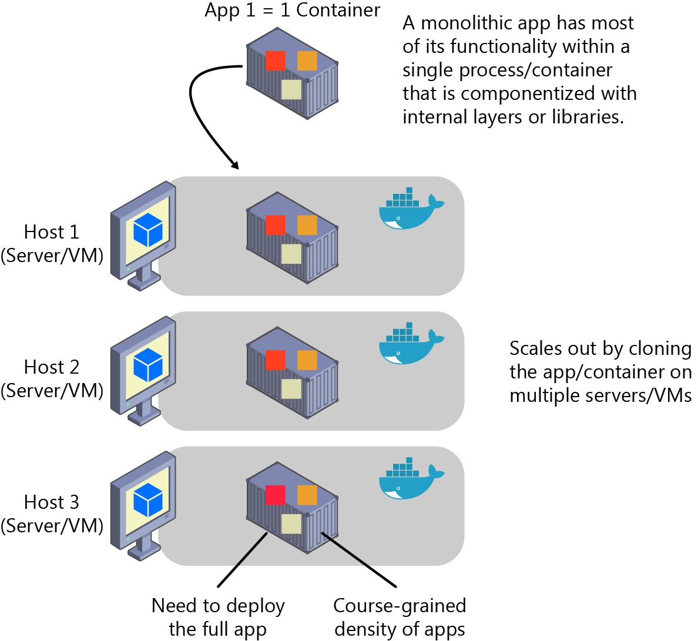
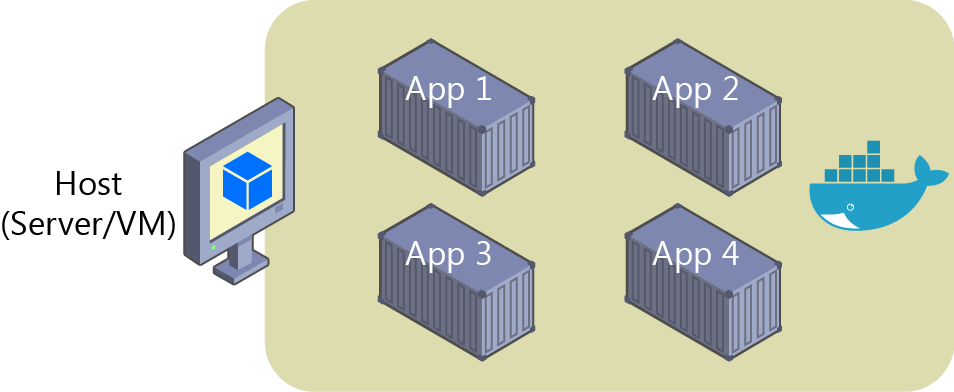
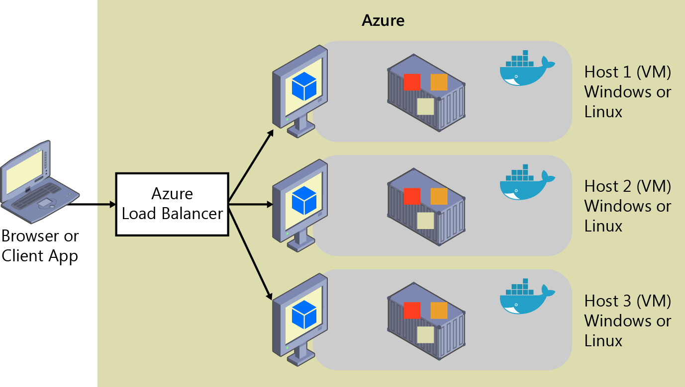
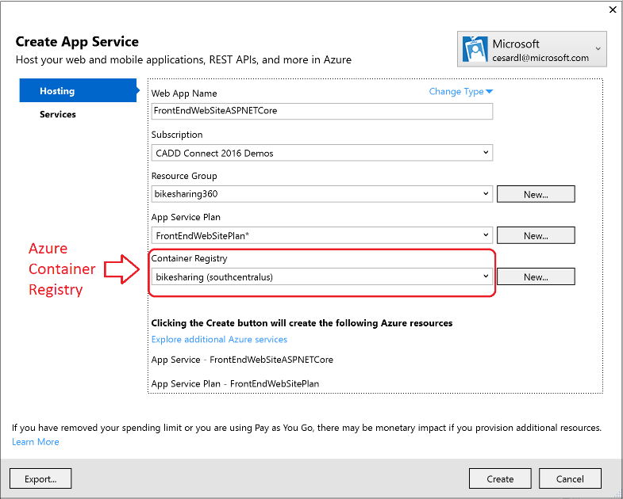

# Monolithic applications

In this scenario, you're building a single and monolithic web application or service and deploying it as a container. Within the application, the structure might not be monolithic; it might comprise several libraries, components, or even layers (application layer, domain layer, data access layer, etc.). Externally, it's a single container, like a single process, single web application, or single service.

To manage this model, you deploy a single container to represent the application. To scale it, just add a few more copies with a load balancer in front. The simplicity comes from managing a single deployment in a single container or virtual machine (VM).

Following the principal that a container does one thing only, and does it in one process, the monolithic pattern is in conflict. You can include multiple components/libraries or internal layers within each container, as illustrated in Figure 4-1.

**Figure 4-1.** An example of monolithic application architecture

A monolithic app has all or most of its functionality within a single process or container and it's componentized in internal layers or libraries. The downside to this approach comes if or when the application grows, requiring it to scale. If the entire application scaled, it's not really a problem. However, in most cases, a few parts of the application are the choke points that require scaling, whereas other components are used less.

Using the typical e-commerce example, what you likely need is to scale the product information component. Many more customers browse products than purchase them. More customers use their basket than use the payment pipeline. Fewer customers add comments or view their purchase history. And you likely have only a handful of employees, in a single region, that need to manage the content and marketing campaigns. By scaling the monolithic design, all of the code is deployed multiple times.

In addition to the "scale-everything" problem, changes to a single component require complete retesting of the entire application as well as a complete redeployment of all the instances.

The monolithic approach is common, and many organizations are developing with this architectural method. Many enjoy good enough results, whereas others encounter limits. Many designed their applications in this model because the tools and infrastructure were too difficult to build SOAs, and they didn't see the need—until the app grew.

From an infrastructure perspective, each server can run many applications within the same host and have an acceptable ratio of efficiency in your resources usage, as shown in Figure 4-2.

**Figure 4-2.** A host running multiple apps/containers

Finally, from an availability perspective, monolithic applications must be deployed as a whole; that means that in case you must *stop and start*, all functionality and all users will be affected during the deployment window. In certain situations, the use of Azure and containers can minimize these situations and reduce the probability of downtime of your application, as you can see in Figure 4-3.

You can deploy monolithic applications in Azure by using dedicated VMs for each instance. Using [Azure VM Scale Sets](https://docs.microsoft.com/azure/virtual-machine-scale-sets/), you can scale the VMs easily.

You can also use [Azure App Services](https://azure.microsoft.com/services/app-service/) to run monolithic applications and easily scale instances without having to manage the VMs. Azure App Services can run single instances of Docker containers, as well, simplifying the deployment.

You can deploy multiple VMs as Docker hosts and run any number of containers per VM. Then, by using an Azure Load Balancer, as illustrated in the Figure 4-3, you can manage scaling.

**Figure 4-3**. Multiple hosts scaling out a single Docker application

You can manage the deployment of the hosts themselves via traditional deployment techniques.

You can manage Docker containers from the command line by using commands like `docker run` and `docker-compose up`, and you can also automate it in Continuous Delivery (CD) pipelines and deploy to Docker hosts from Azure DevOps Services, for instance.

## Monolithic application deployed as a container

There are benefits to using containers to manage monolithic deployments. Scaling the instances of containers is far faster and easier than deploying additional VMs.

Deploying updates as Docker images is far faster and network efficient. Docker containers typically start in seconds, speeding rollouts. Tearing down a Docker container is as easy as invoking the `docker stop` command, typically completing in less than a second.

Because containers are inherently immutable, by design, you never need to worry about corrupted VMs because an update script forgot to account for some specific configuration or file left on disk.

Although monolithic apps can benefit from Docker, we're touching on only the tips of the benefits. The larger benefits of managing containers come from deploying with container orchestrators that manage the various instances and life cycle of each container instance. Breaking up the monolithic application into subsystems that can be scaled, developed, and deployed individually is your entry point into the realm of microservices.

To learn about how to "lift and shift" monolithic applications with containers and how you can modernize your applications, you can read this additional Microsoft guide, [Modernize existing .NET applications with Azure cloud and Windows Containers](../../modernize-with-azure-containers/index.md), which you can also download as PDF from <https://aka.ms/LiftAndShiftWithContainersEbook>.

## Publish a single Docker container app to Azure App Service

Either because you want to get a quick validation of a container deployed to Azure or because the app is simply a single-container app, Azure App Services provides a great way to provide scalable single-container services.

Using Azure App Service is intuitive and you can get up and running quickly because it provides great Git integration to take your code, build it in Microsoft Visual Studio, and directly deploy it to Azure. But, traditionally (with no Docker), if you needed other capabilities, frameworks, or dependencies that aren't supported in App Services, you needed to wait for it until the Azure team updates those dependencies in App Service or switched to other services like Service Fabric, Cloud Services, or even plain VMs, for which you have further control and can install a required component or framework for your application.

Now, as shown in Figure 4-4, when using Visual Studio 2017, container support in Azure App Service gives you the ability to include whatever you want in your app environment. If you added a dependency to your app, because you're running it in a container, you get the capability of including those dependencies in your Dockerfile or Docker image.

**Figure 4-4**. Publishing a container to Azure App Service from Visual Studio apps/containers

Figure 4-4 also shows that the publish flow pushes an image through a Container Registry, which can be the Azure Container Registry (a registry near to your deployments in Azure and secured by Azure Active Directory groups and accounts) or any other Docker Registry like Docker Hub or on-premises registries.

>[!div class="step-by-step"]
>[Previous](common-container-design-principles.md)
>[Next](state-and-data-in-docker-applications.md)
