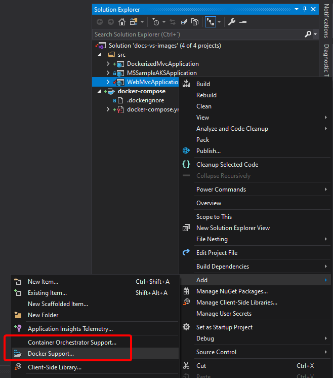
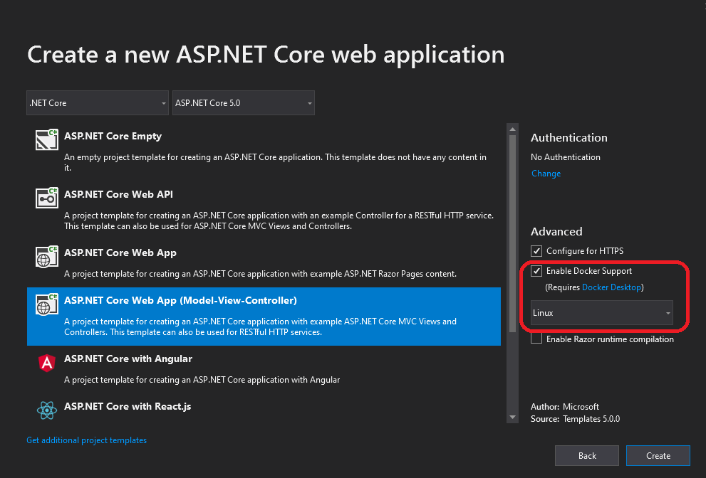
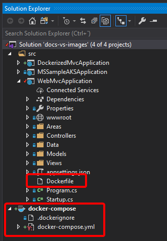
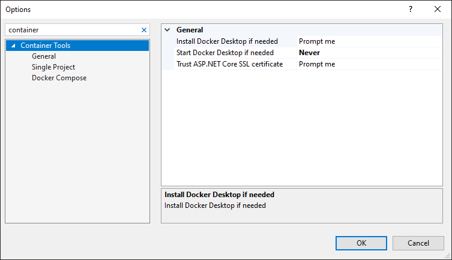

# Use Docker Tools in Visual Studio on Windows

The developer workflow when using the Docker Tools included in Visual Studio 2017 version 15.7 and later, is similar to using Visual Studio Code and Docker CLI (in fact, it's based on the same Docker CLI), but it's easier to get started, simplifies the process, and provides greater productivity for the build, run, and compose tasks. It can also run and debug your containers via the usual `F5` and `Ctrl+F5` keys from Visual Studio. You can even debug a whole solution if its containers are defined in the same `docker-compose.yml` file at the solution level.

## Configure your local environment

With the latest versions of Docker for Windows, it's easier than ever to develop Docker applications because the setup is straightforward, as explained in the following references.

> [!TIP]
> To learn more about installing Docker for Windows, go to (<https://docs.docker.com/docker-for-windows/>).

## Docker support in Visual Studio

There are two levels of Docker support you can add to a project. In ASP.NET Core projects, you can just add a `Dockerfile` file to the project by enabling Docker support. The next level is container orchestration support, which adds a `Dockerfile` to the project (if it doesn't already exist) and a `docker-compose.yml` file at the solution level. Container orchestration support, via Docker Compose, is added by default in Visual Studio 2017 versions 15.0 to 15.7. Container orchestration support is an opt-in feature in Visual Studio 2017 versions 15.8 or later. Visual Studio 2019 and later supports **Kubernetes/Helm** deployment as well.

The **Add > Docker Support** and **Add > Container Orchestrator Support** commands are located on the right-click menu (or context menu) of the project node for an ASP.NET Core project in **Solution Explorer**, as shown in Figure 4-31:

**Figure 4-31**. Adding Docker support to a Visual Studio 2019 project

### Add Docker support

Besides the option to add Docker support to an existing application, as shown in the previous section, you can also enable Docker support during project creation by selecting **Enable Docker Support** in the **New ASP.NET Core Web Application** dialog box that opens after you click **OK** in the **New Project** dialog box, as shown in Figure 4-32.

**Figure 4-32**. Enable Docker support during project creation in Visual Studio 2019

When you add or enable Docker support, Visual Studio adds a _Dockerfile_ file to the project, that includes references to all required project from the solution.

### Add container orchestration support

When you want to compose a multi-container solution, add container orchestration support to your projects. This lets you run and debug a group of containers (a whole solution) at the same time if they're defined in the same _docker-compose.yml_ file.

To add container orchestration support, right-click on the solution or project node in **Solution Explorer**, and choose **Add > Container Orchestration Support**. Then choose **Kubernetes/Helm** or **Docker Compose** to manage the containers.

After you add container orchestration support to your project, you see a Dockerfile added to the project and a **docker-compose** folder added to the solution in **Solution Explorer**, as shown in Figure 4-33:

**Figure 4-33**. Docker files in Solution Explorer in Visual Studio 2019

If _docker-compose.yml_ already exists, Visual Studio just adds the required lines of configuration code to it.

## Configure Docker tools

From the main menu, choose **Tools > Options**, and expand **Container Tools > Settings**. The container tools settings appear.

**Figure 4-34**. Docker Tools Options

The following table might help you decide how to set these options.

| Page/Setting                                |  Default Setting   | Description                                                                                                                                                                                                                                                                                                                                                                                                           |
| ------------------------------------------- | :----------------: | --------------------------------------------------------------------------------------------------------------------------------------------------------------------------------------------------------------------------------------------------------------------------------------------------------------------------------------------------------------------------------------------------------------------- |
| **General page**                            |
| Install Docker Desktop if needed            |     Prompt me      |
| Start Docker Desktop if needed              |     Prompt me      |
| Trust ASP.NET Core SSL certificate          |     Prompt me      | If the localhost SSL certificate hasn't been marked as trusted (with `dotnet dev-certs https --trust`), Visual Studio will prompt every time you run your project.                                                                                                                                                                                                                                                    |
| **Single Project page**                     |
| Pull required Docker images on project open |        True        | For increased performance when running the project, Visual Studio will start a Docker pull operation in the background so that when you're ready to run your code, the image is already downloaded or in the process of downloading. If you're just loading projects and browsing code, you can turn this off to avoid downloading container images you don't need. This could slow the open project user experience. |
| Pull updated Docker images on project load  | .NET Core projects | Pull updates to existing images to get the latest updates on project open. This could slow the open project user experience.                                                                                                                                                                                                                                                                                          |
| Remove containers on project close          |        True        | Clean up on project close, This could slow the close project user experience but it's usually fast anyway.                                                                                                                                                                                                                                                                                                            |
| Run containers on project open              |        True        | For increased performance when running the project, Visual Studio will start all containers in the solution. This could slow the open project user experience.                                                                                                                                                                                                                                                        |
| **Docker Compose**                          |                    | The Docker Compose page contains the same settings as the Single Project page, but they apply to multi-container solutions.                                                                                                                                                                                                                                                                                           |

> [!WARNING]
> If the localhost SSL certificate is not trusted, and you set the option to **Never**, then HTTPS web requests might fail at runtime in your app or service. In that case, set the value back again to **Prompt me** or, better again, trust the certificates in your dev machine using the command `dotnet dev-certs https --trust`.

> [!TIP]
> For further details on the services implementation and use of Visual Studio Tools for Docker, read the following articles:
>
> Debug apps in a local Docker container: <https://docs.microsoft.com/visualstudio/containers/edit-and-refresh>
>
> Deploy an ASP.NET container to a container registry using Visual Studio: <https://docs.microsoft.com/visualstudio/containers/hosting-web-apps-in-docker>

> [!div class="step-by-step"]
> [Previous](docker-apps-inner-loop-workflow.md)
> [Next](set-up-windows-containers-with-powershell.md)
