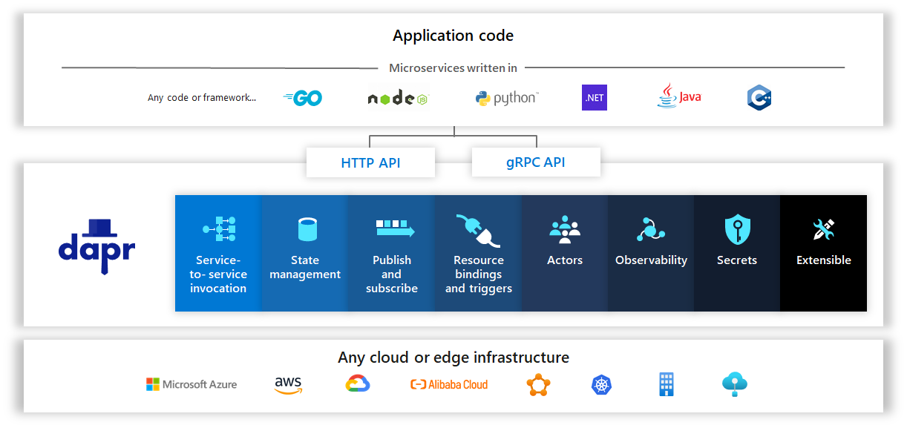
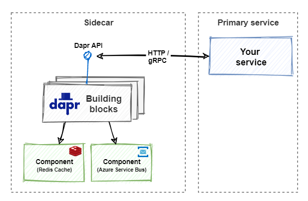
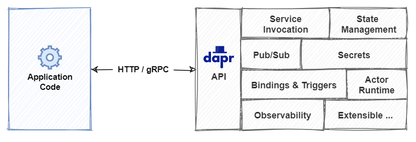
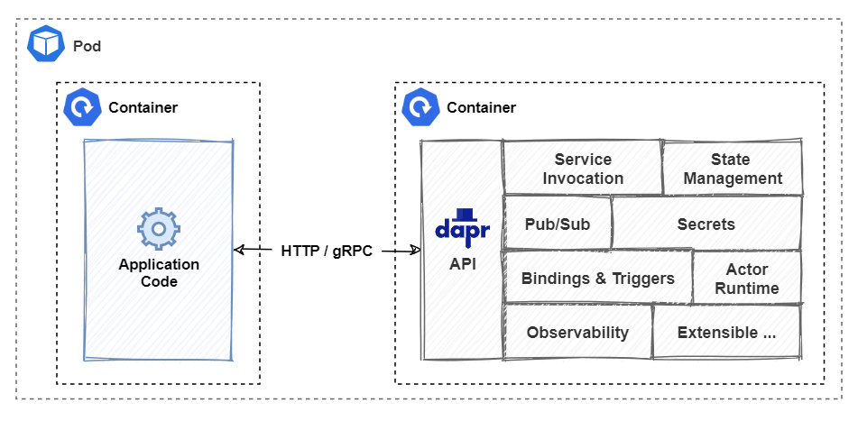
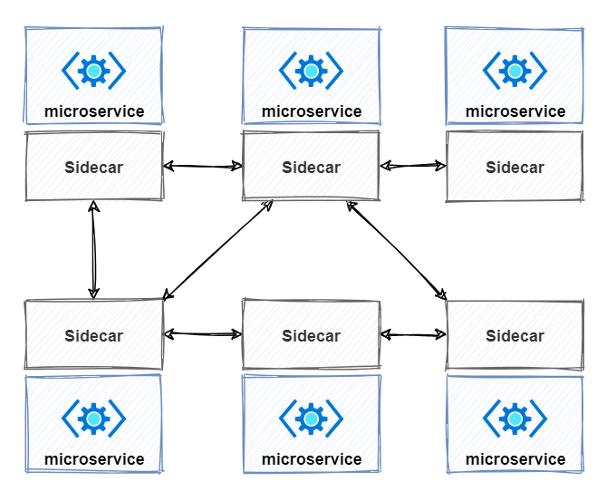
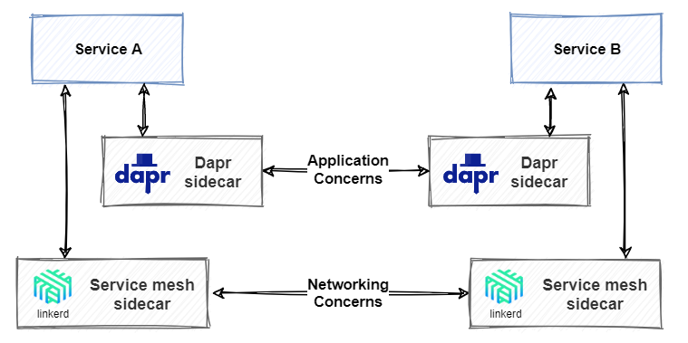

# Dapr at 20,000 feet

In chapter 1, we discussed the appeal of distributed microservice applications. But, we also pointed out that they dramatically increase architectural and operational complexity. With that in mind, the question becomes, how can you "have your cake" and "eat it too?". That is, how can you take advantage of the agility of distributed architecture, and minimize its complexity?

Dapr, or *Distributed Application Runtime*, is a new way to build modern distributed applications.

What started as a prototype has evolved into a highly successful open-source project. Its sponsor, Microsoft, has closely partnered with customers and the open-source community to design and build Dapr. The Dapr project brings together developers from all backgrounds to solve some of the toughest challenges of developing distributed applications.

This book looks at Dapr from the viewpoint of a .NET developer. In this chapter, you'll build a conceptual understanding of Dapr and how it works. Later on, we present practical, hands-on instruction on how you can use Dapr in your applications.

Imagine flying in a jet at 20,000 feet. You look out the window and see the landscape below from a wide perspective. Let's do the same for Dapr. Visualize yourself flying over Dapr at 20,000 feet. What would you see?

## Dapr and the problem it solves

Dapr addresses a large challenge inherent in modern distributed applications: **Complexity**.

Through an architecture of pluggable components, Dapr greatly simplifies the plumbing behind distributed applications. It provides a **dynamic glue** that binds your application with infrastructure capabilities from the Dapr runtime.

Consider a requirement to make one of your services stateful? What would be your design. You could write custom code that targets a state store such as Redis Cache. However, Dapr provides state management capabilities out-of-the-box. Your service invokes the Dapr state management **building block** that dynamically binds to a state store **component** via a Dapr **component configuration** yaml file. Dapr ships with several pre-built state store components, including Redis. With this model, your service delegates state management to the Dapr runtime. Your service has no SDK, library, or direct reference to the underlying component. You can even change state stores, say, from Redis to MySQL or Cassandra, with no code changes.

Figure 2-1 shows Dapr from 20,000 feet.


**Figure 2-1**. Dapr at 20,000 feet.

In the top row of the figure, note how Dapr provides language-specific SDKs for popular development platforms. Dapr v 1.0 includes supports Go, Node.js, Python, .NET, Java, and JavaScript. This book focuses on the Dapr .NET SDK, which also provides direct support for ASP.NET Core integration.

While language-specific SDKs enhance the developer experience, Dapr is platform agnostic. Under the hood, Dapr's programming model exposes capabilities through standard HTTP/gRPC communication protocols. Any programming platform can call Dapr via its native HTTP and gRPC APIs.  

The blue boxes across the center of the figure represent the Dapr building blocks. Each exposes a distributed application capability that your application can consume.

The bottom row highlights the portability of Dapr and the diverse environments across which it can run.

## Dapr architecture

At this point, the jet turns around and flies back over Dapr, descending in altitude, giving you a closer look at how Dapr works.

### Building blocks

From the new perspective, you see a more detailed view of the Dapr **building blocks**.

A building block encapsulates a distributed infrastructure capability. You can access the functionality through the HTTP or gRPC APIs. Figure 2-2 shows the available blocks for Dapr v 1.0.


**Figure 2-2**. Dapr building blocks.

The following table describes the infrastructure services provided by each block.

| Building block | Description |
|----------------|-------------|
| [State management](state-management.md) | Support contextual information for long running stateful services. |
| [Service invocation](service-invocation.md) | Invoke direct, secure service-to-service calls using platform agnostic protocols and well-known endpoints. |
| [Publish and subscribe](publish-subscribe.md) | Implement secure, scalable pub/sub messaging between services. |
| [Bindings](bindings.md) | Trigger code from events raised by external resources with bi-directional communication. |
| [Observability](observability.md) | Monitor and measure message calls across networked services. |
| [Secrets](secrets.md) | Securely access external secret stores. |
| Actors | Encapsulate logic and data in reusable actor objects. |

Building blocks abstract the implementation of distributed application capabilities from your services. Figure 2-3 shows this interaction.


**Figure 2-3**. Dapr building block integration.

Building blocks invoke Dapr components that provide the concrete implementation for each resource. The code for your service is only aware of the building block. It takes no dependencies on external SDKs or libraries - Dapr handles the plumbing for you. Each building block is independent. You can use one, some, or all of them in your application. As a value-add, Dapr building blocks bake in industry best practices including comprehensive observability.

We provide detailed explanation and code samples for each Dapr building block in the upcoming chapters. At this point, the jet descends even more. From the new perspective, you now have a closer look at the Dapr components layer.

### Components

While building blocks expose an API to invoke distributed application capabilities, Dapr components provide the concrete implementation to make it happen.

Consider, the Dapr **state store** component. It provides a uniform way to manage state for CRUD operations. Without any change to your service code, you could switch between any of the following Dapr state components:

- AWS DynamoDB
- Aerospike
- Azure Blob Storage
- Azure CosmosDB
- Azure Table Storage
- Cassandra
- Cloud Firestore (Datastore mode)
- CloudState
- Couchbase
- Etcd
- HashiCorp Consul
- Hazelcast
- Memcached
- MongoDB
- PostgreSQL
- Redis
- RethinkDB
- SQL Server
- Zookeeper

Each component provides the necessary implementation through a common state management interface:

```go
 type Store interface {
   Init(metadata Metadata) error
   Delete(req *DeleteRequest) error
   BulkDelete(req []DeleteRequest) error
   Get(req *GetRequest) (*GetResponse, error)
   Set(req *SetRequest) error
   BulkSet(req []SetRequest) error
}
```

> [!TIP]
> The Dapr runtime as well as all of the Dapr components have been written in the Golang, or Go, language. Go is a popular language across the open source community and attests to cross-platform commitment of Dapr.

Perhaps you start with Azure Redis Cache as your state store. You specify it with the following configuration:

 ```yaml
 apiVersion: dapr.io/v1alpha1
 kind: Component
 metadata:
   name: statestore
   namespace: default
 spec:
   type: state.redis
   version: v1
   metadata:
   - name: redisHost
     value: <HOST>
   - name: redisPassword
     value: <PASSWORD>
   - name: enableTLS
     value: <bool> # Optional. Allowed: true, false.
   - name: failover
     value: <bool> # Optional. Allowed: true, false.
 ```

In the **spec** section, you configure Dapr to use the Redis Cache for state management. The section also contains component-specific metadata. In this case, you can use it to configure additional Redis settings.

At a later time, the application is ready to go to production. For the production environment, you may want to change your state management to Azure Table Storage. Azure Table Storage provides state management capabilities that are affordable and highly durable.

At the time of this writing, the following component types are provided by Dapr:

| Component | Description |
|-----------|-------------|
| [Service discovery](https://github.com/dapr/components-contrib/tree/master/nameresolution) | Used by the service invocation building block to integrate with the hosting environment to provide service-to-service discovery. |
| [State](https://github.com/dapr/components-contrib/tree/master/state) | Provides a uniform interface to interact with a wide variety of state store implementations. |
| [Pub/sub](https://github.com/dapr/components-contrib/tree/master/pubsub) | Provides a uniform interface to interact with a wide variety of message bus implementations. |
| [Bindings](https://github.com/dapr/components-contrib/tree/master/bindings) | Provides a uniform interface to trigger application events from external systems and invoke external systems with optional data payloads. |
| [Middleware](https://github.com/dapr/components-contrib/tree/master/middleware) | Allows custom middleware to plug into the request processing pipeline and invoke additional actions on a request or response. |
| [Secret stores](https://github.com/dapr/components-contrib/tree/master/secretstores) | Provides a uniform interface to interact with external secret stores, including cloud, edge, commercial, open-source services. |

As the jet completes its fly over of Dapr, you look back once more and can see how it connects together.

### Sidecar architecture

Dapr exposes its building blocks and components through a [sidecar architecture](/azure/architecture/patterns/sidecar). A sidecar enables Dapr to run in a separate memory process or separate container alongside your service. Sidecars provide isolation and encapsulation as they aren't part of the service, but connected to it. This separation enables each to have its own runtime environment and be built upon different programming platforms. Figure 2-4 shows a sidecar pattern.



**Figure 2-4**. Sidecar architecture.

This pattern is named Sidecar because it resembles a sidecar attached to a motorcycle. In the previous figure, note how the Dapr sidecar is attached to your service to provide distributed application capabilities.

### Hosting environments

Dapr has cross-platform support and can run in many different environments. These environments include Kubernetes, a group of VMs, or edge environments such as Azure IoT Edge.

For local development, the easiest way to get started is with [self-hosted mode](https://docs.dapr.io/concepts/overview/#self-hosted). In self-hosted mode, the microservices and Dapr sidecars run in separate local processes without a container orchestrator such as Kubernetes. For more information, see [download and install the Dapr CLI](https://docs.dapr.io/getting-started/install-dapr/).

Figure 2-5 shows an application and Dapr hosted in two separate memory processes communicating via HTTP or gRPC.



**Figure 2-5**. Self-hosted Dapr sidecar.

By default, Dapr installs Docker containers for Redis and Zipkin to provide default state management and observability. If you don't want to install Docker on your local machine, you can even [run Dapr in self-hosted mode without any Docker containers](https://docs.dapr.io/operations/hosting/self-hosted/self-hosted-no-docker/). However, you must install default components such as Redis for state management and pub/sub manually.

Dapr also runs in [containerized environments](https://docs.dapr.io/concepts/overview/#kubernetes-hosted), such as Kubernetes. Figure 2-6 shows Dapr running in a separate side-car container along with the application container in the same Kubernetes pod.



**Figure 2-6**. Kubernetes-hosted Dapr sidecar.

## Dapr performance considerations

As you've seen, Dapr exposes a sidecar architecture to decouple your application from distributed application capabilities. Invoking a Dapr operation requires at least one out-of-process network call. Figure 2-7 presents an example of a Dapr traffic pattern.


**Figure 2-7**. Dapr traffic patterns.

Looking at the previous figure, one might question the latency and overhead incurred for each call.  

The Dapr team has invested heavily in performance. A tremendous amount of engineering effort has gone into making Dapr efficient. Calls between Dapr sidecars are always made with gRPC, which delivers high performance and small binary payloads. In most cases, the additional overhead should be sub-millisecond.

To increase performance, developers can call the Dapr building blocks with gRPC.

gRPC is a modern, high-performance framework that evolves the age-old [remote procedure call (RPC)](https://en.wikipedia.org/wiki/Remote_procedure_call) protocol. gRPC uses HTTP/2 for its transport protocol, which provides significant performance enhancements over HTTP RESTFul service, including:

- Multiplexing support for sending multiple parallel requests over the same connection - HTTP 1.1 limits processing to one request/response message at a time.
- Bidirectional full-duplex communication for sending both client requests and server responses simultaneously.
- Built-in streaming enabling requests and responses to asynchronously stream large data sets.

To learn more, check out the [gRPC overview](https://docs.microsoft.com/dotnet/architecture/cloud-native/grpc#what-is-grpc) from the [Architecting Cloud-Native .NET Apps for Azure](https://docs.microsoft.com/dotnet/architecture/cloud-native/) eBook.  

## Dapr and service meshes

Service mesh is another rapidly evolving technology for distributed applications.

A service mesh is a configurable infrastructure layer with built-in capabilities to handle service-to-service communication, resiliency, load balancing, and telemetry capture. It moves the responsibility for these concerns out of the services and into the service mesh layer. Like Dapr, a service mesh also follows a sidecar architecture.

Figure 2-8 shows an application that implements service mesh technology.



**Figure 2-8**. Service mesh with a side car.

The previous figure shows how messages are intercepted by a sidecar proxy that runs alongside each service. Each proxy can be configured with traffic rules specific to the service. It understands messages and can route them across your services and the outside world.

So the question becomes, "Is Dapr a service mesh?".

While both use a sidecar architecture, each technology has a different purpose. Dapr provides distributed application features. A service mesh provides a dedicated network infrastructure layer.

As each works at a different level, both can work together in the same application. For example, a service mesh could provide networking communication between services. Dapr could provide application services such as state management or actor services.

Figure 2-9 shows an application that implements both Dapr and service mesh technology.



**Figure 2-9**. Dapr and service mesh together.

The [Dapr online documentation](https://docs.dapr.io/concepts/faq/#networking-and-service-meshes) cover Dapr and service mesh integration.

## Summary

This chapter introduced you to Dapr, a Distributed Application Runtime.

Dapr is an open-source project sponsored by Microsoft with close collaboration from customers and the open-source community.

At its core, Dapr helps reduce the inherent complexity of distributed microservice applications. It's built upon a concept of building block APIs. Dapr building blocks expose common distributed application capabilities, such as state management, service-to-service invocation, and pub/sub messaging. Dapr components lie beneath the building blocks and provide the concrete implementation for each capability. Applications bind to various components through configuration files.

In the next chapters, we present practical, hands-on instruction on how to use Dapr in your applications.

### References

- [Dapr documentation](https://dapr.io/)
- [Learning Dapr](https://www.amazon.com/Learning-Dapr-Building-Distributed-Applications/dp/1492072427/ref=sr_1_1?dchild=1&keywords=dapr&qid=1604794794&sr=8-1)
- [.NET Microservices: Architecture for Containerized .NET applications](https://dotnet.microsoft.com/download/thank-you/microservices-architecture-ebook)
- [Architecting Cloud-Native .NET Apps for Azure](https://dotnet.microsoft.com/download/e-book/cloud-native-azure/pdf)

> [!div class="step-by-step"]
> [Previous](the-world-is-distributed.md)
> [Next](getting-started.md)
