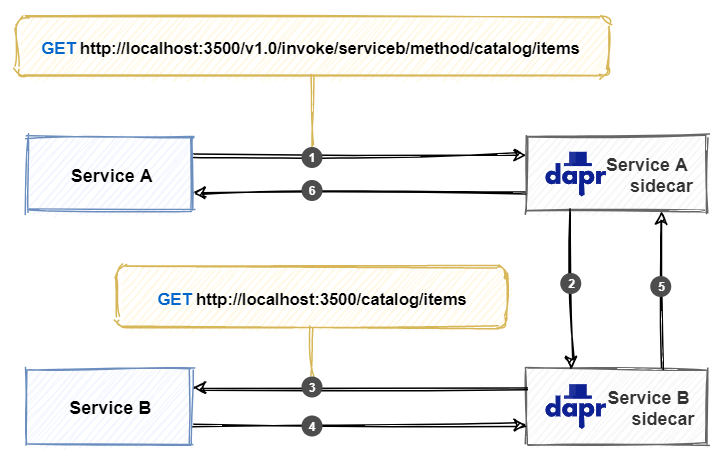
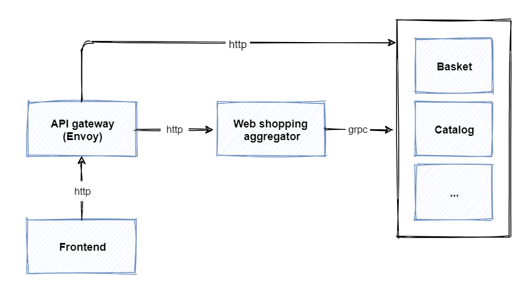
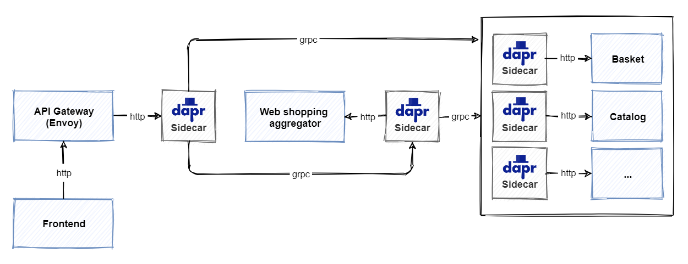
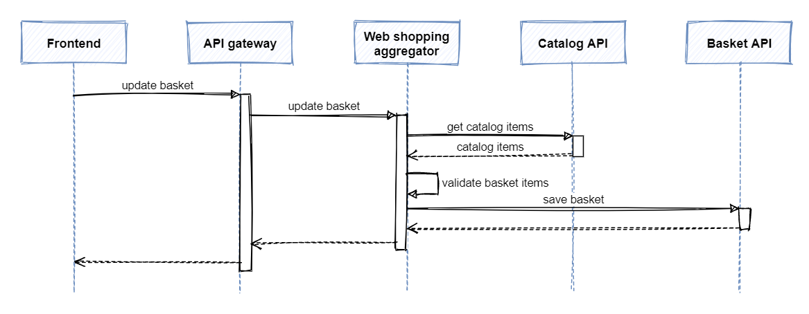

# The Dapr service invocation building block

Across a distributed system, one service often needs to communicate with another to complete a business operation. The [Dapr service invocation building block](https://docs.dapr.io/developing-applications/building-blocks/service-invocation/service-invocation-overview/) can help streamline the communication between services.

## What it solves

Making calls between services in a distributed application may appear easy, but there are many challenges involved. For example:

- Where the other services are located.
- How to call a service securely, given the service address.
- How to handle retries when short-lived [transient errors](/aspnet/aspnet/overview/developing-apps-with-windows-azure/building-real-world-cloud-apps-with-windows-azure/transient-fault-handling) occur.

Lastly, as distributed applications compose many different services, capturing insights across service call graphs are critical to diagnosing production issues.

The service invocation building block addresses these challenges by using a Dapr sidecar as a [reverse proxy](https://kemptechnologies.com/reverse-proxy/reverse-proxy/) for your service.

## How it works

Let's start with an example. Consider two services, "Service A" and "Service B". Service A needs to call the `catalog/items` API on Service B. While Service A could take a dependency on Service B and make a direct call to it, Service A instead invokes the service invocation API on the Dapr sidecar. Figure 6-1 shows the operation.



**Figure 6-1**. How Dapr service invocation works.

Note the steps from the previous figure:

1. Service A makes a call to the `catalog/items` endpoint in Service B by invoking the service invocation API on the Service A sidecar.

    > [!NOTE]
    > The sidecar uses a pluggable name resolution mechanism to resolve the address of Service B. In self-hosted mode, Dapr uses [mDNS](https://www.ionos.com/digitalguide/server/know-how/multicast-dns/) to find it. When running in Kubernetes mode, the Kubernetes DNS service determines the address.  

1. The Service A sidecar forwards the request to the Service B sidecar.

1. The Service B sidecar makes the actual `catalog/items` request against the Service B API.

1. Service B executes the request and returns a response back to its sidecar.

1. The Service B sidecar forwards the response back to the Service A sidecar.

1. The Service A sidecar returns the response back to Service A.

Because the calls flow through sidecars, Dapr can inject some useful cross-cutting behaviors:

- Automatically retry calls upon failure.
- Make calls between services secure with mutual (mTLS) authentication, including automatic certificate rollover.
- Control what operations clients can do using access control policies.
- Capture traces and metrics for all calls between services to provide insights and diagnostics.

Any application can invoke a Dapr sidecar by using the native **invoke** API built into Dapr. The API can be called with either HTTP or gRPC. Use the following URL to call the HTTP API:

``` http
http://localhost:<dapr-port>/v1.0/invoke/<application-id>/method/<method-name>
```

- `<dapr-port>` the HTTP port that Dapr is listening on.
- `<application-id>` application ID of the service to call.
- `<method-name>` name of the method to invoke on the remote service.

In the following example, a *curl* call is made to the `catalog/items` 'GET' endpoint of `Service B`:

```console
curl http://localhost:3500/v1.0/invoke/serviceb/method/catalog/items
```

> [!NOTE]
> The Dapr APIs enable any application stack that supports HTTP or gRPC to use Dapr building blocks. Therefore, the service invocation building block can act as a bridge between protocols. Services can communicate with each other using HTTP, gRPC or a combination of both.

In the next section, you'll learn how to use the .NET SDK to simplify service invocation calls.

## Use the Dapr .NET SDK

The Dapr [.NET SDK](https://github.com/dapr/dotnet-sdk) provides .NET developers with an intuitive and language-specific way to interact with Dapr. The SDK offers developers three ways of making remote service invocation calls:

1. Invoke HTTP services using HttpClient
1. Invoke HTTP services using DaprClient
1. Invoke gRPC services using DaprClient

### Invoke HTTP services using HttpClient

The preferred way to call an HTTP endpoint is to use Dapr's rich integration with `HttpClient`. The following example submits an order by calling the `submit` method of the `orderservice` application:

```csharp
var httpClient = DaprClient.CreateInvokeHttpClient();
await httpClient.PostAsJsonAsync("http://orderservice/submit", order);
```

In the example, `DaprClient.CreateInvokeHttpClient` returns an `HttpClient` instance that is used to perform Dapr service invocation. The returned `HttpClient` uses a special Dapr message handler that rewrites URIs of outgoing requests. The host name is interpreted as the application ID of the service to call. The rewritten request that's actually being called is:

```http
http://127.0.0.1:3500/v1/invoke/orderservice/method/submit
```

This example uses the default value for the Dapr HTTP endpoint, which is `http://127.0.0.1:<dapr-http-port>/`. The value of `dapr-http-port` is taken from the `DAPR_HTTP_PORT` environment variable. If it's not set, the default port number `3500` is used.

Alternatively, you can configure a custom endpoint in the call to `DaprClient.CreateInvokeHttpClient`:

```csharp
var httpClient = DaprClient.CreateInvokeHttpClient(daprEndpoint = "localhost:4000");
```

You can also directly set the base address by specifying the application ID. This makes it possible to use relative URIs when making a call:

```csharp
var httpClient = DaprClient.CreateInvokeHttpClient("orderservice");
await httpClient.PostAsJsonAsync("/submit");
```

The `HttpClient` object is intended to be long-lived. A single `HttpClient` instance can be reused for the lifetime of the application. The next scenario demonstrates how an `OrderServiceClient` class reuses a Dapr `HttpClient` instance:  

```csharp
public void ConfigureServices(IServiceCollection services)
{
    // ...
    services.AddSingleton<IOrderServiceClient, OrderServiceClient>(
        _ => new OrderServiceClient(DaprClient.CreateInvokeHttpClient("orderservice")));
}
```

In the snippet above, the `OrderServiceClient` is registered as a singleton with the ASP.NET Core dependency injection system. An implementation factory creates a new `HttpClient` instance by calling `DaprClient.CreateInvokeHttpClient`. It then uses the newly created `HttpClient` to instantiate the `OrderServiceClient` object. By registering the `OrderServiceClient` as a singleton, it will be reused for the lifetime of the application.

The `OrderServiceClient` itself has no Dapr-specific code. Even though Dapr service invocation is used under the hood, you can treat the Dapr HttpClient like any other HttpClient:

```csharp
public class OrderServiceClient : IOrderServiceClient
{
    private readonly HttpClient _httpClient;

    public OrderServiceClient(HttpClient httpClient)
    {
        _httpClient = httpClient ?? throw new ArgumentNullException(nameof(httpClient));
    }

    public async Task SubmitOrder(Order order)
    {
        var response = await _httpClient.PostAsJsonAsync("submit", order);
        response.EnsureSuccessStatusCode();
    }
}
```

Using the HttpClient class with Dapr service invocation has many benefits:

- HttpClient is a well-known class that many developers already use in their code. Using HttpClient for Dapr service invocation allows developers to reuse their existing skills.
- HttpClient supports advanced scenarios, such as custom headers, and full control over request and response messages.
- In .NET 5, HttpClient supports automatic serialization and deserialization using System.Text.Json.
- HttpClient integrates with many existing frameworks and libraries, such as [Refit](https://github.com/reactiveui/refit), [RestSharp](https://restsharp.dev/getting-started/getting-started.html#basic-usage), and [Polly](https://github.com/App-vNext/Polly).

### Invoke HTTP services using DaprClient

While HttpClient is the preferred way to invoke services using HTTP semantics, you can also use the `DaprClient.InvokeMethodAsync` family of methods. The following example submits an order by calling the `submit` method of the `orderservice` application:

``` csharp
var daprClient = new DaprClientBuilder().Build();
try
{
    var confirmation =
        await daprClient.InvokeMethodAsync<Order, OrderConfirmation>(
            "orderservice", "submit", order);
}
catch (InvocationException ex)
{
    // Handle error
}
```

The third argument, an `order` object, is serialized internally (with `System.Text.JsonSerializer`) and sent as the request payload. The .NET SDK takes care of the call to the sidecar. It also deserializes the response to an `OrderConfirmation` object. Because no HTTP method is specified, the request is executed as an HTTP POST.

The next example demonstrates how you can make an HTTP GET request by specifying the `HttpMethod`:

```csharp
var catalogItems = await daprClient.InvokeMethodAsync<IEnumerable<CatalogItem>>(HttpMethod.Get, "catalogservice", "items");
```

For some scenarios, you may require more control over the request message. For example, when you need to specify request headers, or you want to use a custom serializer for the payload. `DaprClient.CreateInvokeMethodRequest` creates an `HttpRequestMessage`. The following example demonstrates how to add an HTTP authorization header to a request message:

```csharp
var request = daprClient.CreateInvokeMethodRequest("orderservice", "submit", order);
request.Headers.Authorization = new AuthenticationHeaderValue("bearer", token);
```

The `HttpRequestMessage` now has the following properties set:

- Url = `http://127.0.0.1:3500/v1.0/invoke/orderservice/method/submit`
- HttpMethod = POST
- Content =  `JsonContent` object containing the JSON-serialized `order`
- Headers.Authorization = "bearer \<token>"

Once you've got the request set up the way you want, use `DaprClient.InvokeMethodAsync` to send it:

```csharp
var orderConfirmation = await daprClient.InvokeMethodAsync<OrderConfirmation>(request);
```

`DaprClient.InvokeMethodAsync` deserializes the response to an `OrderConfirmation` object if the request is successful. Alternatively, you can use `DaprClient.InvokeMethodWithResponseAsync` to get full access to the underlying `HttpResponseMessage`:

```csharp
var response = await daprClient.InvokeMethodWithResponseAsync(request);
response.EnsureSuccessStatusCode();

var orderConfirmation = response.Content.ReadFromJsonAsync<OrderConfirmation>();
```

> [!NOTE]
> For service invocation calls using HTTP, it's worth considering using the Dapr HttpClient integration presented in the previous section. Using HttpClient gives you additional benefits such as integration with existing frameworks and libraries.

### Invoke gRPC services using DaprClient

DaprClient provides a family of `InvokeMethodGrpcAsync` methods for calling gRPC endpoints. The main difference with the HTTP methods is the use of a Protobuf serializer instead of JSON. The following example invokes the `submitOrder` method of the `orderservice` over gRPC.

```csharp
var daprClient = new DaprClientBuilder().Build();
try
{
    var confirmation = await daprClient.InvokeMethodGrpcAsync<Order, OrderConfirmation>("orderservice", "submitOrder", order);
}
catch (InvocationException ex)
{
    // Handle error
}
```

In the example above, DaprClient serializes the given `order` object using [Protobuf](https://developers.google.com/protocol-buffers) and uses the result as the gRPC request body. Likewise, the response body is Protobuf deserialized and returned to the caller. Protobuf typically provides better performance than the JSON payloads used in HTTP service invocation.

## Reference application: eShopOnDapr

The original [eShopOnContainers](https://github.com/dotnet-architecture/eShopOnContainers) microservice reference architecture from Microsoft used a mix of HTTP/REST and gRPC services. The use of gRPC was limited to communication between an [aggregator service](../cloud-native/service-to-service-communication.md#service-aggregator-pattern) and core back-end services. Figure 6-2 show the architecture:



**Figure 6-2**. gRPC and HTTP/REST calls in eShopOnContainers.

Note the steps from the previous figure:

1. The front end calls the [API gateway](/azure/architecture/microservices/design/gateway) using HTTP/REST.

1. The API gateway forwards simple [CRUD](https://www.sumologic.com/glossary/crud/) (Create, Read, Update, Delete) requests directly to a core back-end service using HTTP/REST.

1. The API gateway forwards complex requests that involve coordinated calls to multiple back-end services to the web shopping aggregator service.

1. The aggregator service uses gRPC to call core back-end services.

In the recently updated eShopOnDapr implementation, Dapr sidecars are added to the services and API gateway. Figure 6-3 show the updated architecture:



**Figure 6-3**. Updated eShop architecture using Dapr.

Note the updated steps from the previous figure:

1. The front end still uses HTTP/REST to call the API gateway.

1. The API gateway forwards HTTP requests to its Dapr sidecar.

1. The API gateway sidecar sends the request to the sidecar of the aggregator or back-end service.

1. The aggregator service uses the Dapr .NET SDK to call back-end services through their sidecar architecture.

Dapr implements calls between sidecars with gRPC. So even if you're invoking a remote service with HTTP/REST semantics, a part of the transport is still implemented using gRPC.

The eShopOnDapr reference application benefits from the Dapr service invocation building block. The benefits include service discovery, automatic mTLS, and observability.

### Forward HTTP requests using Envoy and Dapr

Both the original and updated eShop application leverage the [Envoy proxy](https://www.envoyproxy.io/) as an API gateway. Envoy is an open-source proxy and communication bus that is popular across modern distributed applications. Originating from Lyft, Envoy is owned and maintained by the [Cloud-Native Computing Foundation](https://www.cncf.io/).

In the original eShopOnContainers implementation, the Envoy API gateway forwarded incoming HTTP requests directly to aggregator or back-end services. In the new eShopOnDapr, the Envoy proxy forwards the request to a Dapr sidecar. The sidecar provides service invocation, mTLS, and observability.

Envoy is configured using a YAML definition file to control the proxy's behavior. To enable Envoy to forward HTTP requests to a Dapr sidecar container, a `dapr` cluster is added to the configuration. The cluster configuration contains a host that points to the HTTP port on which the Dapr sidecar is listening:

``` yaml
clusters:
- name: dapr
  connect_timeout: 0.25s
  type: strict_dns
  hosts:
  - socket_address:
    address: 127.0.0.1
    port_value: 3500
```

The Envoy routes configuration is updated to rewrite incoming requests as calls to the Dapr sidecar (pay close attention to the `prefix_rewrite` key/value pair):

``` yaml
- name: "c-short"
  match:
    prefix: "/c/"
  route:
    auto_host_rewrite: true
    prefix_rewrite: "/v1.0/invoke/catalog-api/method/"
    cluster: dapr
```

Consider a scenario where the front-end client wants to retrieve a list of catalog items. The Catalog API provides an endpoint for getting the catalog items:

``` csharp
[Route("api/v1/[controller]")]
[ApiController]
public class CatalogController : ControllerBase
{
    [HttpGet("items")]
    public async Task<IActionResult> ItemsAsync(
        [FromQuery] int pageSize = 10,
        [FromQuery] int pageIndex = 0)
    {
        // ...
    }
```

First, the front end makes a direct HTTP call to the Envoy API gateway.

```
GET http://<api-gateway>/c/api/v1/catalog/items?pageSize=20
```

The Envoy proxy matches the route, rewrites the HTTP request, and forwards it to the `invoke` API of its Dapr sidecar:

```
GET http://127.0.0.1:3500/v1.0/invoke/catalog-api/method/api/v1/catalog/items?pageSize=20
```

The sidecar handles service discovery and routes the request to the Catalog API sidecar. Finally, the sidecar calls the Catalog API to execute the request, fetch catalog items, and return a response:

```
GET http://localhost/api/v1/catalog/items?pageSize=20
```

### Make aggregated service calls using the .NET SDK

Most calls from the eShop front end are simple CRUD calls. The API gateway forwards them to a single service for processing. Some scenarios, however, require multiple back-end services to work together to complete a request. For these more complex calls, eShop uses the web shopping aggregator service to mediate the workflow across multiple services. Figure 6-4 show the processing sequence of adding an item to your shopping basket:



**Figure 6-4**. Update shopping basket sequence.

The aggregator service first retrieves catalog items from the Catalog API. It then validates item availability and pricing. Finally, the aggregator service saves the updated shopping basket by calling the Basket API.

The aggregator service contains a `BasketController` that provides an endpoint for updating the shopping basket:

``` csharp
[Route("api/v1/[controller]")]
[Authorize]
[ApiController]
public class BasketController : ControllerBase
{
    private readonly ICatalogService _catalog;
    private readonly IBasketService _basket;

    [HttpPost]
    [HttpPut]
    public async Task<ActionResult<BasketData>> UpdateAllBasketAsync(
        [FromBody] UpdateBasketRequest data, [FromHeader] string authorization)
    {
        // Get the item details from the catalog API.
        var catalogItems = await _catalog.GetCatalogItemsAsync(
            data.Items.Select(x => x.ProductId));

        // Check item availability and prices; store results in basket object.
        var basket = CreateValidatedBasket(data, catalogItems);

        // Save the shopping basket.
        await _basket.UpdateAsync(basket, authorization);

        return basket;
    }

    // ...
}
```

The `UpdateAllBasketAsync` method gets the *Authorization* header of the incoming request using a `FromHeader` attribute. The *Authorization* header contains the access token that is needed to call protected back-end services.

After receiving a request to update the basket, the aggregator service calls the Catalog API to get the item details. The Basket controller uses an injected `ICatalogService` object to make that call and communicate with the Catalog API. The original implementation of the interface used gRPC to make the call. The updated implementation uses Dapr service invocation with HttpClient support:

``` csharp
public class CatalogService : ICatalogService
{
    private readonly HttpClient _httpClient;

    public CatalogService(HttpClient httpClient)
    {
        _httpClient = httpClient ?? throw new ArgumentNullException(nameof(httpClient));
    }

    public Task<IEnumerable<CatalogItem>> GetCatalogItemsAsync(IEnumerable<int> ids)
    {
        var requestUri = $"api/v1/catalog/items?ids={string.Join(",", ids)}";

        return _httpClient.GetFromJsonAsync<IEnumerable<CatalogItem>>(requestUri);
    }

    // ...
}
```

Notice how no Dapr specific code is required to make the service invocation call. All communication is done using the standard HttpClient object.

The Dapr HttpClient is injected into the `CatalogService` class in the `Startup.ConfigureServices` method:

```csharp
services.AddSingleton<ICatalogService, CatalogService>(
    _ => new CatalogService(DaprClient.CreateInvokeHttpClient("catalog-api")));
```

The other call made by the aggregator service is to the Basket API. It only allows authorized requests. The access token is passed along in an *Authorization* request header to ensure the call succeeds:

``` csharp
public class BasketService : IBasketService
{
    public Task UpdateAsync(BasketData currentBasket, string accessToken)
    {
        var request = new HttpRequestMessage(HttpMethod.Post, "api/v1/basket")
        {
            Content = JsonContent.Create(currentBasket)
        };
        request.Headers.Authorization = new AuthenticationHeaderValue(accessToken);

        var response = await _httpClient.SendAsync(request);
        response.EnsureSuccessStatusCode();
    }

    // ...
}
```

In this example too, only standard HttpClient functionality is used to call the service. This allows developers who are already familiar with HttpClient to reuse their existing skills. It even enables existing HttpClient code to use Dapr service invocation without making any changes.

## Summary

In this chapter, you learned about the service invocation building block. You saw how to invoke remote methods both by making direct HTTP calls to the Dapr sidecar, and by using the Dapr .NET SDK.

The Dapr .NET SDK provides multiple ways to invoke remote methods. HttpClient support is great for developers wanting to reuse existing skills and is compatible with many existing frameworks and libraries. DaprClient offers support for directly using the Dapr service invocation API using either HTTP or gRPC semantics.

The eShopOnDapr reference architecture shows how the original eShopOnContainers solution is modernized by using Dapr service invocation. Adding Dapr to eShop provides benefits such as automatic retries, message encryption using mTLS, and improved observability.

### References

- [Dapr service invocation building block](https://docs.dapr.io/developing-applications/building-blocks/service-invocation/)

- [Monitoring distributed cloud-native applications](../cloud-native/observability-patterns.md)

> [!div class="step-by-step"]
> [Previous](state-management.md)
> [Next](publish-subscribe.md)
