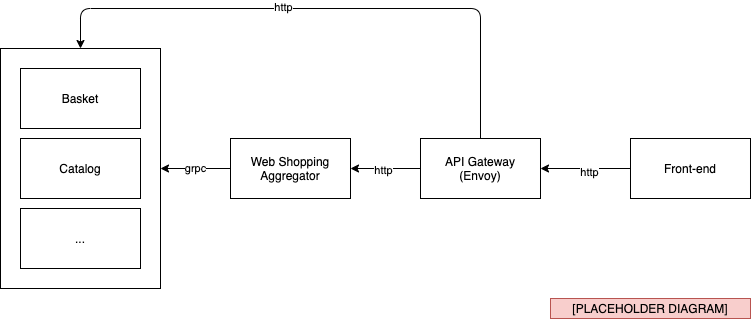
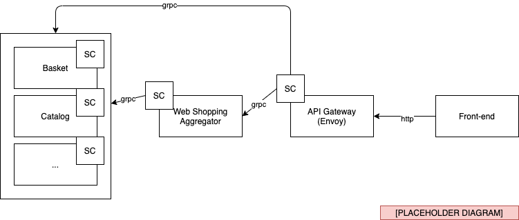
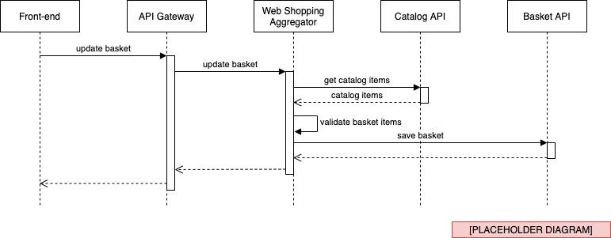

# The service invocation building block

Across a distributed system, one service often needs to communicate with another to complete a business operation. The [Dapr service invocation building block](https://docs.dapr.io/developing-applications/building-blocks/service-invocation/service-invocation-overview/) can help streamline the communication between services.

## What it solves

Making calls between services in a distributed application may appear easy, but there are many challenges involved. For example:

- Where the other services are located.
- How to call a service securely, given the service address.
- How to handle service call failure.
- How to handle retries when short-lived [transient errors](https://docs.microsoft.com/aspnet/aspnet/overview/developing-apps-with-windows-azure/building-real-world-cloud-apps-with-windows-azure/transient-fault-handling) occur.

Lastly, as distributed applications compose many different services, capturing insights across service call graphs are critical to diagnosing production issues.

The Dapr service invocation building block addresses these challenges by using a Dapr sidecar as a [reverse proxy](https://kemptechnologies.com/reverse-proxy/reverse-proxy/) for your service.

## How it works

Let's start with an example. Consider two services, "Service A" and "Service B". Service A needs to call the `catalog/items` API on Service B. While Service A could take a dependency on Service B and make a direct call to it, Service A instead invokes the service invocation API on the Dapr sidecar. Figure 6-1 shows the operation.


**Figure 6-1**. How Dapr service invocation works.

Note the steps from the previous figure:

1. Service A makes a call to the `catalog/items` endpoint in Service B by invoking the service invocation API on the Service A sidecar.

    > [!NOTE]
    > The sidecar uses a pluggable name resolution mechanism to resolve the address of Service B. In self-hosted mode, Dapr uses [mDNS](https://www.ionos.com/digitalguide/server/know-how/multicast-dns/) to find it. When running in Kubernetes mode, the Kubernetes DNS service determines the address.  

2. The Service A sidecar forwards the request to the Service B sidecar.

3. The Service B sidecar makes the actual `catalog/items` request against the Service B API.

4. Service B executes the request and returns a response back to its sidecar.

5. The Service B sidecar forwards the response back to the Service A sidecar.

6. The Service A sidecar returns the response back to Service A.

Because the calls flow through sidecars, Dapr can inject some useful cross-cutting behaviors:

- Automatically retry calls upon failure.
- Make calls between services secure with mutual (mTLS) authentication, including automatic certificate rollover.
- Control what operations clients can do using access control policies.
- Capture traces and metrics for all calls between services to provide insights and diagnostics.

Any application can invoke a Dapr sidecar by using the native **invoke** API built into Dapr:

``` http
http://localhost:<daprPort>/v1.0/invoke/<applicationid>/method/<methodname>
```

> [!IMPORTANT]
> The Dapr native APIs enable any application stack that supports HTTP or gRPC to use Dapr building blocks.

In the following example, a *curl* call is made to the `catalog/items` 'GET' endpoint of `Service B`:

``` curl
curl http://localhost:3500/v1.0/invoke/serviceb/method/catalog/items
```

In the next section, you'll learn how to use the .NET SDK to simplify service invocation calls.

### Using the .NET SDK

The Dapr [.NET SDK](https://github.com/dapr/dotnet-sdk) provides .NET developers with an intuitive and language-specific way to interact with Dapr. The .NET `DaprClient` class can be used for most interactions.

Calling `DaprClient.InvokeMethodAsync` invokes a method on a remote service. The following example submits an order by calling the `order/submit` method of the `orderservice` application:

``` csharp
var result = await daprClient.InvokeMethodAsync<Order, SubmitOrderResult>(
    "orderservice", "order/submit", order);
```

The third argument, an `order` object, is serialized internally (with `System.Text.JsonSerializer`) and sent as the request payload. The .NET SDK takes care of the call to the sidecar. It also deserializes the response to a `SubmitOrderResult` object.

You can also use `InvokeMethodWithResponseAsync` or `InvokeMethodRawAsync` to invoke a remote method. These specialized methods provide you with direct access to response headers and raw response bytes, respectively.

With the Dapr .NET SDK, your service can call another service via HTTP/REST or gRPC. For HTTP-based services, the `HttpInvocationOptions` class provides access to common HTTP properties:

- Method: The HTTP method  to use, such as `Post`, `Get` or `Put`. The default value is `Post`.
- ContentType: The content-type of the HTTP request, such as `application/json`.
- QueryString: A collection of query string parameters.
- Headers: A collection of HTTP request headers.

As an example, consider a call to the following HTTP endpoint:

``` http
http://<serviceb-address>/catalog/items?pagesize=10
```

Using the `HttpInvocationOptions` class, you can configure the segments of the HTTP request with a strongly typed C# class:

``` csharp
var result = await daprClient.InvokeMethodAsync<IEnumerable<CatalogItem>>(
    "serviceb",
    "catalog/items",
    new HttpInvocationOptions
    {
        Method = HttpMethod.Get,
        QueryString = new Dictionary<string, string>
        {
            ["pagesize"] = "10"
        }
    });
```

## Reference case: eShopOnDapr

The original [eShopOnContainers](https://github.com/dotnet-architecture/eShopOnContainers) microservice reference architecture from Microsoft used a mix of HTTP/REST and gRPC services. The use of gRPC was limited to communication between an [aggregator service](https://docs.microsoft.com/dotnet/architecture/cloud-native/service-to-service-communication#service-aggregator-pattern) and core back-end services. Figure 6-2 show the architecture:



**Figure 6-2**. gRPC and HTTP/REST calls in eShopOnContainers.

Note the steps from the previous figure:

1. The front-end calls the [API Gateway](https://docs.microsoft.com/azure/architecture/microservices/design/gateway) using HTTP/REST.

2. The API Gateway forwards simple [CRUD](https://www.sumologic.com/glossary/crud/) (Create, Read, Update, Delete) requests directly to a core back-end service using HTTP/REST.

3. The API Gateway forwards complex requests that involve coordinated calls to multiple back-end services to the Web Shopping Aggregator service.

4. The aggregator service uses gRPC to call core back-end services.

In the recently updated eShopOnDapr implementation, Dapr sidecars are added to the services and API Gateway. Figure 6-3 show the updated architecture:



**Figure 6-3**. Updated eShop architecture using Dapr.

Note the updated steps from the previous figure:

1. The front-end still uses HTTP/REST to call the API Gateway.

2. The API Gateway forwards HTTP requests to its Dapr sidecar.

3. The API Gateway sidecar sends the request to the sidecar of the aggregator or back-end service.

4. The aggregator service uses the Dapr .NET SDK to call back-end services through their sidecar architecture.

Dapr implements calls between sidecars with gRPC. So even if you're invoking a remote service with HTTP/REST, you still get [gRPC performance benefits](https://docs.microsoft.com/dotnet/architecture/cloud-native/grpc#grpc-benefits) for calls between sidecars. Architecturally speaking, calls between sidecars have the highest opportunity for system performance gain. In real-world scenarios, sidecars often are located on different machines.

> [!NOTE]
> The service invocation building block acts as a bridge between protocols. Calls to and from the sidecars support gRPC or HTTP protocols. Therefore, services can communicate with each other using HTTP, gRPC or a combination of both.

The eShopOnDapr reference application benefits from the Dapr service invocation building block. The features include service discovery, automatic mTLS, and observability.

### Forward HTTP requests using Envoy and Dapr

Both the original and updated eShop application leverage the [Envoy proxy](https://www.envoyproxy.io/) as an API Gateway. Envoy is an open-source proxy and communication bus that is popular across modern distributed applications. Originating from Lyft, Envoy is owned and maintained by the [Cloud-Native Computing Foundation](https://www.cncf.io/).

In the original eShopOnContainers implementation, the Envoy API gateway forwarded incoming HTTP requests directly to aggregator or back-end services. In the new eShopOnDapr, the Envoy proxy forwards the request to a Dapr sidecar. The sidecar provides service invocation, mTLS, and observability.

Envoy is configured using a YAML definition file to control the proxy's behavior. To enable Envoy to forward HTTP requests to a Dapr sidecar container, a `dapr` cluster is added to the configuration. The cluster configuration contains a host that points to the HTTP port on which the Dapr sidecar is listening:

``` yaml
clusters:
- name: dapr
  connect_timeout: 0.25s
  type: strict_dns
  hosts:
  - socket_address:
    address: 127.0.0.1
    port_value: 3500
```

The Envoy routes configuration is updated to rewrite incoming requests as calls to the Dapr sidecar (pay close attention to the `prefix_rewrite` key-value pair):

``` yaml
- name: "c-short"
  match:
    prefix: "/c/"
  route:
    auto_host_rewrite: true
    prefix_rewrite: "/v1.0/invoke/catalog-api/method/"
    cluster: dapr
```

Consider a scenario where the front-end client wants to retrieve a list of catalog items. The Catalog API provides an endpoint for getting the catalog items:

``` csharp
[Route("api/v1/[controller]")]
[ApiController]
public class CatalogController : ControllerBase
{
    [HttpGet("items")]
    public async Task<IActionResult> ItemsAsync(
        [FromQuery] int pageSize = 10,
        [FromQuery] int pageIndex = 0)
    {
        // ...
    }
```

First, the front end makes a direct HTTP call to the Envoy API gateway.

```
GET http://<api-gateway>/c/api/v1/catalog/items?pageSize=20
```

The Envoy proxy matches the route, rewrites the HTTP request, and forwards it to the `invoke` API of its Dapr sidecar:

```
GET http://127.0.0.1:3500/v1.0/invoke/catalog-api/method/api/v1/catalog/items?pageSize=20
```

The sidecar handles service discovery and routes the request to the Catalog API sidecar. Finally, the sidecar calls the Catalog API to execute the request, fetch catalog items, and return a response:

```
GET http://localhost/api/v1/catalog/items?pageSize=20
```

### Make aggregated service calls using the .NET SDK

Most calls from the eShop front-end are simple CRUD calls. The API gateway forwards them to a single service for processing. Some scenarios, however, require multiple back-end services to work together to complete a request. For these more complex calls, eShop uses the Web Shopping Aggregator service to mediate the workflow across multiple services. Figure 6-4 show the processing sequence of adding an item to your shopping basket:



**Figure 6-4**. Update shopping basket sequence.

The aggregator service first retrieves catalog items from the Catalog API. It then validates items availability and pricing. Finally, the aggregator service saves the updated shopping basket by calling the Basket API.

The aggregator service contains a `BasketController` that provides an endpoint for updating the shopping basket:

``` csharp
[Route("api/v1/[controller]")]
[Authorize]
[ApiController]
public class BasketController : ControllerBase
{
    private readonly ICatalogService _catalog;
    private readonly IBasketService _basket;

    [HttpPost]
    [HttpPut]
    public async Task<ActionResult<BasketData>> UpdateAllBasketAsync(
        [FromBody] UpdateBasketRequest data, [FromHeader] string authorization)
    {
        // Get the item details from the catalog API.
        var catalogItems = await _catalog.GetCatalogItemsAsync(
            data.Items.Select(x => x.ProductId));

        // Check item availability and prices; store results in basket object.
        var basket = CreateValidatedBasket(data, catalogItems);

        // Save the shopping basket.
        await _basket.UpdateAsync(basket, authorization);

        return basket;
    }

    // ...
}
```

The `UpdateAllBasketAsync` method gets the *Authorization* header of the incoming request using a `FromHeader` attribute. The *Authorization* header contains the access token that is needed to call protected back-end services.

After receiving a request to update the basket, the aggregator service calls the Catalog API to get the item details. The Basket controller uses an injected `ICatalogService` object to make that call and communicate with the Catalog API. The original implementation of the interface used gRPC to make the call. The implementation was changed to use Dapr service invocation:

``` csharp
public class CatalogService : ICatalogService
{
    private const string DaprAppId = "catalog-api";

    private readonly DaprClient _daprClient;

    public CatalogService(DaprClient daprClient)
    {
        _daprClient = daprClient;
    }

    public async Task<IEnumerable<CatalogItem>> GetCatalogItemsAsync(
        IEnumerable<int> ids)
    {
        return await _daprClient.InvokeMethodAsync<IEnumerable<CatalogItem>>(
            DaprAppId,
            "api/v1/catalog/items",
            new HttpInvocationOptions
            { 
                Method = HttpMethod.Get,
                QueryString = new Dictionary<string, string>
                {
                    ["ids"] = string.Join(",", ids)
                }
            });
    }

    // ...
}
```

The `HttpInvocationOptions` object is used to pass the query string and HTTP verb details to the Catalog API.

The other call made by the aggregator service is to the Basket API. It only allows authorized requests. The access token is passed along in an *Authorization* request header to ensure the call succeeds:

``` csharp
public class BasketService : IBasketService
{
    private const string DaprAppId = "basket-api";

    public Task UpdateAsync(BasketData currentBasket, string accessToken)
    {
        return _daprClient.InvokeMethodAsync(
            DaprAppId,
            "api/v1/basket",
            currentBasket,
            new HttpInvocationOptions
            {
                Headers = new Dictionary<string, string>
                {
                    [HeaderNames.Authorization] = accessToken
                }
            });
    }

    // ...
}
```

There is no need to explicitly specify the HTTP method for this POST call as `Post` is the default value of `HttpInvocationOptions.Method`.

## Summary

In this chapter, you learned about the service invocation building block. You saw how to invoke remote methods both by making direct HTTP calls to the Dapr sidecar, and by using the Dapr .NET SDK.

The eShopOnDapr reference architecture shows how the original eShopOnContainers solution is modernized by using Dapr service invocation. Adding Dapr to eShop provides benefits such as automatic retries, message encryption using mTLS, and improved observability.

### References

- [Dapr service invocation building block](https://docs.dapr.io/developing-applications/building-blocks/service-invocation/)

- [Monitoring distributed cloud-native applications](https://docs.microsoft.com/en-us/dotnet/architecture/cloud-native/observability-patterns)

>[!div class=“step-by-step”]
>[Previous](~index.md~)
>[Next](~index.md~)
