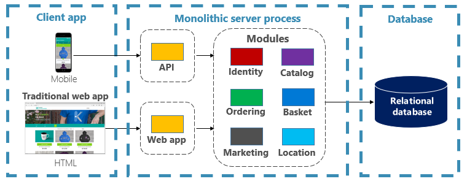
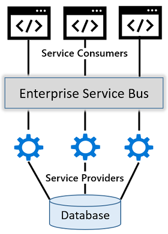

# The world is distributed

Just ask any 'cool kid': *Modern, distributed systems are in, and monolithic apps are out!* 

But, it's not just "cool kids." Progressive IT Leaders, corporate architects, and astute developers are echoing these same thoughts as they explore and evaluate modern distributed applications. Many have bought in. They're designing new and replatforming existing enterprise applications following the principles, patterns, and practices of distributed microservice applications.

But, this evolution raises many questions...

- What exactly is a distributed application?
- Why are they gaining popularity?
- What are the costs?
- And, importantly, what are the tradeoffs?

To start, let's rewind and look at the past 15 years. During this period, we typically constructed applications as a single, monolithic unit. Figure 1-1 shows the architecture.

**Figure 1-1. Monolithic architecture.

Note how the modules for Ordering, Identity, and Marketing execute in a single-server process. Application data is stored in a shared database. Business functionality is exposed via HTML and RESTful interfaces.

In many ways, monolithic apps are `straightforward`. They're straightforward to...

 - build
 - test
 - deploy
 - troubleshoot
 - scale vertically (scale up)

However, monolithic architectures can present significant challenges. 

Over time, you may reach a point where you begin to lose control... 

 - The monolith has become so overwhelmingly complicated that no single person understands it.
 - You fear making changes as each brings unintended and costly side effects.
 - New features/fixes become time-consuming and expensive to implement. 
 - Even the smallest change requires a full deployment of the entire application - expensive and risky. 
 - One unstable component can crash the entire system.
 - Adding new technologies and frameworks aren't an option.
 - Implementing agile delivery methodologies are difficult.
 - Architectural erosion sets in as the code base deteriorates with never-ending "special cases."
 - Eventually the consultants come in and tell you to rewrite it.

IT practitioners call this condition `the Fear Cycle`. If you've been in the technology business for any length of time, good chance you've experienced it. It's stressful and exhausts your IT budget. Instead of building new and innovative solutions, the majority of your budget is spent maintaining legacy apps.

Instead of fear, businesses require `speed and agility`. They seek an architectural style with which they can rapidly respond to market conditions. They need to instantaneously update and individually scale small areas of a live application.

An early attempt to gain speed and agility came in the form of [Service Oriented Architecture](https://en.wikipedia.org/wiki/Service-oriented_architecture), or `SOA`. In this model, service consumers and service providers collaborated via middleware messaging components, often referred to as an [Enterprise Service Bus](https://en.wikipedia.org/wiki/Enterprise_service_bus), or `ESB`. Figure 1-2 shows the architecture.

**Figure 1-2. SOA architecture.

With SOA, centralized service providers registered with the ESB. Business logic would be built into the ESB to integrate providers and consumers. Service consumers could then find and communicate with these providers using the ESB. 

Despite the promises of SOA, implementing this approach often increased complexity and introduced bottlenecks. Maintenance costs became high and ESB middleware expensive. Services tended to be large. They often shared dependencies and data storage. In the end, SOAs often resulted in a 'distributed monolithic' structure with centralized services that were resistant to change. 

Nowadays, many organizations have realized speed and agility by adopting a distributed microservice architectural approach to building systems. Figure 1-3 shows the same system built using distributed techniques and practices.

**Figure 1-3. Distributed architecture.

Note how the same application is decomposed across a set of distributed services. Each is self-contained and encapsulates its own code, data, and dependencies. Each is deployed in a software container and managed by a container orchestrator. Instead of a single database shared by multiple services, each service owns a private database. Other services cannot access this database directly and can only get to data that is exposed through the public API of the service that owns it. Note how some services require a full relational database, but others, a NoSQL datastore. The Basket service stores its state in a distributed key-value cache. Note how inbound traffic routes through an API Gateway service. It's responsible for directing calls to back-end services and enforcing cross-cutting concerns. Most importantly, the application takes full advantage of the scalability, availability, and resiliency features found in modern cloud platforms.

But, while distributed services can provide agility and speed, they present a different set of challenges. Consider the following... 

 - How can distributed services discover each other and communicate synchronously?
 - How can they implement asynchronous messaging? 
 - How can they maintain contextual information across a transaction?
 - How can they become resilient to failure?
 - How can they scale to meet fluctuating demand?
 - How are they monitored and observed?
 
For each of these challenges, multiple products are often available. But, shielding your application from product differences and keeping code maintainable and portable become a challenge.

This book introduces Dapr. Dapr is a distributed application runtime. It directly addresses many of the challenges found that come along with distributed applications. Looking ahead, Dapr has the potential to have profound impact on distributed application development.

## Summary

In this chapter, we discussed the adoption of distributed applications. We contrasted a monolithic system approach with that of distributed services. We pointed out many of the common challenges when considering a distributed approach. 

Now, sit back, relax, and let us introduce you the new world of Dapr.

### References

>[!div class="step-by-step"]
>[Previous](index.md)
>[Next](index.md)
