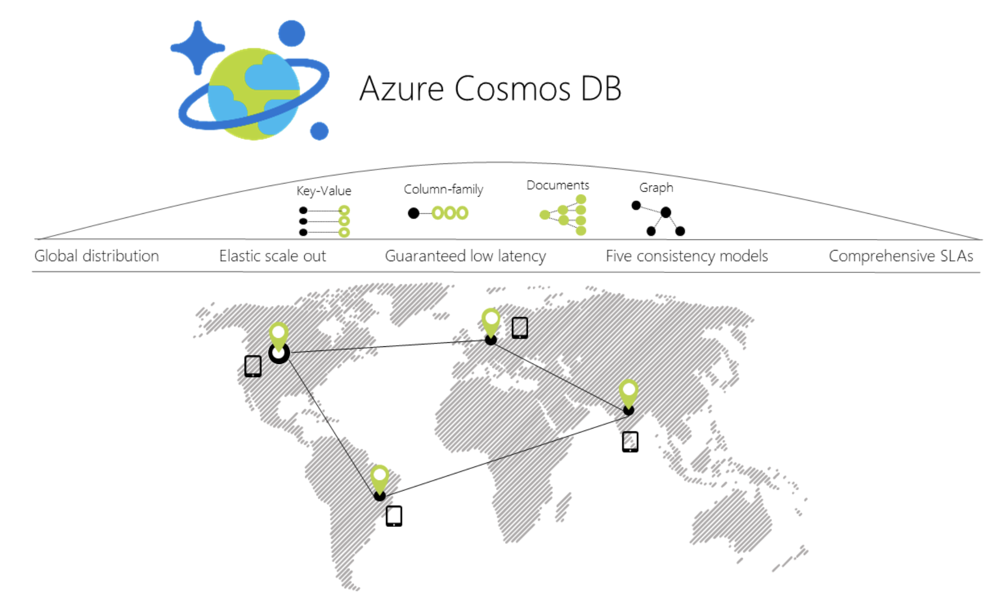
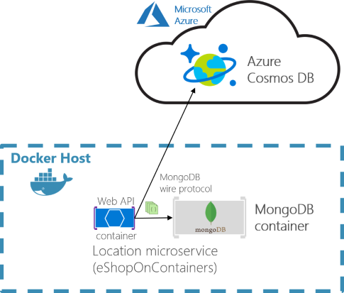
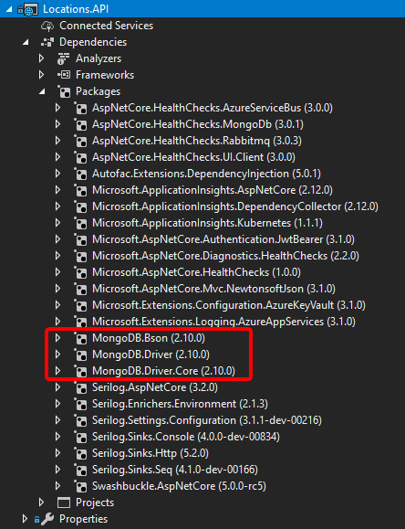

# Use NoSQL databases as a persistence infrastructure

When you use NoSQL databases for your infrastructure data tier, you typically do not use an ORM like Entity Framework Core. Instead you use the API provided by the NoSQL engine, such as Azure Cosmos DB, MongoDB, Cassandra, RavenDB, CouchDB, or Azure Storage Tables.

However, when you use a NoSQL database, especially a document-oriented database like Azure Cosmos DB, CouchDB, or RavenDB, the way you design your model with DDD aggregates is partially similar to how you can do it in EF Core, in regards to the identification of aggregate roots, child entity classes, and value object classes. But, ultimately, the database selection will impact in your design.

When you use a document-oriented database, you implement an aggregate as a single document, serialized in JSON or another format. However, the use of the database is transparent from a domain model code point of view. When using a NoSQL database, you still are using entity classes and aggregate root classes, but with more flexibility than when using EF Core because the persistence is not relational.

The difference is in how you persist that model. If you implemented your domain model based on POCO entity classes, agnostic to the infrastructure persistence, it might look like you could move to a different persistence infrastructure, even from relational to NoSQL. However, that should not be your goal. There are always constraints and trade-offs in the different database technologies, so you will not be able to have the same model for relational or NoSQL databases. Changing persistence models is not a trivial task, because transactions and persistence operations will be very different.

For example, in a document-oriented database, it is okay for an aggregate root to have multiple child collection properties. In a relational database, querying multiple child collection properties is not easily optimized, because you get a UNION ALL SQL statement back from EF. Having the same domain model for relational databases or NoSQL databases is not simple, and you should not try to do it. You really have to design your model with an understanding of how the data is going to be used in each particular database.

A benefit when using NoSQL databases is that the entities are more denormalized, so you do not set a table mapping. Your domain model can be more flexible than when using a relational database.

When you design your domain model based on aggregates, moving to NoSQL and document-oriented databases might be even easier than using a relational database, because the aggregates you design are similar to serialized documents in a document-oriented database. Then you can include in those “bags” all the information you might need for that aggregate.

For instance, the following JSON code is a sample implementation of an order aggregate when using a document-oriented database. It is similar to the order aggregate we implemented in the eShopOnContainers sample, but without using EF Core underneath.

```json
{
    "id": "2017001",
    "orderDate": "2/25/2017",
    "buyerId": "1234567",
    "address": [
        {
        "street": "100 One Microsoft Way",
        "city": "Redmond",
        "state": "WA",
        "zip": "98052",
        "country": "U.S."
        }
    ],
    "orderItems": [
        {"id": 20170011, "productId": "123456", "productName": ".NET T-Shirt",
        "unitPrice": 25, "units": 2, "discount": 0},
        {"id": 20170012, "productId": "123457", "productName": ".NET Mug",
        "unitPrice": 15, "units": 1, "discount": 0}
    ]
}
```

## Introduction to Azure Cosmos DB and the native Cosmos DB API

[Azure Cosmos DB](https://docs.microsoft.com/azure/cosmos-db/introduction) is Microsoft's globally distributed database service for mission-critical applications. Azure Cosmos DB provides [turn-key global distribution](https://docs.microsoft.com/azure/cosmos-db/distribute-data-globally), [elastic scaling of throughput and storage](https://docs.microsoft.com/azure/cosmos-db/partition-data) worldwide, single-digit millisecond latencies at the 99th percentile, [five well-defined consistency levels](https://docs.microsoft.com/azure/cosmos-db/consistency-levels), and guaranteed high availability, all backed by [industry-leading SLAs](https://azure.microsoft.com/support/legal/sla/cosmos-db/). Azure Cosmos DB [automatically indexes data](https://www.vldb.org/pvldb/vol8/p1668-shukla.pdf) without requiring you to deal with schema and index management. It is multi-model and supports document, key-value, graph, and columnar data models.



**Figure 7-19**. Azure Cosmos DB global distribution

When you use a C\# model to implement the aggregate to be used by the Azure Cosmos DB API, the aggregate can be similar to the C\# POCO classes used with EF Core. The difference is in the way to use them from the application and infrastructure layers, as in the following code:

```csharp
// C# EXAMPLE OF AN ORDER AGGREGATE BEING PERSISTED WITH AZURE COSMOS DB API
// *** Domain Model Code ***
// Aggregate: Create an Order object with its child entities and/or value objects.
// Then, use AggregateRoot’s methods to add the nested objects so invariants and
// logic is consistent across the nested properties (value objects and entities).

Order orderAggregate = new Order
{
    Id = "2017001",
    OrderDate = new DateTime(2005, 7, 1),
    BuyerId = "1234567",
    PurchaseOrderNumber = "PO18009186470"
}

Address address = new Address
{
    Street = "100 One Microsoft Way",
    City = "Redmond",
    State = "WA",
    Zip = "98052",
    Country = "U.S."
}

orderAggregate.UpdateAddress(address);

OrderItem orderItem1 = new OrderItem
{
    Id = 20170011,
    ProductId = "123456",
    ProductName = ".NET T-Shirt",
    UnitPrice = 25,
    Units = 2,
    Discount = 0;
};

//Using methods with domain logic within the entity. No anemic-domain model
orderAggregate.AddOrderItem(orderItem1);
// *** End of Domain Model Code ***

// *** Infrastructure Code using Cosmos DB Client API ***
Uri collectionUri = UriFactory.CreateDocumentCollectionUri(databaseName,
    collectionName);

await client.CreateDocumentAsync(collectionUri, orderAggregate);

// As your app evolves, let's say your object has a new schema. You can insert
// OrderV2 objects without any changes to the database tier.
Order2 newOrder = GetOrderV2Sample("IdForSalesOrder2");
await client.CreateDocumentAsync(collectionUri, newOrder);
```

You can see that the way you work with your domain model can be similar to the way you use it in your domain model layer when the infrastructure is EF. You still use the same aggregate root methods to ensure consistency, invariants, and validations within the aggregate.

However, when you persist your model into the NoSQL database, the code and API change dramatically compared to EF Core code or any other code related to relational databases.

## Implement .NET code targeting MongoDB and Azure Cosmos DB

### Use Azure Cosmos DB from .NET containers

You can access Azure Cosmos DB databases from .NET code running in containers, like from any other .NET application. For instance, the Locations.API and Marketing.API microservices in eShopOnContainers are implemented so they can consume Azure Cosmos DB databases.

However, there’s a limitation in Azure Cosmos DB from a Docker development environment point of view. Even when there’s a on-premises [Azure Cosmos DB Emulator](https://docs.microsoft.com/azure/cosmos-db/local-emulator) able to run in a local development machine (like a PC), as of late 2017, it just supports Windows, not Linux.

There is also the possibility to run this emulator on Docker, but just on Windows Containers, not with Linux Containers. That is an initial handicap for the development environment if your application is deployed as Linux containers, since, currently, you cannot deploy Linux and Windows Containers on Docker for Windows at the same time. Either all containers being deployed have to be for Linux or for Windows.

The ideal and more straightforward deployment for a dev/test solution is to be able to deploy your database systems as containers along with your custom containers so your dev/test environments are always consistent.

### Use MongoDB API for local dev/test Linux/Windows containers plus Azure Cosmos DB

Cosmos DB databases support MongoDB API for .NET as well as the native MongoDB wire protocol. This means that by using existing drivers, your application written for MongoDB can now communicate with Cosmos DB and use Cosmos DB databases instead of MongoDB databases, as shown in Figure 7-20.


**Figure 7-20**. Using MongoDB API and protocol to access Azure Cosmos DB

This is a very convenient approach for proof of concepts in Docker environments with Linux containers because the [MongoDB Docker image](https://hub.docker.com/r/_/mongo/) is a multi-arch image that supports Docker Linux containers and Docker Windows containers.

As shown in the following image, by using the MongoDB API, eShopOnContainers supports MongoDB Linux and Windows containers for the local development environment but then, you can move to a scalable, PaaS cloud solution as Azure Cosmos DB by simply [changing the MongoDB connection string to point to Azure Cosmos DB](https://docs.microsoft.com/azure/cosmos-db/connect-mongodb-account).



**Figure 7-21**. eShopOnContainers using MongoDB containers for dev-env or Azure Cosmos DB for production

The production Azure Cosmos DB would be running in Azure’s cloud as a PaaS and scalable service.

Your custom .NET Core containers can run on a local development Docker host (that is using Docker for Windows in a Windows 10 machine) or be deployed into a production environment, like Kubernetes in Azure AKS or Azure Service Fabric. In this second environment, you would deploy only the .NET Core custom containers but not the MongoDB container since you’d be using Azure Cosmos DB in the cloud for handling the data in production.

A clear benefit of using the MongoDB API is that your solution could run in both database engines, MongoDB or Azure Cosmos DB, so migrations to different environments should be easy. However, sometimes it is worthwhile to use a native API (that is the native Cosmos DB API) in order to take full advantage of the capabilities of a specific database engine.

For further comparison between simply using MongoDB versus Cosmos DB in the cloud, see the [Benefits of using Azure Cosmos DB in this page](https://docs.microsoft.com/azure/cosmos-db/mongodb-introduction).

### Analyze your approach for production applications: MongoDB API vs. Cosmos DB API

In eShopOnContainers, we’re using MongoDB API because our priority was fundamentally to have a consistent dev/test environment using a NoSQL database that could also work with Azure Cosmos DB.

However, if you planning to use MongoDB API to access Azure Cosmos DB in Azure for production applications, you should analyze the differences in capabilities and performance when using MongoDB API to access Azure Cosmos DB databases compared to using the native Azure Cosmos DB API. If it is similar you can use MongoDB API and you get the benefit of supporting two NoSQL database engines at the same time.

You could also use MongoDB clusters as the production database in Azure’s cloud, too, with [MongoDB Azure Service](https://www.mongodb.com/scale/mongodb-azure-service). But that is not a PaaS service provided by Microsoft. In this case, Azure is just hosting that solution coming from MongoDB.

Basically, this is just a disclaimer stating that you shouldn’t always use MongoDB API against Azure Cosmos DB, as we did in eShopOnContainers because it was a convenient choice for Linux containers. The decision should be based on the specific needs and tests you need to do for your production application.

### The code: Use MongoDB API in .NET Core applications

MongoDB API for .NET is based on NuGet packages that you need to add to your projects, like in the Locations.API project shown in the following figure.



**Figure 7-22**. MongoDB API NuGet packages references in a .NET Core project

Let's investigate the code in the following sections.

#### A Model used by MongoDB API

First, you need to define a model that will hold the data coming from the database in your application’s memory space. Here’s an example of the model used for Locations at eShopOnContainers.

```csharp
using MongoDB.Bson;
using MongoDB.Bson.Serialization.Attributes;
using MongoDB.Driver.GeoJsonObjectModel;
using System.Collections.Generic;

public class Locations
{
    [BsonId]
    [BsonRepresentation(BsonType.ObjectId)]
    public string Id { get; set; }
    public int LocationId { get; set; }
    public string Code { get; set; }
    [BsonRepresentation(BsonType.ObjectId)]
    public string Parent_Id { get; set; }
    public string Description { get; set; }
    public double Latitude { get; set; }
    public double Longitude { get; set; }
    public GeoJsonPoint<GeoJson2DGeographicCoordinates> Location
                                                             { get; private set; }
    public GeoJsonPolygon<GeoJson2DGeographicCoordinates> Polygon
                                                             { get; private set; }
    public void SetLocation(double lon, double lat) => SetPosition(lon, lat);
    public void SetArea(List<GeoJson2DGeographicCoordinates> coordinatesList)
                                                    => SetPolygon(coordinatesList);

    private void SetPosition(double lon, double lat)
    {
        Latitude = lat;
        Longitude = lon;
        Location = new GeoJsonPoint<GeoJson2DGeographicCoordinates>(
            new GeoJson2DGeographicCoordinates(lon, lat));
    }

    private void SetPolygon(List<GeoJson2DGeographicCoordinates> coordinatesList)
    {
        Polygon = new GeoJsonPolygon<GeoJson2DGeographicCoordinates>(
                  new GeoJsonPolygonCoordinates<GeoJson2DGeographicCoordinates>(
                  new GeoJsonLinearRingCoordinates<GeoJson2DGeographicCoordinates>(
                                                                 coordinatesList)));
    }
}
```

You can see there are a few attributes and types coming from the MongoDB NuGet packages.

NoSQL databases are usually very well suited for working with non-relational hierarchical data. In this example, we are using MongoDB types especially made for geo-locations, like `GeoJson2DGeographicCoordinates`.

#### Retrieve the database and the collection

In eShopOnContainers, we have created a custom database context where we implement the code to retrieve the database and the MongoCollections, as in the following code.

```csharp
public class LocationsContext
{
    private readonly IMongoDatabase _database = null;

    public LocationsContext(IOptions<LocationSettings> settings)
    {
        var client = new MongoClient(settings.Value.ConnectionString);
        if (client != null)
            _database = client.GetDatabase(settings.Value.Database);
    }

    public IMongoCollection<Locations> Locations
    {
        get
        {
            return _database.GetCollection<Locations>("Locations");
        }
    }
}
```

#### Retrieve the data

In C# code, like Web API controllers or custom Repositories implementation, you can write similar code to the following when querying through the MongoDB API. Note that the `_context` object is an instance of the previous `LocationsContext` class.

```csharp
public async Task<Locations> GetAsync(int locationId)
{
    var filter = Builders<Locations>.Filter.Eq("LocationId", locationId);
    return await _context.Locations
                            .Find(filter)
                            .FirstOrDefaultAsync();
}
```

#### Use an env-var in the docker-compose.override.yml file for the MongoDB connection string

When creating a MongoClient object, it needs a fundamental parameter which is precisely the `ConnectionString` parameter pointing to the right database. In the case of eShopOnContainers, the connection string can point to a local MongoDB Docker container or to a “production” Azure Cosmos DB database.  That connection string comes from the environment variables defined in the `docker-compose.override.yml` files used when deploying with docker-compose or Visual Studio, as in the following yml code.

```yml
# docker-compose.override.yml
version: '3.4'
services:
  # Other services
  locations.api:
    environment:
      # Other settings
      - ConnectionString=${ESHOP_AZURE_COSMOSDB:-mongodb://nosql.data}

```

The `ConnectionString` environment variable is resolved this way: If the `ESHOP_AZURE_COSMOSDB` global variable is defined in the `.env` file with the Azure Cosmos DB connection string, it will use it to access the Azure Cosmos DB database in the cloud. If it’s not defined, it will take the `mongodb://nosql.data` value and use the development mongodb container.

The following code shows the `.env` file with the Azure Cosmos DB connection string global environment variable, as implemented in eShopOnContainers:

```yml
# .env file, in eShopOnContainers root folder
# Other Docker environment variables

ESHOP_EXTERNAL_DNS_NAME_OR_IP=localhost
ESHOP_PROD_EXTERNAL_DNS_NAME_OR_IP=<YourDockerHostIP>

#ESHOP_AZURE_COSMOSDB=<YourAzureCosmosDBConnData>

#Other environment variables for additional Azure infrastructure assets
#ESHOP_AZURE_REDIS_BASKET_DB=<YourAzureRedisBasketInfo>
#ESHOP_AZURE_STORAGE_CATALOG_URL=<YourAzureStorage_Catalog_BLOB_URL>
#ESHOP_AZURE_SERVICE_BUS=<YourAzureServiceBusInfo>
```

You should uncomment the ESHOP_AZURE_COSMOSDB line and update it with your Azure Cosmos DB connection string obtained from the Azure portal as explained in [Connect a MongoDB application to Azure Cosmos DB](https://docs.microsoft.com/azure/cosmos-db/connect-mongodb-account).

If the `ESHOP_AZURE_COSMOSDB` global variable is empty, meaning that it is commented out in the `.env` file, then the container uses a default MongoDB connection string pointing to the local MongoDB container deployed in eShopOnContainers which is named `nosql.data` and was defined at the docker-compose file, as shown in the following .yml code.

``` yml
# docker-compose.yml
version: '3.4'
services:
  # ...Other services...
  nosql.data:
    image: mongo
```

#### Additional resources

- **Modeling document data for NoSQL databases** \
  <https://docs.microsoft.com/azure/cosmos-db/modeling-data>

- **Vaughn Vernon. The Ideal Domain-Driven Design Aggregate Store?** \
  <https://kalele.io/blog-posts/the-ideal-domain-driven-design-aggregate-store/>

- **Introduction to Azure Cosmos DB: API for MongoDB**  \
  <https://docs.microsoft.com/azure/cosmos-db/mongodb-introduction>

- **Azure Cosmos DB: Build a MongoDB API web app with .NET and the Azure portal**  \
  <https://docs.microsoft.com/azure/cosmos-db/create-mongodb-dotnet>

- **Use the Azure Cosmos DB Emulator for local development and testing**  \
  <https://docs.microsoft.com/azure/cosmos-db/local-emulator>

- **Connect a MongoDB application to Azure Cosmos DB**  \
  <https://docs.microsoft.com/azure/cosmos-db/connect-mongodb-account>

- **The Cosmos DB Emulator Docker image (Windows Container)**  \
  <https://hub.docker.com/r/microsoft/azure-cosmosdb-emulator/>

- **The MongoDB Docker image (Linux and Windows Container)**  \
  <https://hub.docker.com/_/mongo/>

- **Use MongoChef (Studio 3T) with an Azure Cosmos DB: API for MongoDB account**  \
  <https://docs.microsoft.com/azure/cosmos-db/mongodb-mongochef>

>[!div class="step-by-step"]
>[Previous](infrastructure-persistence-layer-implemenation-entity-framework-core.md)
>[Next](microservice-application-layer-web-api-design.md)
