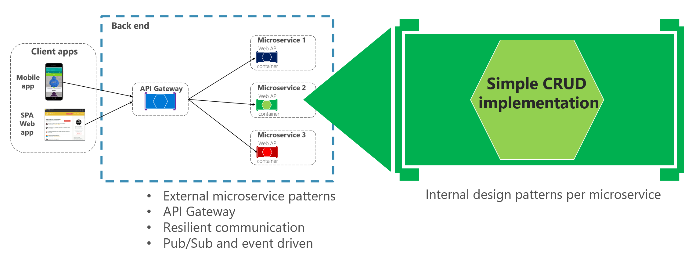
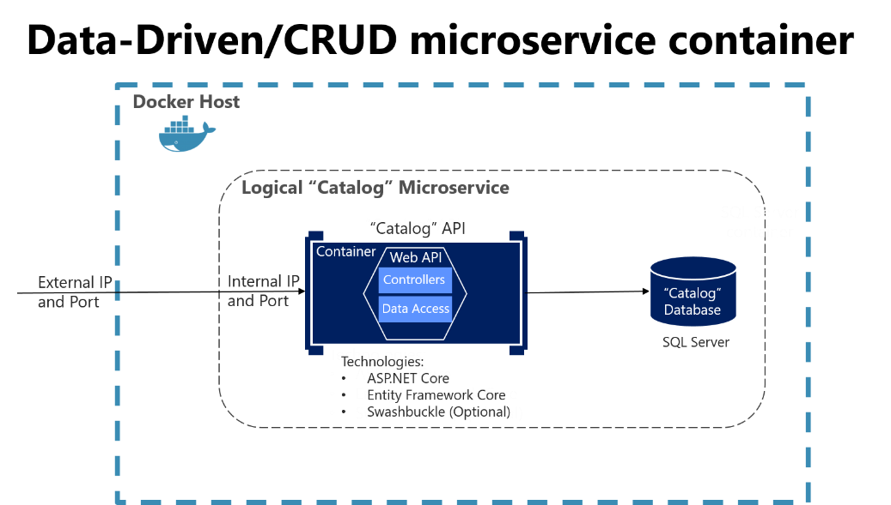
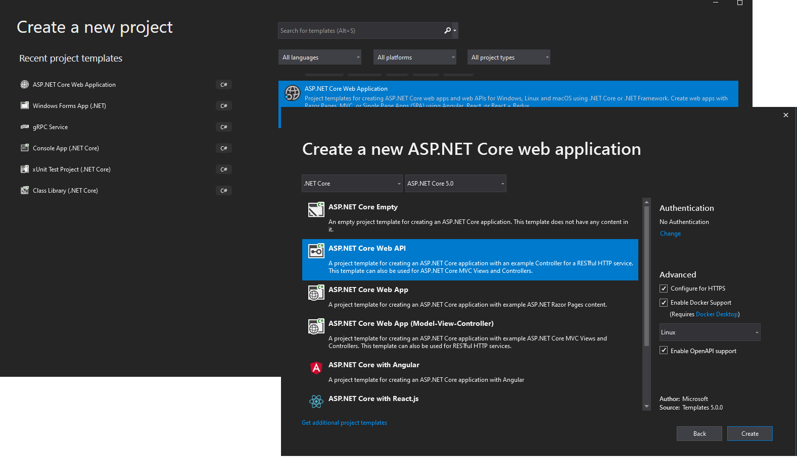
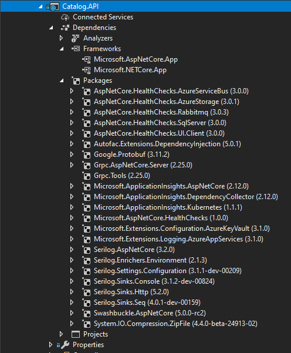
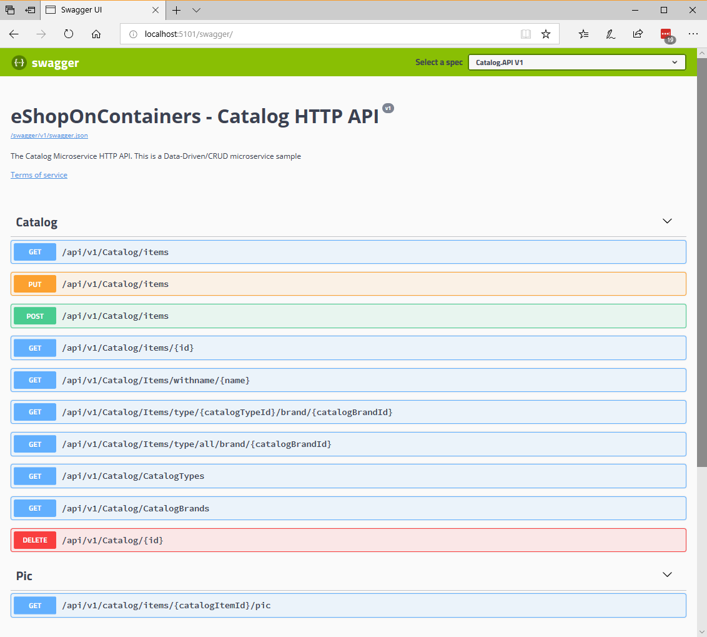
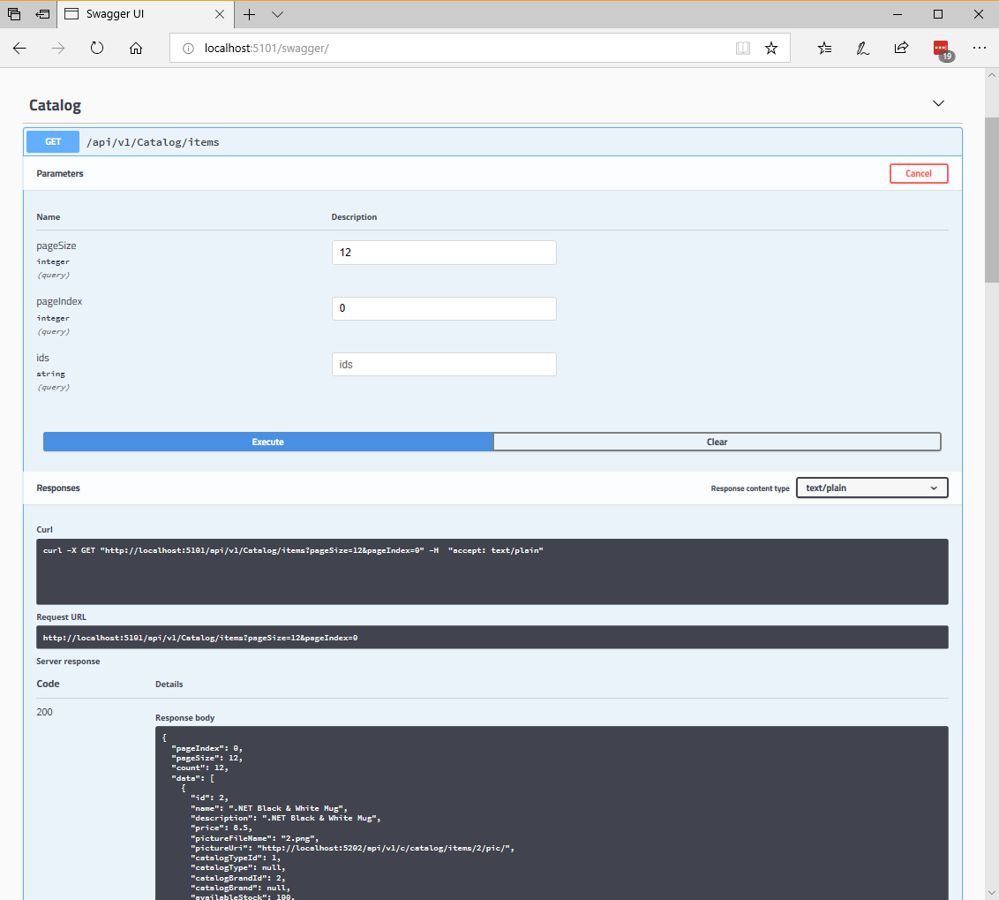
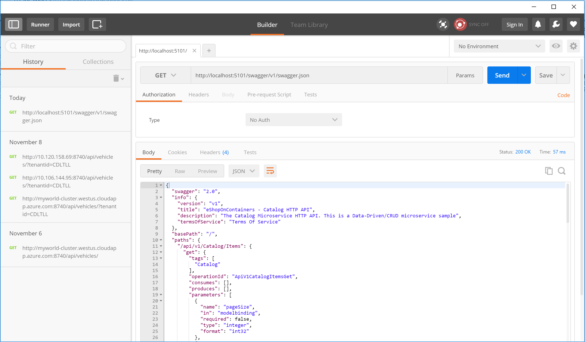

# Creating a simple data-driven CRUD microservice

This section outlines how to create a simple microservice that performs create, read, update, and delete (CRUD) operations on a data source.

## Designing a simple CRUD microservice

From a design point of view, this type of containerized microservice is very simple. Perhaps the problem to solve is simple, or perhaps the implementation is only a proof of concept.



**Figure 6-4**. Internal design for simple CRUD microservices

An example of this kind of simple data-drive service is the catalog microservice from the eShopOnContainers sample application. This type of service implements all its functionality in a single ASP.NET Core Web API project that includes classes for its data model, its business logic, and its data access code. It also stores its related data in a database running in SQL Server (as another container for dev/test purposes), but could also be any regular SQL Server host, as shown in Figure 6-5.



**Figure 6-5**. Simple data-driven/CRUD microservice design

The previous diagram shows the logical Catalog microservice, that includes its Catalog database, which can be or not in the same Docker host. Having the database in the same Docker host might be good for development, but not for production. When you are developing this kind of service, you only need [ASP.NET Core](https://docs.microsoft.com/aspnet/core/) and a data-access API or ORM like [Entity Framework Core](https://docs.microsoft.com/ef/core/index). You could also generate [Swagger](https://swagger.io/) metadata automatically through [Swashbuckle](https://github.com/domaindrivendev/Swashbuckle.AspNetCore) to provide a description of what your service offers, as explained in the next section.

Note that running a database server like SQL Server within a Docker container is great for development environments, because you can have all your dependencies up and running without needing to provision a database in the cloud or on-premises. This is very convenient when running integration tests. However, for production environments, running a database server in a container is not recommended, because you usually do not get high availability with that approach. For a production environment in Azure, it is recommended that you use Azure SQL DB or any other database technology that can provide high availability and high scalability. For example, for a NoSQL approach, you might choose CosmosDB.

Finally, by editing the Dockerfile and docker-compose.yml metadata files, you can configure how the image of this container will be created—what base image it will use, plus design settings such as internal and external names and TCP ports.

## Implementing a simple CRUD microservice with ASP.NET Core

To implement a simple CRUD microservice using .NET Core and Visual Studio, you start by creating a simple ASP.NET Core Web API project (running on .NET Core so it can run on a Linux Docker host), as shown in Figure 6-6.



**Figure 6-6**. Creating an ASP.NET Core Web API project in Visual Studio 2019

To create an ASP.NET Core Web API Project, first select an ASP.NET Core Web Application and then select the API type. After creating the project, you can implement your MVC controllers as you would in any other Web API project, using the Entity Framework API or other API. In a new Web API project, you can see that the only dependency you have in that microservice is on ASP.NET Core itself. Internally, within the *Microsoft.AspNetCore.All* dependency, it is referencing Entity Framework and many other .NET Core NuGet packages, as shown in Figure 6-7.



**Figure 6-7**. Dependencies in a simple CRUD Web API microservice

The API project includes references to the Microsoft.AspNetCore.App NuGet package, that includes references to all essential packages. It could include some other packages as well.

### Implementing CRUD Web API services with Entity Framework Core

Entity Framework (EF) Core is a lightweight, extensible, and cross-platform version of the popular Entity Framework data access technology. EF Core is an object-relational mapper (ORM) that enables .NET developers to work with a database using .NET objects.

The catalog microservice uses EF and the SQL Server provider because its database is running in a container with the SQL Server for Linux Docker image. However, the database could be deployed into any SQL Server, such as Windows on-premises or Azure SQL DB. The only thing you would need to change is the connection string in the ASP.NET Web API microservice.

#### The data model

With EF Core, data access is performed by using a model. A model is made up of (domain model) entity classes and a derived context (DbContext) that represents a session with the database, allowing you to query and save data. You can generate a model from an existing database, manually code a model to match your database, or use EF migrations to create a database from your model, using the code-first approach (that makes it easy to evolve the database as your model changes over time). For the catalog microservice we are using the last approach. You can see an example of the CatalogItem entity class in the following code example, which is a simple Plain Old CLR Object ([POCO](https://en.wikipedia.org/wiki/Plain_Old_CLR_Object)) entity class.

```csharp
public class CatalogItem
{
    public int Id { get; set; }
    public string Name { get; set; }
    public string Description { get; set; }
    public decimal Price { get; set; }
    public string PictureFileName { get; set; }
    public string PictureUri { get; set; }
    public int CatalogTypeId { get; set; }
    public CatalogType CatalogType { get; set; }
    public int CatalogBrandId { get; set; }
    public CatalogBrand CatalogBrand { get; set; }
    public int AvailableStock { get; set; }
    public int RestockThreshold { get; set; }
    public int MaxStockThreshold { get; set; }

    public bool OnReorder { get; set; }
    public CatalogItem() { }

    // Additional code ...
}
```

You also need a DbContext that represents a session with the database. For the catalog microservice, the CatalogContext class derives from the DbContext base class, as shown in the following example:

```csharp
public class CatalogContext : DbContext
{
    public CatalogContext(DbContextOptions<CatalogContext> options) : base(options)
    { }
    public DbSet<CatalogItem> CatalogItems { get; set; }
    public DbSet<CatalogBrand> CatalogBrands { get; set; }
    public DbSet<CatalogType> CatalogTypes { get; set; }

    // Additional code ...
}
```

You can have additional `DbContext` implementations. For example, in the sample Catalog.API microservice, there's a second `DbContext` named `CatalogContextSeed` where it automatically populates the sample data the first time it tries to access the database. This method is useful for demo data and for automated testing scenarios, as well.

Within the `DbContext`, you use the `OnModelCreating` method to customize object/database entity mappings and other [EF extensibility points](https://devblogs.microsoft.com/dotnet/implementing-seeding-custom-conventions-and-interceptors-in-ef-core-1-0/).

##### Querying data from Web API controllers

Instances of your entity classes are typically retrieved from the database using Language Integrated Query (LINQ), as shown in the following example:

```csharp
[Route("api/v1/[controller]")]
public class CatalogController : ControllerBase
{
    private readonly CatalogContext _catalogContext;
    private readonly CatalogSettings _settings;
    private readonly ICatalogIntegrationEventService _catalogIntegrationEventService;

    public CatalogController(
        CatalogContext context,
        IOptionsSnapshot<CatalogSettings> settings,
        ICatalogIntegrationEventService catalogIntegrationEventService)
    {
        _catalogContext = context ?? throw new ArgumentNullException(nameof(context));
        _catalogIntegrationEventService = catalogIntegrationEventService
            ?? throw new ArgumentNullException(nameof(catalogIntegrationEventService));

        _settings = settings.Value;
        context.ChangeTracker.QueryTrackingBehavior = QueryTrackingBehavior.NoTracking;
    }

    // GET api/v1/[controller]/items[?pageSize=3&pageIndex=10]
    [HttpGet]
    [Route("items")]
    [ProducesResponseType(typeof(PaginatedItemsViewModel<CatalogItem>), (int)HttpStatusCode.OK)]
    [ProducesResponseType(typeof(IEnumerable<CatalogItem>), (int)HttpStatusCode.OK)]
    [ProducesResponseType((int)HttpStatusCode.BadRequest)]
    public async Task<IActionResult> ItemsAsync(
        [FromQuery]int pageSize = 10,
        [FromQuery]int pageIndex = 0,
        string ids = null)
    {
        if (!string.IsNullOrEmpty(ids))
        {
            var items = await GetItemsByIdsAsync(ids);

            if (!items.Any())
            {
                return BadRequest("ids value invalid. Must be comma-separated list of numbers");
            }

            return Ok(items);
        }

        var totalItems = await _catalogContext.CatalogItems
            .LongCountAsync();

        var itemsOnPage = await _catalogContext.CatalogItems
            .OrderBy(c => c.Name)
            .Skip(pageSize * pageIndex)
            .Take(pageSize)
            .ToListAsync();

        itemsOnPage = ChangeUriPlaceholder(itemsOnPage);

        var model = new PaginatedItemsViewModel<CatalogItem>(
            pageIndex, pageSize, totalItems, itemsOnPage);

        return Ok(model);
    }
    //...
}
```

##### Saving data

Data is created, deleted, and modified in the database using instances of your entity classes. You could add code like the following hard-coded example (mock data, in this case) to your Web API controllers.

```csharp
var catalogItem = new CatalogItem() {CatalogTypeId=2, CatalogBrandId=2,
                                     Name="Roslyn T-Shirt", Price = 12};
_context.Catalog.Add(catalogItem);
_context.SaveChanges();
```

##### Dependency Injection in ASP.NET Core and Web API controllers

In ASP.NET Core you can use Dependency Injection (DI) out of the box. You do not need to set up a third-party Inversion of Control (IoC) container, although you can plug your preferred IoC container into the ASP.NET Core infrastructure if you want. In this case, it means that you can directly inject the required EF DBContext or additional repositories through the controller constructor.

In the example above of the `CatalogController` class, we are injecting an object of `CatalogContext` which inherits from `DbContext` type and other required objects through the `CatalogController()` constructor.

An important configuration to set up in the Web API project is the DbContext class registration into the service's IoC container. You typically do so in the `Startup` class by calling the `services.AddDbContext<CatalogContext>()` method inside the `ConfigureServices()` method, as shown in the following **simplified** example:

```csharp
public void ConfigureServices(IServiceCollection services)
{
    // Additional code...
    // Actual code reference : https://github.com/dotnet-architecture/eShopOnContainers/blob/dev/src/Services/Catalog/Catalog.API/Startup.cs#L203

    services.AddDbContext<CatalogContext>(options =>
    {
        options.UseSqlServer(Configuration["ConnectionString"],
        sqlServerOptionsAction: sqlOptions =>
        {
            sqlOptions.MigrationsAssembly(
                typeof(Startup).GetTypeInfo().Assembly.GetName().Name);

           //Configuring Connection Resiliency:
           sqlOptions.
               EnableRetryOnFailure(maxRetryCount: 5,
               maxRetryDelay: TimeSpan.FromSeconds(30),
               errorNumbersToAdd: null);

       });

       // Changing default behavior when client evaluation occurs to throw.
       // Default in EFCore would be to log warning when client evaluation is done.
       options.ConfigureWarnings(warnings => warnings.Throw(
           RelationalEventId.QueryClientEvaluationWarning));
   });

  //...
}
```

### Additional resources

- **Querying Data** \
  [https://docs.microsoft.com/ef/core/querying/index](/ef/core/querying/index)

- **Saving Data** \
  [https://docs.microsoft.com/ef/core/saving/index](/ef/core/saving/index)

## The DB connection string and environment variables used by Docker containers

You can use the ASP.NET Core settings and add a ConnectionString property to your settings.json file as shown in the following example:

```json
{
    "ConnectionString": "Server=tcp:127.0.0.1,5433;Initial Catalog=Microsoft.eShopOnContainers.Services.CatalogDb;User Id=sa;Password=Pass@word",
    "ExternalCatalogBaseUrl": "http://localhost:5101",
    "Logging": {
        "IncludeScopes": false,
        "LogLevel": {
            "Default": "Debug",
            "System": "Information",
            "Microsoft": "Information"
        }
    }
}
```

The settings.json file can have default values for the ConnectionString property or for any other property. However, those properties will be overridden by the values of environment variables that you specify in the docker-compose.override.yml file, when using Docker.

From your docker-compose.yml or docker-compose.override.yml files, you can initialize those environment variables so that Docker will set them up as OS environment variables for you, as shown in the following docker-compose.override.yml file (the connection string and other lines wrap in this example, but it would not wrap in your own file).

```yml
# docker-compose.override.yml

#
catalog-api:
  environment:
    - ConnectionString=Server=sqldata;Database=Microsoft.eShopOnContainers.Services.CatalogDb;User Id=sa;Password=Pass@word
    # Additional environment variables for this service
  ports:
    - "5101:80"
```

The docker-compose.yml files at the solution level are not only more flexible than configuration files at the project or microservice level, but also more secure if you override the environment variables declared at the docker-compose files with values set from your deployment tools, like from Azure DevOps Services Docker deployment tasks.

Finally, you can get that value from your code by using Configuration\["ConnectionString"\], as shown in the ConfigureServices method in an earlier code example.

However, for production environments, you might want to explore additional ways on how to store secrets like the connection strings. An excellent way to manage application secrets is using [Azure Key Vault](https://azure.microsoft.com/services/key-vault/).

Azure Key Vault helps to store and safeguard cryptographic keys and secrets used by your cloud applications and services. A secret is anything you want to keep strict control of, like API keys, connection strings, passwords, etc. and strict control includes usage logging, setting expiration, managing access, *among others*.

Azure Key Vault allows a very detailed control level of the application secrets usage without the need to let anyone know them. The secrets can even be rotated for enhanced security without disrupting development or operations.

Applications have to be registered in the organization's Active Directory, so they can use the Key Vault.

You can check the *Key Vault Concepts documentation* for more details.

### Implementing versioning in ASP.NET Web APIs

As business requirements change, new collections of resources may be added, the relationships between resources might change, and the structure of the data in resources might be amended. Updating a Web API to handle new requirements is a relatively straightforward process, but you must consider the effects that such changes will have on client applications consuming the Web API. Although the developer designing and implementing a Web API has full control over that API, the developer does not have the same degree of control over client applications that might be built by third party organizations operating remotely.

Versioning enables a Web API to indicate the features and resources that it exposes. A client application can then submit requests to a specific version of a feature or resource. There are several approaches to implement versioning:

- URI versioning

- Query string versioning

- Header versioning

Query string and URI versioning are the simplest to implement. Header versioning is a good approach. However, header versioning not as explicit and straightforward as URI versioning. Because URL versioning is the simplest and most explicit, the eShopOnContainers sample application uses URI versioning.

With URI versioning, as in the eShopOnContainers sample application, each time you modify the Web API or change the schema of resources, you add a version number to the URI for each resource. Existing URIs should continue to operate as before, returning resources that conform to the schema that matches the requested version.

As shown in the following code example, the version can be set by using the Route attribute in the Web API controller, which makes the version explicit in the URI (v1 in this case).

```csharp
[Route("api/v1/[controller]")]
public class CatalogController : ControllerBase
{
    // Implementation ...
```

This versioning mechanism is simple and depends on the server routing the request to the appropriate endpoint. However, for a more sophisticated versioning and the best method when using REST, you should use hypermedia and implement [HATEOAS (Hypertext as the Engine of Application State)](https://docs.microsoft.com/azure/architecture/best-practices/api-design#use-hateoas-to-enable-navigation-to-related-resources).

### Additional resources

- **Scott Hanselman. ASP.NET Core RESTful Web API versioning made easy** \
  <https://www.hanselman.com/blog/ASPNETCoreRESTfulWebAPIVersioningMadeEasy.aspx>

- **Versioning a RESTful web API** \
  <https://docs.microsoft.com/azure/architecture/best-practices/api-design#versioning-a-restful-web-api>

- **Roy Fielding. Versioning, Hypermedia, and REST** \
  <https://www.infoq.com/articles/roy-fielding-on-versioning>

## Generating Swagger description metadata from your ASP.NET Core Web API

[Swagger](https://swagger.io/) is a commonly used open source framework backed by a large ecosystem of tools that helps you design, build, document, and consume your RESTful APIs. It is becoming the standard for the APIs description metadata domain. You should include Swagger description metadata with any kind of microservice, either data-driven microservices or more advanced domain-driven microservices (as explained in following section).

The heart of Swagger is the Swagger specification, which is API description metadata in a JSON or YAML file. The specification creates the RESTful contract for your API, detailing all its resources and operations in both a human- and machine-readable format for easy development, discovery, and integration.

The specification is the basis of the OpenAPI Specification (OAS) and is developed in an open, transparent, and collaborative community to standardize the way RESTful interfaces are defined.

The specification defines the structure for how a service can be discovered and how its capabilities understood. For more information, including a web editor and examples of Swagger specifications from companies like Spotify, Uber, Slack, and Microsoft, see the Swagger site (<https://swagger.io>).

### Why use Swagger?

The main reasons to generate Swagger metadata for your APIs are the following.

**Ability for other products to automatically consume and integrate your APIs**. Dozens of products and [commercial tools](https://swagger.io/commercial-tools/) and many [libraries and frameworks](https://swagger.io/open-source-integrations/) support Swagger. Microsoft has high-level products and tools that can automatically consume Swagger-based APIs, such as the following:

- [AutoRest](https://github.com/Azure/AutoRest). You can automatically generate .NET client classes for calling Swagger. This tool can be used from the CLI and it also integrates with Visual Studio for easy use through the GUI.

- [Microsoft Flow](https://flow.microsoft.com/). You can automatically [use and integrate your API](https://flow.microsoft.com/blog/integrating-custom-api/) into a high-level Microsoft Flow workflow, with no programming skills required.

- [Microsoft PowerApps](https://powerapps.microsoft.com/). You can automatically consume your API from [PowerApps mobile apps](https://powerapps.microsoft.com/blog/register-and-use-custom-apis-in-powerapps/) built with [PowerApps Studio](https://powerapps.microsoft.com/build-powerapps/), with no programming skills required.

- [Azure App Service Logic Apps](https://docs.microsoft.com/azure/app-service-logic/app-service-logic-what-are-logic-apps). You can automatically [use and integrate your API into an Azure App Service Logic App](https://docs.microsoft.com/azure/app-service-logic/app-service-logic-custom-hosted-api), with no programming skills required.

**Ability to automatically generate API documentation**. When you create large-scale RESTful APIs, such as complex microservice-based applications, you need to handle many endpoints with different data models used in the request and response payloads. Having proper documentation and having a solid API explorer, as you get with Swagger, is key for the success of your API and adoption by developers.

Swagger's metadata is what Microsoft Flow, PowerApps, and Azure Logic Apps use to understand how to use APIs and connect to them.

There are several options to automate Swagger metadata generation for ASP.NET Core REST API applications, in the form of functional API help pages, based on *swagger-ui*.

Probably the best know is [Swashbuckle](https://github.com/domaindrivendev/Swashbuckle.AspNetCore) which is currently used in [eShopOnContainers](https://github.com/dotnet-architecture/eShopOnContainers) and we'll cover in some detail in this guide but there's also the option to use [NSwag](https://github.com/RSuter/NSwag), which can generate Typescript and C\# API clients, as well as C\# controllers, from a Swagger or OpenAPI specification and even by scanning the .dll that contains the controllers, using [NSwagStudio](https://github.com/RSuter/NSwag/wiki/NSwagStudio).

### How to automate API Swagger metadata generation with the Swashbuckle NuGet package

Generating Swagger metadata manually (in a JSON or YAML file) can be tedious work. However, you can automate API discovery of ASP.NET Web API services by using the [Swashbuckle NuGet package](https://aka.ms/swashbuckledotnetcore) to dynamically generate Swagger API metadata.

Swashbuckle automatically generates Swagger metadata for your ASP.NET Web API projects. It supports ASP.NET Core Web API projects and the traditional ASP.NET Web API and any other flavor, such as Azure API App, Azure Mobile App, Azure Service Fabric microservices based on ASP.NET. It also supports plain Web API deployed on containers, as in for the reference application.

Swashbuckle combines API Explorer and Swagger or [swagger-ui](https://github.com/swagger-api/swagger-ui) to provide a rich discovery and documentation experience for your API consumers. In addition to its Swagger metadata generator engine, Swashbuckle also contains an embedded version of swagger-ui, which it will automatically serve up once Swashbuckle is installed.

This means you can complement your API with a nice discovery UI to help developers to use your API. It requires a very small amount of code and maintenance because it is automatically generated, allowing you to focus on building your API. The result for the API Explorer looks like Figure 6-8.



**Figure 6-8**. Swashbuckle API Explorer based on Swagger metadata—eShopOnContainers catalog microservice

The Swashbuckle generated Swagger UI API documentation includes all published actions. The API explorer is not the most important thing here. Once you have a Web API that can describe itself in Swagger metadata, your API can be used seamlessly from Swagger-based tools, including client proxy-class code generators that can target many platforms. For example, as mentioned, [AutoRest](https://github.com/Azure/AutoRest) automatically generates .NET client classes. But additional tools like [swagger-codegen](https://github.com/swagger-api/swagger-codegen) are also available, which allow code generation of API client libraries, server stubs, and documentation automatically.

Currently, Swashbuckle consists of five internal NuGet packages under the high-level meta- package [Swashbuckle.AspNetCore](https://www.nuget.org/packages/Swashbuckle.AspNetCore) for ASP.NET Core applications.

After you have installed these NuGet packages in your Web API project, you need to configure Swagger in the Startup class, as in the following **simplified** code:

```csharp
public class Startup
{
    public IConfigurationRoot Configuration { get; }
    // Other startup code...

    public void ConfigureServices(IServiceCollection services)
    {
        // Other ConfigureServices() code...

        // Add framework services.
        services.AddSwaggerGen(options =>
        {
            options.DescribeAllEnumsAsStrings();
            options.SwaggerDoc("v1", new OpenApiInfo
            {
                Title = "eShopOnContainers - Catalog HTTP API",
                Version = "v1",
                Description = "The Catalog Microservice HTTP API. This is a Data-Driven/CRUD microservice sample"
            });
        });

        // Other ConfigureServices() code...
    }

    public void Configure(IApplicationBuilder app,
        IHostingEnvironment env,
        ILoggerFactory loggerFactory)
    {
        // Other Configure() code...
        // ...
        app.UseSwagger()
            .UseSwaggerUI(c =>
            {
                c.SwaggerEndpoint("/swagger/v1/swagger.json", "My API V1");
            });
    }
}
```

Once this is done, you can start your application and browse the following Swagger JSON and UI endpoints using URLs like these:

```console
  http://<your-root-url>/swagger/v1/swagger.json

  http://<your-root-url>/swagger/
```

You previously saw the generated UI created by Swashbuckle for a URL like `http://<your-root-url>/swagger`. In Figure 6-9 you can also see how you can test any API method.



**Figure 6-9**. Swashbuckle UI testing the Catalog/Items API method

The Swagger UI API detail shows a sample of the response and can be used to execute the real API, which is great for developer discovery. Figure 6-10 shows the Swagger JSON metadata generated from the eShopOnContainers microservice (which is what the tools use underneath) when you request `http://<your-root-url>/swagger/v1/swagger.json` using [Postman](https://www.getpostman.com/).



**Figure 6-10**. Swagger JSON metadata

It is that simple. And because it is automatically generated, the Swagger metadata will grow when you add more functionality to your API.

### Additional resources

- **ASP.NET Web API Help Pages using Swagger** \
  [https://docs.microsoft.com/aspnet/core/tutorials/web-api-help-pages-using-swagger](/aspnet/core/tutorials/web-api-help-pages-using-swagger)

- **Get started with Swashbuckle and ASP.NET Core** \
  [https://docs.microsoft.com/aspnet/core/tutorials/getting-started-with-swashbuckle](/aspnet/core/tutorials/getting-started-with-swashbuckle)

- **Get started with NSwag and ASP.NET Core** \
  [https://docs.microsoft.com/aspnet/core/tutorials/getting-started-with-nswag](/aspnet/core/tutorials/getting-started-with-nswag)

> [!div class="step-by-step"]
> [Previous](microservice-application-design.md)
> [Next](multi-container-applications-docker-compose.md)
