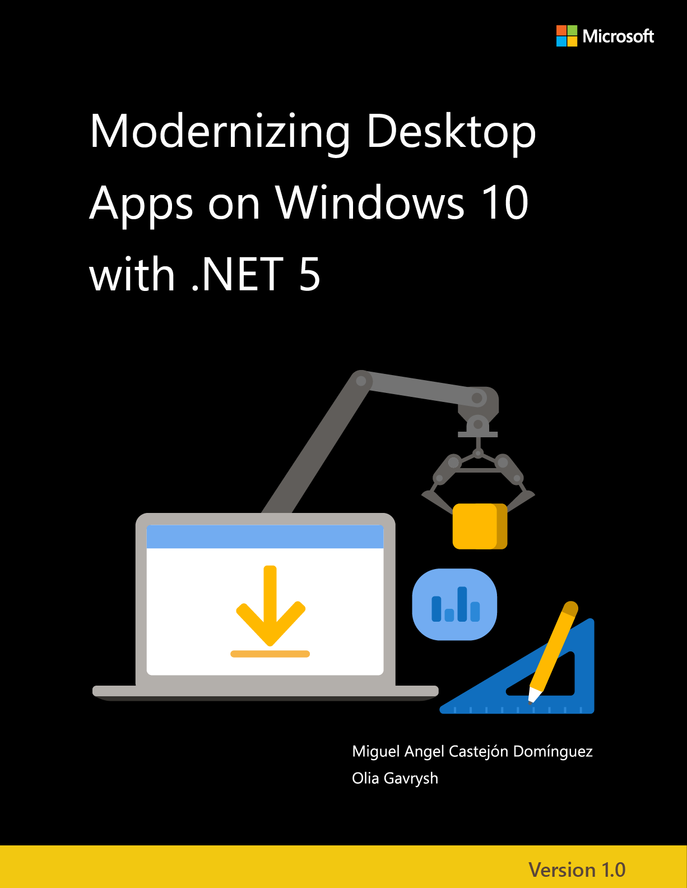

# Modernizing Desktop Apps on Windows 10 with .NET

PUBLISHED BY

Microsoft Developer Division, .NET, and Visual Studio product teams

A division of Microsoft Corporation

One Microsoft Way

Redmond, Washington 98052-6399

Copyright © 2020 by Microsoft Corporation

All rights reserved. No part of the contents of this book may be reproduced or transmitted in any form or by any means without the written permission of the publisher.

This book is provided "as-is" and expresses the author's views and opinions. The views, opinions, and information expressed in this book, including URL and other Internet website references, may change without notice.

Some examples depicted herein are provided for illustration only and are fictitious. No real association or connection is intended or should be inferred.

Microsoft and the trademarks listed at <https://www.microsoft.com> on the "Trademarks" webpage are trademarks of the Microsoft group of companies.

Mac and macOS are trademarks of Apple Inc.

All other marks and logos are property of their respective owners.

Co-Authors:

> **Olia Gavrysh**, Program Manager, .NET team, Microsoft

> **Miguel Angel Castejón Dominguez**, Innovation Architect, Kabel

Participants and reviewers:

> **Maira Wenzel**, Senior Program Manager, .NET team, Microsoft

> **Andy De Gorge**, Senior Content Developer, .NET docs team, Microsoft

> **Miguel Ramos**, Senior Program Manager, Windows Developer Platform team, Microsoft

> **Adam Braden**, Principal Program Manager, Windows Developer Platform team, Microsoft

> **Ricardo Minguez Pablos**, Senior Program Manager, Azure IoT team, Microsoft

> **Nish Anil**, Senior Program Manager, .NET team, Microsoft

> **Beth Massi**, Senior Product Marketing Manager, Microsoft

> **Scott Hunter**, Partner Director Program Manager, .NET team, Microsoft

> **Marta Fuentes Lara**, Kabel

> **Raúl Fernández de Córdoba**, Kabel

> **Antonio Manuel Fernández Cantos**, Kabel

## Introduction

This book is about strategies you can adopt to move your existing desktop applications through the path of modernization and incorporate the latest runtime, language, and platform features. You'll discover that there's no unique recipe as each application is different, and so are your requirements and preferences. The good news is that there are common approaches you can apply to add new features and capabilities to your applications. Some of them won't even require major modifications of your code. In this book, we'll reveal how all those features work behind the scenes and explain the mechanics of their implementations. Moreover, you'll find some common scenarios for modernizing existing desktop applications shown in detail so you can find inspiration for evolving your projects.

Microsoft's approach to modernizing existing applications is to give you the flexibility to create your own customized path. All the modernization strategies described in this book are mostly independent. You can choose ones that are relevant for your application and skip others that aren't important for you. In other words, you can mix and match the strategies to best address your application needs.

## Who should use the book

We wrote this book for developers and solution architects who want to modernize existing Windows Forms and WPF desktop applications to leverage the benefits of .NET and Windows 10.

You might also find this book useful if you're a technical decision maker, such as an enterprise architect or a development lead or director who wants an overview of the benefits of updating existing desktop applications.

## How to use the book

This book addresses the "why"—why you might want to modernize your existing applications, and the specific benefits you get from using NET and MSIX to modernize your desktop apps. The content of the book is designed for architects and technical decision makers who want an overview, but who don't need to focus on implementation and technical, step-by-step details.

Along the different chapters, sample implementation code snippets and screenshots are provided, with chapter 5 devoted to showcase a complete migration process for sample applications.

## What this book doesn't cover

This book covers a specific subset of scenarios that are focused on lift-and-shift scenarios, outlining the way to gain the benefits of modernizing without the effort of rewriting code.

This book isn't about developing modern applications with .NET from scratch or about getting started with Windows Forms and WPF. It focuses on how you can update existing desktop applications with the latest technologies for desktop development.

## Samples used in this book

To highlight the necessary steps to perform a modernization, we'll be using a sample application called `eShopModernizing`. This application has two flavors, Windows Forms and WPF, and we'll show a step-by-step process on how to perform the modernization on both of them to .NET.

Also, on the GitHub repository for this book, you'll find the results of the process, which you can consult with if you decide to follow the step-by-step tutorial.

## Send your feedback

This book and related samples are constantly evolving, so your feedback is welcomed! If you have comments about how this book can be improved, use the feedback section at the bottom of any page built on [GitHub issues](https://github.com/dotnet/docs/issues).

>[!div class="step-by-step"]
>[Next](why-modern-applications.md)
