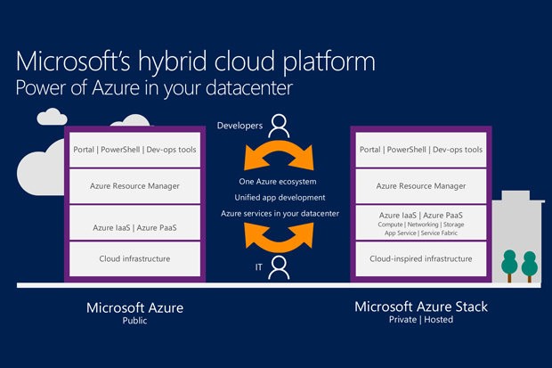

# Migrate to hybrid cloud scenarios

Some organizations and enterprises can't migrate some of their applications to public clouds like Microsoft Azure or any other public cloud due to regulations or their own policies. However, it's likely that any organization might benefit from having some of their applications in the public cloud and other applications on-premises. But a mixed environment can lead to excessive complexity in environments due to different platforms and technologies used in public clouds versus on-premises environments.

Microsoft provides the best hybrid cloud solution, one in which you can optimize your existing assets on-premises and in the public cloud, while you ensure consistency in an Azure hybrid cloud. You can maximize existing skills, and get a flexible, unified approach to building apps that can run in the cloud or on-premises, thanks to Azure Stack (on-premises) and Azure (public cloud).

When it comes to security, you can centralize management and security across your hybrid cloud. You can get control over all assets, from your datacenter to the cloud, by providing single sign-on to on-premises and cloud apps. You accomplish this by extending Active Directory to a hybrid cloud, and by using identity management.

Finally, you can distribute and analyze data seamlessly, use the same query languages for cloud and on-premises assets, and apply analytics and deep learning in Azure to enrich your data, regardless of its source.

## Azure Stack

Azure Stack is a hybrid cloud platform that lets you deliver Azure services from your organization's datacenter. Azure Stack is designed to support new options for your modern applications in key scenarios, like edge and unconnected environments, or meeting specific security and compliance requirements.

Figure 4-13 shows an overview of the true hybrid cloud platform that Microsoft offers.

**Figure 4-13.** Microsoft hybrid cloud platform with Azure Stack and Azure

Azure Stack is offered in two deployment options, to meet your needs:

- Azure Stack integrated systems

- Azure Stack Development Kit

### Azure Stack integrated systems

Azure Stack integrated systems are offered through a partnership of Microsoft and hardware partners. The partnership creates a solution that offers cloud-paced innovation that is balanced with simplicity in management. Because Azure Stack is offered as an integrated system of hardware and software, you get the right amount of flexibility and control, while still adopting innovation from the cloud. Azure Stack integrated systems range in size from 4 to 12 nodes, and are jointly supported by the hardware partner and Microsoft. Use Azure Stack integrated systems to implement new scenarios for your production workloads.

### Azure Stack Development Kit

Microsoft Azure Stack Development Kit is a single-node deployment of Azure Stack, which you can use to evaluate and learn about Azure Stack. You can also use Azure Stack Development Kit as a developer environment, where you can develop using APIs and tooling that are consistent with Azure. Azure Stack Development Kit is not intended to be used as a production environment.

### Additional resources

- **Azure hybrid cloud**

    <https://azure.microsoft.com/overview/hybrid-cloud/>

- **Azure Stack**

    <https://azure.microsoft.com/overview/azure-stack/>

- **Active Directory Service Accounts for Windows Containers**

    <https://docs.microsoft.com/virtualization/windowscontainers/manage-containers/manage-serviceaccounts>

- **Create a container with Active Directory support**

    <https://blogs.msdn.microsoft.com/containerstuff/2017/01/30/create-a-container-with-active-directory-support/>

- **Azure Hybrid Benefit licensing**

    <https://azure.microsoft.com/pricing/hybrid-benefit/>

>[!div class="step-by-step"]
>[Previous](life-cycle-ci-cd-pipelines-devops-tools)
>[Next](../walkthroughs-technical-get-started-overview.md)
