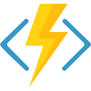

# Azure Functions

Azure functions provide a serverless compute experience. A function is invoked by a *trigger* (such as access to an HTTP endpoint or a timer) and executes a block of code or business logic. Functions also support specialized *bindings* that connect to resources like storage and queues.



The current runtime version 3.0 supports cross-platform .NET Core 3.1 applications. Additional languages besides C# such as JavaScript, F#, and Java are supported. Functions created in the portal provide a rich scripting syntax. Functions created as standalone projects can be deployed with full platform support and capabilities.

For more information, see [Azure Functions documentation](/azure/azure-functions).

## Programming language support

The following languages are all supported in general availability (GA).

|Language      |Supported runtimes|
|--------------|------------------|
|**C#**        |.NET Core 3.1     |
|**JavaScript**|Node 10 & 12      |
|**F#**        |.NET Core 3.1     |
|**Java**      |Java 8            |
|**Python**    |Python 3.6, 3.7, & 3.8|
|**TypeScript**|Node 10 & 12 (via JavaScript)|
|**PowerShell**|PowerShell Core 6|

For more information, see [Supported languages](/azure/azure-functions/supported-languages).

## App service plans

Functions are backed by an *app service plan*. The plan defines the resources used by the functions app. You can assign plans to a region, determine the size and number of virtual machines that will be used, and pick a pricing tier. For a true serverless approach, function apps may use the **consumption** plan. The consumption plan will scale the back end automatically based on load.

Another hosting option for function apps is the [Premium plan](/azure/azure-functions/functions-premium-plan). This plan provides an "always on" instance to avoid cold start, supports advanced features like VNet connectivity, and runs on premium hardware.

For more information, see [App service plans](/azure/app-service/azure-web-sites-web-hosting-plans-in-depth-overview).

## Create your first function

There are three common ways you can create function apps.

- Script functions in the portal.
- Create the necessary resources using the Azure CLI.
- Build functions locally using your favorite IDE and publish them to Azure.

For more information on creating a scripted function in the portal, see [Create your first function in the Azure portal](/azure/azure-functions/functions-create-first-azure-function).

To build from the Azure CLI, see [Create your first function using the Azure CLI](/azure/azure-functions/functions-create-first-azure-function-azure-cli).

To create a function from Visual Studio, see [Create your first function using Visual Studio](/azure/azure-functions/functions-create-your-first-function-visual-studio).

## Understand triggers and bindings

Functions are invoked by a *trigger* and can have exactly one. In addition to invoking the function, certain triggers also serve as bindings. You may also define multiple bindings in addition to the trigger. *Bindings* provide a declarative way to connect data to your code. They can be passed in (input) or receive data (output). Triggers and bindings make functions easy to work with. Bindings remove the overhead of manually creating database or file system connections. All of the information needed for the bindings is contained in a special *functions.json* file for scripts or declared with attributes in code.

Some common triggers include:

- Blob Storage: invoke your function when a file or folder is uploaded or changed in storage.
- HTTP: invoke your function like a REST API.
- Queue: invoke your function when items exist in a queue.
- Timer: invoke your function on a regular cadence.

Examples of bindings include:

- CosmosDB: easily connect to the database to load or save files.
- Table Storage: work with key/value storage from your function app.
- Queue Storage: easily retrieve items from a queue, or place new items on the queue.

The following example *functions.json* file defines a trigger and a binding:

```json
{
  "bindings": [
    {
      "name": "myBlob",
      "type": "blobTrigger",
      "direction": "in",
      "path": "images/{name}",
      "connection": "AzureWebJobsStorage"
    },
    {
      "name": "$return",
      "type": "queue",
      "direction": "out",
      "queueName": "images",
      "connection": "AzureWebJobsStorage"
    }
  ],
  "disabled": false
}
```

In this example, the function is triggered by a change to blob storage in the `images` container. The information for the file is passed in, so the trigger also acts as a binding. Another binding exists to put information onto a queue named `images`.

Here is the C# script for the function:

```csharp
public static string Run(Stream myBlob, string name, TraceWriter log)
{
    log.Info($"C# Blob trigger function Processed blob\n Name:{name} \n Size: {myBlob.Length} Bytes");
    return name;
}
```

The example is a simple function that takes the name of the file that was modified or uploaded to blob storage, and places it on a queue for later processing.

For a full list of triggers and bindings, see [Azure Functions triggers and bindings concepts](/azure/azure-functions/functions-triggers-bindings).

>[!div class="step-by-step"]
>[Previous](azure-serverless-platform.md)
>[Next](application-insights.md)
