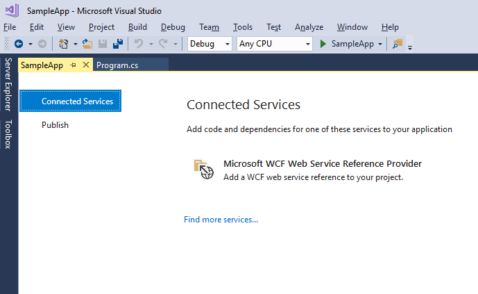
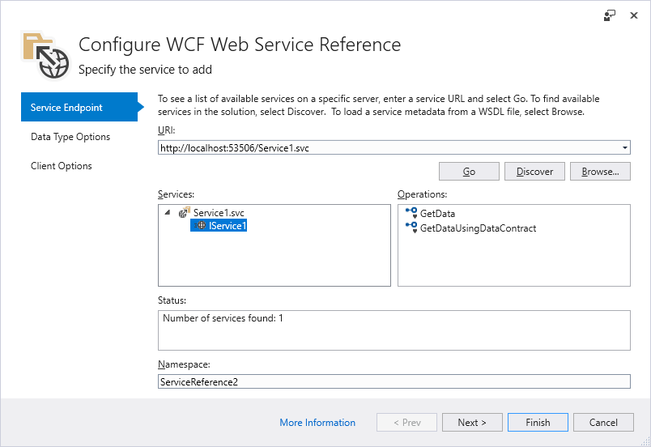
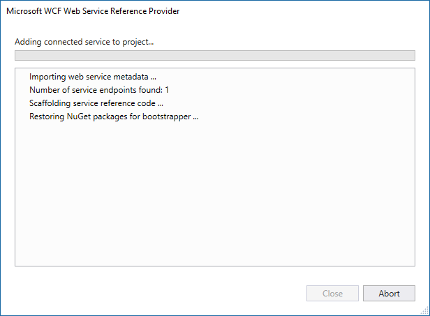

## Microsoft WCF Web Service Reference Provider

Over the years, many Visual Studio developers have enjoyed the productivity that Add Service Reference provides when their .NET Framework projects needed to access Windows Communication Foundation (WCF) services. The WCF team is excited to introduce the WCF Connected Service for .NET Core and ASP.NET Core, a VS extension providing an experience like the Add Service Reference functionality. This tool retrieves metadata from a WCF service in the current solution, locally or on a network, and generates a .NET Core compatible source code file for a WCF client proxy that you can use to access the service.

> [!NOTE]
> You should only reference services from a trusted source. Adding references from an untrusted source may compromise security. 

### How to use the extension

The WCF Web Service Reference VS connected service extension is applicable to projects created using the templates under Visual C# -> .Net Core, Visual C# -> .Net Standard and Visual C# -> Web -> ASP.NET CORE Web Application projects.

Using the ASP.NET Core Web Application project template as an example, I will walk you through adding a WCF service reference to the project:
1. In Solution Explorer, double-click the Connected Services node of a project. A Connected Services page appears as shown below:

2. On this page, click Microsoft WCF Web Service Reference Provider. This will bring up the Configure WCF Web Service Reference wizard:

3. You can either click the Discover button to initiate a search for services that are contained in the current solution, enter a service URL in the Address box and click Go to search for services hosted at the address, or Browse to a WSDL file containing the service metadata information.  The services that are found will be displayed in the Services box and you can select the one you want to use. You can also enter the namespace for the generated code in the Namespace box.

Once a service has been selected you can click Next to visit the Data Type Options and the Client Options pages.  Alternatively, you can click Finish to use default options.

The Data Type Options form offers a few settings for further refining the configuration for the generated service reference, Of particular interest is the option to reuse types in reference assemblies.  This is useful when types needed for generating the service reference code are already referenced in your project, and it is necessary to reuse the existing types to avoid a compile-time type clash.

Depending on the number of project dependencies as well as other system performance factors, it may take some time for type information to be loaded into this form, the Finish button will be disabled during this time unless 'Reuse types' in reference assemblies check box is unchecked.

4. Click Finish when you are done.

This will download metadata from the WCF service, generate the service reference code in a file named 'reference.cs', and add it to your project under the Connected Services node. The project file (.csproj) will also be updated with NuGet package references required for your project to compile and run on the target platform.

You can now create instances of the WCF client types generated by the tool and communicate with your web service as desired.

### Release Notes
* [Release history](https://github.com/dotnet/wcf/blob/master/release-notes/WCF-Web-Service-Reference-notes.md)

### Known Issues
We are hard at work to address these known issues in future releases:

* Reuse Types in referenced assemblies check box is disabled. This can happen when a project targets the full .NET Framework, e.g., ‘net46’ or targets multiple frameworks, e.g., ‘<TargetFrameworks>netcoreapp1.0;netcoreapp1.1</TargetFrameworks>’. Given the differences of API surface between different frameworks, it becomes challenging to reuse types in the same generated service reference code. To work around the issue, you can generate a service reference by temporarily updating the project to only target either one of .NET Core frameworks or .NET Standard. 

### Feedback & Questions
If you have any questions or feedback, please [open an issue on GitHub](https://github.com/dotnet/wcf/issues/new) so we can follow up with you. You can also review any existing questions or issues [at this site](https://github.com/dotnet/wcf/issues?utf8=%E2%9C%93&q=is:issue%20label:tooling%20).
