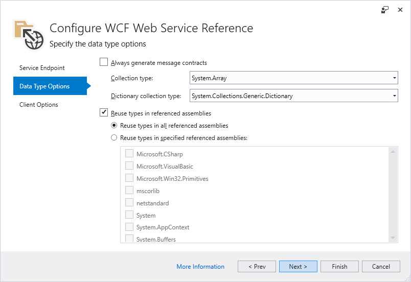

## Microsoft WCF Web Service Reference Provider

Over the years, many Visual Studio developers have enjoyed the productivity that the [Add Service Reference](https://msdn.microsoft.com/en-us/library/bb386382.aspx) tool provided when their .NET Framework projects needed to access Windows Communication Foundation (WCF) services. The WCF team is excited to introduce the **WCF Web Service Reference** tool, a Visual Studio connected service extension providing an experience like the Add Service Reference functionality for .NET Core and ASP.NET Core projects. This tool retrieves metadata from a WCF service in the current solution, from a WSDL file or on a network location, and generates a .NET Core compatible source file containing WCF client proxy code that you can use to access the web service.

> [!!IMPORTANT]
> You should only reference services from a trusted source. Adding references from an untrusted source may compromise security. 

### How to use the extension

The **WCF Web Service Reference** option is applicable to projects created using the templates under **Visual C#** -> **.Net Core**, **Visual C#** -> **.Net Standard**, and **Visual C#** -> **Web** -> **ASP.NET Core Web Application** projects.

Using the **ASP.NET Core Web Application** project template as an example, I will walk you through adding a WCF service reference to the project:

1. In Solution Explorer, double-click the **Connected Services** node of the project (for a .Net Core or .Net Standard project this option is available from the context menu of the **Dependencies** node). The **Connected Services** page appears as shown below:

2. On this page, click **Microsoft WCF Web Service Reference Provider**. This will bring up the **Configure WCF Web Service Reference** wizard:

3. You can either click the **Discover** button to initiate a search for services defined in the current solution, enter a service URL in the **Address** box and click the **Go** button to search for services hosted at the specifed address, or click the **Browse** button to select a WSDL file containing the web service metadata information. The services that are found will be displayed in the **Services** box and you can select the one you want to use. You can also enter the namespace for the generated code in the corresponding **Namespace** text box.

Once a service has been selected you can click the **Next** button to visit the **Data Type Options** and the **Client Options** pages. Alternatively, you can click the **Finish** button to use the default options.

The **Data Type Options** form offers a few options for further refining the configuration settings for the generated service reference. Of particular interest is the option to reuse data types in referenced assemblies. This is useful when data types needed for generating the service reference code are already defined in one of the referenced assemblies in your project, in this case it is necessary to reuse existing types to avoid compile-time type clash or runtime issues.

Depending on the number of project dependencies as well as other system performance factors, it may take some time for type information to be loaded into this form, the **Finish** button will be disabled during this time unless the **Reuse types in referenced assemblies** check box is unchecked.

4. Click Finish when you are done.

This will download metadata from the WCF service, generate the service reference code in a file named `reference.cs`, and add it to your project under the **Connected Services** node. The project file (.csproj) will also be updated with NuGet package references required for your project to compile and run on the target platform.

You can now create instances of the WCF client types generated by the tool and communicate with your web service as desired.

### Release Notes
* [Release history](https://github.com/dotnet/wcf/blob/master/release-notes/WCF-Web-Service-Reference-notes.md)

### Known Issues
We are hard at work to address these known issues in future releases:

* Reuse Types in referenced assemblies check box is disabled. This can happen when a project targets the full .NET Framework, e.g., `net46` or targets multiple frameworks, e.g., `<TargetFrameworks>netcoreapp1.0;netcoreapp1.1</TargetFrameworks>`. Given the differences of API surface offered by the different frameworks, it becomes challenging to reuse types in the same generated service reference code. To work around the issue, you can generate a service reference by temporarily updating the project to target only one of the .NET Core framework or .NET Standard versions.

### Feedback & Questions
If you have any questions or feedback, please [open an issue on GitHub](https://github.com/dotnet/wcf/issues/new) so we can follow up with you. You can also review any existing questions or issues from [at this site](https://github.com/dotnet/wcf/issues?utf8=%E2%9C%93&q=is:issue%20label:tooling).
