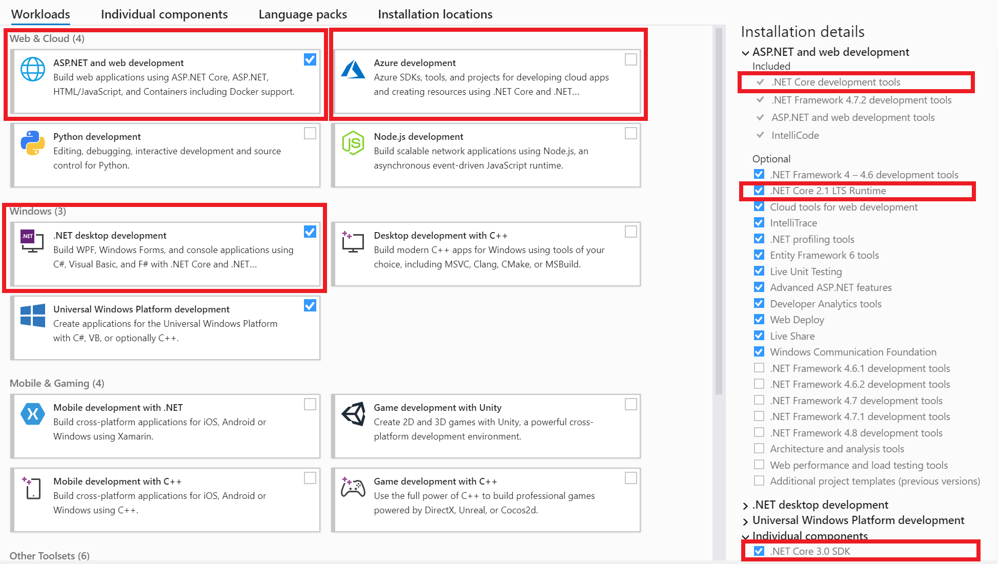
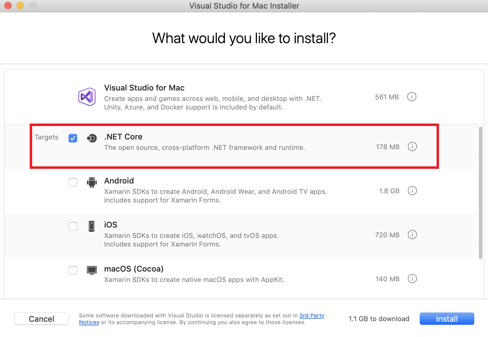

# .NET Core acquisition experiences

There are various Acquisition options for .NET Core - 
* [Visual Studio and Visual Studio Code](#Visual-Studio-and-Visual-Studio-Code)
* [https://dot.net (Microsoft .NET site)](#httpsdotnet-Microsoft-NET-site)
* [Dotnet-install.ps1/.sh Scripts](#Dotnet-install.ps1.sh-Scripts)
* [Docker](#Docker)
* [Linux Package Managers](#Linux-Package-Managers)
* [Azure DevOps pipeline Installer Task](#Azure-DevOps-pipeline-Installer-Task)
* [Snap store](#Snap-store)
* [.NET Core on GitHub](#NET-Core-on-GitHub)

Each of these choices has their own strengths. Some options support both initial acquisition, and subsequent notification of updates for the .NET Core runtime and tools, while others don't support update notifications.

|Acquisition Choice|Acquire|Update|
|:-|:-:|:-:|
[Visual Studio and Visual Studio Code](#Visual-Studio-and-Visual-Studio-Code)   | ✔️ | ✔️ |
[https://dot.net (Microsoft .NET site)](#httpsdotnet-Microsoft-NET-site)        | ✔️ | ❌ |
[Dotnet-install.ps1/.sh Scripts](#Dotnet-install.ps1.sh-Scripts)                | ✔️ | ✔️ |
[Docker](#Docker)                                                               | ✔️ | ✔️ |
[Linux Package Managers](#Linux-Package-Managers)                               | ✔️ | ✔️\*|
[Azure DevOps pipeline Installer Task](#Azure-DevOps-pipeline-Installer-Task)   | ✔️ | ✔️ |
[Snap store](#Snap-store)                                                       | ✔️ | ✔️ |
[.NET Core on GitHub](#NET-Core-on-GitHub)                                      | ✔️ | ❌ |

_\*Some package Managers provide update notifications__

Additionally, differences between these choices make some of them a great option for developers while others are better suited for DevOps and IT administrators.

|Acquisition Choice|Great For Developers|Great For DevOps/ IT Admins|
|:-|:-:|:-:|
[Visual Studio and Visual Studio Code](#Visual-Studio-and-Visual-Studio-Code)   | ✔️ | ❌ |
[https://dot.net (Microsoft .NET site)](#httpsdotnet-Microsoft-NET-site)        | ✔️ | ✔️ |
[Dotnet-install.ps1/.sh Scripts](#Dotnet-install.ps1.sh-Scripts)                | ✔️ | ✔️ |
[Docker](#Docker)                                                               | ✔️ | ✔️ |
[Linux Package Managers](#Linux-Package-Managers)                               | ✔️ | ✔️ |
[Azure DevOps pipeline Installer Task](#Azure-DevOps-pipeline-Installer-Task)   | ❌ | ✔️ |
[Snap store](#Snap-store)                                                       | ✔️ | ✔️ |
[.NET Core on GitHub](#NET-Core-on-GitHub)                                      | ✔️ | ❌ |

Let's look at each of these choices for .NET Core acquisition in further detail.

## Visual Studio and Visual Studio Code

Developers often acquire and update the .NET Core tools and runtime by installing Visual Studio or Visual Studio for Mac. 

### Visual Studio for Windows
Each version of Visual Studio installs the latest .NET Core SDK tools, and one or more runtimes so you can target your app to run on the .NET Core runtime version of your choice.

Selecting any of the managed workloads for Web, Desktop or Azure development will install the .NET Core development tools and runtime.

In recent previews of Visual Studio 2019 Update 3, we have made changes to the installation experience for .NET Core in order to make the experience more streamlined and efficient. More details about this can be found in the blog post [Improving .NET Core installation in Visual Studio and on Windows](https://devblogs.microsoft.com/dotnet/improving-net-core-installation-in-visual-studio-and-on-windows/). 

### Visual Studio for MacOS

The latest release version of the .NET Core tools are installed when you install Visual Studio for Mac and select the .NET Core workload. To get started with .NET Core development on MacOS, see [Install Visual Studio 2019 for Mac](https://docs.microsoft.com/visualstudio/mac/installation?view=vsmac-2019).

Note: .NET Core 2.x development is supported on MacOS 10.12 “Sierra” and later. 

For more information about .NET Core development on MacOS, see [Get started with .NET Core on macOS using Visual Studio for Mac](https://docs.microsoft.com/dotnet/core/tutorials/using-on-mac-vs).

## Visual Studio Code

Visual Studio Code is a lightweight but powerful source code editor that runs on your desktop and is available for Windows, MacOS, and Linux. 
While VS Code does not come with .NET Core support in the box, adding .NET Core support is straightforward. You can do this with only a couple of steps.

1. [Install .NET Core](https://dotnet.microsoft.com/download/dotnet-core)
2. [Install the C# extension for VS Code from the Marketplace](https://marketplace.visualstudio.com/items?itemName=ms-vscode.csharp)

## https://dot.net (Microsoft .NET site)

The [Microsoft .NET](https://dot.net/) site is your one stop shop for all things .NET, from [downloads for the latest installers](https://dotnet.microsoft.com/download) for your platform to [Getting Started](https://docs.microsoft.com/dotnet/core/get-started?tabs=windows) guides, and [Tutorials](https://docs.microsoft.com/dotnet/core/tutorials/).

This site provides downloads for the native installers (MSI for Windows, PKG for MacOS), and tar.gz files for download, installation, and redistribution with your app.

## Dotnet-install.ps1/.sh Scripts

The dotnet-install scripts are used to perform a non-admin installation of the .NET Core SDK. The .NET Core SDK includes both the .NET Core CLI tools and the shared runtime.

The primary usage scenario of these scripts is in automation scenarios and non-admin installations. 
There are two scripts: one is a PowerShell script that works on Windows and everywhere that PowerShell is supported including [Linux](https://azure.microsoft.com/blog/powershell-is-open-sourced-and-is-available-on-linux/) and [MacOS](https://docs.microsoft.com/powershell/scripting/install/installing-powershell-core-on-macos?view=powershell-6). The other is a bash script that works on Linux/MacOS. Both scripts have the same behavior.

For more information about these scripts, see [dotnet-install scripts reference](https://docs.microsoft.com/dotnet/core/tools/dotnet-install-script).

## Docker

Containers provide a lightweight way to isolate your application from the rest of the host system, sharing just the kernel, and using resources given to your application.
.NET Core can run in a Docker container. Official .NET Core Docker images are published to the Microsoft Container Registry (MCR) and are discoverable at the [Microsoft .NET Core Docker Hub repository](https://hub.docker.com/_/microsoft-dotnet-core/). Each repository contains images for different combinations of the .NET (SDK or Runtime) and OS that you can use.
Microsoft provides images that are tailored for specific scenarios. For example, the [ASP.NET Core repository](https://hub.docker.com/_/microsoft-dotnet-core-aspnet/) provides images that are built for running ASP.NET Core apps in production.

For more information about using .NET Core in a Docker container, see [Introduction to .NET and Docker](https://docs.microsoft.com/dotnet/core/docker/intro-net-docker) and [Samples](https://github.com/dotnet/dotnet-docker/blob/master/samples/README.md).

## Azure App Services
Various Azure services support containers. You create a Docker image for your application and deploy it to one of the following services:
- [Azure Kubernetes Service (AKS)](https://azure.microsoft.com/services/kubernetes-service/)  
  Scale and orchestrate Linux containers using Kubernetes.
- [Azure App Service](https://azure.microsoft.com/services/app-service/containers/)  
  Deploy web apps or APIs using Linux containers in a PaaS environment.
- [Azure Container Instances](https://azure.microsoft.com/services/container-instances/)  
  Host your container in the cloud without any higher-level management services.
- [Azure Batch](https://azure.microsoft.com/services/batch/)  
  Run repetitive compute jobs using containers.
- [Azure Service Fabric](https://azure.microsoft.com/services/service-fabric/)  
  Lift, shift, and modernize .NET applications to microservices using Windows Server containers
- [Azure Container Registry](https://azure.microsoft.com/services/container-registry/)  
  Store and manage container images across all types of Azure deployments.

You can find more information about deploying your app in a container in the document [Containerize a .NET Core app](https://docs.microsoft.com/dotnet/core/docker/build-container).

## Linux Package Managers

* .NET Core packages are available in native package managers for various Linux distros encompassing .deb and .rpm based systems. 

  Information about getting .NET Core using a package manager can be found in the document titled [Preparing your Linux system for .NET Core – Using a package manager](https://github.com/dotnet/core/blob/4b39c16ccae64a69799f642f49f3fbf742623a9c/Documentation/linux-setup.md#installation-using-a-package-manager).

  More information about working with .NET Core packages on various Linux distros is available here:

  * [Install .NET Core SDK on Linux](https://dotnet.microsoft.com/download/linux-package-manager/rhel/sdk-2.2.402)
  * [Install .NET Core Runtime on Linux](https://dotnet.microsoft.com/download/linux-package-manager/rhel/runtime-2.2.7)

  To review instructions for other package managers, change the distro selected at the top of the page. 

* _Starting with RedHat Enterprise Linux 8, you can find the .NET Core Runtime & tools directly as the “dotnet” package in the [AppStream repository](https://developers.redhat.com/blog/2018/11/15/rhel8-introducing-appstreams/).__

## Azure DevOps pipeline Installer Task

Azure DevOps provides a Task that can be used in build or release pipelines to deploy .NET Core. You can use the [.NET Core Installer Task](https://docs.microsoft.com/azure/devops/pipelines/tasks/tool/dotnet-core-tool-installer?view=azure-devops) to acquire a specific version of .NET Core from the Internet or the tools cache and add it to the PATH. This task can also be used to change the version of .NET Core that is used in subsequent tasks like [.NET Core cli task](https://github.com/Microsoft/azure-pipelines-tasks/tree/master/Tasks/DotNetCoreCLIV2).

## Snap Store

Snaps are an emerging application installation and sandboxing technology. These are app packages that are easy to install, work across multiple distros of Linux and dependency-free. 

The [Snap Store](https://snapcraft.io/store) provides a place to upload snaps, and for users to browse and install snaps. [Snaps](https://forum.snapcraft.io/t/system-options/87) update automatically but you can manually control when and how often these updates.

.NET Core packages are available in the Snap Store.  More details about getting .NET Core as a Snap install can be found in the document titled [Preparing your Linux system for .NET Core – Installation using Snap](https://github.com/dotnet/core/blob/4b39c16ccae64a69799f642f49f3fbf742623a9c/Documentation/linux-setup.md#installation-using-snap).

Visit [Snapcraft.io](https://snapcraft.io/) for guidance on preparing your system to use Snaps. 

## .NET Core on GitHub

.NET Core sources are available in public repositories on GitHub. Building from source is covered in depth in the document titled [Build .NET Core from source](https://docs.microsoft.com/dotnet/core/build/).

 

## Updates and Notifications

.NET Core provides a robust metadata file for discovering updates. For more information about this, see [.NET Core Update Discovery](../update-discovery-and-deploy.md).

