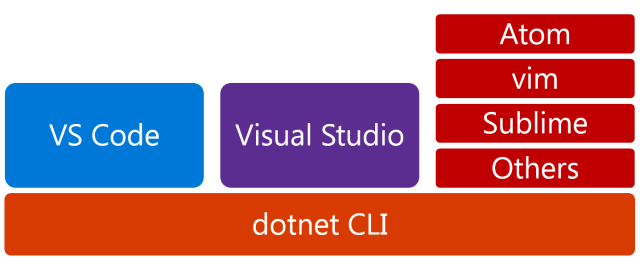
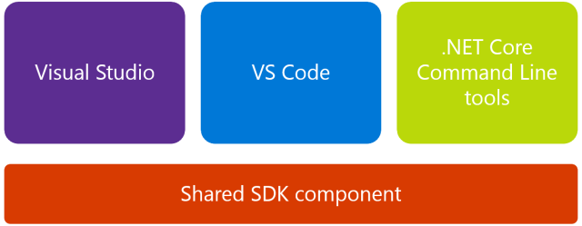

# High level overview of changes in CLI Preview 3

This document will describe in high-level the changes that moving from `project.json` to MSBuild and `csproj` project system bring. It will outline the new way the tooling is layered all-up and which new pieces are available and what is their place in the overall picture. After reading this article, you should have a better understanding of all of the pieces that make up .NET Core tooling after moving to MSBuild and `csproj`. 

> [!NOTE]
> This article is **not required** to use the Preview 3 .NET Core Command Line tools. you can continue using the tools as you are 
> used to. This article is here to complete the picture of how the move to MSBuild changes the overall "layering" and the architecture of 
> the command line tools. 

## Moving away from project.json
The biggest change in the Preview 3 tooling for .NET Core is certainly the [move away from project.json to csproj](https://blogs.msdn.microsoft.com/dotnet/2016/05/23/changes-to-project-json/) as the project system. Preview 3 version of the command line tools is the first release of .NET Core command line tooling that does not contain any support for project.json. That means that it cannot be used to build, run or publish project.json based applications and libraries. In order to use this version of the tools, you will need to migrate your existing projects or start new ones. 

As part of this move, the custom build engine that was developed to build project.json projects was replaced with a mature and fully capable build engine called [MSBuild](https://github.com/Microsoft/msbuild). MSBuild is a well-known engine in the .NET community, since it has been a key technology since the platform's first release. Of course, because it needs to build .NET Core applications, MSBuild has been ported to .NET Core and can be used on any platform that .NET Core runs on. One of the main promises of .NET Core is that of a cross-platform development stack, and we have made sure that this move does not break that promise.

> [!NOTE]
> If you are new to MSBuild and would like to learn more about it, you can start by reading 
> the [existing documentation](https://msdn.microsoft.com/en-us/library/dd637714.aspx). 

## The tooling layers
With the move away from the existing project system as well as with building engine switches, the question that naturally follows is do any of these changes change the overall "layering" of the whole .NET Core tooling ecosystem? Are there new bits and components?

Let's start with a quick refresher on Preview 2 layering as shown in the following picture:

The layering of the tools is quite simple. At the bottom we have the .NET Core Command Line tools as a foundation. All other, higher-level tools such as Visual Studio or VS Code, depend and rely on the CLI to build projects, restore dependencies and so on. This meant that, for example, if Visual Studio wanted to perform a restore operation, it would call into `dotnet restore` command in the CLI. 

With the move to the new project system, the previous diagram changes: 

The main difference is that the CLI is not the foundational layer anymore; this role is now filled by the "shared SDK component". This shared SDK component is a set of targets and associated tasks that are responsible for compiling your code, publishing it, packing nuget packages etc. The SDK itself is open-source and is available on GitHub on the [SDK repo](https://github.com/dotnet/sdk). 

> [!NOTE]
> A "target" is an MSBuild term that indicates a named operation that MSBuild can invoke. It is usually coupled with one or more tasks that execute some logic that the target is supposed to do. MSBuild supports many ready-made targets such as `Copy` or `Execute`; it also allows users to write their own tasks using managed code and define targets to execute those tasks. You can read more about MSBuild tasks on [MSDN](https://msdn.microsoft.com/en-us/library/ms171466.aspx). 

All the toolsets now consume the shared SDK component and its targets, CLI included. For example, the next version of Visual Studio will not call into `dotnet restore` command to restore dependencies for .NET Core projects, it will use the "Restore" target directly. Since these are MSBuild targets, you can also use raw MSBuild to execute them using the [dotnet msbuild](dotnet-msbuild.md) command. 

### Preview 3 CLI commands
The shared SDK component means that the majority of existing CLI commands have been re-implemented as MSBuild tasks and targets. What does this mean for the CLI commands and your usage of the toolset? 

From an usage perspective, it doesn't change the way you use the CLI. The CLI still has the core commands that exist in Preview 2 release:

* `new`
* `restore`
* `run` 
* `build`
* `publish`
* `test`
* `pack` 

These commands still do what you expect them to do (new up a project, build it, publish it, pack it and so on). Majority of the options are not changed, and are still there, and you can consult either the commands' help screens (using `dotent <command> --help`) or Preview 3 documentation on this site to get familiar with any changes. 

From an execution perspective, the CLI commands will take their parameters and construct a call to "raw" MSBuild that will set the needed properties and run the desired target. To better illustrate this, consider the following command: 

    dotnet publish -o pub -c Release
    
This command is publishing an application into a `pub` folder using the "Release" configuration. Internally, this command gets translated into the following MSBuild invocation: 

    dotnet msbuild /t:Publish /p:OutputPath=pub /p:Configuration=Release

The notable exception to this rule are `new` and `run` commands, as they have not been implemented as MSBuild targets. 

## Conclusion 
This document outlined at a high-level the changes that are happening to the overall CLI tooling architecture and functioning that are coming with Preview 3. It has introduced the notion of the shared SDK component as well as explained how the CLI commands function, from a technical perspective, in Preview 3. 

