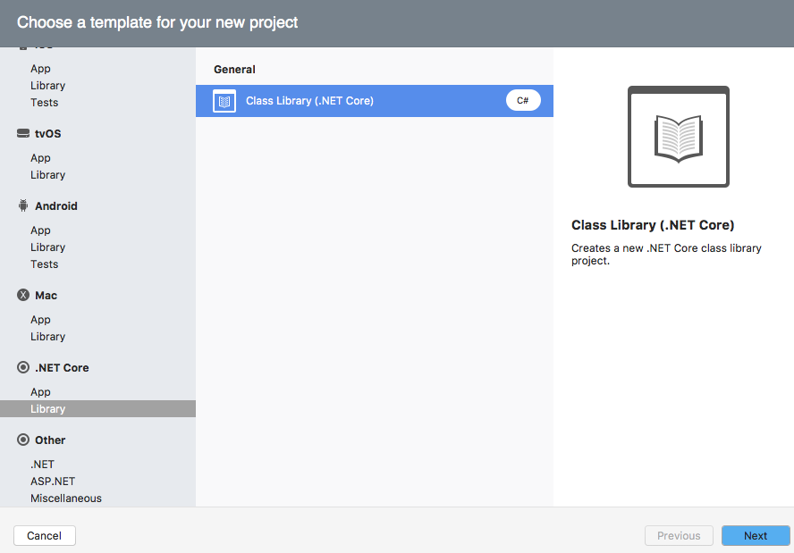
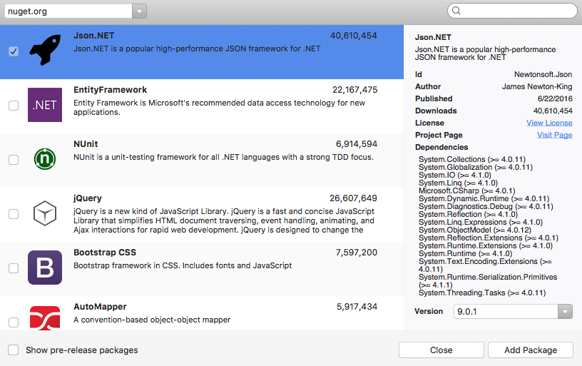
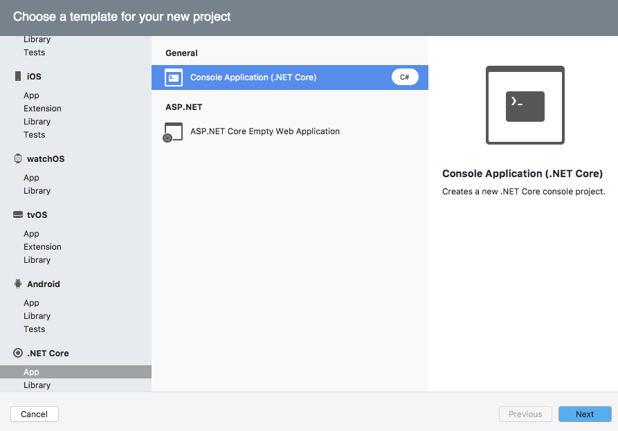
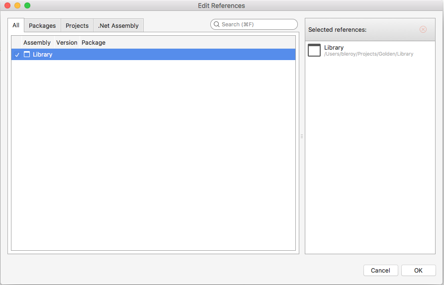
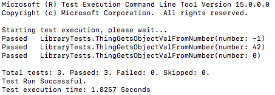
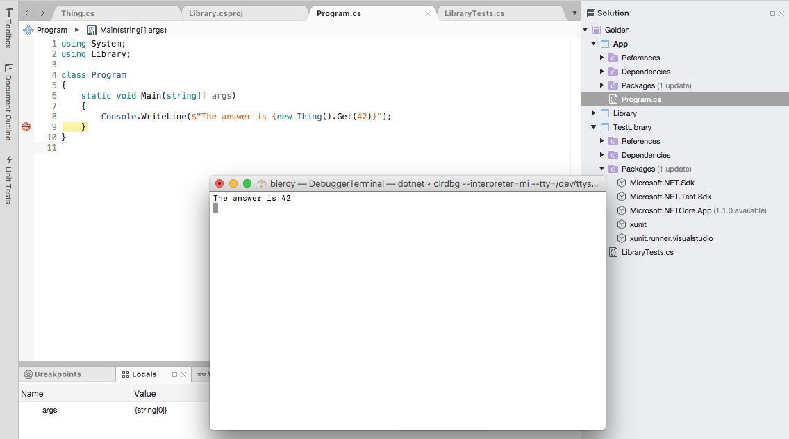

---
title: Building a complete .NET Core solution on macOS, using Visual Studio for Mac
description: Building a complete .NET Core solution on macOS, using Visual Studio for Mac
keywords: .NET, .NET Core, macOS, Mac
author: bleroy
manager: wpickett
ms.date: 11/16/2016
ms.topic: article
ms.prod: .net-core
ms.technology: .net-core-technologies
ms.devlang: dotnet
ms.assetid: d743134a-08a3-4ff6-aab7-49f71f0568c3
---

# Building a complete .NET Core solution on macOS, using Visual Studio for Mac

by [Bertrand Le Roy](https://github.com/bleroy)

Visual Studio for Mac provides a full-featured development environment for developing .NET Core applications. The procedures in this document describe the steps necessary to build a typical .NET Core solution that includes reusable libraries, testing, and using third-party libraries.

> Visual Studio for Mac is preview software

## Prerequisites

Follow the instructions on [our prerequisites page](../macos-prerequisites.md) to update your environment.

# A solution using only .NET Core projects

## Writing the library

1. In Visual Studio, choose **New Project**. In the new project dialog, choose **Library** under **.NET Core**, then select **Class Library (.NET Core)**. Click **Next**.

   

2. Name the project "Library" and the solution "Golden". Leave **Create a project directory within the solution directory** checked. Click **Create**.

   
   
3. By default, the current project template sets the .NET Standard version to 1.4. We'll bump it up to 1.6. Right-click the project and choose **Tools / Edit File**. Change `<TargetFramework>netstandard1.4</TargetFramework>` to `<TargetFramework>netstandard1.6</TargetFramework>`. Save.

4. In the solution explorer, open the context menu for the **Dependencies** node and choose **Add Packages...**.

5. Choose "nuget.org" as the Package source, and check **Json.NET**. Click **Add Package**. The package should now appear under **Dependencies/NuGet** and be automatically restored. [Json.NET](http://www.newtonsoft.com/json) is the recommended library and what our code will use to perform [JSON](http://www.json.org/) serialization and deserialization.

   

6. Rename the `MyClass.cs` file to `Thing.cs`. Also rename the class and constructor `Thing`. Add a method: `public int Get(int number) => Newtonsoft.Json.JsonConvert.DeserializeObject<int>($"{number}");`

7. On the **Build** menu, choose **Build All**.

   The solution should build without error.

### Writing the test project

1. In the solution explorer, open the context menu for the Golden solution node and choose **Add**, **Add New Project...**. In the new project dialog, choose **.NET Core / App** (and not **Library**), and then **Console Application (.NET Core)**. Click **Next**. Name the new project "TestLibrary" and click **Create**.

   

2. In the **TestLibrary** project, open the context menu for the **References** node and choose **Edit References...**. Check the Library project and click **OK**. This adds a reference to your library from the test project.

   

3. The testing framework that we'll use in this tutorial is [xUnit](https://xunit.github.io/). Right-click **Packages** under the solution explorer and choose **Add Packages...**. Search for xunit, check "xUnit.net" and click **Add Package** (the version you see may vary; the latest is usually the best choice).

   
   
   Do the same for `Microsoft.NET.Test.Sdk` and "xunit.runner.visualstudio". Those libraries enable the command-line test runner to work.

4. Rename the `Program.cs` file to `LibraryTests.cs`, then open it and change the code to:

    ```csharp
    using Library;
    using Xunit;
    
    public class LibraryTests
        [Theory]
        [InlineData(42)]
        [InlineData(0)]
        [InlineData(-1)]
        public void ThingGetsObjectValFromNumber(int number)
        {
            Assert.Equal(number, new Thing().Get(number));
        }
    }
    ```

   You should now be able to build the solution.
   
5. At the time of writing, Visual Studio for Mac doesn't integrate NUnit tests to its built-in test runner. We will still be able to run tests, but from the command-line. Right-click the `TestLibrary` project, and choose **Tools / Open in Terminal** from the menu. In the command-line, enter `dotnet test`.
   
   The tests should pass.

   

### Writing the console app

1. In Solution Explorer, open the context menu for the solution, and add a new **Console Application (.NET Core)** project. Name it "App".

2. In the **App** project, open the context menu for the **References** node and choose **Add**,  **Reference**. In the **Reference Manager** dialog, check **Library** under the **Projects**, **Solution** node, and then click **OK**.

3. Open the `Program.cs` file, add a `using Library;` directive to the top of the file, and then add `Console.WriteLine($"The answer is {new Thing().Get(42)}");` to the `Main` method.

8. Set a breakpoint after the line that you just added.

9. Click the play button or **Run / Start Debugging** to run the application..

   The application should build without error, and should hit the breakpoint. You should also be able to check that the application output "The answer is 42.".

   
