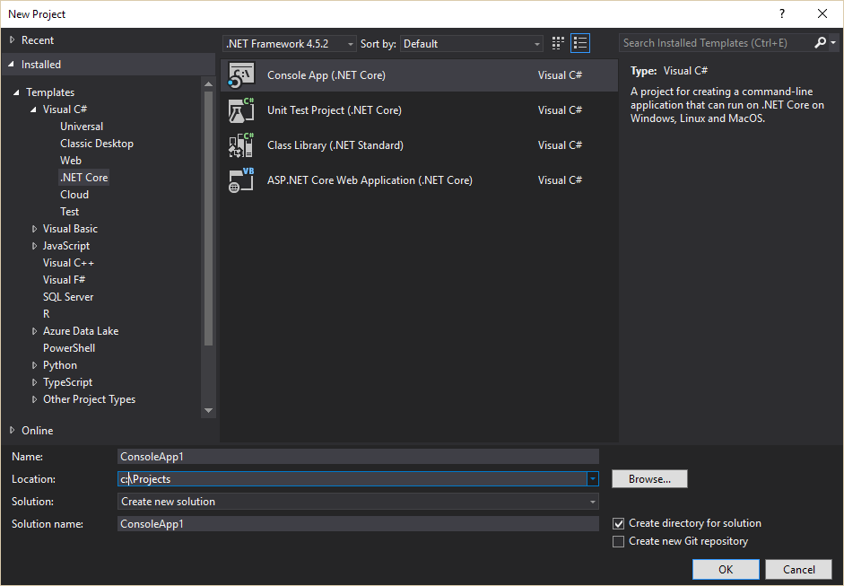

# Getting started with .NET Core on Windows, using Visual Studio 2017

by [Bertrand Le Roy](https://github.com/bleroy) and [Phillip Carter](https://github.com/cartermp)

Visual Studio 2017 provides a full-featured development environment for developing .NET Core applications. The procedures in this document describe the steps necessary to build a very simple console application, using Visual Studio and .NET Core.

## Prerequisites

Follow the instructions on [our prerequisites page](../windows-prerequisites.md) to update your environment.

## Getting Started

The following steps will set up Visual Studio 2017 for .NET Core console application development:

1. Open Visual Studio, and on the **File** menu, choose **New**, **Project**.

2. In the **New Project** dialog, in the **Templates** list, expand the **Visual C#** node and choose **.NET Core**. You should see three four project templates for **Console App (.NET Core)**, **Unit Test Project (.NET Core)**, **Class Library (.NET Core)**, and **ASP.NET Core Web Application (.NET Core)**. Choose **Console App (.NET Core)**, type a name for your project, pick a location, then click OK.

  

3. The resulting project has a single C# file that will output "Hello World" to the console.

  

You may run this application in debug mode using F5, or in release mode using CTRL+F5. You may also set breakpoints to interrupt execution and inspect variables, or start writing more interesting code.

Happy coding!

## What to do next

After this simple introduction, you're probably wondering how to build more advanced solutions, with reusable libraries and tests. The [Building a complete .NET Core solution on Windows, using Visual Studio 2017](using-on-windows-vs-2017-full-solution.md) topic will show you how to do that.
