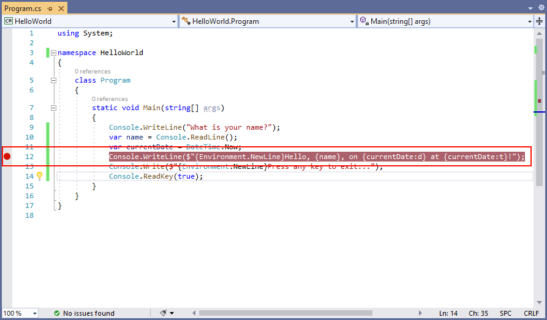
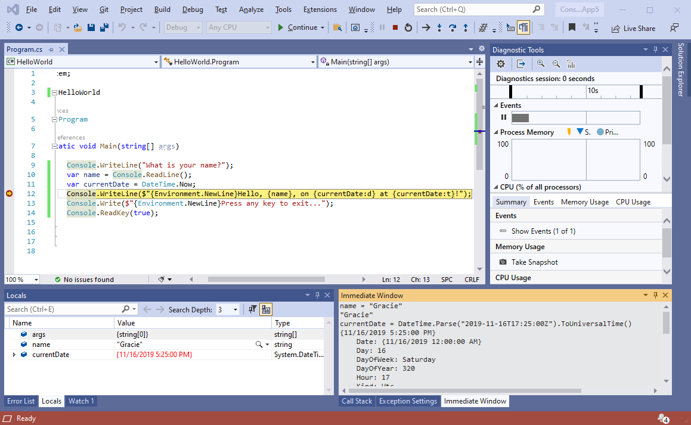
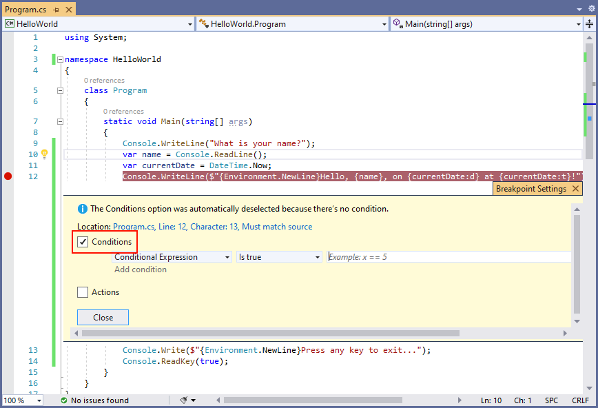
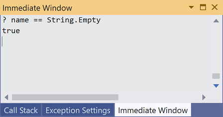
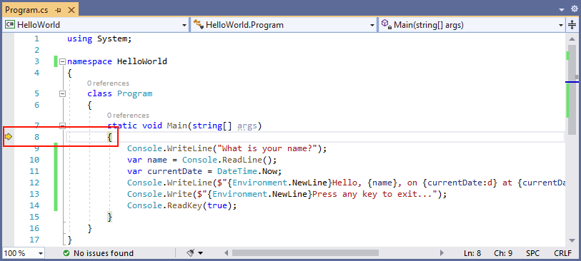
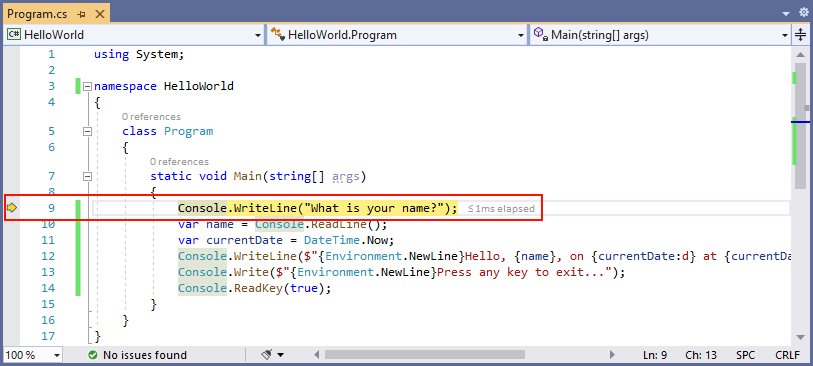
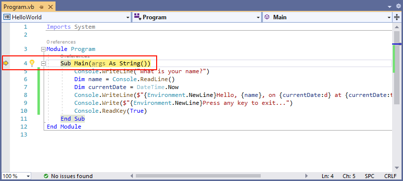
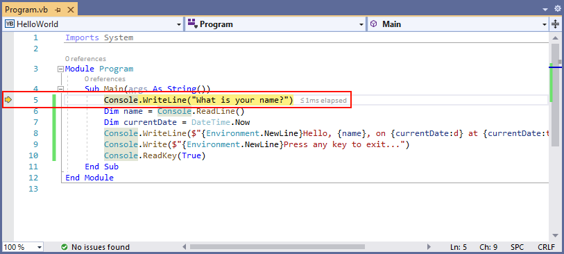

# Debug your C# or Visual Basic .NET Core Hello World application using Visual Studio

So far, you've followed the steps in [Create your first .NET Core console application in Visual Studio](with-visual-studio.md) to create and run a simple console application. Once you've written and compiled your application, you can begin testing it. Visual Studio includes a comprehensive set of debugging tools that you can use when testing and troubleshooting your application.

## Debug build configuration

*Debug* and *Release* are two of Visual Studio's default build configurations. The current build configuration is shown on the toolbar. The following toolbar image shows that Visual Studio is configured to compile the Debug version of the app:


Begin by running the Debug version of your app. The Debug build configuration turns off most compiler optimizations and provides richer information during the build process.

## Set a breakpoint

Run your program and try a few debugging features:

<!-- markdownlint-disable MD025 -->

# [C#](#tab/csharp)

1. A *breakpoint* temporarily interrupts the execution of the application *before* the line with the breakpoint is executed.

   Set a breakpoint on the line that reads `Console.WriteLine($"\nHello, {name}, on {date:d} at {date:t}!");` by clicking in the left margin of the code window on that line. You can also set a breakpoint by placing the caret in the line of code and then pressing **F9** or choosing **Debug** > **Toggle Breakpoint** from the menu bar. As the following image shows, Visual Studio indicates the line on which the breakpoint is set by highlighting it and displaying a red circle in its left margin.

   

1. Run the program in Debug mode by selecting the **HelloWorld** button with the green arrow on the toolbar, pressing **F5**, or choosing **Debug** > **Start Debugging**.

1. Enter a string in the console window when the program prompts for a name, and then press **Enter**.

1. Program execution stops when it reaches the breakpoint and before the `Console.WriteLine` method executes. The **Locals** window displays the values of variables that are defined in the currently executing method.

   

1. The **Immediate** window lets you interact with the application you're debugging. You can interactively change the value of variables to see how it affects your program.

   1. If the **Immediate** window is not visible, display it by choosing **Debug** > **Windows** > **Immediate**.

   1. Enter `name = "Gracie"` in the **Immediate** window and press the **Enter** key.

   1. Enter `date = DateTime.Parse("11/16/2019 5:25 PM")` in the **Immediate** window and press the **Enter** key.

   The **Immediate** window displays the value of the string variable and the properties of the <xref:System.DateTime> value. In addition, the values of the variables are updated in the **Locals** window.

   

1. Continue program execution by selecting the **Continue** button in the toolbar or by selecting **Debug** > **Continue**. The values displayed in the console window correspond to the changes you made in the **Immediate** window.

   

1. Press any key to exit the application and stop debugging.

# [Visual Basic](#tab/vb)

1. A *breakpoint* temporarily interrupts the execution of the application *before* the line with the breakpoint is executed.

   Set a breakpoint on the line that reads `Console.WriteLine($"{vbCrLf}Hello, {name}, on {currentDate:d} at {currentDate:t}!")` by clicking in the left margin of the code window on that line. You can also set a breakpoint by placing the caret on the desired line and then choosing **Debug** > **Toggle Breakpoint** from the menu bar. As the following figure shows, Visual Studio indicates the line on which the breakpoint is set by highlighting it and displaying a red circle in its left margin.

   

1. Run the program in Debug mode by selecting the **HelloWorld** button with the green arrow on the toolbar, pressing **F5**, or choosing **Debug** > **Start Debugging**.

1. Enter a string in the console window when the program prompts for a name and press **Enter**.

1. Program execution stops when it reaches the breakpoint and before the `Console.WriteLine` method executes. The **Locals** window displays the values of variables that are defined in the currently executing method.

1. The **Immediate** window lets you interact with the application you're debugging. You can interactively change the value of variables to see how it affects your program.

   1. If the **Immediate** window is not visible, display it by choosing **Debug** > **Windows** > **Immediate**.

   1. Enter `name = "Gracie"` in the **Immediate** window and press the **Enter** key.

   1. Enter `date = DateTime.Parse("11/16/2019 5:25 PM")` in the **Immediate** window and press the **Enter** key.

   The values of the variables are updated in the **Locals** window.

1. Continue program execution by selecting the **Continue** button in the toolbar or by selecting the **Debug** > **Continue** menu item. The values displayed in the console window correspond to the changes you made in the **Immediate** window.

   

1. Press any key to exit the application and stop debugging.

---

## Set a conditional breakpoint

Your program displays the string that the user enters. What happens if the user doesn't enter anything? You can test this with a useful debugging feature called a *conditional breakpoint*, which breaks program execution when one or more conditions are met.

To set a conditional breakpoint and test what happens when the user fails to enter a string, do the following:

# [C#](#tab/csharp)

1. Right-click on the red dot that represents the breakpoint. On the context menu, select **Conditions** to open the **Breakpoint Settings** dialog. Check the box for **Conditions** if it's not already selected.

   

1. For the **Conditional Expression**, replace "e.g. x == 5" with the following:

   ```csharp
   String.IsNullOrEmpty(name)
   ```

   You're testing for a code condition, that the `String.IsNullOrEmpty(name)` method call is `true` either because `name` has not been assigned a value or because its value is an empty string (""). Instead of a conditional expression, you can also specify a *hit count*, which interrupts program execution before a statement is executed a specified number of times, or a *filter condition*, which interrupts program execution based on such attributes as a thread identifier, process name, or thread name.

1. Select **Close** to close the dialog.

1. Start the programming with debugging by pressing **F5**.

1. In the console window, press the **Enter** key when prompted to enter your name.

1. Because the condition you specified, `name` is either `null` or <xref:System.String.Empty?displayProperty=nameWithType>, has been satisfied, program execution stops when it reaches the breakpoint and before the `Console.WriteLine` method executes.

1. Select the **Locals** window, which shows the values of variables that are local to the currently executing method. In this case, `Main` is the currently executing method. Observe that the value of the `name` variable is `""`, or <xref:System.String.Empty?displayProperty=nameWithType>.

1. Confirm the value is an empty string by entering the following statement in the **Immediate** window and pressing **Enter**. The result is `true`.

   ```csharp
   ? name == String.Empty
   ```

   

1. Select the **Continue** button on the toolbar to continue program execution.

1. Press any key to close the console window and stop debugging.

1. Clear the breakpoint by clicking on the dot in the left margin of the code window or by choosing **Debug > Toggle Breakpoint** while the line of code is selected.

# [Visual Basic](#tab/vb)

1. Right-click on the red dot that represents the breakpoint. On the context menu, select **Conditions** to open the **Breakpoint Settings** dialog. Check the box for **Conditions**.

   

1. For the **Conditional Expression** replace "e.g. x = 5" with the following:

   ```vb
   String.IsNullOrEmpty(name)
   ```

   You're testing for a code condition, that the `String.IsNullOrEmpty(name)` method call is `true` either because `name` has not been assigned a value or because its value is an empty string (""). Instead of a conditional expression, you can also specify a *hit count*, which interrupts program execution before a statement is executed a specified number of times, or a *filter condition*, which interrupts program execution based on such attributes as a thread identifier, process name, or thread name.

1. Select **Close** to close the dialog.

1. Start the programming with debugging by pressing **F5**.

1. In the console window, press the **Enter** key when prompted to enter your name.

1. Because the condition you specified, `name` is either `null` or <xref:System.String.Empty?displayProperty=nameWithType>, has been satisfied, program execution stops when it reaches the breakpoint and before the `Console.WriteLine` method executes.

1. Select the **Locals** window, which shows the values of variables that are local to the currently executing method. In this case, `Main` is the currently executing method. Observe that the value of the `name` variable is `""`, or <xref:System.String.Empty?displayProperty=nameWithType>.

1. Confirm the value is an empty string by entering the following statement in the **Immediate** window and pressing **Enter**. The result is `true`.

   ```vb
   ? String.IsNullOrEmpty(name)
   ```

  

1. Select the **Continue** button on the toolbar to continue program execution.

1. Press any key to close the console window and stop debugging.

1. Clear the breakpoint by clicking on the dot in the left margin of the code window or by choosing the **Debug > Toggle Breakpoint** menu item with the row selected.

---
## Step through a program

Visual Studio also allows you to step line by line through a program and monitor its execution. Ordinarily, you'd set a breakpoint and use this feature to follow program flow through a small part of your program code. Since your program is small, you can step through the entire program:

# [C#](#tab/csharp)

1. On the menu bar, choose **Debug** > **Step Into** or press **F11**. Visual Studio highlights and displays an arrow beside the next line of execution.

   

   At this point, the **Locals** window shows that your program has defined only one variable, `args`. Because you haven't passed any command-line arguments to the program, its value is an empty string array. In addition, Visual Studio has opened a blank console window.

1. Select **Debug** > **Step Into** or press **F11**. Visual Studio now highlights the next line of execution. As the image shows, it has taken less than one millisecond to execute the code between the last statement and this one. `args` remains the only declared variable, and the console window remains blank.

   

1. Select **Debug** > **Step Into** or press **F11**. Visual Studio highlights the statement that includes the `name` variable assignment. The **Locals** window shows that `name` is `null`, and the console window displays the string "What is your name?".

1. Respond to the prompt by entering a string in the console window and pressing **Enter**. The console is unresponsive, and the string you entered isn't displayed in the console window, but the <xref:System.Console.ReadLine%2A?displayProperty=nameWithType> method will nevertheless capture your input.

1. Select **Debug** > **Step Into** or press **F11**. Visual Studio highlights the statement that includes the `date` variable assignment. The **Locals** window shows the value returned by the call to the <xref:System.Console.ReadLine%2A?displayProperty=nameWithType> method. The console window also displays the string you entered at the prompt.

1. Select **Debug** > **Step Into** or press **F11**. The **Locals** window shows the value of the `date` variable after the assignment from the <xref:System.DateTime.Now?displayProperty=nameWithType> property. The console window is unchanged.

1. Select **Debug** > **Step Into** or press **F11**. Visual Studio calls the <xref:System.Console.WriteLine(System.String,System.Object,System.Object)?displayProperty=nameWithType> method. The console window displays the formatted string.

1. Select **Debug** > **Step Out** or press **Shift**+**F11**. This stops step-by-step execution. The console window displays a message and waits for you to press a key.

1. Press any key to close the console window and stop debugging.

# [Visual Basic](#tab/vb)

1. On the menu bar, choose **Debug** > **Step Into** or press **F11**. Visual Studio highlights and displays an arrow beside the next line of execution.

   

   At this point, the **Locals** window shows that your program has defined only one variable, `args`. Because you haven't passed any command-line arguments to the program, its value is an empty string array. In addition, Visual Studio has opened a blank console window.

1. Select **Debug** > **Step Into** or press **F11**. Visual Studio now highlights the next line of execution. As the figure shows, it has taken less than one millisecond to execute the code between the last statement and this one. `args` remains the only declared variable, and the console window remains blank.

   

1. Select **Debug** > **Step Into** or press **F11**. Visual Studio highlights the statement that includes the `name` variable assignment. The **Locals** window shows that `name` is `Nothing`, and the console window displays the string "What is your name?".

1. Respond to the prompt by entering a string in the console window and pressing **Enter**. The console is unresponsive, and the string you enter isn't displayed in the console window, but the <xref:System.Console.ReadLine%2A?displayProperty=nameWithType> method will nevertheless capture your input.

1. Select **Debug** > **Step Into** or press **F11**. Visual Studio highlights the statement that includes the `currentDate` variable assignment. The **Locals** window shows the value returned by the call to the <xref:System.Console.ReadLine%2A?displayProperty=nameWithType> method. The console window also displays the string entered when the console prompted for input.

1. Select **Debug** > **Step Into** or press **F11**. The console window is unchanged.

1. Select **Debug** > **Step Into** or press **F11**. Visual Studio calls the <xref:System.Console.WriteLine(System.String,System.Object,System.Object)?displayProperty=nameWithType> method. The console window displays the formatted string.

1. Select **Debug** > **Step Out** or press **Shift**+**F11**. This stops step-by-step execution. The console window displays a message and waits for you to press a key.

1. Press any key to close the console window and stop debugging.

---

## Build a Release version

Once you've tested the Debug version of your application, you should also compile and test the Release version. The Release version incorporates compiler optimizations that can sometimes negatively affect the behavior of an application. For example, compiler optimizations that are designed to improve performance can create race conditions in asynchronous or multithreaded applications.

To build and test the Release version of your console application, change the build configuration on the toolbar from **Debug** to **Release**.


When you press **F5** or choose **Build Solution** from the **Build** menu, Visual Studio compiles the Release version of the application. You can test it as you did the Debug version.

## Next steps

Once you've debugged your application, the next step is to publish a deployable version of the app. For information on how to do this, see [Publish the Hello World application with Visual Studio](publishing-with-visual-studio.md).
