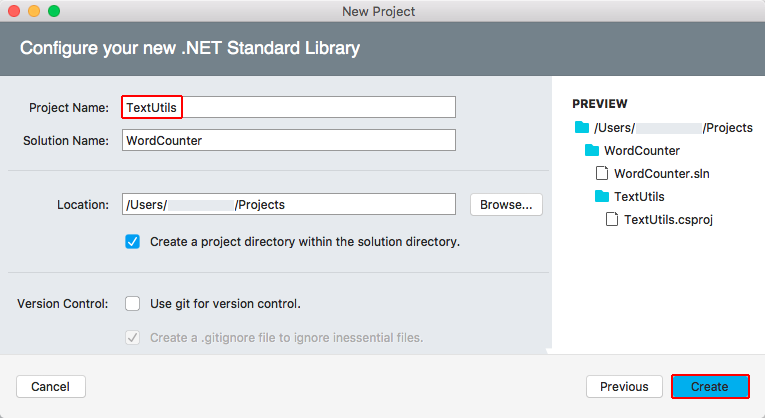
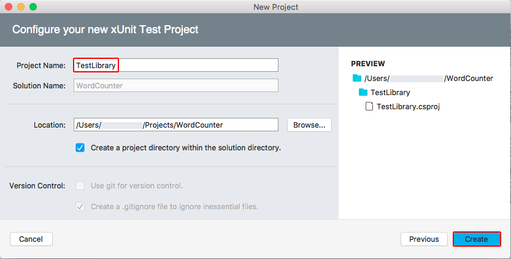

---
title: Building a complete .NET Core solution on macOS using Visual Studio for Mac | Microsoft Docs
description: Building a complete .NET Core solution on macOS, using Visual Studio for Mac
keywords: .NET, .NET Core, macOS, Mac
author: guardrex
ms.author: mairaw
ms.date: 03/16/2017
ms.topic: article
ms.prod: .net-core
ms.devlang: dotnet
ms.assetid: 6945bedf-5bf3-4955-8588-83fb87511b79
---

# Building a complete .NET Core solution on macOS using Visual Studio for Mac

Visual Studio for Mac provides a full-featured Integrated Development Environment (IDE) for developing .NET Core applications. This topic walks you through building a .NET Core solution that includes reusable libraries, unit testing, and third-party libraries.

> [!NOTE]
> Visual Studio for Mac is preview software. As with all preview versions of Microsoft products, your feedback is highly valued. There are a number of ways you can provide feedback to the development team on Visual Studio for Mac:
> * Select **Help > Report Problem** from the menu bar or **Report a Problem** from the Welcome page, which will open a window for filing a bug report.
> * To make a suggestion, select **Help > Provide a Suggestion** from the menu bar or **Provide a Suggestion** from the Welcome page, which will take you to the [Visual Studio for Mac UserVoice webpage](https://visualstudio.uservoice.com/forums/563332-visual-studio-for-mac).

## Prerequisites

[.NET Core and OpenSSL](https://www.microsoft.com/net/core#macos)

For more information on prerequisites, see the [Prerequisites for .NET Core on Mac](../core/macos-prerequisites.md).

## Getting started

If you've already installed the prerequisites and Visual Studio for Mac, skip this section and proceed to [Building a library](#building-a-library). Follow these steps to install the prerequisites and Visual Studio for Mac:

1. Download and install [.NET Core and OpenSSL](https://www.microsoft.com/net/core#macos).

1. Download the [Visual Studio for Mac installer](https://www.visualstudio.com/vs/visual-studio-mac/). Double-click the icon to run the installer. Read and accept the license agreement. During the install, you're provided the opportunity to install Xamarin, a cross-platform mobile app development technology. Installing Xamarin and its related components is optional for .NET Core development. For a walk-through of the Visual Studio for Mac install process, see [Introducing Visual Studio for Mac](https://developer.xamarin.com/guides/cross-platform/visual-studio-mac/). When the install is complete, start the Visual Studio for Mac IDE.

## Building a library

1. In Visual Studio, choose **New Project**. In the new project dialog, choose **Library** under **.NET Core**, then select **Class Library (.NET Core)**. Select **Next**.

   

1. Name the project "Library" and the solution "Golden". Leave **Create a project directory within the solution directory** checked. Select **Create**.

   
   
1. By default, the current project template sets the .NET Standard version to 1.4. We'll bump it up to 1.6. Right-click the project and choose **Tools > Edit File**. Change `<TargetFramework>netstandard1.4</TargetFramework>` to `<TargetFramework>netstandard1.6</TargetFramework>`. Save.

1. In the solution explorer, open the context menu for the **Dependencies** node and choose **Add Packages**.

1. Choose "nuget.org" as the Package source, and check **Json.NET**. Select **Add Package**. The package should now appear under **Dependencies/NuGet** and be automatically restored. [Json.NET](http://www.newtonsoft.com/json) is the recommended library and what our code will use to perform [JSON](http://www.json.org/) serialization and deserialization.

   

1. Rename the *MyClass.cs* file to *Thing.cs*. Also rename the class and constructor `Thing`. Add a method: `public int Get(int number) => Newtonsoft.Json.JsonConvert.DeserializeObject<int>($"{number}");`

1. On the **Build** menu, choose **Build All**.

   The solution should build without error.

## Creating a test project

1. In the solution explorer, open the context menu for the Golden solution node and choose **Add**, **Add New Project**. In the new project dialog, choose **.NET Core > App** (and not **Library**), and then **Console Application (.NET Core)**. Select **Next**. Name the new project "TestLibrary" and select **Create**.

   

1. In the **TestLibrary** project, open the context menu for the **References** node and choose **Edit References**. Check the Library project and select **OK**. This adds a reference to your library from the test project.

   

1. The testing framework that we'll use in this tutorial is [xUnit](https://xunit.github.io/). Right-click **Packages** under the solution explorer and choose **Add Packages**. Search for xunit, check "xUnit.net" and select **Add Package** (the version you see may vary; the latest is usually the best choice).

   
   
   Do the same for `Microsoft.NET.Test.Sdk` and "xunit.runner.visualstudio". Those libraries enable the command-line test runner to work.

1. Rename the *Program.cs* file to *LibraryTests.cs*, then open it and change the code to:

    ```cs
    using Library;
    using Xunit;
    
    public class LibraryTests
        [Theory]
        [InlineData(42)]
        [InlineData(0)]
        [InlineData(-1)]
        public void ThingGetsObjectValFromNumber(int number)
        {
            Assert.Equal(number, new Thing().Get(number));
        }
    }
    ```

   You should now be able to build the solution.
   
1. Currently, Visual Studio for Mac doesn't integrate NUnit tests to its built-in test runner. You will still be able to run tests, but from the command-line. Right-click the `TestLibrary` project, and choose **Tools > Open in Terminal** from the menu. In the command-line, enter `dotnet test`.
   
   The tests should pass.

   

## Adding a console app

1. In Solution Explorer, open the context menu for the solution, and add a new **Console Application (.NET Core)** project. Name it "App".

1. In the **App** project, open the context menu for the **References** node and choose **Add**, **Reference**. In the **Reference Manager** dialog, check **Library** under the **Projects**, **Solution** node, and then select **OK**.

1. Open the *Program.cs* file, add a `using Library;` directive to the top of the file, and then add `Console.WriteLine($"The answer is {new Thing().Get(42)}");` to the `Main` method.

1. Set a breakpoint after the line that you just added.

1. Select the play button or **Run > Start Debugging** to run the application.

   The application should build without error, and should hit the breakpoint. You should also be able to check that the application output "The answer is 42."

   
