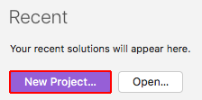

# Getting started with .NET Core on macOS using Visual Studio for Mac

Visual Studio for Mac provides a full-featured Integrated Development Environment (IDE) for developing .NET Core applications. This topic walks you through building a simple console application using Visual Studio for Mac and .NET Core.

> [!NOTE]
> Visual Studio for Mac is preview software.

## Prerequisites

* [.NET Core and OpenSSL](https://www.microsoft.com/net/core#macos)
* [Visual Studio for Mac](https://www.visualstudio.com/vs/visual-studio-mac/)

For more information on prerequisites, see the [Prerequisites for .NET Core on Mac](../core/macos-prerequisites.md).

## Getting Started

Follow these steps to set up Visual Studio for Mac for .NET Core console application development:

1. Download and install [.NET Core and OpenSSL](https://www.microsoft.com/net/core#macos).

1. Download the [Visual Studio for Mac installer](https://www.visualstudio.com/vs/visual-studio-mac/). Double-click the icon to run the installer. Read and accept the license agreement. When the install is complete, start the Visual Studio for Mac IDE.

## Creating a project

1. Select **New Project**.

   

1. In the new project dialog, select **App** under **.NET Core**, then **Console Application (.NET Core)**.

   

   Select **Next**.

1. Give your new project a name. We'll use "Hello" in this tutorial. You may optionally specify a different parent folder for the new project.

   

   Select **Create**.

1. The resulting project has a single C# file that will output "Hello World" to the console. Restoring the dependencies will take a few seconds.

   

## Run the application

You may run this application in debug mode using F5, or in release mode using CTRL+F5. You may also set breakpoints to interrupt execution and inspect variables, or start writing more interesting code.

Happy coding!

## Next step

The [Building a complete .NET Core solution on macOS using Visual Studio for Mac](using-on-mac-vs-full-solution.md) topic will show you how to build a complete .NET Core solution that includes reusable libraries, unit testing, and third-party libraries.
