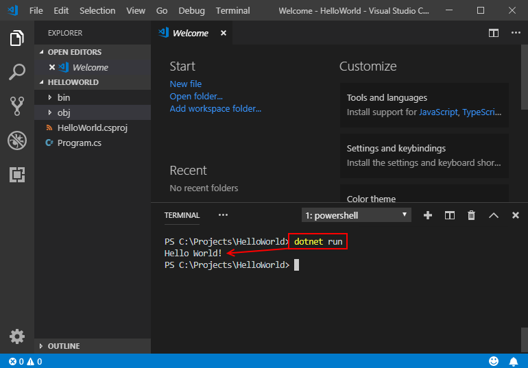
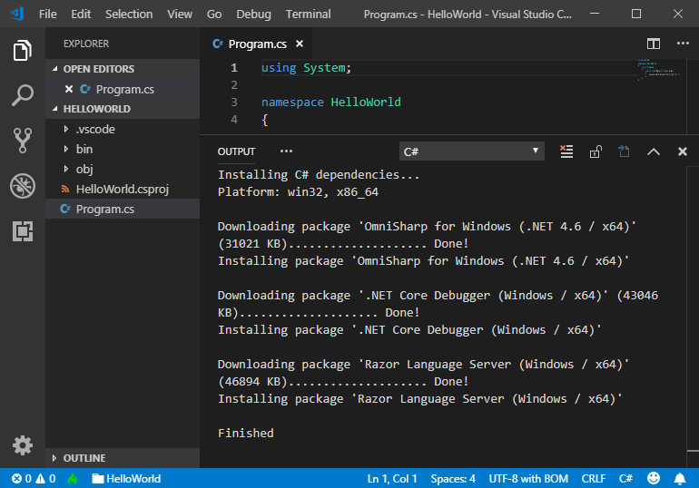

# Tutorial: Create a console application with .NET Core using Visual Studio Code

This tutorial shows how to create and run a .NET Core console application by using Visual Studio Code and the .NET Core CLI. Project tasks, such as creating, compiling, and running a project are done by using the CLI, so you can follow this tutorial with a different code editor and run commands in a terminal if you prefer.

## Prerequisites

1. [Visual Studio Code](https://code.visualstudio.com/) with the [C# extension](https://marketplace.visualstudio.com/items?itemName=ms-dotnettools.csharp) installed. For information about how to install extensions on Visual Studio Code, see [VS Code Extension Marketplace](https://code.visualstudio.com/docs/editor/extension-gallery).
2. The [.NET Core 3.1 SDK or later](https://dotnet.microsoft.com/download)

## Create the app

1. Open Visual Studio Code.

1. Create a project.

   1. Select **File** > **Open Folder**/**Open...** from the main menu, create a *HelloWorld* folder, and click **Select Folder**/**Open**.

      The folder name becomes the project name and the namespace name by default. You'll add code later in the tutorial that assumes the project namespace is `HelloWorld`.

   1. Open the **Terminal** in Visual Studio Code by selecting **View** > **Terminal** from the main menu.

      The **Terminal** opens with the command prompt in the *HelloWorld* folder.

   1. In the **Terminal**, enter the following command:

      ```dotnetcli
      dotnet new console
      ```

The Console Application template for .NET Core defines a class, `Program`, with a single method, `Main`, that takes a <xref:System.String> array as an argument. The *Program.cs* file has the following code:

```csharp
using System;

namespace HelloWorld
{
    class Program
    {
        static void Main(string[] args)
        {
            Console.WriteLine("Hello World!");
        }
    }
}
```

`Main` is the application entry point, the method that's called automatically by the runtime when it launches the application. Any command-line arguments supplied when the application is launched are available in the *args* array.

The template creates a simple application that calls the <xref:System.Console.WriteLine(System.String)?displayProperty=nameWithType> method to display "Hello World!" in the console window.

## Run the app

Run the following command in the **Terminal**:

```dotnetcli
dotnet run
```

The program displays "Hello World!" and ends.



## Enhance the app

Enhance the application to prompt the user for their name and display it along with the date and time.

1. Open *Program.cs* by clicking on it.

   The first time you open a C# file in Visual Studio Code, [OmniSharp](https://www.omnisharp.net/) loads in the editor.

   

1. Select **Yes** when Visual Studio Code prompts you to add the missing assets to build and debug your app.

   

1. Replace the contents of the `Main` method in *Program.cs*, which is currently just the line that calls `Console.WriteLine`, with the following code:

   :::code language="csharp" source="./snippets/with-visual-studio/csharp/Program.cs" id="Snippet1":::

   This code displays "What is your name?" in the console window and waits until the user enters a string followed by the **Enter** key. It stores this string in a variable named `name`. It also retrieves the value of the <xref:System.DateTime.Now?displayProperty=nameWithType> property, which contains the current local time, and assigns it to a variable named `date`. Finally, it displays these values in the console window.

   The `\n` represents a newline character.

   The dollar sign (`$`) in front of a string lets you put expressions such as variable names in curly braces in the string. The expression value is inserted into the string in place of the expression. This syntax is referred to as [interpolated strings](../../csharp/language-reference/tokens/interpolated.md).

1. Save your changes.

   > [!IMPORTANT]
   > In Visual Studio Code, you have to explicitly save changes. Unlike Visual Studio, file changes are not automatically saved when you build and run an app.

1. Run the program again:

   ```dotnetcli
   dotnet run
   ```

1. Respond to the prompt by entering a name and pressing the **Enter** key.

   :::image type="content" source="media/debugging-with-visual-studio-code/run-modified-program.png" alt-text="Terminal window with modified program output":::

1. Press any key to exit the program.

## Additional resources

- [Setting up Visual Studio Code](https://code.visualstudio.com/docs/setup/setup-overview)

## Next steps

In this tutorial, you created a .NET Core application. In the next tutorial, you debug the app.

> [!div class="nextstepaction"]
> [Debug a .NET Core console application using Visual Studio Code](debugging-with-visual-studio-code.md)
