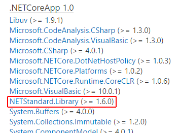
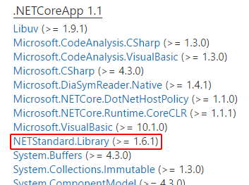

# .NET Core Versioning

.NET Core is a platform of [NuGet packages](../packages.md), of frameworks and distributed as a unit. Each of these platform layers can be versioned separately for product agility and to accurately describe product changes. While there is significant versioning flexibility, there is a desire to version the platform as a unit to make the product easier to understand.

The product is in some respects unique, being described and delivered via a package manager (NuGet) as packages. While you typically acquire .NET Core as a standalone SDK, the SDK is largely a convenience experience over NuGet packages and therefore not distinct from packages. As a result, versioning is first and foremost in terms of packages and other versioning experiences follow from there.

## Semantic Versioning

.NET Core uses [Semantic Versioning (SemVer)](http://semver.org/), adopting the use of major.minor.patch versioning, using the various parts of the version number to describe the degree and kind of change.

The following versioning template is generally applied to .NET Core. There are cases where it has been adapted to fit with existing versioning. These cases are described later in this document. For example, frameworks are only intended to represent platform and API capabilities, which aligns with major/minor versioning.

### Versioning Form

MAJOR.MINOR.PATCH[-PRERELEASE-BUILDNUMBER]

### Decision Tree

MAJOR when:
  - drop support for a platform
  - adopt a newer MAJOR version of an existing dependency 
  - disable a compatibility quirk off by default

MINOR when:
  - add public API surface area 
  - add new behavior
  - adopt a newer MINOR version of an existing dependency
  - introduce a new dependency 
  
PATCH when:
  - make bug fixes
  - add support for a newer platform
  - adopt a newer PATCH version of an existing dependency
  - any other change (not otherwise captured)

When determining what to increment when there are multiple changes, choose the highest kind of change.

## Versioning Scheme

.NET Core can be defined as and will version in the following way:

- A runtime and framework implementation, distributed as packages. Each package is versioned independently, particularly for patch versioning.
- A set of metapackages that reference fine-grained packages as a versioned unit. Metapackages are versioned separately from packages.
- A set of frameworks (for example, `netstandard`) that represent a progressively larger API set, described in a set of versioned snapshots.

### Packages

Library packages evolve and version independently. Packages that overlap with .NET Framework System.\* assemblies typically use 4.x versions, aligning with the .NET Framework 4.x versioning (a historical choice). Packages that do not overlap with the .NET Framework libraries (for example, [System.Reflection.Metadata](https://www.nuget.org/packages/System.Reflection.Metadata)) typically start at 1.0 and increment from there.

The packages described by [NETStandard.Library](https://www.nuget.org/packages/NETStandard.Library) are treated specially due to being at the base of the platform.

- NETStandard.Library packages will typically version as a set, since they have implementation-level dependencies between them.
- APIs will only be added to NETStandard.Library packages as part of major or minor .NET Core releases, since doing so would require adding a new `netstandard` version. This is in addition to SemVer requirements.

### Metapackages

Versioning for .NET Core metapackages is based on the framework that they map to. The metapackages adopt the highest version number of the framework (for example, netstandard1.6) it maps to in its package closure. 

The patch version for the metapackage is used to represent updates to the metapackage to reference updated packages. Patch versions will never include an updated framework version. As a result, the metapackages are not strictly SemVer compliant because their versioning scheme doesn't represent the degree of change in the underlying packages, but primarily the API level. 

There are two primary metapackages for .NET Core.

**NETStandard.Library**

- v1.6 as of .NET Core 1.0 (these versions won't typically or intentionally match).
- Maps to the `netstandard` framework. 
- Describes the packages that are considered required for modern app development and that .NET platforms must implement to be considered a [.NET Standard](../../standard/library.md) platform.

**Microsoft.NETCore.App**

- v1.0 as of .NET Core 1.0 (these versions will match).
- Maps to the `netcoreapp` framework.
- Describes the packages in the .NET Core distribution.

Note: [`Microsoft.NETCore.Portable.Compatibility`](https://www.nuget.org/packages/Microsoft.NETCore.Portable.Compatibility) is another .NET Core metapackage. It doesn't map to a particular framework, so versions like a package.

### Frameworks

Framework versions are updated when new APIs are added. They have no concept of patch version, since they represent API shape and not implementation concerns. Major and minor versioning will follow the SemVer rules specified earlier.

The `netcoreapp` framework is tied to the .NET Core distribution. It will follow the version numbers used by .NET Core. For example, when .NET Core 2.0 is released, it will target `netcoreapp2.0`. The `netstandard` framework will not match the versioning scheme of any .NET runtime, given that it is equally applicable to all of them.

## Versioning in Practice

There are commits and PRs on .NET Core repos on GitHub on a daily basis, resulting in new builds of many libraries. It is not practical to create new public versions of .NET Core for every change. Instead, changes will be aggregated over some loosely-defined period of time (for example, weeks or months) before making a new public stable .NET Core version.

A new version of .NET Core could mean several things:

- New versions of packages and metapackages.
- New versions of various frameworks, assuming the addition of new APIs.
- New version of the .NET Core distribution.

### Shipping a patch release

Patch-level changes (no new APIs) are made to .NET Core libraries to fix bugs and improve performance and reliability. The various metapackages are updated to reference the updated .NET Core library packages. The metapackages are versioned as patch updates (x.y.z). Frameworks are not updated. A new .NET Core distribution is released with a matching version number to the `Microsoft.NETCore.App` metapackage.

Between the release of the `Microsoft.NETCore.App` metapackage for versions 1.0 and 1.1, the `NETStandard.Library` metapackage received a patch update from version 1.6.0 to 1.6.1:





### Shipping a minor release

New APIs are added to .NET Core libraries to enable new scenarios. The various metapackages are updated to reference the updated .NET Core library packages. The metapackages are versioned as patch updates (x.y) to match the higher framework version. The various frameworks are updated to describe the new APIs. A new .NET Core distribution is released with a matching version number to the `Microsoft.NETCore.App` metapackage.

You can see minor updates demonstrated in the following project file:

```xml
<Project Sdk="Microsoft.NET.Sdk">
  <PropertyGroup>
    <TargetFramework>netcoreapp1.1</TargetFramework>
    <OutputType>exe</OutputType>
  </PropertyGroup>
</Project>
```

### Shipping a major release

Given a .NET Core v1.y.z stable version, new APIs are added to .NET Core libraries to enable major new scenarios. Perhaps, support is dropped for a platform. The various metapackages are updated to reference the updated .NET Core library packages. The `Microsoft.NETCore.App` metapackage and the `netcore` framework are versioned as a major update (x.). The `NETStandard.Library` metapackage is likely  versioned as a minor update (x.y) since it applies to multiple .NET implementations. A new .NET Core distribution would be released with a matching version number to the `Microsoft.NETCore.App` metapackage.

You can see major updates demonstrated in the following project file. (Note that `netcoreapp2.0` has not been released.)

```xml
<Project Sdk="Microsoft.NET.Sdk">
  <PropertyGroup>
    <TargetFramework>netcoreapp2.0</TargetFramework>
    <OutputType>exe</OutputType>
  </PropertyGroup>
</Project>

```
