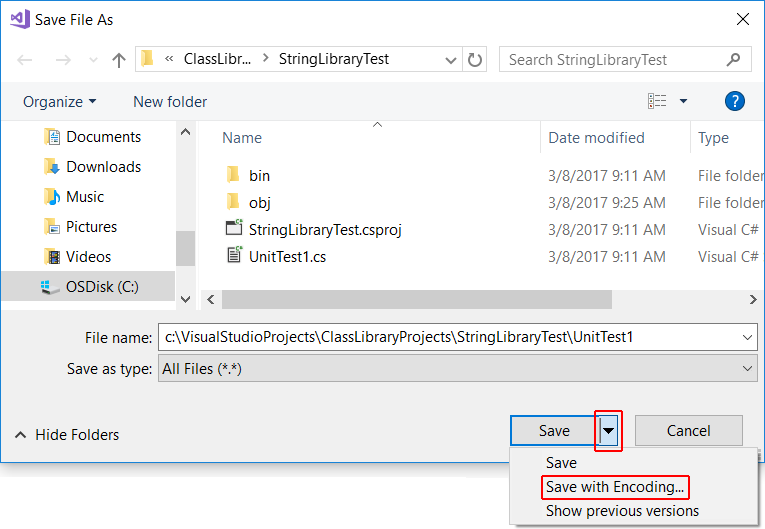
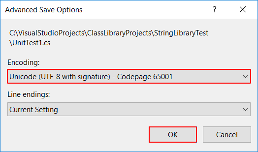
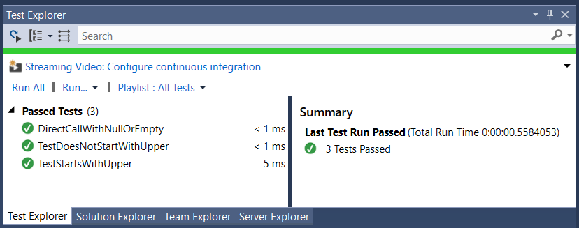
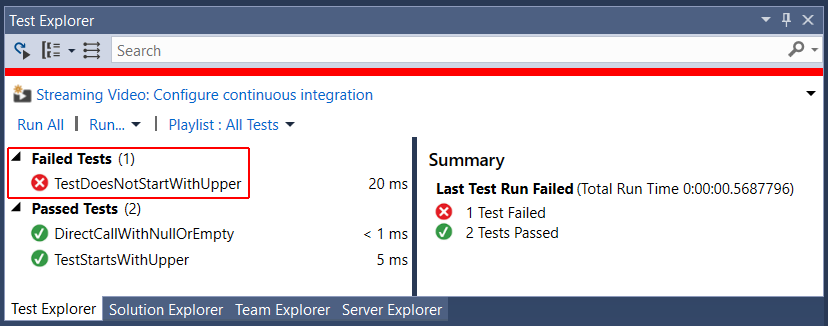
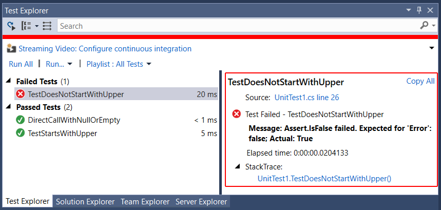

# Testing a class library with .NET Core in Visual Studio 2017

In [Building a class library with C# and .NET Core in Visual Studio 2017](library-with-visual-studio.md), you created a simple class library that adds an extension method to the @System.String class. Now, you'll create a unit test to make sure that it works as expected. You'll add your unit test project to the solution you created in the previous topic.

## Creating a unit test project

To create the unit test project, do the following:

1. In **Solution Explorer**, open the context menu for the **ClassLibraryProject** solution node and select **Add**, **New Project**.

   <!-- Need a VS 2017 version  [!NOTE] In addition to a Unit Test project, you can also use Visual Studio to create an XUnit test project for .NET Core. For a walkthrough that includes an XUnit test project, see [Getting started with .NET Core on Windows, using Visual Studio 2015](../../core/tutorials/using-on-windows.md). --> 

1. In the **Add New Project** dialog, select the **.NET Core** node followed by the **Unit Test Project (.NET Core)** project template. In the **Name** text box, enter "StringLibraryTest" as the name of the project. Select **OK** to create the unit test project.

   

1. Visual Studio creates the project and opens the *UnitTest1.cs* file in the code window.

   

   The source code created by the unit test template does the following:

   * It imports the [Microsoft.VisualStudio.TestTools.UnitTesting](https://msdn.microsoft.com/library/microsoft.visualstudio.testtools.unittesting.aspx) namespace, which contains the types used for unit testing.

   * It applies the [\[TestClass\]](https://msdn.microsoft.com/library/microsoft.visualstudio.testtools.unittesting.testclassattribute.aspx) attribute to the `UnitTest1` class. Each test method in a test class tagged with the \[TestMethod\] attribute is executed automatically when the unit test is run.

   * It applies the [\[TestMethod\]](https://msdn.microsoft.com/library/microsoft.visualstudio.testtools.unittesting.testmethodattribute.aspx) attribute to define `TestMethod1` as a test method for automatic execution when the unit test is run.

1. In **Solution Explorer**, right-click the **Dependencies** node of the **StringLibraryTest** project and choose **Add Reference** from the context menu. This adds a reference to our class library project, `StringLibrary`.

   

1. In the **Reference Manager** dialog, check the box next to **StringLibrary**. Adding a reference to the `StringLibrary` assembly allows the compiler to find **StringLibrary** methods. Select the **OK** button.

   

## Adding and running unit test methods

When Visual Studio runs a unit test, it executes each method marked with the [\[TestMethod\]](https://msdn.microsoft.com/library/microsoft.visualstudio.testtools.unittesting.testmethodattribute.aspx) attribute in a unit test class, the class to which the  [\[TestClass\]](https://msdn.microsoft.com/library/microsoft.visualstudio.testtools.unittesting.testclassattribute.aspx) attribute is applied. A test method ends when the first failure is encountered or when all tests contained in the method have succeeded.

The most common tests call members of the [Assert](https://msdn.microsoft.com/library/microsoft.visualstudio.testtools.unittesting.assert.aspx) class. Many assert methods include at least two parameters, one of which is the expected test result and the other of which is the actual test result. Some of its most frequently called methods are shown in the table below.

Assert methods | Function
--- | ---
`Assert.AreEqual` | Verifies that two values or objects are equal. The assert fails if the values or objects are not equal.
`Assert.AreSame` | Verifies that two object variables refer to the same object. The assert fails if the variables refer to different objects.
`Assert.IsFalse` | Verifies that a condition is `false`. The assert fails if the condition is `true`.
`Assert.IsNotNull` | Verifies that an object is not `null`. The assert fails if the object is `null`.
[\[ExpectedException\]](https://msdn.microsoft.com/library/microsoft.visualstudio.testtools.unittesting.expectedexceptionattribute.aspx) attribute | Indicates the type of exception a test method is expected to throw. The test fails if the specified exception is not thrown.

In testing the `StringLibrary.StartsWithUpper` method, you want to provide a number of strings that begin with an uppercase character. We expect the method to return `true` in these cases, so you can call the [Assert.IsTrue(Boolean, String)](https://msdn.microsoft.com/library/ms243754.aspx) method. Similarly, you want to provide a number of strings that begin with something other than an uppercase character. You expect the method to return `false` in these cases, so you can call the [Assert.IsFalse(Boolean, String)](https://msdn.microsoft.com/library/ms243805.aspx) method.

Since our library method handles strings, you also want to make sure that it successfully handles an [empty string (`String.Empty`)](xref:System.String.Empty), a valid string that has no characters and whose @System.String.Length is 0 and a `null` string that has not been initialized. If `StartsWithUpper` is called as an extension method on a @System.String instance, it cannot be passed a `null` string. However, you can also call it directly as a static method and pass a single @System.String argument.

You'll define three methods, each of which calls its [Assert](https://msdn.microsoft.com/library/microsoft.visualstudio.testtools.unittesting.assert.aspx) method repeatedly for each element in a string array. Because the test method fails as soon as it encounters the first failure, you'll call a method overload that allows you to pass a string that indicates the string value used in the method call.

To create the the test methods:

1. In the *UnitTest1.cs* code window, replace the code with the following code:

   [!CODE-csharp[Test#1](../../../samples/snippets/csharp/getting_started/with_visual_studio_2017/testlib1.cs#1)]

   Note that your test of uppercase characters in the `TestStartsWithUpper` method includes the Greek capital letter alpha (U+0391) and the Cyrillic capital letter EM (U+041C), and the test of lowercase characters in the `TestDoesNotStartWithUpper` method includes the Greek small letter alpha (U+03B1) and the Cyrillic small letter Ghe (U+0433).

1. On the menu bar, choose **File > Save UnitTest1.cs As**. In the **Save File As** dialog, choose the arrow beside the **Save** button, and then choose **Save with Encoding...***.

   

1. In the Confirm Save As dialog, choose the **Yes** button to save the file.

1. In the **Advanced Save Options** dialog, select **Unicode (UTF-8 with signature) - Codepage 65001** from the **Encoding** drop-down list and then select **OK**.

   

   If you fail to save your source code as a UTF8-encoded file, Visual Studio may save it as an ASCII file. When that happens, the runtime doesn't accurately decode the UTF8 characters outside of the ASCII range, and the test results won't be accurate.

1. On the menu bar, choose **Test > Run > All Tests**. The **Test Explorer** window opens and shows that the tests have run successfully. The three tests are listed in the **Passed Tests** section, and the **Summary** section reports the result of the test run.

   

## Handling test failures

Your test run had no failures, but change it slightly so that one of the test methods fails:

1. Modify the `words` array in the `TestDoesNotStartWithUpper` method to include the string "Error". You don't need to save the file because Visual Studio automatically saves open files when a solution is built to run tests.

   ```csharp
   string[] words = { "alphabet", "Error", "zebra", "abc", "αυτοκινητοβιομηχανία", "государство",
                      "1234", ".", ";", " " };
   ```

1. Run the test by selecting **Test > Run > All Tests** from the menu bar. The **Test Explorer** window indicates that two tests succeeded and one failed.

   

1. In the **Failed Tests** section, select the failed test, `TestDoesNotStartWith`. The lower pane of the **Test Explorer** displays the message produced by the assert: "Assert.IsFalse failed. Expected for 'Error': false; actual: True", as the following figure of **Test Explorer** shows. Because of the failure, all strings in the array after "Error" were not tested.

   

1. Remove the code that you added (`"Error", `) and rerun the test. The tests will pass.

## Testing the Release version of the library

We've been running our tests against the Debug version of the library. Now that our tests have all passed and we've adequately tested our library, we should run the tests an additional time against the Release build of the library. A number of factors, including compiler optimizations, can sometimes produce different behavior between Debug and Release builds.

To test the Release build:

1. In the Visual Studio toolbar, change the build configuration from **Debug** to **Release**.

   

1. In **Solution Explorer**, right-click the **StringLibrary** project and select **Build** from the context menu to recompile the library.

   

1. Run the unit tests by choosing **Test > Run > All Tests** from the menu bar. The tests pass.

Now that you've finished testing your library, the next step is to make it available to callers. You can bundle it with one or more applications, or you can distribute it as a NuGet package. For more information, see [Consuming a .NET Standard Class Library](./consuming-library-with-visual-studio.md).
