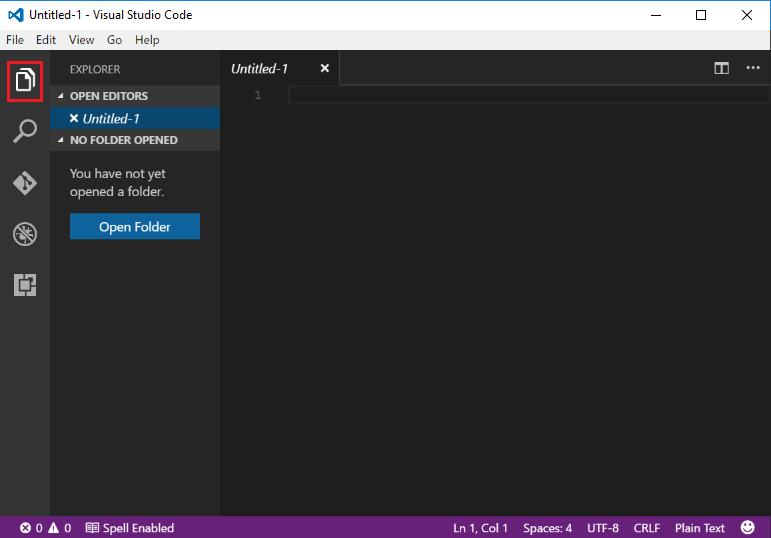
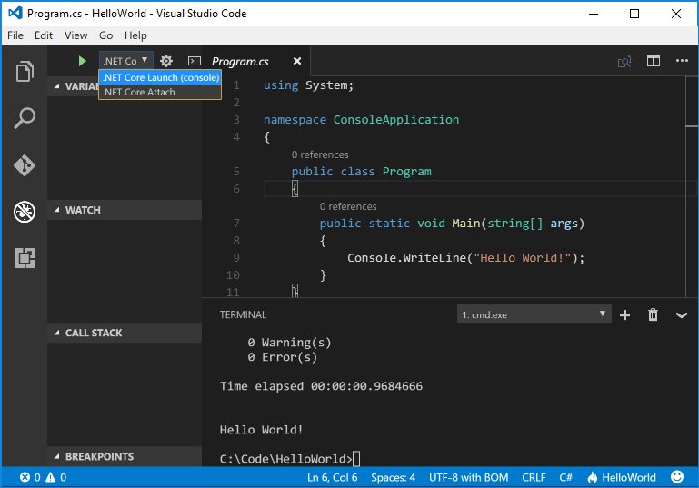
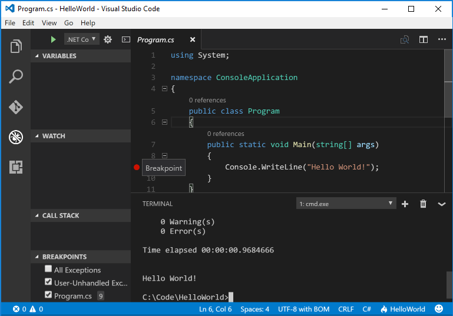
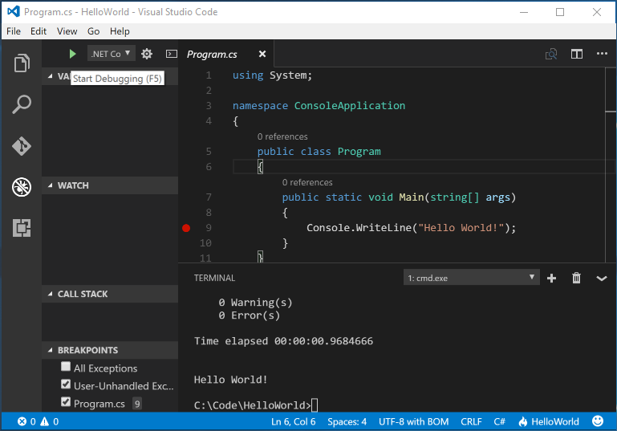

# Getting Started with Visual Studio Code

.NET Core gives you a fast and modular platform for creating server applications that run on Windows, Linux and macOS. Use Visual Studio Code with the C# extension to get a powerful editing experience with full support for C# IntelliSense (smart code completion) and debugging.

## Prerequisites

1. Install [Visual Studio Code](https://code.visualstudio.com/).
2. Install the [.NET Core SDK](https://www.microsoft.com/net/download/core).
3. Install the [C# extension](https://marketplace.visualstudio.com/items?itemName=ms-vscode.csharp) from the VS Code Marketplace.

## Hello World

Let's get started with a simple "Hello World" program on .NET Core:

1. Open a project:

    * Open VS Code.
    * Click on the Explorer icon on the left menu and then click **Open Folder**.
    * Select the folder you want your C# project to be in and click **Select Folder**.

  

    * Alternatively, you can select **File** > **Open Folder** from the main menu to open your project folder.

2. Initialize a C# project:
    * Open the Integrated Terminal from VS Code by typing <kbd>CTRL</kbd>+<kbd>`</kbd> (backtick).
    * On the terminal window, type `dotnet new`.
    * This creates a `Program.cs` file in your folder with a simple "Hello World" program already written.

  

3. Resolve the build assets:

    * Type `dotnet restore`. Running `dotnet restore` pulls down the required packages declared in the `project.json` file.
    * You'll see a new `project.lock.json` file in your project folder.
    * This file contains information about your project's dependencies to make subsequent restores quicker.

  > TIP: If you are using the MSBuild-based .NET Core Tools a .csproj file will be created instead of a project.json one, but the `dotnet` commands you need to execute remain the same. For more information, see the [MSBuild-based tooling announcement](https://blogs.msdn.microsoft.com/dotnet/2016/11/16/announcing-net-core-tools-msbuild-alpha/) on the .NET blog.

  

4. Run the "Hello World" program:

    * Type `dotnet run`. 

  

You can also watch a short video tutorial for further setup help on [Windows](https://channel9.msdn.com/Blogs/dotnet/Get-started-with-VS-Code-using-CSharp-and-NET-Core), [macOS](https://channel9.msdn.com/Blogs/dotnet/Get-started-with-VS-Code-using-CSharp-and-NET-Core-on-MacOS), or [Linux](https://channel9.msdn.com/Blogs/dotnet/Get-started-with-VS-Code-Csharp-dotnet-Core-Ubuntu).

## Debug
1. Open Program.cs by clicking on it. The first time you open a C# file in VS Code, OmniSharp will load in the editor.

  

2. VS Code will prompt you to add the missing assets to build and debug your app. Click **Yes**. 

  

3. To open the Debug view, click on the Debugging icon on the left side menu.

  

4. Locate the green arrow at the top of the pane. Make sure the drop-down next to it has `.NET Core Launch (console)` selected.

  

5. Add a breakpoint to your project by clicking on the **editor margin** (the space on the left of the line numbers in the editor).

  

6. Hit F5 or the green arrow to start debugging. The debugger stops execution of your program when it reaches the breakpoint you set the previous step.
    * While debugging you can view your local variables in the top left pane or use the debug console.

  

7. Hit the green arrow at the top to continue debugging or press the red square to stop.

## See also
- [Setting up Visual Studio Code](https://code.visualstudio.com/docs/setup/setup-overview)
- [Debugging in Visual Studio Code](https://code.visualstudio.com/Docs/editor/debugging)