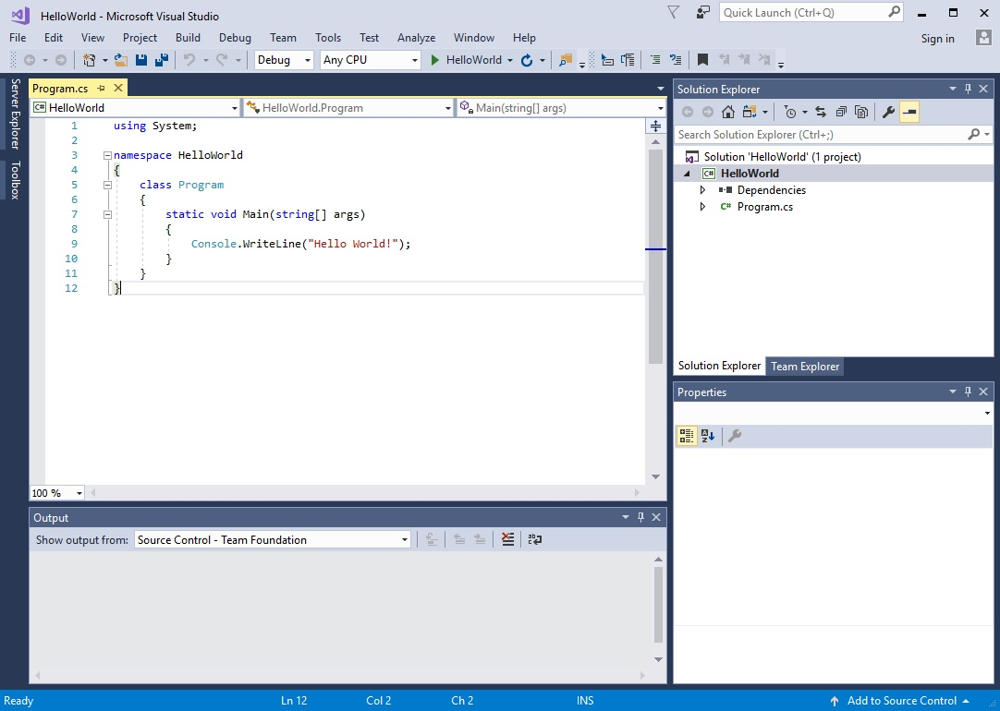
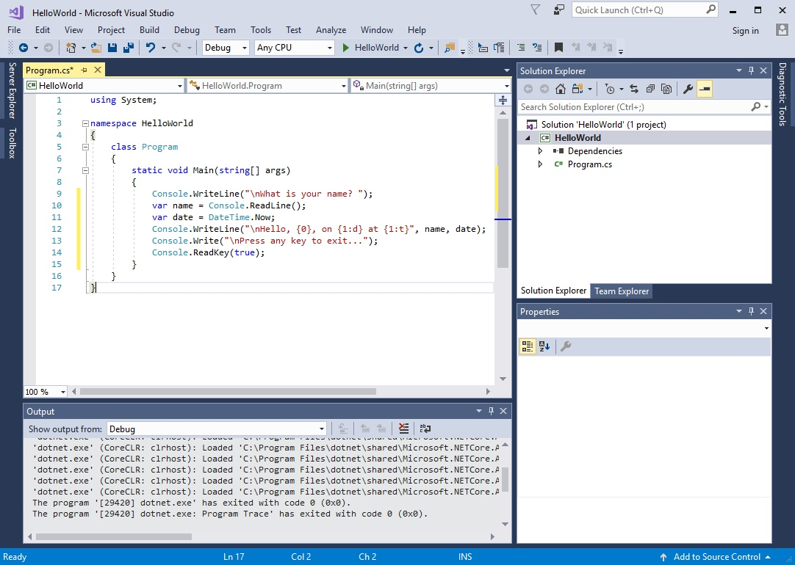
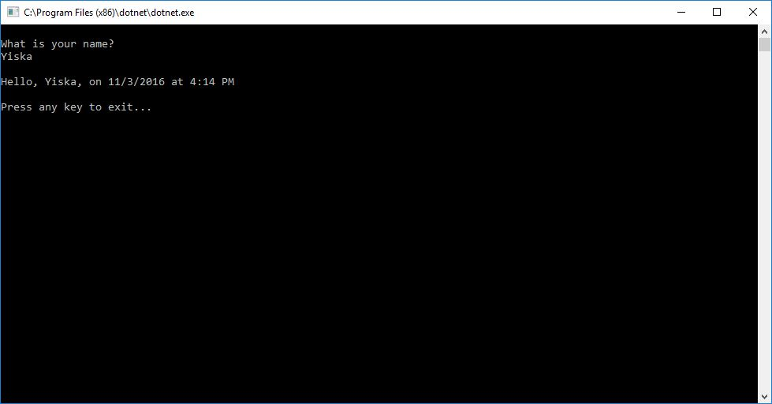

# Building a Hello World Appllication with .NET Core in Visual Studio 2015 #

This topic provides a step-by-step introduction to building and debugging a simple .NET Core console application using Visual Studio 2015. Visual Studio 2015 provides a full-featured development environment for building .NET Core applications. As long as the application does not have any platform-specific dependencies, the application itself can run on any platform that .NET Core targets and on any system that has .NET Core installed.

## The prerequisites ##

In order to develop the application, Visual Studio 2015 must be installed on your machine. If you  haven't already installed it, you can download a trial version of Visual Studio Professional or Visual Studio Enterprise, or you can download the free Visual Studio Community Edition, from  [Visual Studio Downloads](https://www.visualstudio.com/downloads/).

In addition, you must install the [.NET Core tools for Visual Studio 2015](https://go.microsoft.com/fwlink/?LinkID=827546).

For more information, see [Prerequisites for Windows development](../../core/windows-prerequisites).

## A simple "Hello World" application ##

Let's begin by creating a simple "Hello World" application. Here are the steps:

1. Launch Visual Studio and, on the **File** menu, select **New**, **Project**. In the **New Project** dialog, expand the **Visual C#** node in the left-hand pane, then select the **.NET Core** node. 

2. In the right-hand pane, select **Console Application (.NET Core)**. Enter the name of the project, `HelloWorld`, and make sure the **Create directory for solution** box is checked, as the following figure shows.

   

   You can also create two other .NET Core application types with Visual Studio.

3. Select the **OK** button. Visual Studio displays its development environment with its code window, as the following figure shows. The C# Console Application template for .NET Core automatically defines a class, `Program`, with a single method, `Main`. `Main` is the application entry point, the method that is called automatically by the runtime when it launches the application.

   

4. Enter the following C# code in the code window immediately after the opening bracket that follows the `public static void Main(string[] args)` line.

   [!CODE [GettingStarted#1](../../../samples/snippets/csharp/getting_started/with_visual_studio/helloworld.cs#1)]

   The following figure shows the resulting code window.

   

5. Compile the program by selecting **Build**, **Build Solution**. This compiles your program to IL, an intermediate language that is then converted to binary code by a just-in-time (JIT) compiler.

6. Run the program in debug mode in Visual Studio by selecting the green arrow on the toolbar, pressing F5, or selecting **Debug**, **Start Debugging**. After you respond to the prompts by entering a name and pressing the Enter key, the console window should look something like the following:

   

7. Press any key to close the console window. This ends debug mode.

You've now created and run your simple application. To develop a professional application, there are still some additional steps that you can take to make your application ready for release:

- For information on debugging your application, see [Debugging the Hello World Application](.\debugging-with-visual-studio.md)

- For information on developing a publishing a distributable version of your application, see [Publishing the Hello World application](./publishing-with-visual-studio.md).

## Related topics ##

Instead of a console application, you can also build a class library with .NET Core and Visual Studio 2015. For a step-by-step introduction, see [Getting started with .NET Core on WIndows, using Visual Studio 2015](../../core/tutorials/using-on-windows.md).

You can also develop a .NET Core console app on Mac, Linux, and Windows by using Visual Studio Code, a freely downloadable code editor. For a step-by-step tutorial, see [Getting Started with Visual Studio Code](.\with-visual-studio-code.md).
