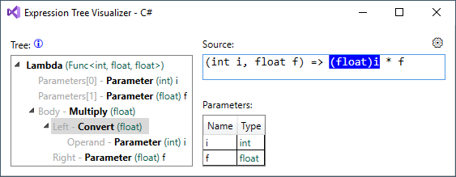

# Debugging Expression Trees in Visual Studio (C#)
You can analyze the structure and content of expression trees when you debug your applications. To get a quick overview of the expression tree structure, you can use the `DebugView` property, which represents expression trees using a special syntax described [below](#debug-view-syntax). (Note that `DebugView` is available only in debug mode.)  

Since `DebugView` is a string, you can use the [built-in Text Visualizer](https://docs.microsoft.com/en-us/visualstudio/debugger/view-strings-visualizer?view=vs-2019#open-a-string-visualizer) to view it across multiple lines, by selecting **Text Visualizer** from the magnifying glass icon next to the `DebugView` label.

 

Alternatively, you can install and use [a custom visualizer](https://docs.microsoft.com/en-us/visualstudio/debugger/create-custom-visualizers-of-data) for expression trees:

* [Readable Expressions](https://github.com/agileobjects/ReadableExpressions), available on the [Visual Studio Marketplace](https://marketplace.visualstudio.com/items?itemName=vs-publisher-1232914.ReadableExpressionsVisualizers), which renders the expression tree as C# code:

  

* [Expression Tree Visualizer](https://github.com/zspitz/ExpressionToString#visual-studio-debugger-visualizer-for-expression-trees), which provides a graphical view of the expression tree, its properties, and related objects:

  

### To open a visualizer for an expression tree  
  
1. Click the magnifying glass icon that appears next to the expression tree in **DataTips**, a **Watch** window, the **Autos** window, or the **Locals** window.  
  
     A list of available visualizers is displayed.: 

      

2. Click the visualizer you want to use.  

# `DebugView` syntax 

Each expression type is displayed by the `DebugView` property as described in the following sections.  
  
## ParameterExpressions  
 <xref:System.Linq.Expressions.ParameterExpression> variable names are displayed with a "$" symbol at the beginning.  
  
 If a parameter does not have a name, it is assigned an automatically generated name, such as `$var1` or `$var2`.  
  
### Examples  
  
|Expression|`DebugView` property|  
|----------------|--------------------------|  
|`ParameterExpression numParam =  Expression.Parameter(typeof(int), "num");`|`$num`|  
|`ParameterExpression numParam =  Expression.Parameter(typeof(int));`|`$var1`|  
  
## ConstantExpressions  
 For <xref:System.Linq.Expressions.ConstantExpression> objects that represent integer values, strings, and `null`, the value of the constant is displayed.  
  
 For numeric types that have standard suffixes as C# literals, the suffix is added to the value. The following table shows the suffixes associated with various numeric types.  
  
|Type|Suffix|  
|----------|------------|  
|<xref:System.UInt32>|U|  
|<xref:System.Int64>|L|  
|<xref:System.UInt64>|UL|  
|<xref:System.Double>|D|  
|<xref:System.Single>|F|  
|<xref:System.Decimal>|M|  
  
### Examples  
  
|Expression|`DebugView` property|  
|----------------|--------------------------|  
|`int num = 10; ConstantExpression expr = Expression.Constant(num);`|10|  
|`double num = 10; ConstantExpression expr = Expression.Constant(num);`|10D|  
  
## BlockExpression  
 If the type of a <xref:System.Linq.Expressions.BlockExpression> object differs from the type of the last expression in the block, the type is displayed in the `DebugInfo` property in angle brackets (\< and >). Otherwise, the type of the <xref:System.Linq.Expressions.BlockExpression> object is not displayed.  
  
### Examples  
  
|Expression|`DebugView` property|  
|----------------|--------------------------|  
|`BlockExpression block = Expression.Block(Expression.Constant("test"));`|`.Block() {`   `"test"`   `}`|  
|`BlockExpression block =  Expression.Block(typeof(Object), Expression.Constant("test"));`|`.Block<System.Object>() {`   `"test"`   `}`|  
  
## LambdaExpression  
 <xref:System.Linq.Expressions.LambdaExpression> objects are displayed together with their delegate types.  
  
 If a lambda expression does not have a name, it is assigned an automatically generated name, such as `#Lambda1` or `#Lambda2`.  
  
### Examples  
  
|Expression|`DebugView` property|  
|----------------|--------------------------|  
|`LambdaExpression lambda =  Expression.Lambda<Func<int>>(Expression.Constant(1));`|`.Lambda #Lambda1<System.Func'1[System.Int32]>() {`   `1`   `}`|  
|`LambdaExpression lambda =  Expression.Lambda<Func<int>>(Expression.Constant(1), "SampleLambda", null);`|`.Lambda SampleLambda<System.Func'1[System.Int32]>() {`   `1`   `}`|  
  
## LabelExpression  
 If you specify a default value for the <xref:System.Linq.Expressions.LabelExpression> object, this value is displayed before the <xref:System.Linq.Expressions.LabelTarget> object.  
  
 The `.Label` token indicates the start of the label. The `.LabelTarget` token indicates the destination of the target to jump to.  
  
 If a label does not have a name, it is assigned an automatically generated name, such as `#Label1` or `#Label2`.  
  
### Examples  
  
|Expression|`DebugView` property|  
|----------------|--------------------------|  
|`LabelTarget target = Expression.Label(typeof(int), "SampleLabel"); BlockExpression block = Expression.Block( Expression.Goto(target, Expression.Constant(0)), Expression.Label(target, Expression.Constant(-1)));`|`.Block() {`   `.Goto SampleLabel { 0 };`   `.Label`   `-1`   `.LabelTarget SampleLabel:`   `}`|  
|`LabelTarget target = Expression.Label(); BlockExpression block = Expression.Block( Expression.Goto(target5), Expression.Label(target5));`|`.Block() {`   `.Goto #Label1 { };`   `.Label`   `.LabelTarget #Label1:`   `}`|  
  
## Checked Operators  
 Checked operators are displayed with the "#" symbol in front of the operator. For example, the checked addition operator is displayed as `#+`.  
  
### Examples  
  
|Expression|`DebugView` property|  
|----------------|--------------------------|  
|`Expression expr = Expression.AddChecked( Expression.Constant(1), Expression.Constant(2));`|`1 #+ 2`|  
|`Expression expr = Expression.ConvertChecked( Expression.Constant(10.0), typeof(int));`|`#(System.Int32)10D`|  
  
## See also

- [Expression Trees (C#)](../../../../csharp/programming-guide/concepts/expression-trees/index.md)
- [Debugging in Visual Studio](/visualstudio/debugger/debugging-in-visual-studio)
- [Create Custom Visualizers](/visualstudio/debugger/create-custom-visualizers-of-data)
