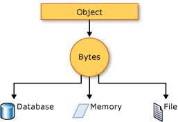

# Serialization (C#)

Serialization is the process of converting an object into a stream of bytes to store the object or transmit it to memory, a database, or a file. Its main purpose is to save the state of an object in order to be able to recreate it when needed. The reverse process is called deserialization.

## How serialization works

This illustration shows the overall process of serialization:

The object is serialized to a stream that carries the data. The stream may also have information about the object's type, such as its version, culture, and assembly name. From that stream, the object can be stored in a database, a file, or memory.

### Uses for serialization

Serialization allows the developer to save the state of an object and re-create it as needed, providing storage of objects as well as data exchange. Through serialization, a developer can perform actions such as:

* Sending the object to a remote application by using a web service
* Passing an object from one domain to another
* Passing an object through a firewall as a JSON or XML string
* Maintaining security or user-specific information across applications

## JSON serialization

The [System.Text.Json namespace](../../../../standard/serialization/system-text-json-overview.md) contains classes for JavaScript Object Notation (JSON) serialization and deserialization. JSON is an open standard that is commonly used for sharing data across the web.

JSON serialization serializes the public properties of an object into a string, byte array, or stream that conforms to [the RFC 8259 JSON specification](https://tools.ietf.org/html/rfc8259). To control the way <xref:System.Text.Json.JsonSerializer> serializes or deserializes an instance of the class:

* Use a [JsonSerializerOptions](xref:System.Text.Json.JsonSerializerOptions) object
* Apply attributes from the [System.Text.Json](xref:System.Text.Json.Serialization) namespace to classes or properties
* [Implement custom converters](../../../../standard/serialization/system-text-json-converters-how-to.md)

## Binary and XML serialization

The <xref:System.Runtime.Serialization> namespace contains classes for binary and XML serialization and deserialization.

Binary serialization uses binary encoding to produce compact serialization for uses such as storage or socket-based network streams. In binary serialization, all members, even members that are read-only, are serialized, and performance is enhanced. 

XML serialization serializes the public fields and properties of an object, or the parameters and return values of methods, into an XML stream that conforms to a specific XML Schema definition language (XSD) document. XML serialization results in strongly typed classes with public properties and fields that are converted to XML. <xref:System.Xml.Serialization> contains classes for serializing and deserializing XML. You apply attributes to classes and class members to control the way the <xref:System.Xml.Serialization.XmlSerializer> serializes or deserializes an instance of the class.

### Making an object serializable

For binary or XML serialization, you need:

* The object to be serialized
* A stream to contain the serialized object
* A <xref:System.Runtime.Serialization.Formatter?displayProperty=fullName> instance

Apply the <xref:System.SerializableAttribute> attribute to a type to indicate that instances of the type can be serialized. An  exception is thrown if you attempt to serialize but the type doesn't have the <xref:System.SerializableAttribute> attribute.

To prevent a field from being serialized, apply the <xref:System.NonSerializedAttribute> attribute. If a field of a serializable type contains a pointer, a handle, or some other data structure that is specific to a particular environment, and the field cannot be meaningfully reconstituted in a different environment, then you may want to make it nonserializable.

If a serialized class contains references to objects of other classes that are marked <xref:System.SerializableAttribute>, those objects will also be serialized.

### Basic and custom serialization

Binary and XML serialization can be performed in two ways, basic and custom.

Basic serialization uses the .NET Framework to automatically serialize the object. The only requirement is that the class has the <xref:System.SerializableAttribute> attribute applied. The <xref:System.NonSerializedAttribute> can be used to keep specific fields from being serialized.

When you use basic serialization, the versioning of objects may create problems. You would use custom serialization when versioning issues are important. Basic serialization is the easiest way to perform serialization, but it does not provide much control over the process.

In custom serialization, you can specify exactly which objects will be serialized and how it will be done. The class must be marked <xref:System.SerializableAttribute> and implement the <xref:System.Runtime.Serialization.ISerializable> interface. If you want your object to be deserialized in a custom manner as well, use a custom constructor.

## Designer serialization

Designer serialization is a special form of serialization that involves the kind of object persistence associated with development tools. Designer serialization is the process of converting an object graph into a source file that can later be used to recover the object graph. A source file can contain code, markup, or even SQL table information.

##  Related Topics and Examples  

[System.Text.Json overview](../../../../standard/serialization/system-text-json-overview.md)

[How to serialize and deserialize JSON in .NET](../../../../standard/serialization/system-text-json-how-to.md)

[Walkthrough: Persisting an Object in Visual Studio (C#)](walkthrough-persisting-an-object-in-visual-studio.md)  
Demonstrates how serialization can be used to persist an object's data between instances, allowing you to store values and retrieve them the next time the object is instantiated.

[How to read object data from an XML file (C#)](how-to-read-object-data-from-an-xml-file.md)  
 Shows how to read object data that was previously written to an XML file using the <xref:System.Xml.Serialization.XmlSerializer> class.

[How to write object data to an XML file (C#)](how-to-write-object-data-to-an-xml-file.md)  
Shows how to write the object from a class to an XML file using the <xref:System.Xml.Serialization.XmlSerializer> class.
