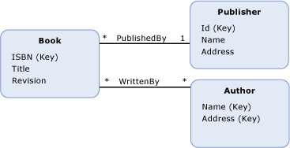

# entity container

An *entity container* is a logical grouping of [entity sets](entity-set.md), [association sets](association-set.md), and [function imports](model-declared-function.md).  
  
 The following must be true of an entity container defined in a conceptual model:  
  
- At least one entity container must be defined in each conceptual model.  
  
- The entity container must have a unique name within each conceptual model.  
  
 An entity container can define entity sets or association sets that use entity types or associations defined in one or more namespaces. For more information, see [Entity Data Model: Namespaces](entity-data-model-namespaces.md).  
  
## Example  

 The diagram below shows a conceptual model with three entity types: `Book`, `Publisher`, and `Author`.  See the next example for more information.  
  
   
  
 Although the diagram does not convey entity container information, the conceptual model must define an entity container. The [ADO.NET Entity Framework](./ef/index.md) uses a DSL called conceptual schema definition language ([CSDL](/ef/ef6/modeling/designer/advanced/edmx/csdl-spec)) to define conceptual models. The following CSDL defines an entity container for the conceptual model shown in the diagram above. Note that the entity container name is defined in an XML attribute.  
  
 [!code-xml[EDM_Example_Model#EntityContainerExample](../../../../samples/snippets/xml/VS_Snippets_Data/edm_example_model/xml/books.edmx#entitycontainerexample)]  
  
## See also

- [Entity Data Model Key Concepts](entity-data-model-key-concepts.md)
- [Entity Data Model](entity-data-model.md)
