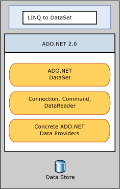

# LINQ to DataSet
[!INCLUDE[linq_dataset](../../../../includes/linq-dataset-md.md)] makes it easier and faster to query over data cached in a <xref:System.Data.DataSet> object. Specifically, [!INCLUDE[linq_dataset](../../../../includes/linq-dataset-md.md)] simplifies querying by enabling developers to write queries from the programming language itself, instead of by using a separate query language. This is especially useful for [!INCLUDE[vsprvs](../../../../includes/vsprvs-md.md)] developers, who can now take advantage of the compile-time syntax checking, static typing, and IntelliSense support provided by the [!INCLUDE[vsprvs](../../../../includes/vsprvs-md.md)] in their queries.  
  
 [!INCLUDE[linq_dataset](../../../../includes/linq-dataset-md.md)] can also be used to query over data that has been consolidated from one or more data sources. This enables many scenarios that require flexibility in how data is represented and handled, such as querying locally aggregated data and middle-tier caching in Web applications. In particular, generic reporting, analysis, and business intelligence applications require this method of manipulation.  
  
 The [!INCLUDE[linq_dataset](../../../../includes/linq-dataset-md.md)] functionality is exposed primarily through the extension methods in the <xref:System.Data.DataRowExtensions> and <xref:System.Data.DataTableExtensions> classes. [!INCLUDE[linq_dataset](../../../../includes/linq-dataset-md.md)] builds on and uses the existing [!INCLUDE[ado_whidbey_long](../../../../includes/ado-whidbey-long-md.md)] architecture, and is not meant to replace [!INCLUDE[ado_whidbey_long](../../../../includes/ado-whidbey-long-md.md)] in application code. Existing ADO.NET 2.0 code will continue to function in a [!INCLUDE[linq_dataset](../../../../includes/linq-dataset-md.md)] application. The relationship of [!INCLUDE[linq_dataset](../../../../includes/linq-dataset-md.md)] to [!INCLUDE[ado_whidbey_long](../../../../includes/ado-whidbey-long-md.md)] and the data store is illustrated in the following diagram.  
  
   
  
## In This Section  
 [Getting Started](../../../../docs/framework/data/adonet/getting-started-linq-to-dataset.md)  
  
 [Programming Guide](../../../../docs/framework/data/adonet/programming-guide-linq-to-dataset.md)  
  
## Reference  
 <xref:System.Data.DataTableExtensions>  
  
 <xref:System.Data.DataRowExtensions>  
  
 <xref:System.Data.DataRowComparer>  
  
## See Also  
 [LINQ (Language-Integrated Query)](http://msdn.microsoft.com/library/a73c4aec-5d15-4e98-b962-1274021ea93d)  
 [LINQ and ADO.NET](../../../../docs/framework/data/adonet/linq-and-ado-net.md)  
 [ADO.NET](../../../../docs/framework/data/adonet/index.md)
