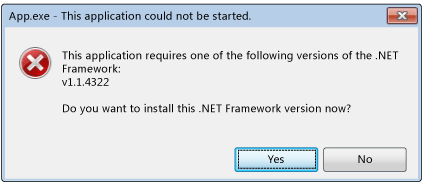
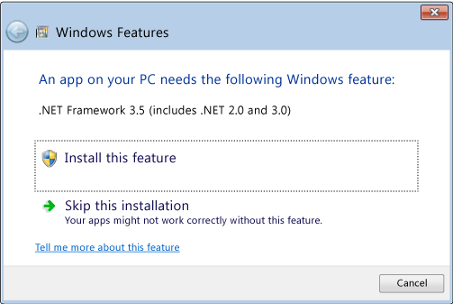

# .NET Framework initialization errors: Managing the user experience

The common language runtime (CLR) activation system determines the version of the CLR that will be used to run managed application code. In some cases, the activation system might not be able to find a version of the CLR to load. This situation typically occurs when an application requires a CLR version that is invalid or not installed on a given computer. If the requested version is not found, the CLR activation system returns an HRESULT error code from the function or interface that was called, and may display an error message to the user who is running the application. This article provides a list of HRESULT codes and explains how you can prevent the error message from being displayed.

The CLR provides logging infrastructure to help you debug CLR activation issues, as described in [How to: Debug CLR Activation Issues](how-to-debug-clr-activation-issues.md). This infrastructure should not be confused with [assembly binding logs](../tools/fuslogvw-exe-assembly-binding-log-viewer.md), which are entirely different.

## CLR activation HRESULT codes

The CLR activation APIs return HRESULT codes to report the result of an activation operation to a host. CLR hosts should always consult these return values before proceeding with additional operations.

- CLR_E_SHIM_RUNTIMELOAD

- CLR_E_SHIM_RUNTIMEEXPORT

- CLR_E_SHIM_INSTALLROOT

- CLR_E_SHIM_INSTALLCOMP

- CLR_E_SHIM_LEGACYRUNTIMEALREADYBOUND

- CLR_E_SHIM_SHUTDOWNINPROGRESS

## UI for initialization errors

If the CLR activation system cannot load the correct version of the runtime that is required by an application, it displays an error message to users to inform them that their computer is not properly configured to run the application, and provides them with an opportunity to remedy the situation. The following error message is typically presented in this situation. The user can choose **Yes** to go to a Microsoft website where they can download the correct .NET Framework version for the application.

## Resolving the initialization error

As a developer, you have a variety of options for controlling the .NET Framework initialization error message. For example, you can use an API flag to prevent the message from being displayed, as discussed in the next section. However, you still have to resolve the issue that prevented your application from loading the requested runtime. Otherwise, your application may not run at all, or some functionality may not be available.

To resolve the underlying issues and provide the best user experience (fewer error messages), we recommend the following:

- For .NET Framework 3.5 (and earlier) applications: Configure your application to support the .NET Framework 4 or later versions (see [instructions](../migration-guide/how-to-configure-an-app-to-support-net-framework-4-or-4-5.md)).

- For .NET Framework 4 applications: Install the .NET Framework 4 redistributable package as part of your application setup. See [Deployment Guide for Developers](deployment-guide-for-developers.md).

## Controlling the error message

Displaying an error message to communicate that a requested .NET Framework version was not found can be viewed as either a helpful service or a minor annoyance to users. In either case, you can control this UI by passing flags to the activation APIs.

The [ICLRMetaHostPolicy::GetRequestedRuntime](../unmanaged-api/hosting/iclrmetahostpolicy-getrequestedruntime-method.md) method accepts a [METAHOST_POLICY_FLAGS](../unmanaged-api/hosting/metahost-policy-flags-enumeration.md) enumeration member as input. You can include the METAHOST_POLICY_SHOW_ERROR_DIALOG flag to request an error message if the requested version of the CLR is not found. By default, the error message is not displayed. (The [ICLRMetaHost::GetRuntime](../unmanaged-api/hosting/iclrmetahost-getruntime-method.md) method does not accept this flag, and does not provide any other way to display the error message.)

Windows provides a [SetErrorMode](/windows/win32/api/errhandlingapi/nf-errhandlingapi-seterrormode) function that you can use to declare whether you want error messages to be shown as a result of code that runs within your process. You can specify the SEM_FAILCRITICALERRORS flag to prevent the error message from being displayed.

However, in some scenarios, it is important to override the SEM_FAILCRITICALERRORS setting set by an application process. For example, if you have a native COM component that hosts the CLR and that is hosted in a process where SEM_FAILCRITICALERRORS is set, you may want to override the flag, depending on the impact of displaying error messages within that particular application process. In this case, you can use one of the following flags to override SEM_FAILCRITICALERRORS:

- Use METAHOST_POLICY_IGNORE_ERROR_MODE with the [ICLRMetaHostPolicy::GetRequestedRuntime](../unmanaged-api/hosting/iclrmetahostpolicy-getrequestedruntime-method.md) method.

- Use RUNTIME_INFO_IGNORE_ERROR_MODE with the [GetRequestedRuntimeInfo](../unmanaged-api/hosting/getrequestedruntimeinfo-function.md) function.

## UI policy for CLR-provided hosts

The CLR includes a set of hosts for a variety of scenarios, and these hosts all display an error message when they encounter problems loading the required version of the runtime. The following table provides a list of hosts and their error message policies.

|CLR host|Description|Error message policy|Can error message be disabled?|
|--------------|-----------------|--------------------------|------------------------------------|
|Managed EXE host|Launches managed EXEs.|Is shown in case of a missing .NET Framework version|No|
|Managed COM host|Loads managed COM components into a process.|Is shown in case of a missing .NET Framework version|Yes, by setting the SEM_FAILCRITICALERRORS flag|
|ClickOnce host|Launches ClickOnce applications.|Is shown in case of a missing .NET Framework version, starting with the .NET Framework 4.5|No|
|XBAP host|Launches WPF XBAP applications.|Is shown in case of a missing .NET Framework version, starting with the .NET Framework 4.5|No|

## Windows 8 behavior and UI

The CLR activation system provides the same behavior and UI on Windows 8 as it does on other versions of the Windows operating system, except when it encounters issues loading CLR 2.0. Windows 8 includes the .NET Framework 4.5, which uses CLR 4.5. However, Windows 8 does not include the .NET Framework 2.0, 3.0, or 3.5, which all use CLR 2.0. As a result, applications that depend on CLR 2.0 do not run on Windows 8 by default. Instead, they display the following dialog box to enable users to install the .NET Framework 3.5. Users can also enable the .NET Framework 3.5 in Control Panel. Both options are discussed in the article [Install the .NET Framework 3.5 on Windows 10, Windows 8.1, and Windows 8](../install/dotnet-35-windows-10.md).

> [!NOTE]
> The .NET Framework 4.5 replaces the .NET Framework 4 (CLR 4) on the user's computer. Therefore, .NET Framework 4 applications run seamlessly, without displaying this dialog box, on Windows 8.

When the .NET Framework 3.5 is installed, users can run applications that depend on the .NET Framework 2.0, 3.0, or 3.5 on their Windows 8 computers. They can also run .NET Framework 1.0 and 1.1 applications, provided that those applications are not explicitly configured to run only on the .NET Framework 1.0 or 1.1. See [Migrating from the .NET Framework 1.1](../migration-guide/migrating-from-the-net-framework-1-1.md).

Starting with the .NET Framework 4.5, CLR activation logging has been improved to include log entries that record when and why the initialization error message is displayed. For more information, see [How to: Debug CLR Activation Issues](how-to-debug-clr-activation-issues.md).

## See also

- [Deployment Guide for Developers](deployment-guide-for-developers.md)
- [How to: Configure an app to support .NET Framework 4 or later versions](../migration-guide/how-to-configure-an-app-to-support-net-framework-4-or-4-5.md)
- [How to: Debug CLR Activation Issues](how-to-debug-clr-activation-issues.md)
- [Install the .NET Framework 3.5 on Windows 10, Windows 8.1, and Windows 8](../install/dotnet-35-windows-10.md)
