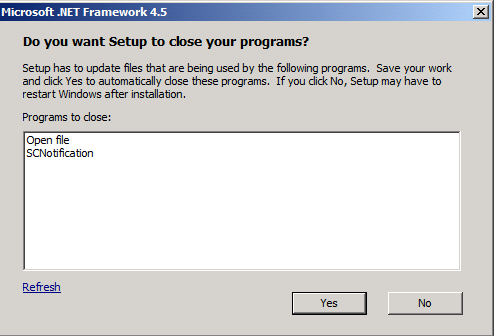

# Reducing System Restarts During .NET Framework 4.5 Installations
The [!INCLUDE[net_v45](../../../includes/net-v45-md.md)] installer uses the [Restart Manager](https://go.microsoft.com/fwlink/?LinkId=231425) to prevent system restarts whenever possible during installation. If your app setup program installs the .NET Framework, it can interface with the Restart Manager to take advantage of this feature. For more information, see [How to: Get Progress from the .NET Framework 4.5 Installer](../../../docs/framework/deployment/how-to-get-progress-from-the-dotnet-installer.md).  
  
## Reasons for a Restart  
 The [!INCLUDE[net_v45](../../../includes/net-v45-md.md)] installation requires a system restart if a .NET Framework 4 app is in use during the installation. This is because the [!INCLUDE[net_v45](../../../includes/net-v45-md.md)] replaces .NET Framework 4 files and requires those files to be available during installation. In many cases, the restart can be prevented by preemptively detecting and closing.NET Framework 4 apps that are in use. However, some system apps should not be closed. In these cases, a restart cannot be avoided.  
  
## End-User Experience  
 An end-user who is doing a full installation of the [!INCLUDE[net_v45](../../../includes/net-v45-md.md)] is given the opportunity to avoid a system restart if the installer detects .NET Framework 4 apps in use. A message lists all running .NET Framework 4 apps and provides the option to close these apps before the installation. If the user confirms, these apps are shut down by the installer, and a system restart is avoided. If the user does not respond to the message within a certain amount of time, the installation continues without closing any apps.  
  
 If the Restart Manager detects a situation that will require a system restart even if running apps are closed, the message is not displayed.  
  
   
Prompt for closing .NET Framework apps that are in use  
  
## Using a Chained Installer  
 If you want to redistribute the .NET Framework with your app, but you want to use your own setup program and UI, you can include (chain) the .NET Framework setup process to your setup process. For more information about chained installations, see [Deployment Guide for Developers](../../../docs/framework/deployment/deployment-guide-for-developers.md). To reduce system restarts in chained installations, the .NET Framework installer supplies your setup program with the list of apps to close. Your setup program must provide this information to the user through a user interface such as a message box, get the user’s response, and then pass the response back to the .NET Framework installer. For an example of a chained installer, see the article [How to: Get Progress from the .NET Framework 4.5 Installer](../../../docs/framework/deployment/how-to-get-progress-from-the-dotnet-installer.md).  
  
 If you're using a chained installer, but you do not want to provide your own message box for closing apps, you can use the `/showrmui` and `/passive` options on the command line when you chain the .NET Framework setup process. When you use these options together, the installer shows the message box for closing apps if they can be closed to avoid a system restart. This message box behaves the same in passive mode as it does under the full user interface. See [Deployment Guide for Developers](../../../docs/framework/deployment/deployment-guide-for-developers.md) for the complete set of command-line options for the .NET Framework redistributable.  
  
## See Also  
 [Deployment](../../../docs/framework/deployment/index.md)  
 [Deployment Guide for Developers](../../../docs/framework/deployment/deployment-guide-for-developers.md)  
 [How to: Get Progress from the .NET Framework 4.5 Installer](../../../docs/framework/deployment/how-to-get-progress-from-the-dotnet-installer.md)
